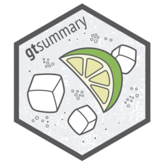

# Introduction

```{r}
#| label: setup-libraries
#| echo: false
#| cache: false
library(gtsummary)
library(tidyverse)
library(countdown)
library(knitr)

# fill for font awesome icons
fa_fill <- "#606060"
```

## Acknowledgements

::: {.columns .v-center-container}
::: {.column width="60%"}

:::

::: {.column width="40%"}
This work is licensed under a [Creative Commons Attribution-ShareAlike 4.0 International License](https://creativecommons.org/licenses/by-sa/4.0/) (CC BY-SA4.0).
:::
:::

## Your instructors

```{=html}
<div class="instructor-cards">
  <figure>
    
    <figcaption>
      <span class="name">Daniel D. Sjoberg</span>
      <span class="role">Executive Director of Data Sciences &amp; Clinical Data Analytics, Kardigan</span>
    </figcaption>
  </figure>
  <figure>
    
    <figcaption>
      <span class="name">Shannon Pileggi</span>
      <span class="role">Director of Data Science, The Prostate Cancer Clinical Trials Consortium</span>
    </figcaption>
  </figure>
</div>
```

## Questions

::: {.columns .v-center-container}
::: {.column width="50%"}
`r fontawesome::fa("circle-question", fill = fa_fill)` Please ask questions at any time!
:::
::: {.column width="50%"}
{width=100%}
:::
:::

## What we will cover


1.  [Analysis Results Datasets]{.emphasis} — build the numbers first with {cards}, so every table has something auditable behind it.

2.  [{gtsummary} fundamentals]{.emphasis} — `tbl_summary()`, hierarchical adverse event tables, merging and stacking.

3.  [ARD-first tables]{.emphasis} — every cell traceable, and QC by comparing one ARD against another.

4.  [Print engines]{.emphasis} — {gt}, {flextable}, and submission-ready Word output.

5.  [Adopting {gtsummary}]{.emphasis} — a house theme, wrappers of your own, and {crane}.

6.  [Coding agents]{.emphasis} — writing your standards down so an agent follows them without being reminded.


::: aside
::: {.small}
By the end: a concrete plan for standardizing table production across your group.
:::
:::

## About you

We are assuming you:

-   Are [comfortable in R]{.emphasis} and work in the [tidyverse]{.emphasis} — the native pipe, {dplyr}, {tidyr}.

-   Have [used {gtsummary} before]{.emphasis}, even just once.

This is a workshop about [adopting {gtsummary} across an organization]{.emphasis} — not a first tour of the package. We cover only the [very basics]{.emphasis} before moving on to themes, ARDs, and extensions, so a little background with the package goes a long way.

::: aside
::: {.small}
Newer to it than that? Stay with us and ask questions — the [{gtsummary} website](https://www.danieldsjoberg.com/gtsummary/) is the place to fill in the rest afterward.
:::
:::

## `AGENTS.md` and `SKILL.md`

Two ways to write your standards down for a coding agent. Both are [committed to the repo]{.emphasis}, so every agent on the project reads the same thing.

-   [`AGENTS.md`]{.emphasis} — how we work [in this repo, every time]{.emphasis}. House code style, where the data comes from, project layout, how to build. Lives at the root; the agent loads it for every task.

-   [`SKILL.md`]{.emphasis} — how to do [one particular task]{.emphasis}, loaded [only when that task comes up]{.emphasis}. Its `description` is the trigger the agent matches against, so it is written as concrete situations, not a summary.

::: {.fragment}
::: {.goal}
This repo ships two skills we wrote: [`ard-creation`]{.emphasis} and [`gtsummary-tables`]{.emphasis}, in `.agents/skills/`. We will read both later today. ➡️
:::
:::

::: aside
::: {.small}
Rule of thumb: if it applies to *every* task in the repo, it belongs in `AGENTS.md`; if it applies to *one kind* of task, make it a skill.
:::
:::
