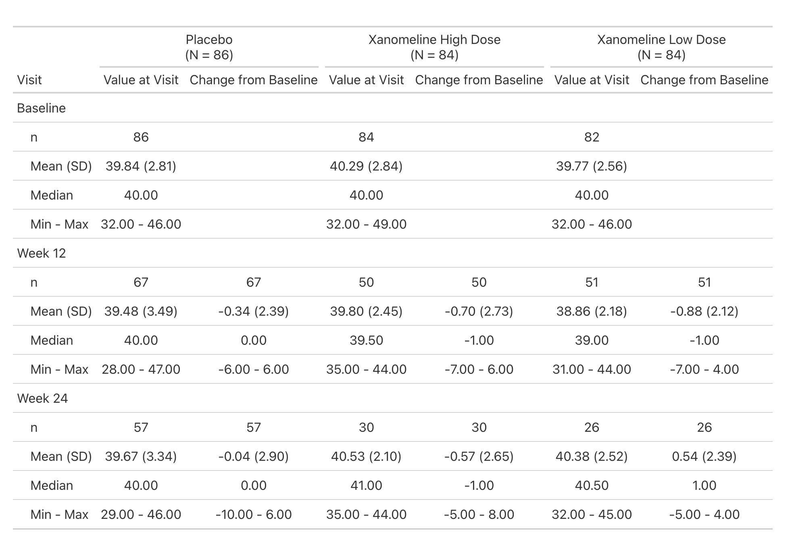
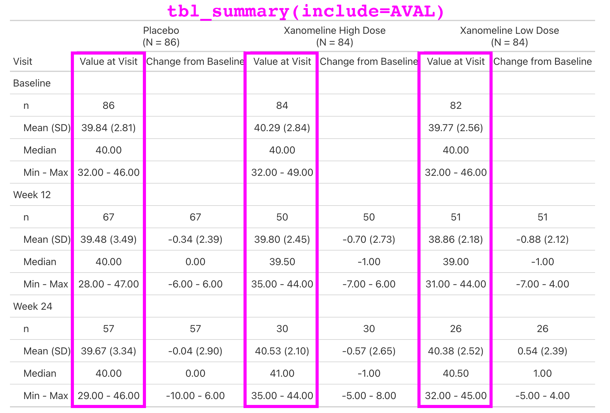

# Adopting {gtsummary}

## How to Adopt {gtsummary}

Three moves, in order.

#### 1. Set a theme

Your house defaults — rounding, headers, print engine — applied to [every table]{.emphasis}, without anyone passing an argument.

#### 2. Write wrappers

Named functions for the tables your team builds over and over, so the shape of a table is [written down once]{.emphasis}.

#### 3. Ship them in a package

Adoption becomes a single `library()` call, and the standard is [versioned and testable]{.emphasis}.


::: aside
::: {.small}
We will build 1 and 2 from scratch, then look at {crane} — Roche's answer to all three.
:::
:::

## Themes that ship with {gtsummary}

A [theme]{.emphasis} is set once, before you build any tables, and every table in the session picks it up.

-   `theme_gtsummary_journal("jama")` — defaults matching a journal's guidelines

-   `theme_gtsummary_compact()` — smaller font and cell padding

-   `theme_gtsummary_language("es")` — translate every table

-   `theme_gtsummary_printer(print_engine = "flextable")` — change the print engine

Themes [stack]{.emphasis}: call several, and each one layers onto the last.


```{r}
#| label: theme-stacking
#| eval: false
theme_gtsummary_journal("jama")
theme_gtsummary_compact()
```

::: aside
::: {.small}
`theme_gtsummary_printer()` is a shortcut for a single element. Next we build a theme that sets several at once.
:::
:::

## A theme is a named list

Every element is named `"<function>-<input type>:<description>"`.

::: {.small}

-   `"pkgwide-str:print_engine"` — applies [package-wide]{.emphasis}, takes a [string]{.emphasis}

-   `"tbl_summary-fn:percent_fun"` — applies to [`tbl_summary()`]{.emphasis}, takes a [function]{.emphasis}

Elements come in two flavors:

1.  [Internal behavior]{.emphasis} you cannot reach with a function argument.

2.  [Argument defaults]{.emphasis} — anything named `*-arg:*` sets that argument's default.

:::

Full catalog of theme elements: [**{gtsummary} themes vignette**](https://www.danieldsjoberg.com/gtsummary/articles/themes.html)

## Exercise: your own theme 🏃

1. Open [Exercise 3](https://ddsjoberg.github.io/rpharma-workshop-gtsummary-adoption-2026/exercises/exercises.html#exercise-3) on the workshop site and copy it into RStudio.

2. Fill in the four theme elements, then check and set your theme.

```{r}
#| label: theme-exercise-countdown
#| echo: false
#| cache: false
countdown::countdown(minutes = 5)
```

## Build a theme

Ship it as a function, the same way {gtsummary} and {crane} do — and start from a theme that already exists.

```{r}
#| label: theme-build
#| code-line-numbers: "|5|8|9|10|11|15"
theme_gtsummary_rpharma <- function(set_theme = TRUE) {
  lst_theme <-
    utils::modifyList(
      # start from the shipped compact theme, then layer ours on top
      theme_gtsummary_compact(set_theme = FALSE),
      list(
        "pkgwide-str:theme_name"        = "R/Pharma 2026",
        "pkgwide-str:print_engine"      = "flextable",
        "tbl_summary-fn:percent_fun"    = scales::label_number(scale = 100, accuracy = 0.1),
        "pkgwide-fn:pvalue_fun"         = label_style_pvalue(digits = 3),
        "tbl_summary-str:header-withby" = "**{level}**  \n(N = {n})"
      )
    )

  if (set_theme == TRUE) set_gtsummary_theme(lst_theme)
  invisible(lst_theme)
}
```


## Before and after

```{r}
#| label: theme-demo-code
#| eval: false
adsl |>
  tbl_summary(by = ARM2, include = c(AGE, ETHNIC)) |>
  add_p()
```

::: columns
::: {.column width="50%"}

::: {.small}
[Package defaults]{.emphasis} · printed with {gt}
:::

```{r}
#| label: theme-before
#| echo: false
adsl |>
  tbl_summary(by = ARM2, include = c(AGE, ETHNIC)) |>
  add_p()
```

:::

::: {.column width="50%"}

::: {.small}
After [`theme_gtsummary_rpharma()`]{.emphasis} · printed with {flextable}
:::

```{r}
#| label: theme-after
#| echo: false
theme_gtsummary_rpharma()

adsl |>
  tbl_summary(by = ARM2, include = c(AGE, ETHNIC)) |>
  add_p()
```

:::
:::

```{r}
#| label: theme-reset
#| echo: false
#| message: false
# the print engine applies when the table prints, so the theme has to be
# live here — clear it again before the rest of the deck
reset_gtsummary_theme()
```


## Why a theme for your company?

::: {.small}

-   [Consistency without memorization.]{.emphasis} Nobody has to remember that percentages go to one decimal place — the theme already knows.

-   [One place to change.]{.emphasis} When the standard changes, edit the theme and re-render. You are not grepping for `digits =` across forty programs.

-   [Better reviews.]{.emphasis} If formatting is handled, review comments are about the numbers instead of the decimal places.

-   [A shorter first day.]{.emphasis} New team members inherit the house style before they have written a line of code.

-   [Portable.]{.emphasis} Put the theme function in your company package and adoption is one `library()` call.

:::

## Themes end where names begin

A [theme]{.emphasis} changes defaults — everywhere, all at once, for functions that already exist.

A [wrapper]{.emphasis} earns its place when you want something a default cannot give you:

-   a [name]{.emphasis} your team already says out loud — "the demography table"

-   [documentation and tests]{.emphasis} that live with the function

-   a table built from [several]{.emphasis} {gtsummary} calls, not one

-   defaults that apply to [this table only]{.emphasis}, not the whole session

::: aside
::: {.small}
The two are not rivals — the wrapper we are about to write uses a theme element to set its own default.
:::
:::

## Exercise: your own wrapper 🏃

1. Open [Exercise 4](https://ddsjoberg.github.io/rpharma-workshop-gtsummary-adoption-2026/exercises/exercises.html#exercise-4) on the workshop site and copy it into RStudio.

2. Finish `tbl_pharma_summary()`, then use it to summarize `AGE` and `ETHNIC` by `ARM2`.

```{r}
#| label: wrapper-exercise-countdown
#| echo: false
#| cache: false
countdown::countdown(minutes = 5)
```

## `tbl_pharma_summary()` {.smaller}

A [thin]{.emphasis} wrapper: multi-line continuous summaries and our house statistics, with everything still overridable.

```{r}
#| label: wrapper-define
#| code-line-numbers: "|5-9|11-12|"
tbl_pharma_summary <- function(
    data,
    by = NULL,
    type = NULL,
    statistic = list(
      all_continuous() ~ c("{mean} ({sd})", "{median}",
                           "{p25}, {p75}", "{min}, {max}"),
      all_categorical() ~ "{n} ({p}%)"
    ),
    ...) {
  with_gtsummary_theme(
    list("tbl_summary-str:default_con_type" = "continuous2"),
    tbl_summary(
      data = data,
      by = {{ by }},
      type = type,
      statistic = statistic,
      ...
    )
  )
}
```

::: aside
::: {.small}
A theme element is not only a session-wide setting — `with_gtsummary_theme()` lets a [function]{.emphasis} set one for itself. This works because `default_con_type` is read while the table is [built]{.emphasis}; `print_engine` is read when it [prints]{.emphasis}, so that one cannot be set this way.
:::
:::

## `tbl_pharma_summary()` in action {.smaller}

::: columns
::: {.column width="50%"}

```{r}
#| label: wrapper-plain
adsl |>
  tbl_summary(
    by = ARM2,
    include = c(AGE, ETHNIC)
  )
```

:::

::: {.column width="50%"}

```{r}
#| label: wrapper-pharma
adsl |>
  tbl_pharma_summary(
    by = ARM2,
    include = c(AGE, ETHNIC)
  )
```

:::
:::

## A default, not a lock

An explicit argument still beats the theme element, so nothing is taken away from the caller.

```{r}
#| label: wrapper-override
adsl |>
  tbl_pharma_summary(
    by = ARM2,
    include = AGE,
    type = all_continuous() ~ "continuous",
    statistic = all_continuous() ~ "{median} ({p25}, {p75})"
  )
```

## Extension Package:{crane} 

We just wrote a one-function version of this. {crane} is the same idea, maintained as a real package — Roche's theme and wrappers, on CRAN.

::: {.small}

- Continuous variables default to `continuous2`.

- `tbl_summary(missing*)` arguments have been changed to `tbl_roche_summary(nonmissing*)`.

    - Highlights non-missing counts over missing counts, which are the default in {gtsummary}

- Counts represented by `0 (0%)` print as `0`.

:::

```{r}
#| label: roche-summary
#| output-location: slide
library(crane)

adsl |>
  dplyr::mutate(ETHNIC = forcats::fct_expand(ETHNIC, "REFUSED")) |>
  tbl_roche_summary(
    by = ARM2,
    include = c(AGE, ETHNIC),
    nonmissing = "always"
  )
```

## What else is in {crane}? 

::: small
Lab values are summarized by visit and include the change from baseline.

This is a simple table that is just a `tbl_merge()` of the `AVAL` summary and the `CHG` summary.

But the general structure appears enough times in our catalog, we make it simple for our programmers to create.
:::

```{r}
#| label: tbl_baseline_chg
#| eval: false
adlb |>
  dplyr::filter(PARAM == "Albumin (g/L)") |>
  tbl_baseline_chg(
    by = "ARM",
    baseline_level = "Baseline",
    denominator = adsl
  )
```

## What else is in {crane}? 

{fig-align="center" width="80%"}

## What else is in {crane}? 

{fig-align="center" width="80%"}

## What else is in {crane}? 

{fig-align="center" width="80%"}

## What else is in {crane}? 

{fig-align="center" width="80%"}

## A pharma theme with {crane}

Our theme is implemented in `crane::theme_gtsummary_roche()`. Primary changes include a custom function for [rounding percentages]{.emphasis}, [p-values]{.emphasis} rounded to four decimal places, [headers]{.emphasis} that default to bold and include N in parentheses (e.g. `'Placebo  \n (N = 184)'`), and printing all tables with [{flextable}]{.emphasis} using Roche-specific styling — font, font size, borders, cell padding, etc.

::: {.small}
Same named list, same `set_theme` argument — just with `style_roche_percent()` and `style_roche_pvalue()` in the function slots, and eleven elements instead of five.
:::

```{r}
#| label: roche-summary-example
#| output-location: column
theme_gtsummary_roche()

adsl |>
  dplyr::mutate(ETHNIC = forcats::fct_expand(ETHNIC, "REFUSED")) |>
  tbl_roche_summary(
    by = ARM2,
    include = c(AGE, ETHNIC),
    nonmissing = "always"
  )
```

## cardinal collaboration 

The cardinal initiative is an industry collaborative effort under the pharmaverse.

The site includes examples for building ARDs and tables from the FDA Standard Safety Tables and Figures Integrated Guide using {cards} and {gtsummary}.

<a href="https://pharmaverse.github.io/cardinal/#contributors" target="_blank"> Let's Go!</a>
