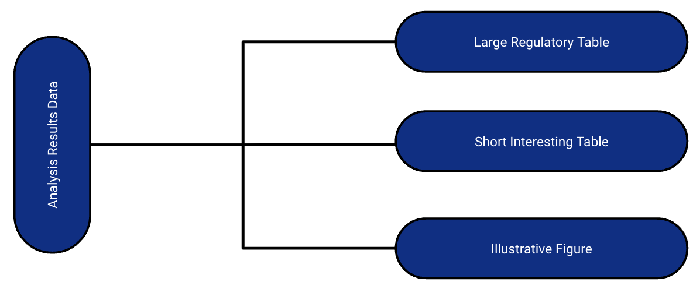
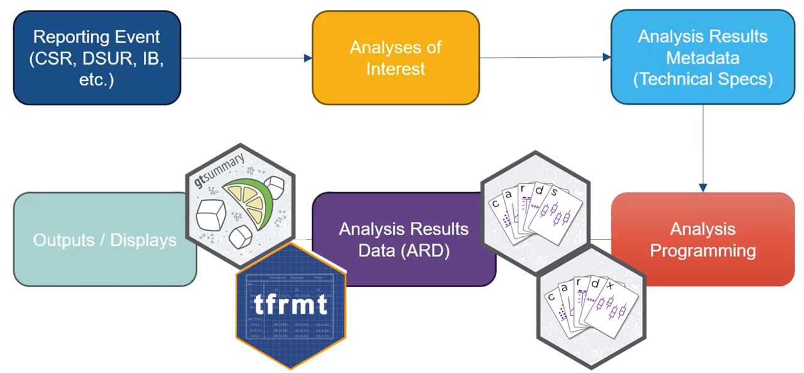
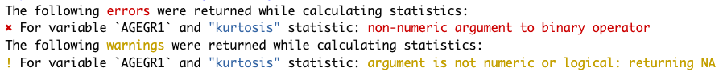
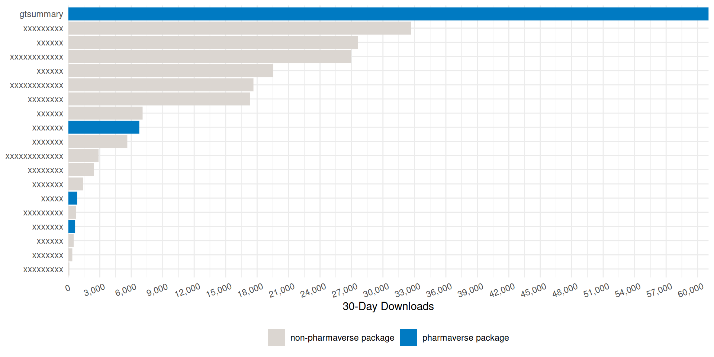
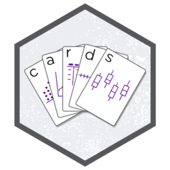

::: {.cell}

:::


# Introduction


::: {.cell}

:::


## Acknowledgements

::: {.columns .v-center-container}
::: {.column width="60%"}

:::

::: {.column width="40%"}
This work is licensed under a [Creative Commons Attribution-ShareAlike 4.0 International License](https://creativecommons.org/licenses/by-sa/4.0/) (CC BY-SA4.0).
:::
:::

## Questions

::: {.columns .v-center-container}
::: {.column width="50%"}
`<svg aria-hidden="true" role="img" viewBox="0 0 512 512" style="height:1em;width:1em;vertical-align:-0.125em;margin-left:auto;margin-right:auto;font-size:inherit;fill:#606060;overflow:visible;position:relative;"><path d="M464 256A208 208 0 1 0 48 256a208 208 0 1 0 416 0zM0 256a256 256 0 1 1 512 0A256 256 0 1 1 0 256zm169.8-90.7c7.9-22.3 29.1-37.3 52.8-37.3h58.3c34.9 0 63.1 28.3 63.1 63.1c0 22.6-12.1 43.5-31.7 54.8L280 264.4c-.2 13-10.9 23.6-24 23.6c-13.3 0-24-10.7-24-24V250.5c0-8.6 4.6-16.5 12.1-20.8l44.3-25.4c4.7-2.7 7.6-7.7 7.6-13.1c0-8.4-6.8-15.1-15.1-15.1H222.6c-3.4 0-6.4 2.1-7.5 5.3l-.4 1.2c-4.4 12.5-18.2 19-30.6 14.6s-19-18.2-14.6-30.6l.4-1.2zM224 352a32 32 0 1 1 64 0 32 32 0 1 1 -64 0z"/></svg>`{=html} Please ask questions at any time!
:::
::: {.column width="50%"}
{width=100%}
:::
:::

## What we will cover

::: {.small}

1.  [Analysis Results Datasets]{.emphasis} — build the numbers first with {cards}, so every table has something auditable behind it.

2.  [{gtsummary} fundamentals]{.emphasis} — `tbl_summary()`, hierarchical adverse event tables, merging and stacking.

3.  [ARD-first tables]{.emphasis} — every cell traceable, and QC by comparing one ARD against another.

4.  [Print engines]{.emphasis} — {gt}, {flextable}, and submission-ready Word output.

5.  [Adopting {gtsummary}]{.emphasis} — a house theme, wrappers of your own, and {crane}.

6.  [Coding agents]{.emphasis} — writing your standards down so an agent follows them without being reminded.

:::

::: aside
::: {.small}
By the end: a concrete plan for standardizing table production across your group.
:::
:::


# Analysis Results Datasets


::: {.cell}

:::


## What are ARDs?

<!-- ::: incremental -->

-   Dataset that stores key metadata and *raw results* from analysis
  
  - Long dataset that is 1 record per result value

  - May contained formatted values as well

-   The ARD can be used to to subsequently create tables and figures.

-   The ARD does *not* describe the layout of the results

<!-- ::: -->

## Analysis Results Data (ARD)

* After the initial creation of an ARD, the results can later be re-used again and again for subsequent reporting needs.

{fig-align="center"}

## A few notes about ARDs

<!-- :::{.incremental} -->

-   ARDs give us the opportunity to *rethink* QC

    -   QC can be focused on the raw value, as well as the formatted display
  
        -   You don’t have to waste time trying to match formatting to match QC
    
-   ARDs can be flexibly saved to different file types

    -   For example: a dataset (rds, xpt, etc) or json file
  
<!-- ::: -->

## Zooming Out: The Analysis Results Standard (ARS) 

{fig-align="center"}

:::{.small}
Objectives include:

-   To leverage analysis results metadata to drive the automation of results
-   To support storage, access, processing, traceability and reproducibility of results
-   Learn more at [https://www.cdisc.org/events/webinar/analysis-results-standard-public-review](https://www.cdisc.org/events/webinar/analysis-results-standard-public-review) 
:::

## Proposed Metadata Framework in the ARS

{fig-align="center"}

- The ARS provides a metadata-driven infrastructure for analysis

## Proposed Metadata Framework in the ARS

{fig-align="center"}

- The ARS provides a metadata-driven infrastructure for analysis

- {cards} serves as the engine for the analysis 
 


# ARDs using {cards} 
 
<a href="https://pharmaverse.github.io/cards/"></a>

## {cards}: Introduction

-   Part of the Pharmaverse

-   Collaboration between Roche, GSK, Novartis, Eli Lilly, Pfizer

-   Contains a variety of utilities for making ARDs

-   Can be used within the ARS workflow and separately

-   59K downloads per month 🤯

## Data used in examples

ADSL from `pharmaverseadam`

::: {.cell}

```{.r .cell-code  code-fold="true"}
adsl <- pharmaverseadam::adsl |>
  dplyr::filter(SAFFL=="Y") |> 
  dplyr::mutate(ARM2 = ifelse(startsWith(ARM, "Xanomeline"), "Xanomeline", ARM))
```
:::


ADAE from `pharmaverseadam`

::: {.cell}

```{.r .cell-code  code-fold="true"}
adae <- pharmaverseadam::adae |>
  dplyr::filter(SAFFL=="Y") |> 
  dplyr::mutate(ARM2 = ifelse(startsWith(ARM, "Xanomeline"), "Xanomeline", ARM)) |> 
  dplyr::filter(AESOC %in% unique(AESOC)[1:3]) |> 
  dplyr::group_by(AESOC) |> 
  dplyr::filter(AEDECOD %in% unique(AEDECOD)[1:3]) |> 
  dplyr::ungroup()
```
:::


## {cards}: `ard_tabulate()`

::: {.small}
- includes `n`, `%`, `N` by default
- _Any unobserved levels of the variables will be present in the resulting ARD._
:::


::: {.cell}

```{.r .cell-code}
library(cards)

adsl |> 
  ard_tabulate(
    variables = AGEGR1
  ) 
```

::: {.cell-output .cell-output-stdout}

```
# An ARD data frame: 6 × 9
  variable variable_level context  stat_name stat_label    stat fmt_fun warning error 
* <chr>    <list>         <chr>    <chr>     <chr>       <list> <list>  <list>  <list>
1 AGEGR1   18-64          tabulate n         n           33     0       <NULL>  <NULL>
2 AGEGR1   18-64          tabulate N         N          254     0       <NULL>  <NULL>
3 AGEGR1   18-64          tabulate p         %            0.130 <fn>    <NULL>  <NULL>
4 AGEGR1   >64            tabulate n         n          221     0       <NULL>  <NULL>
5 AGEGR1   >64            tabulate N         N          254     0       <NULL>  <NULL>
6 AGEGR1   >64            tabulate p         %            0.870 <fn>    <NULL>  <NULL>
```


:::
:::


## {cards}: `ard_tabulate()`

::: {.small}
- includes `n`, `%`, `N` by default
- _Any unobserved levels of the variables will be present in the resulting ARD._
:::


::: {.cell}

```{.r .cell-code}
adsl |>
  ard_tabulate(
    by = ARM2,
    variables = AGEGR1
  )
```

::: {.cell-output .cell-output-stdout}

```
# An ARD data frame: 12 × 11
  group1 group1_level variable variable_level context  stat_name stat_label    stat fmt_fun warning error 
* <chr>  <list>       <chr>    <list>         <chr>    <chr>     <chr>       <list> <list>  <list>  <list>
1 ARM2   Placebo      AGEGR1   18-64          tabulate n         n           14     0       <NULL>  <NULL>
2 ARM2   Placebo      AGEGR1   18-64          tabulate N         N           86     0       <NULL>  <NULL>
3 ARM2   Placebo      AGEGR1   18-64          tabulate p         %            0.163 <fn>    <NULL>  <NULL>
4 ARM2   Placebo      AGEGR1   >64            tabulate n         n           72     0       <NULL>  <NULL>
5 ARM2   Placebo      AGEGR1   >64            tabulate N         N           86     0       <NULL>  <NULL>
6 ARM2   Placebo      AGEGR1   >64            tabulate p         %            0.837 <fn>    <NULL>  <NULL>
7 ARM2   Xanomeline   AGEGR1   18-64          tabulate n         n           19     0       <NULL>  <NULL>
8 ARM2   Xanomeline   AGEGR1   18-64          tabulate N         N          168     0       <NULL>  <NULL>
# ℹ 4 more rows
```


:::
:::


## {cards}: `ard_summary()`


::: {.cell}

```{.r .cell-code}
# create ARD with default summary statistics
adsl |>
  ard_summary(
    variables = AGE
  )
```

::: {.cell-output .cell-output-stdout}

```
# An ARD data frame: 8 × 8
  variable context stat_name stat_label   stat fmt_fun warning error 
* <chr>    <chr>   <chr>     <chr>      <list>  <list> <list>  <list>
1 AGE      summary N         N          254          0 <NULL>  <NULL>
2 AGE      summary mean      Mean        75.1        1 <NULL>  <NULL>
3 AGE      summary sd        SD           8.25       1 <NULL>  <NULL>
4 AGE      summary median    Median      77          1 <NULL>  <NULL>
5 AGE      summary p25       Q1          70          1 <NULL>  <NULL>
6 AGE      summary p75       Q3          81          1 <NULL>  <NULL>
7 AGE      summary min       Min         51          1 <NULL>  <NULL>
8 AGE      summary max       Max         89          1 <NULL>  <NULL>
```


:::
:::


## {cards}: `ard_summary()` by variable

::: {.small}
`by`: summary statistics are calculated by all combinations of the by variables, including unobserved factor levels
:::


::: {.cell}

```{.r .cell-code}
adsl |>
  ard_summary(
    variables = AGE,
    by = ARM2         # stats by treatment arm
  )
```

::: {.cell-output .cell-output-stdout}

```
# An ARD data frame: 16 × 10
  group1 group1_level variable context stat_name stat_label   stat fmt_fun warning error 
* <chr>  <list>       <chr>    <chr>   <chr>     <chr>      <list>  <list> <list>  <list>
1 ARM2   Placebo      AGE      summary N         N           86          0 <NULL>  <NULL>
2 ARM2   Placebo      AGE      summary mean      Mean        75.2        1 <NULL>  <NULL>
3 ARM2   Placebo      AGE      summary sd        SD           8.59       1 <NULL>  <NULL>
4 ARM2   Placebo      AGE      summary median    Median      76          1 <NULL>  <NULL>
5 ARM2   Placebo      AGE      summary p25       Q1          69          1 <NULL>  <NULL>
6 ARM2   Placebo      AGE      summary p75       Q3          82          1 <NULL>  <NULL>
7 ARM2   Placebo      AGE      summary min       Min         52          1 <NULL>  <NULL>
8 ARM2   Placebo      AGE      summary max       Max         89          1 <NULL>  <NULL>
# ℹ 8 more rows
```


:::
:::


## {cards}: `ard_summary()` statistics

::: {.small}
`statistic`: specify univariate summary statistics. Accepts _any_ function, base R, from a package, or user-defined.
:::


::: {.cell}

```{.r .cell-code}
cv <- function(x)  sd(x, na.rm = TRUE)/mean(x, na.rm = TRUE)

adsl |> 
  ard_summary(  
    variables = AGE,
    by = ARM2,
    statistic = ~ list(cv = cv) # customize statistics
  )
```

::: {.cell-output .cell-output-stdout}

```
# An ARD data frame: 2 × 10
  group1 group1_level variable context stat_name stat_label   stat fmt_fun warning error 
* <chr>  <list>       <chr>    <chr>   <chr>     <chr>      <list>  <list> <list>  <list>
1 ARM2   Placebo      AGE      summary cv        cv          0.114       1 <NULL>  <NULL>
2 ARM2   Xanomeline   AGE      summary cv        cv          0.108       1 <NULL>  <NULL>
```


:::
:::


## {cards}: `ard_summary()` statistics

::: {.small}
Customize the statistics returned for each variable
:::


::: {.cell}

```{.r .cell-code}
adsl |>
  dplyr::mutate(AGE2 = AGE) |>
  ard_summary(
    variables = c(AGE, AGE2),
    by = ARM2,
    statistic = list(AGE = list(cv = cv),
                     AGE2 = continuous_summary_fns(c("mean","median")))
  )
```

::: {.cell-output .cell-output-stdout}

```
# An ARD data frame: 6 × 10
  group1 group1_level variable context stat_name stat_label   stat fmt_fun warning error 
* <chr>  <list>       <chr>    <chr>   <chr>     <chr>      <list>  <list> <list>  <list>
1 ARM2   Placebo      AGE      summary cv        cv          0.114       1 <NULL>  <NULL>
2 ARM2   Placebo      AGE2     summary mean      Mean       75.2         1 <NULL>  <NULL>
3 ARM2   Placebo      AGE2     summary median    Median     76           1 <NULL>  <NULL>
4 ARM2   Xanomeline   AGE      summary cv        cv          0.108       1 <NULL>  <NULL>
5 ARM2   Xanomeline   AGE2     summary mean      Mean       75.0         1 <NULL>  <NULL>
6 ARM2   Xanomeline   AGE2     summary median    Median     77           1 <NULL>  <NULL>
```


:::
:::


## {cards}: `ard_summary()` fmt_fun

::: {.small}
- Override the default formatting functions
- Can also update later via `update_ard_fmt_fun()`
:::
 

::: {.cell}

```{.r .cell-code}
adsl |>
  ard_summary(
    variables = AGE,
    by = ARM2,
    fmt_fun = ~list(mean = 0)
  ) |>
  apply_fmt_fun() # add a character column of rounded results
```

::: {.cell-output .cell-output-stdout}

```
# An ARD data frame: 16 × 11
  group1 group1_level variable context stat_name stat_label   stat stat_fmt fmt_fun warning error 
  <chr>  <list>       <chr>    <chr>   <chr>     <chr>      <list> <list>    <list> <list>  <list>
1 ARM2   Placebo      AGE      summary N         N           86    86             0 <NULL>  <NULL>
2 ARM2   Placebo      AGE      summary mean      Mean        75.2  75             0 <NULL>  <NULL>
3 ARM2   Placebo      AGE      summary sd        SD           8.59 8.6            1 <NULL>  <NULL>
4 ARM2   Placebo      AGE      summary median    Median      76    76.0           1 <NULL>  <NULL>
5 ARM2   Placebo      AGE      summary p25       Q1          69    69.0           1 <NULL>  <NULL>
6 ARM2   Placebo      AGE      summary p75       Q3          82    82.0           1 <NULL>  <NULL>
7 ARM2   Placebo      AGE      summary min       Min         52    52.0           1 <NULL>  <NULL>
# ℹ 9 more rows
```


:::
:::


## {cards}: Other Summary Functions 

- `ard_tabulate_value()`: similar to `ard_tabulate()`, but for dichotomous tabulations

- `ard_hierarchical()`: similar to `ard_tabulate()`, but built for nested tabulations, e.g. AE terms within SOC

- `ard_mvsummary()`: similar to `ard_summary()`, for multivariate summaries. The function accepts other arguments like the full and subsetted (within the by groups) data sets.

- `ard_missing()`: tabulates rates of missingness

The results from all these functions are entirely compatible with one another, and can be stacked into a single data frame. 🥞

## {cards}: Other Functions

In addition to exporting functions to prepare summaries, {cards} exports many utilities for wrangling ARDs and creating new ARDs. 

Constructing: `bind_ard()`, `tidy_as_ard()`, `nest_for_ard()`, `check_ard_structure()`, and many more

Wrangling: `get_ard_statistics()`, `replace_null_statistic()`, etc.


## {cards}: Stacking utilities

::: {.small}
- `data` and `.by` are shared by all `ard_*` calls

- Additional Options `.overall`, `.missing`, `.attributes`, and `.total_n` provide even more results

- By default, summaries of the `.by` variable are included
:::


::: {.cell}

```{.r .cell-code}
adsl |>
  ard_stack(
    .by = ARM2,
    ard_summary(variables = AGE, statistic = ~ continuous_summary_fns(c("mean","sd"))), 
    ard_tabulate(variables = AGEGR1, statistic = ~ "p")
  )  
```

::: {.cell-output .cell-output-stdout}

```
# An ARD data frame: 14 × 11
  group1 group1_level variable variable_level context  stat_name stat_label   stat fmt_fun warning error 
  <chr>  <list>       <chr>    <list>         <chr>    <chr>     <chr>      <list> <list>  <list>  <list>
1 ARM2   Placebo      AGE      <NULL>         summary  mean      Mean       75.2   1       <NULL>  <NULL>
2 ARM2   Placebo      AGE      <NULL>         summary  sd        SD          8.59  1       <NULL>  <NULL>
3 ARM2   Placebo      AGEGR1   18-64          tabulate p         %           0.163 <fn>    <NULL>  <NULL>
4 ARM2   Placebo      AGEGR1   >64            tabulate p         %           0.837 <fn>    <NULL>  <NULL>
5 ARM2   Xanomeline   AGE      <NULL>         summary  mean      Mean       75.0   1       <NULL>  <NULL>
6 ARM2   Xanomeline   AGE      <NULL>         summary  sd        SD          8.09  1       <NULL>  <NULL>
# ℹ 8 more rows
```


:::
:::


## Quick recap!

::: {.small}
- Let's compute summaries for a demography table that includes age (AGE), age group (AGEGR1), and sex (SEX) by treatment (ARM2)
- First, we compute the continuous summaries for AGE by ARM2
:::


::: {.cell}

```{.r .cell-code}
ard_summary(
  data = adsl,
  by = ,
  variables =
)
```
:::


## Quick recap!

::: {.small}
- Let's compute summaries for a demography table that includes age (AGE), age group (AGEGR1), and sex (SEX) by treatment (ARM2)
- First, we compute the continuous summaries for AGE by ARM2
:::


::: {.cell}

```{.r .cell-code  code-line-numbers="3,4"}
ard_summary(
  data = adsl,
  by = ARM2,
  variables = AGE
)
```

::: {.cell-output .cell-output-stdout}

```
# An ARD data frame: 16 × 10
  group1 group1_level variable context stat_name stat_label   stat fmt_fun warning error 
* <chr>  <list>       <chr>    <chr>   <chr>     <chr>      <list>  <list> <list>  <list>
1 ARM2   Placebo      AGE      summary N         N           86          0 <NULL>  <NULL>
2 ARM2   Placebo      AGE      summary mean      Mean        75.2        1 <NULL>  <NULL>
3 ARM2   Placebo      AGE      summary sd        SD           8.59       1 <NULL>  <NULL>
4 ARM2   Placebo      AGE      summary median    Median      76          1 <NULL>  <NULL>
5 ARM2   Placebo      AGE      summary p25       Q1          69          1 <NULL>  <NULL>
6 ARM2   Placebo      AGE      summary p75       Q3          82          1 <NULL>  <NULL>
7 ARM2   Placebo      AGE      summary min       Min         52          1 <NULL>  <NULL>
# ℹ 9 more rows
```


:::
:::

 
## Quick recap!

::: {.small}
- Let's compute summaries for a demography table that includes age (AGE), age group (AGEGR1), and sex (SEX) by treatment (ARM2)
- Next, we compute the categorical summaries for AGEGR1 and SEX by ARM2
::: 


::: {.cell}

```{.r .cell-code}
ard_tabulate(
  data = adsl,
  by = ,
  variables =
)
```
:::


## Quick recap!

::: {.small}
- Let's compute summaries for a demography table that includes age (AGE), age group (AGEGR1), and sex (SEX) by treatment (ARM2)
- Next, we compute the categorical summaries for AGEGR1 and SEX by ARM2
::: 

::: {.cell}

```{.r .cell-code  code-line-numbers="3,4"}
ard_tabulate(
  data = adsl,
  by = ARM2,
  variables = c(AGEGR1, SEX)
)
```

::: {.cell-output .cell-output-stdout}

```
# An ARD data frame: 24 × 11
  group1 group1_level variable variable_level context  stat_name stat_label   stat fmt_fun warning error 
* <chr>  <list>       <chr>    <list>         <chr>    <chr>     <chr>      <list> <list>  <list>  <list>
1 ARM2   Placebo      AGEGR1   18-64          tabulate n         n          14     0       <NULL>  <NULL>
2 ARM2   Placebo      AGEGR1   18-64          tabulate N         N          86     0       <NULL>  <NULL>
3 ARM2   Placebo      AGEGR1   18-64          tabulate p         %           0.163 <fn>    <NULL>  <NULL>
4 ARM2   Placebo      AGEGR1   >64            tabulate n         n          72     0       <NULL>  <NULL>
5 ARM2   Placebo      AGEGR1   >64            tabulate N         N          86     0       <NULL>  <NULL>
6 ARM2   Placebo      AGEGR1   >64            tabulate p         %           0.837 <fn>    <NULL>  <NULL>
7 ARM2   Placebo      SEX      F              tabulate n         n          53     0       <NULL>  <NULL>
# ℹ 17 more rows
```


:::
:::


## Quick recap!

::: {.small}
Let's compute summaries for a demography table that includes age (AGE), age group (AGEGR1), and sex (SEX) by treatment (ARM2) in a *single `ard_stack()` call*, including:

  - summaries by ARM2 as performed above
  
  - continuous summaries from part A for AGE
  
  - categorical summaries from part B for AGEGR1 and SEX
:::


::: {.cell}

```{.r .cell-code}
ard_stack(
  data = adsl,
  .by = ARM2,

  # add ard_* calls here

)
```
:::


## Quick recap!

::: {.small}
Let's compute summaries for a demography table that includes age (AGE), age group (AGEGR1), and sex (SEX) by treatment (ARM2) in a *single `ard_stack()` call*, including:

  - summaries by ARM2 as performed above
  
  - continuous summaries from part A for AGE
  
  - categorical summaries from part B for AGEGR1 and SEX
:::


::: {.cell}

```{.r .cell-code  code-line-numbers="4,5"}
ard_stack(
  data = adsl,
  .by = ARM2,
  ard_summary(variables = AGE),
  ard_tabulate(variables = c(AGEGR1, SEX))
)
```

::: {.cell-output .cell-output-stdout}

```
# An ARD data frame: 46 × 11
  group1 group1_level variable variable_level context stat_name stat_label   stat fmt_fun warning error 
  <chr>  <list>       <chr>    <list>         <chr>   <chr>     <chr>      <list>  <list> <list>  <list>
1 ARM2   Placebo      AGE      <NULL>         summary N         N           86          0 <NULL>  <NULL>
2 ARM2   Placebo      AGE      <NULL>         summary mean      Mean        75.2        1 <NULL>  <NULL>
3 ARM2   Placebo      AGE      <NULL>         summary sd        SD           8.59       1 <NULL>  <NULL>
4 ARM2   Placebo      AGE      <NULL>         summary median    Median      76          1 <NULL>  <NULL>
5 ARM2   Placebo      AGE      <NULL>         summary p25       Q1          69          1 <NULL>  <NULL>
# ℹ 41 more rows
```


:::
:::


## Quick recap!

::: {.small}
We can also add:

- Overall summaries for all variables
- Total N
:::


::: {.cell}

```{.r .cell-code  code-line-numbers="6,7"}
ard_stack(
  data = adsl,
  .by = ARM2,
  ard_summary(variables = AGE),
  ard_tabulate(variables = c(AGEGR1, SEX)),
  .overall = TRUE,
  .total_n = TRUE
)
```

::: {.cell-output .cell-output-stdout}

```
# An ARD data frame: 67 × 11
  group1 group1_level variable variable_level context stat_name stat_label   stat fmt_fun warning error 
  <chr>  <list>       <chr>    <list>         <chr>   <chr>     <chr>      <list>  <list> <list>  <list>
1 ARM2   Placebo      AGE      <NULL>         summary N         N           86          0 <NULL>  <NULL>
2 ARM2   Placebo      AGE      <NULL>         summary mean      Mean        75.2        1 <NULL>  <NULL>
3 ARM2   Placebo      AGE      <NULL>         summary sd        SD           8.59       1 <NULL>  <NULL>
4 ARM2   Placebo      AGE      <NULL>         summary median    Median      76          1 <NULL>  <NULL>
5 ARM2   Placebo      AGE      <NULL>         summary p25       Q1          69          1 <NULL>  <NULL>
# ℹ 62 more rows
```


:::
:::


## {cards}: Hierarchical Summary Functions

Following hierarchical summary functions aid in nested tabulations (e.g. AE terms within SOC):

-   `ard_stack_hierarchical()`: calculating nested subject-level rates

-   `ard_stack_hierarchical_count()`: calculating nested event-level counts


## {cards}: `ard_stack_hierarchical`

::: {.small}

- Our go-to function for nested **subject**-level rates — one call handles the whole hierarchy

- A single call returns rows for **both** the System Organ Class (`group2_level`) and the nested AE term (`variable_level`)

- `id` checks for duplicate rows and subsets the data along the way; `denominator` dictates the denominator for the rates

:::


::: {.cell}

```{.r .cell-code}
adae |>
  ard_stack_hierarchical(
    variables = c(AESOC, AEDECOD),
    by = TRT01A,
    id = USUBJID,
    denominator = pharmaverseadam::adsl
  )
```
:::


::: {.cell}
::: {.cell-output .cell-output-stdout}

```
# An ARD data frame: 12 × 13
  group1 group1_level group2 group2_level               variable variable_level             context      stat_name stat_label   stat fmt_fun warning error 
  <chr>  <list>       <chr>  <list>                     <chr>    <list>                     <chr>        <chr>     <chr>      <list> <list>  <list>  <list>
1 TRT01A Placebo      <NA>   <NULL>                     AESOC    GASTROINTESTINAL DISORDERS hierarchical n         n          12     0       <NULL>  <NULL>
2 TRT01A Placebo      <NA>   <NULL>                     AESOC    GASTROINTESTINAL DISORDERS hierarchical N         N          86     0       <NULL>  <NULL>
3 TRT01A Placebo      <NA>   <NULL>                     AESOC    GASTROINTESTINAL DISORDERS hierarchical p         %           0.140 <fn>    <NULL>  <NULL>
4 TRT01A Placebo      AESOC  GASTROINTESTINAL DISORDERS AEDECOD  DIARRHOEA                  hierarchical n         n           9     0       <NULL>  <NULL>
# ℹ 8 more rows
```


:::
:::


## Why the stacking functions?


- Displays for hierarchical data report on **each level** of the hierarchy (by System Organ Class, by Preferred Term)

- Producing that by hand means several calls to the simpler `ard_hierarchical()` / `ard_hierarchical_count()` functions, each on a **different subset** of the data 

- `ard_stack_hierarchical*()` runs those calls in the background and **stacks** the results into one ARD


## {cards}: `ard_stack_hierarchical_count`

::: {.small}

- Below is the stacking function for event-level summaries, aligned with `ard_hierarchical_count()`

:::


::: {.cell}

```{.r .cell-code}
adae |>
  ard_stack_hierarchical_count(
    variables = c(AESOC, AEDECOD),
    by = TRT01A, 
    denominator = pharmaverseadam::adsl
  )
```
:::


::: {.cell}
::: {.cell-output .cell-output-stdout}

```
# An ARD data frame: 4 × 13
  group1 group1_level group2 group2_level               variable variable_level             context            stat_name stat_label   stat fmt_fun warning error 
  <chr>  <list>       <chr>  <list>                     <chr>    <list>                     <chr>              <chr>     <chr>      <list>  <list> <list>  <list>
1 TRT01A Placebo      <NA>   <NULL>                     AESOC    GASTROINTESTINAL DISORDERS hierarchical_count n         n              15       0 <NULL>  <NULL>
2 TRT01A Placebo      AESOC  GASTROINTESTINAL DISORDERS AEDECOD  DIARRHOEA                  hierarchical_count n         n              10       0 <NULL>  <NULL>
3 TRT01A Placebo      AESOC  GASTROINTESTINAL DISORDERS AEDECOD  HIATUS HERNIA              hierarchical_count n         n               2       0 <NULL>  <NULL>
4 TRT01A Placebo      AESOC  GASTROINTESTINAL DISORDERS AEDECOD  VOMITING                   hierarchical_count n         n               3       0 <NULL>  <NULL>
```


:::
:::


## Exercise 🏃‍➡️

1. Open the script `exercises/04-ARD.R` in RStudio

2. Compute the nested AE tabulations as described.

3. Add the "completed" sticky note to your laptop when complete.


::: {.cell}
::: {.cell-output-display}

```{=html}
<countdown-timer class="countdown" id="timer_d14398de" minutes="10" seconds="0" update-every="1" play-sound="true" tabindex="0" style="right:0;bottom:0;"></countdown-timer>
```

:::
:::


## {cardx}

-   Extension of the {cards} package, providing additional functions to create Analysis Results Datasets (ARDs)

-   The {cardx} package exports many `ard_*()` function for statistical methods.

{fig-alt="cards and cardx package logos" fig-align="center"}

## {cardx}

-   Exports ARD frameworks for statistical analyses from many packages 

::: {.larger}

      - {stats}
      - {car}
      - {effectsize}
      - {emmeans}
      - {geepack}
      - {lme4}
      - {parameters}
      - {smd}
      - {survey}
      - {survival}

:::

-   This list is growing (rather quickly) 🌱

## {cardx} t-test Example

::: {.small}

- We see the results like the mean difference, the confidence interval, and p-value as expected.

- And we also see the function's inputs, which is incredibly useful for re-use, e.g. we know that we did not use equal variances.

:::


::: {.cell}

```{.r .cell-code}
adsl |>
  cardx::ard_stats_t_test(by = ARM2, variables = AGE)
```

::: {.cell-output .cell-output-stdout}

```
# An ARD data frame: 14 × 9
   group1 variable context      stat_name   stat_label         stat                    fmt_fun      warning      error       
   <chr>  <chr>    <chr>        <chr>       <chr>              <named list>            <named list> <named list> <named list>
 1 ARM2   AGE      stats_t_test estimate    Mean Difference    0.1854928               1            <NULL>       <NULL>      
 2 ARM2   AGE      stats_t_test estimate1   Group 1 Mean       75.2093                 1            <NULL>       <NULL>      
 3 ARM2   AGE      stats_t_test estimate2   Group 2 Mean       75.02381                1            <NULL>       <NULL>      
 4 ARM2   AGE      stats_t_test statistic   t Statistic        0.1660687               1            <NULL>       <NULL>      
 5 ARM2   AGE      stats_t_test p.value     p-value            0.8683091               1            <NULL>       <NULL>      
 6 ARM2   AGE      stats_t_test parameter   Degrees of Freedom 162.6425                1            <NULL>       <NULL>      
 7 ARM2   AGE      stats_t_test conf.low    CI Lower Bound     -2.020129               1            <NULL>       <NULL>      
 8 ARM2   AGE      stats_t_test conf.high   CI Upper Bound     2.391114                1            <NULL>       <NULL>      
 9 ARM2   AGE      stats_t_test method      method             Welch Two Sample t-test <NULL>       <NULL>       <NULL>      
10 ARM2   AGE      stats_t_test alternative alternative        two.sided               <NULL>       <NULL>       <NULL>      
# ℹ 4 more rows
```


:::
:::


## {cardx} t-test Example

::: {.small}

- _What to do if a method you need is not implemented?_

- It's simple to wrap existing frameworks to customize.

- One-sample t-test example utilizing `cards::ard_summary()`.

:::


::: {.cell}

```{.r .cell-code}
adsl |>
  cards::ard_summary(
    variables = AGE,
    statistic = everything() ~ list(t_test = \(x) t.test(x) |> broom::tidy())
  ) |>
  dplyr::mutate(context = "t_test_one_sample")
```

::: {.cell-output .cell-output-stdout}

```
# An ARD data frame: 8 × 8
  variable context           stat_name   stat_label  stat              fmt_fun warning error 
  <chr>    <chr>             <chr>       <chr>       <list>            <list>  <list>  <list>
1 AGE      t_test_one_sample estimate    estimate    75.08661          1       <NULL>  <NULL>
2 AGE      t_test_one_sample statistic   statistic   145.1188          1       <NULL>  <NULL>
3 AGE      t_test_one_sample p.value     p.value     1.333805e-245     1       <NULL>  <NULL>
4 AGE      t_test_one_sample parameter   parameter   253               1       <NULL>  <NULL>
5 AGE      t_test_one_sample conf.low    conf.low    74.06763          1       <NULL>  <NULL>
6 AGE      t_test_one_sample conf.high   conf.high   76.1056           1       <NULL>  <NULL>
7 AGE      t_test_one_sample method      method      One Sample t-test <fn>    <NULL>  <NULL>
8 AGE      t_test_one_sample alternative alternative two.sided         <fn>    <NULL>  <NULL>
```


:::
:::


## {cardx} t-test Example

::: {.small}

- How to modify if we need a two-sample test, or more generally accessing other columns in the data frame.

:::


::: {.cell}

```{.r .cell-code}
adsl |>
  cards::ard_mvsummary(
    variables = AGE,
    statistic = ~ list(t_test = \(x, data, ...) t.test(x ~ data$ARM2) |> broom::tidy())
  ) |> 
  dplyr::mutate(group1 = "ARM2", context = "t_test_two_sample") |> 
  cards::tidy_ard_column_order()
```

::: {.cell-output .cell-output-stdout}

```
# An ARD data frame: 10 × 9
  group1 variable context           stat_name stat_label    stat fmt_fun warning error 
  <chr>  <chr>    <chr>             <chr>     <chr>       <list>  <list> <list>  <list>
1 ARM2   AGE      t_test_two_sample estimate  estimate     0.185       1 <NULL>  <NULL>
2 ARM2   AGE      t_test_two_sample estimate1 estimate1   75.2         1 <NULL>  <NULL>
3 ARM2   AGE      t_test_two_sample estimate2 estimate2   75.0         1 <NULL>  <NULL>
4 ARM2   AGE      t_test_two_sample statistic statistic    0.166       1 <NULL>  <NULL>
5 ARM2   AGE      t_test_two_sample p.value   p.value      0.868       1 <NULL>  <NULL>
6 ARM2   AGE      t_test_two_sample parameter parameter  163.          1 <NULL>  <NULL>
7 ARM2   AGE      t_test_two_sample conf.low  conf.low    -2.02        1 <NULL>  <NULL>
8 ARM2   AGE      t_test_two_sample conf.high conf.high    2.39        1 <NULL>  <NULL>
# ℹ 2 more rows
```


:::
:::


## {cardx} Regression

-   Includes functionality to summarize nearly every type of regression model in the R ecosystem: 

::: {.small}

`betareg::betareg()`, `biglm::bigglm()`, `brms::brm()`, `cmprsk::crr()`, `fixest::feglm()`, `fixest::femlm()`, `fixest::feNmlm()`, `fixest::feols()`, `gam::gam()`, `geepack::geeglm()`, `glmmTMB::glmmTMB()`, `glmtoolbox::glmgee()`, `lavaan::lavaan()`, `lfe::felm()`, `lme4::glmer.nb()`, `lme4::glmer()`, `lme4::lmer()`, `logitr::logitr()`, `MASS::glm.nb()`, `MASS::polr()`, `mgcv::gam()`, `mice::mira`, `mmrm::mmrm()`, `multgee::nomLORgee()`, `multgee::ordLORgee()`, `nnet::multinom()`, `ordinal::clm()`, `ordinal::clmm()`, `parsnip::model_fit`, `plm::plm()`, `pscl::hurdle()`, `pscl::zeroinfl()`, `quantreg::rq()`, `rstanarm::stan_glm()`, `stats::aov()`, `stats::glm()`, `stats::lm()`, `stats::nls()`, `survey::svycoxph()`, `survey::svyglm()`, `survey::svyolr()`, `survival::cch()`, `survival::clogit()`, `survival::coxph()`, `survival::survreg()`, `svyVGAM::svy_vglm()`, `tidycmprsk::crr()`, `VGAM::vgam()`, `VGAM::vglm()` (and more)

:::

## {cardx} Regression Example


::: {.cell}

```{.r .cell-code}
library(survival)

# build model
mod <- pharmaverseadam::adtte_onco |> 
  dplyr::filter(PARAM %in% "Progression Free Survival") |>
  coxph(ggsurvfit::Surv_CNSR() ~ ARM, data = _)

# put model in a summary table
tbl <- gtsummary::tbl_regression(mod, exponentiate = TRUE) |> 
  gtsummary::add_n(location = c('label', 'level')) |> 
  gtsummary::add_nevent(location = c('label', 'level'))
```
:::


<br>


::: {.cell}
::: {.cell-output-display}

```{=html}
<div id="qucihyowsk" style="padding-left:0px;padding-right:0px;padding-top:10px;padding-bottom:10px;overflow-x:auto;overflow-y:auto;width:auto;height:auto;">
<style>#qucihyowsk table {
  font-family: system-ui, 'Segoe UI', Roboto, Helvetica, Arial, sans-serif, 'Apple Color Emoji', 'Segoe UI Emoji', 'Segoe UI Symbol', 'Noto Color Emoji';
  -webkit-font-smoothing: antialiased;
  -moz-osx-font-smoothing: grayscale;
}

#qucihyowsk thead, #qucihyowsk tbody, #qucihyowsk tfoot, #qucihyowsk tr, #qucihyowsk td, #qucihyowsk th {
  border-style: none;
}

#qucihyowsk p {
  margin: 0;
  padding: 0;
}

#qucihyowsk .gt_table {
  display: table;
  border-collapse: collapse;
  line-height: normal;
  margin-left: auto;
  margin-right: auto;
  color: #333333;
  font-size: 16px;
  font-weight: normal;
  font-style: normal;
  background-color: #FFFFFF;
  width: auto;
  border-top-style: solid;
  border-top-width: 2px;
  border-top-color: #A8A8A8;
  border-right-style: none;
  border-right-width: 2px;
  border-right-color: #D3D3D3;
  border-bottom-style: solid;
  border-bottom-width: 2px;
  border-bottom-color: #A8A8A8;
  border-left-style: none;
  border-left-width: 2px;
  border-left-color: #D3D3D3;
}

#qucihyowsk .gt_caption {
  padding-top: 4px;
  padding-bottom: 4px;
}

#qucihyowsk .gt_title {
  color: #333333;
  font-size: 125%;
  font-weight: initial;
  padding-top: 4px;
  padding-bottom: 4px;
  padding-left: 5px;
  padding-right: 5px;
  border-bottom-color: #FFFFFF;
  border-bottom-width: 0;
}

#qucihyowsk .gt_subtitle {
  color: #333333;
  font-size: 85%;
  font-weight: initial;
  padding-top: 3px;
  padding-bottom: 5px;
  padding-left: 5px;
  padding-right: 5px;
  border-top-color: #FFFFFF;
  border-top-width: 0;
}

#qucihyowsk .gt_heading {
  background-color: #FFFFFF;
  text-align: center;
  border-bottom-color: #FFFFFF;
  border-left-style: none;
  border-left-width: 1px;
  border-left-color: #D3D3D3;
  border-right-style: none;
  border-right-width: 1px;
  border-right-color: #D3D3D3;
}

#qucihyowsk .gt_bottom_border {
  border-bottom-style: solid;
  border-bottom-width: 2px;
  border-bottom-color: #D3D3D3;
}

#qucihyowsk .gt_col_headings {
  border-top-style: solid;
  border-top-width: 2px;
  border-top-color: #D3D3D3;
  border-bottom-style: solid;
  border-bottom-width: 2px;
  border-bottom-color: #D3D3D3;
  border-left-style: none;
  border-left-width: 1px;
  border-left-color: #D3D3D3;
  border-right-style: none;
  border-right-width: 1px;
  border-right-color: #D3D3D3;
}

#qucihyowsk .gt_col_heading {
  color: #333333;
  background-color: #FFFFFF;
  font-size: 100%;
  font-weight: normal;
  text-transform: inherit;
  border-left-style: none;
  border-left-width: 1px;
  border-left-color: #D3D3D3;
  border-right-style: none;
  border-right-width: 1px;
  border-right-color: #D3D3D3;
  vertical-align: bottom;
  padding-top: 5px;
  padding-bottom: 6px;
  padding-left: 5px;
  padding-right: 5px;
  overflow-x: hidden;
}

#qucihyowsk .gt_column_spanner_outer {
  color: #333333;
  background-color: #FFFFFF;
  font-size: 100%;
  font-weight: normal;
  text-transform: inherit;
  padding-top: 0;
  padding-bottom: 0;
  padding-left: 4px;
  padding-right: 4px;
}

#qucihyowsk .gt_column_spanner_outer:first-child {
  padding-left: 0;
}

#qucihyowsk .gt_column_spanner_outer:last-child {
  padding-right: 0;
}

#qucihyowsk .gt_column_spanner {
  border-bottom-style: solid;
  border-bottom-width: 2px;
  border-bottom-color: #D3D3D3;
  vertical-align: bottom;
  padding-top: 5px;
  padding-bottom: 5px;
  overflow-x: hidden;
  display: inline-block;
  width: 100%;
}

#qucihyowsk .gt_spanner_row {
  border-bottom-style: hidden;
}

#qucihyowsk .gt_group_heading {
  padding-top: 8px;
  padding-bottom: 8px;
  padding-left: 5px;
  padding-right: 5px;
  color: #333333;
  background-color: #FFFFFF;
  font-size: 100%;
  font-weight: initial;
  text-transform: inherit;
  border-top-style: solid;
  border-top-width: 2px;
  border-top-color: #D3D3D3;
  border-bottom-style: solid;
  border-bottom-width: 2px;
  border-bottom-color: #D3D3D3;
  border-left-style: none;
  border-left-width: 1px;
  border-left-color: #D3D3D3;
  border-right-style: none;
  border-right-width: 1px;
  border-right-color: #D3D3D3;
  vertical-align: middle;
  text-align: left;
}

#qucihyowsk .gt_empty_group_heading {
  padding: 0.5px;
  color: #333333;
  background-color: #FFFFFF;
  font-size: 100%;
  font-weight: initial;
  border-top-style: solid;
  border-top-width: 2px;
  border-top-color: #D3D3D3;
  border-bottom-style: solid;
  border-bottom-width: 2px;
  border-bottom-color: #D3D3D3;
  vertical-align: middle;
}

#qucihyowsk .gt_from_md > :first-child {
  margin-top: 0;
}

#qucihyowsk .gt_from_md > :last-child {
  margin-bottom: 0;
}

#qucihyowsk .gt_row {
  padding-top: 8px;
  padding-bottom: 8px;
  padding-left: 5px;
  padding-right: 5px;
  margin: 10px;
  border-top-style: solid;
  border-top-width: 1px;
  border-top-color: #D3D3D3;
  border-left-style: none;
  border-left-width: 1px;
  border-left-color: #D3D3D3;
  border-right-style: none;
  border-right-width: 1px;
  border-right-color: #D3D3D3;
  vertical-align: middle;
  overflow-x: hidden;
}

#qucihyowsk .gt_stub {
  color: #333333;
  background-color: #FFFFFF;
  font-size: 100%;
  font-weight: initial;
  text-transform: inherit;
  border-right-style: solid;
  border-right-width: 2px;
  border-right-color: #D3D3D3;
  padding-left: 5px;
  padding-right: 5px;
}

#qucihyowsk .gt_stub_row_group {
  color: #333333;
  background-color: #FFFFFF;
  font-size: 100%;
  font-weight: initial;
  text-transform: inherit;
  border-right-style: solid;
  border-right-width: 2px;
  border-right-color: #D3D3D3;
  padding-left: 5px;
  padding-right: 5px;
  vertical-align: top;
}

#qucihyowsk .gt_row_group_first td {
  border-top-width: 2px;
}

#qucihyowsk .gt_row_group_first th {
  border-top-width: 2px;
}

#qucihyowsk .gt_summary_row {
  color: #333333;
  background-color: #FFFFFF;
  text-transform: inherit;
  padding-top: 8px;
  padding-bottom: 8px;
  padding-left: 5px;
  padding-right: 5px;
}

#qucihyowsk .gt_first_summary_row {
  border-top-style: solid;
  border-top-color: #D3D3D3;
}

#qucihyowsk .gt_first_summary_row.thick {
  border-top-width: 2px;
}

#qucihyowsk .gt_last_summary_row {
  padding-top: 8px;
  padding-bottom: 8px;
  padding-left: 5px;
  padding-right: 5px;
  border-bottom-style: solid;
  border-bottom-width: 2px;
  border-bottom-color: #D3D3D3;
}

#qucihyowsk .gt_grand_summary_row {
  color: #333333;
  background-color: #FFFFFF;
  text-transform: inherit;
  padding-top: 8px;
  padding-bottom: 8px;
  padding-left: 5px;
  padding-right: 5px;
}

#qucihyowsk .gt_first_grand_summary_row {
  padding-top: 8px;
  padding-bottom: 8px;
  padding-left: 5px;
  padding-right: 5px;
  border-top-style: double;
  border-top-width: 6px;
  border-top-color: #D3D3D3;
}

#qucihyowsk .gt_last_grand_summary_row_top {
  padding-top: 8px;
  padding-bottom: 8px;
  padding-left: 5px;
  padding-right: 5px;
  border-bottom-style: double;
  border-bottom-width: 6px;
  border-bottom-color: #D3D3D3;
}

#qucihyowsk .gt_striped {
  background-color: rgba(128, 128, 128, 0.05);
}

#qucihyowsk .gt_table_body {
  border-top-style: solid;
  border-top-width: 2px;
  border-top-color: #D3D3D3;
  border-bottom-style: solid;
  border-bottom-width: 2px;
  border-bottom-color: #D3D3D3;
}

#qucihyowsk .gt_footnotes {
  color: #333333;
  background-color: #FFFFFF;
  border-bottom-style: none;
  border-bottom-width: 2px;
  border-bottom-color: #D3D3D3;
  border-left-style: none;
  border-left-width: 2px;
  border-left-color: #D3D3D3;
  border-right-style: none;
  border-right-width: 2px;
  border-right-color: #D3D3D3;
}

#qucihyowsk .gt_footnote {
  margin: 0px;
  font-size: 90%;
  padding-top: 4px;
  padding-bottom: 4px;
  padding-left: 5px;
  padding-right: 5px;
}

#qucihyowsk .gt_sourcenotes {
  color: #333333;
  background-color: #FFFFFF;
  border-bottom-style: none;
  border-bottom-width: 2px;
  border-bottom-color: #D3D3D3;
  border-left-style: none;
  border-left-width: 2px;
  border-left-color: #D3D3D3;
  border-right-style: none;
  border-right-width: 2px;
  border-right-color: #D3D3D3;
}

#qucihyowsk .gt_sourcenote {
  font-size: 90%;
  padding-top: 4px;
  padding-bottom: 4px;
  padding-left: 5px;
  padding-right: 5px;
}

#qucihyowsk .gt_left {
  text-align: left;
}

#qucihyowsk .gt_center {
  text-align: center;
}

#qucihyowsk .gt_right {
  text-align: right;
  font-variant-numeric: tabular-nums;
}

#qucihyowsk .gt_font_normal {
  font-weight: normal;
}

#qucihyowsk .gt_font_bold {
  font-weight: bold;
}

#qucihyowsk .gt_font_italic {
  font-style: italic;
}

#qucihyowsk .gt_super {
  font-size: 65%;
}

#qucihyowsk .gt_footnote_marks {
  font-size: 75%;
  vertical-align: 0.4em;
  position: initial;
}

#qucihyowsk .gt_asterisk {
  font-size: 100%;
  vertical-align: 0;
}

#qucihyowsk .gt_indent_1 {
  text-indent: 5px;
}

#qucihyowsk .gt_indent_2 {
  text-indent: 10px;
}

#qucihyowsk .gt_indent_3 {
  text-indent: 15px;
}

#qucihyowsk .gt_indent_4 {
  text-indent: 20px;
}

#qucihyowsk .gt_indent_5 {
  text-indent: 25px;
}

#qucihyowsk .katex-display {
  display: inline-flex !important;
  margin-bottom: 0.75em !important;
}

#qucihyowsk div.Reactable > div.rt-table > div.rt-thead > div.rt-tr.rt-tr-group-header > div.rt-th-group:after {
  height: 0px !important;
}
</style>
<table class="gt_table" style="table-layout:fixed;" data-quarto-disable-processing="false" data-quarto-bootstrap="false">
  <colgroup>
    <col/>
    <col style="width:25px;"/>
    <col style="width:25px;"/>
    <col style="width:25px;"/>
    <col/>
    <col style="width:25px;"/>
  </colgroup>
  <thead>
    <tr class="gt_col_headings">
      <th class="gt_col_heading gt_columns_bottom_border gt_left" rowspan="1" colspan="1" scope="col" id="label"><span data-qmd-base64="KipDaGFyYWN0ZXJpc3RpYyoq"><span class='gt_from_md'><strong>Characteristic</strong></span></span></th>
      <th class="gt_col_heading gt_columns_bottom_border gt_center" rowspan="1" colspan="1" scope="col" id="stat_n"><span data-qmd-base64="KipOKio="><span class='gt_from_md'><strong>N</strong></span></span></th>
      <th class="gt_col_heading gt_columns_bottom_border gt_center" rowspan="1" colspan="1" scope="col" id="stat_nevent"><span data-qmd-base64="KipFdmVudCBOKio="><span class='gt_from_md'><strong>Event N</strong></span></span></th>
      <th class="gt_col_heading gt_columns_bottom_border gt_center" rowspan="1" colspan="1" scope="col" id="estimate"><span data-qmd-base64="KipIUioq"><span class='gt_from_md'><strong>HR</strong></span></span></th>
      <th class="gt_col_heading gt_columns_bottom_border gt_center" rowspan="1" colspan="1" scope="col" id="conf.low"><span data-qmd-base64="Kio5NSUgQ0kqKg=="><span class='gt_from_md'><strong>95% CI</strong></span></span></th>
      <th class="gt_col_heading gt_columns_bottom_border gt_center" rowspan="1" colspan="1" scope="col" id="p.value"><span data-qmd-base64="KipwLXZhbHVlKio="><span class='gt_from_md'><strong>p-value</strong></span></span></th>
    </tr>
  </thead>
  <tbody class="gt_table_body">
    <tr><td headers="label" class="gt_row gt_left">Description of Planned Arm</td>
<td headers="stat_n" class="gt_row gt_center">254</td>
<td headers="stat_nevent" class="gt_row gt_center">6</td>
<td headers="estimate" class="gt_row gt_center"><br /></td>
<td headers="conf.low" class="gt_row gt_center"><br /></td>
<td headers="p.value" class="gt_row gt_center"><br /></td></tr>
    <tr><td headers="label" class="gt_row gt_left">    Placebo</td>
<td headers="stat_n" class="gt_row gt_center">86</td>
<td headers="stat_nevent" class="gt_row gt_center">3</td>
<td headers="estimate" class="gt_row gt_center">—</td>
<td headers="conf.low" class="gt_row gt_center">—</td>
<td headers="p.value" class="gt_row gt_center"><br /></td></tr>
    <tr><td headers="label" class="gt_row gt_left">    Xanomeline High Dose</td>
<td headers="stat_n" class="gt_row gt_center">84</td>
<td headers="stat_nevent" class="gt_row gt_center">2</td>
<td headers="estimate" class="gt_row gt_center">3.00</td>
<td headers="conf.low" class="gt_row gt_center">0.39, 22.9</td>
<td headers="p.value" class="gt_row gt_center">0.3</td></tr>
    <tr><td headers="label" class="gt_row gt_left">    Xanomeline Low Dose</td>
<td headers="stat_n" class="gt_row gt_center">84</td>
<td headers="stat_nevent" class="gt_row gt_center">1</td>
<td headers="estimate" class="gt_row gt_center">1.27</td>
<td headers="conf.low" class="gt_row gt_center">0.11, 14.3</td>
<td headers="p.value" class="gt_row gt_center">0.8</td></tr>
  </tbody>
  <tfoot>
    <tr class="gt_sourcenotes">
      <td class="gt_sourcenote" colspan="6"><span data-qmd-base64="QWJicmV2aWF0aW9uczogQ0kgPSBDb25maWRlbmNlIEludGVydmFsLCBIUiA9IEhhemFyZCBSYXRpbw=="><span class='gt_from_md'>Abbreviations: CI = Confidence Interval, HR = Hazard Ratio</span></span></td>
    </tr>
  </tfoot>
</table>
</div>
```

:::
:::


## {cardx} Regression Example

The `cardx::ard_regression()` does **a lot** for us in the background.

- Identifies the variable from the regression terms (i.e. groups levels of the same variable)
- Identifies reference groups from categorical covariates
- Finds variable labels from the source data frames
- Knows the total N of the model, the number of events, and can do the same for each level of categorical variables
- Contextually aware of slopes, odds ratios, hazard ratios, and incidence rate ratios
- And much _**much**_ more.
  

## When things go wrong 😱

::: {.small}

What happens when statistics are un-calculable? 

:::

::: {.cell}

```{.r .cell-code}
ard_gone_wrong <-
  adsl |> 
  ard_summary(
    by = ARM2,
    variable = AGEGR1,
    statistic = ~list(kurtosis = \(x) e1071::kurtosis(x))
  ) |> 
  cards::replace_null_statistic()
ard_gone_wrong
```

::: {.cell-output .cell-output-stdout}

```
# An ARD data frame: 2 × 10
  group1 group1_level variable context stat_name stat_label stat   fmt_fun warning                                          error                                  
* <chr>  <list>       <chr>    <chr>   <chr>     <chr>      <list> <list>  <list>                                           <list>                                 
1 ARM2   Placebo      AGEGR1   summary kurtosis  kurtosis   NA     <fn>    argument is not numeric or logical: returning NA non-numeric argument to binary operator
2 ARM2   Xanomeline   AGEGR1   summary kurtosis  kurtosis   NA     <fn>    argument is not numeric or logical: returning NA non-numeric argument to binary operator
```


:::
:::


::: {.fragment}

```r
cards::print_ard_conditions(ard_gone_wrong)
```



:::

::: {.notes}

- Where is the statistic? `AGEGR1` is _character_

- Even when there are errors or warnings, we still get the ARD with the expected structure returned.

  - THIS IS BIG! There are MANY circumstances, when you are designing TLGs early in a study when you do not have all the data required to calculate every statistic.
  
  - This allows you to design everything up-front.
  
- We can also report these warnings and errors back to users. <!CLICK!>

:::

## An ARD Skill {.smaller}

A Skill is a folder with a `SKILL.md`. The YAML `description` is the [trigger]{.emphasis} — write it as *when to use it* — and the body holds the procedure, loaded [on demand]{.emphasis}.

::: {.small}
Lives at `.agents/skills/ard-creation/SKILL.md`. Bundle reference files (worked examples, a {cardx} catalog) beside it. Skills are portable across agents that read the `.agents/` convention.
:::

``` md
---
name: ard-creation
description: Build ARDs (Analysis Results Datasets) in R with cards and
  cardx. Use whenever the user asks for an ARD, or for the numbers
  behind a table -- counts, descriptive statistics, or test results.
---

# Analysis Results Datasets

Setup: load cards; add cardx and broom as needed.

## Decision order
1. {cards} ard_*() first -- counting and tabulating, univariate
   summaries, some multivariable summaries, and more:
   ard_tabulate(), ard_summary(), ard_mvsummary(), ard_missing();
   stack with ard_stack(). For nested tabulations use the stack
   versions ard_stack_hierarchical*(), not ard_hierarchical*()
2. statistical methods and tests -> {cardx}, e.g.
   ard_stats_t_test(), ard_regression()
3. method not in {cardx} -> wrap broom::tidy() and convert to ARD,
   e.g. \(x) t.test(x) |> broom::tidy() inside ard_summary()
4. no tidy method -> build the ARD brute force with dplyr, nest_for_ard(), bind_ard()

Always check_ard_structure() the result.
```

## Recap: what we covered

::: {.small}

Starting from raw data, we built ARDs and never touched a layout:

- **Univariate summaries** with `ard_summary()` (continuous) and `ard_tabulate()` (categorical) — custom statistics, `by` groups, and formatting

- **Hierarchical summaries** with `ard_stack_hierarchical()` / `ard_stack_hierarchical_count()` for nested AE tabulations (built on the lower-level `ard_hierarchical*()` functions)

- **Stacking** everything into a single ARD with `ard_stack()` — overall rows, total N, and all

- **Statistical results** with `{cardx}`: t-tests, regression models, and wrapping your own methods

- A structure that holds together **even when a statistic can't be computed**

:::

## Why ARDs? 🤝

::: {.incremental}

- **Compute once, reuse everywhere** — one ARD feeds any number of tables and figures

- **QC the values** — numeric or rounded/formatted...or both!

- **Composable by design** — every `ard_*()` result stacks into one tidy data frame 🥞

- **The engine for the ARS** — {cards} powers a metadata-driven, reproducible analysis workflow

:::

::: {.fragment}
::: {.goal}
ARDs are the *foundation*. Next, we turn these results into tables. ➡️
:::
:::

## Learn more

::: {.columns .v-center-container}

::: {.column width="55%"}

{fig-alt="cards and cardx package logos" width="90%"}

:::

::: {.column width="45%"}

::: {.small}

📦 [{cards}](https://pharmaverse.github.io/cards/) — build ARDs

📦 [{cardx}](https://pharmaverse.github.io/cardx/) — statistical ARDs

🌐 [pharmaverse.org](https://pharmaverse.org/)

📖 [CDISC Analysis Results Standard](https://www.cdisc.org/standards/foundational/analysis-results-standard)

:::

Thank you! Questions? 🙋

:::

:::


::: {.cell}

:::


# Clinical reporting with {gtsummary}


::: {.cell}

:::


##

:::::::: columns
:::::: {.column width="65%"}
#### How it started

::: small
-   Began to address reproducibility issues while working in academia

-   Goal to build a package to summarize study results with code that was [both simple and customizable]{.emphasis}
:::

:::: fragment
#### How it's going

::: small
-   The stats

    -   [2,300,000+ installations]{.emphasis} from CRAN
    -   1,200 GitHub stars
    -   1,500 citations in peer-reviewed articles
    -   50 code contributors

-   Won the 2025 Brian Bole Award of Excellence from R in Pharma

-   Won the 2021 American Statistical Association (ASA) Innovation in Programming Award

-   Won the 2024 Posit Pharma Table Contest

:::
::::
::::::

::: {.column width="35%"}


:::
::::::::

## {pharmaverse} 30-day CRAN Downloads


::: {.cell}
::: {.cell-output-display}
{width=960}
:::
:::


::: aside
Figure contains 30-day downloads for all summary table packages on CRAN.
:::

## {gtsummary} overview

Create [tabular summaries]{.emphasis} with sensible defaults but highly customizable.

For our workshop, we will focus on the following summary types as well as [themes]{.emphasis} and  [print engines]{.emphasis}.

- `tbl_summary()`

- `tbl_hierarchical()`

::: {.fragment}

Other helpful functions we're not covering:

::: {.small}

- `tbl_hierarchical_count()`: similar to `tbl_hierarchical()` for counts instead of rates

- `tbl_cross()`: cross tabulations

- `tbl_continuous()`: summarizing continuous variables by 2 categorical variables

- `tbl_wide_summary()`: similar to `tbl_summary()` but statistics are presented in separate columns

- regression models, survival data, survey data, and many more!

:::
:::


# tbl_summary()


::: {.cell}

:::


## Basic tbl_summary()

::: columns
::: {.column width="50%"}

::: {.cell}

```{.r .cell-code}
library(gtsummary)

adsl |>
  tbl_summary(
    include = c(AGE, ETHNIC, FEMALE)
  )
```

::: {.cell-output-display}

```{=html}
<div id="otqgagmvry" style="padding-left:0px;padding-right:0px;padding-top:10px;padding-bottom:10px;overflow-x:auto;overflow-y:auto;width:auto;height:auto;">
<style>#otqgagmvry table {
  font-family: system-ui, 'Segoe UI', Roboto, Helvetica, Arial, sans-serif, 'Apple Color Emoji', 'Segoe UI Emoji', 'Segoe UI Symbol', 'Noto Color Emoji';
  -webkit-font-smoothing: antialiased;
  -moz-osx-font-smoothing: grayscale;
}

#otqgagmvry thead, #otqgagmvry tbody, #otqgagmvry tfoot, #otqgagmvry tr, #otqgagmvry td, #otqgagmvry th {
  border-style: none;
}

#otqgagmvry p {
  margin: 0;
  padding: 0;
}

#otqgagmvry .gt_table {
  display: table;
  border-collapse: collapse;
  line-height: normal;
  margin-left: auto;
  margin-right: auto;
  color: #333333;
  font-size: 16px;
  font-weight: normal;
  font-style: normal;
  background-color: #FFFFFF;
  width: auto;
  border-top-style: solid;
  border-top-width: 2px;
  border-top-color: #A8A8A8;
  border-right-style: none;
  border-right-width: 2px;
  border-right-color: #D3D3D3;
  border-bottom-style: solid;
  border-bottom-width: 2px;
  border-bottom-color: #A8A8A8;
  border-left-style: none;
  border-left-width: 2px;
  border-left-color: #D3D3D3;
}

#otqgagmvry .gt_caption {
  padding-top: 4px;
  padding-bottom: 4px;
}

#otqgagmvry .gt_title {
  color: #333333;
  font-size: 125%;
  font-weight: initial;
  padding-top: 4px;
  padding-bottom: 4px;
  padding-left: 5px;
  padding-right: 5px;
  border-bottom-color: #FFFFFF;
  border-bottom-width: 0;
}

#otqgagmvry .gt_subtitle {
  color: #333333;
  font-size: 85%;
  font-weight: initial;
  padding-top: 3px;
  padding-bottom: 5px;
  padding-left: 5px;
  padding-right: 5px;
  border-top-color: #FFFFFF;
  border-top-width: 0;
}

#otqgagmvry .gt_heading {
  background-color: #FFFFFF;
  text-align: center;
  border-bottom-color: #FFFFFF;
  border-left-style: none;
  border-left-width: 1px;
  border-left-color: #D3D3D3;
  border-right-style: none;
  border-right-width: 1px;
  border-right-color: #D3D3D3;
}

#otqgagmvry .gt_bottom_border {
  border-bottom-style: solid;
  border-bottom-width: 2px;
  border-bottom-color: #D3D3D3;
}

#otqgagmvry .gt_col_headings {
  border-top-style: solid;
  border-top-width: 2px;
  border-top-color: #D3D3D3;
  border-bottom-style: solid;
  border-bottom-width: 2px;
  border-bottom-color: #D3D3D3;
  border-left-style: none;
  border-left-width: 1px;
  border-left-color: #D3D3D3;
  border-right-style: none;
  border-right-width: 1px;
  border-right-color: #D3D3D3;
}

#otqgagmvry .gt_col_heading {
  color: #333333;
  background-color: #FFFFFF;
  font-size: 100%;
  font-weight: normal;
  text-transform: inherit;
  border-left-style: none;
  border-left-width: 1px;
  border-left-color: #D3D3D3;
  border-right-style: none;
  border-right-width: 1px;
  border-right-color: #D3D3D3;
  vertical-align: bottom;
  padding-top: 5px;
  padding-bottom: 6px;
  padding-left: 5px;
  padding-right: 5px;
  overflow-x: hidden;
}

#otqgagmvry .gt_column_spanner_outer {
  color: #333333;
  background-color: #FFFFFF;
  font-size: 100%;
  font-weight: normal;
  text-transform: inherit;
  padding-top: 0;
  padding-bottom: 0;
  padding-left: 4px;
  padding-right: 4px;
}

#otqgagmvry .gt_column_spanner_outer:first-child {
  padding-left: 0;
}

#otqgagmvry .gt_column_spanner_outer:last-child {
  padding-right: 0;
}

#otqgagmvry .gt_column_spanner {
  border-bottom-style: solid;
  border-bottom-width: 2px;
  border-bottom-color: #D3D3D3;
  vertical-align: bottom;
  padding-top: 5px;
  padding-bottom: 5px;
  overflow-x: hidden;
  display: inline-block;
  width: 100%;
}

#otqgagmvry .gt_spanner_row {
  border-bottom-style: hidden;
}

#otqgagmvry .gt_group_heading {
  padding-top: 8px;
  padding-bottom: 8px;
  padding-left: 5px;
  padding-right: 5px;
  color: #333333;
  background-color: #FFFFFF;
  font-size: 100%;
  font-weight: initial;
  text-transform: inherit;
  border-top-style: solid;
  border-top-width: 2px;
  border-top-color: #D3D3D3;
  border-bottom-style: solid;
  border-bottom-width: 2px;
  border-bottom-color: #D3D3D3;
  border-left-style: none;
  border-left-width: 1px;
  border-left-color: #D3D3D3;
  border-right-style: none;
  border-right-width: 1px;
  border-right-color: #D3D3D3;
  vertical-align: middle;
  text-align: left;
}

#otqgagmvry .gt_empty_group_heading {
  padding: 0.5px;
  color: #333333;
  background-color: #FFFFFF;
  font-size: 100%;
  font-weight: initial;
  border-top-style: solid;
  border-top-width: 2px;
  border-top-color: #D3D3D3;
  border-bottom-style: solid;
  border-bottom-width: 2px;
  border-bottom-color: #D3D3D3;
  vertical-align: middle;
}

#otqgagmvry .gt_from_md > :first-child {
  margin-top: 0;
}

#otqgagmvry .gt_from_md > :last-child {
  margin-bottom: 0;
}

#otqgagmvry .gt_row {
  padding-top: 8px;
  padding-bottom: 8px;
  padding-left: 5px;
  padding-right: 5px;
  margin: 10px;
  border-top-style: solid;
  border-top-width: 1px;
  border-top-color: #D3D3D3;
  border-left-style: none;
  border-left-width: 1px;
  border-left-color: #D3D3D3;
  border-right-style: none;
  border-right-width: 1px;
  border-right-color: #D3D3D3;
  vertical-align: middle;
  overflow-x: hidden;
}

#otqgagmvry .gt_stub {
  color: #333333;
  background-color: #FFFFFF;
  font-size: 100%;
  font-weight: initial;
  text-transform: inherit;
  border-right-style: solid;
  border-right-width: 2px;
  border-right-color: #D3D3D3;
  padding-left: 5px;
  padding-right: 5px;
}

#otqgagmvry .gt_stub_row_group {
  color: #333333;
  background-color: #FFFFFF;
  font-size: 100%;
  font-weight: initial;
  text-transform: inherit;
  border-right-style: solid;
  border-right-width: 2px;
  border-right-color: #D3D3D3;
  padding-left: 5px;
  padding-right: 5px;
  vertical-align: top;
}

#otqgagmvry .gt_row_group_first td {
  border-top-width: 2px;
}

#otqgagmvry .gt_row_group_first th {
  border-top-width: 2px;
}

#otqgagmvry .gt_summary_row {
  color: #333333;
  background-color: #FFFFFF;
  text-transform: inherit;
  padding-top: 8px;
  padding-bottom: 8px;
  padding-left: 5px;
  padding-right: 5px;
}

#otqgagmvry .gt_first_summary_row {
  border-top-style: solid;
  border-top-color: #D3D3D3;
}

#otqgagmvry .gt_first_summary_row.thick {
  border-top-width: 2px;
}

#otqgagmvry .gt_last_summary_row {
  padding-top: 8px;
  padding-bottom: 8px;
  padding-left: 5px;
  padding-right: 5px;
  border-bottom-style: solid;
  border-bottom-width: 2px;
  border-bottom-color: #D3D3D3;
}

#otqgagmvry .gt_grand_summary_row {
  color: #333333;
  background-color: #FFFFFF;
  text-transform: inherit;
  padding-top: 8px;
  padding-bottom: 8px;
  padding-left: 5px;
  padding-right: 5px;
}

#otqgagmvry .gt_first_grand_summary_row {
  padding-top: 8px;
  padding-bottom: 8px;
  padding-left: 5px;
  padding-right: 5px;
  border-top-style: double;
  border-top-width: 6px;
  border-top-color: #D3D3D3;
}

#otqgagmvry .gt_last_grand_summary_row_top {
  padding-top: 8px;
  padding-bottom: 8px;
  padding-left: 5px;
  padding-right: 5px;
  border-bottom-style: double;
  border-bottom-width: 6px;
  border-bottom-color: #D3D3D3;
}

#otqgagmvry .gt_striped {
  background-color: rgba(128, 128, 128, 0.05);
}

#otqgagmvry .gt_table_body {
  border-top-style: solid;
  border-top-width: 2px;
  border-top-color: #D3D3D3;
  border-bottom-style: solid;
  border-bottom-width: 2px;
  border-bottom-color: #D3D3D3;
}

#otqgagmvry .gt_footnotes {
  color: #333333;
  background-color: #FFFFFF;
  border-bottom-style: none;
  border-bottom-width: 2px;
  border-bottom-color: #D3D3D3;
  border-left-style: none;
  border-left-width: 2px;
  border-left-color: #D3D3D3;
  border-right-style: none;
  border-right-width: 2px;
  border-right-color: #D3D3D3;
}

#otqgagmvry .gt_footnote {
  margin: 0px;
  font-size: 90%;
  padding-top: 4px;
  padding-bottom: 4px;
  padding-left: 5px;
  padding-right: 5px;
}

#otqgagmvry .gt_sourcenotes {
  color: #333333;
  background-color: #FFFFFF;
  border-bottom-style: none;
  border-bottom-width: 2px;
  border-bottom-color: #D3D3D3;
  border-left-style: none;
  border-left-width: 2px;
  border-left-color: #D3D3D3;
  border-right-style: none;
  border-right-width: 2px;
  border-right-color: #D3D3D3;
}

#otqgagmvry .gt_sourcenote {
  font-size: 90%;
  padding-top: 4px;
  padding-bottom: 4px;
  padding-left: 5px;
  padding-right: 5px;
}

#otqgagmvry .gt_left {
  text-align: left;
}

#otqgagmvry .gt_center {
  text-align: center;
}

#otqgagmvry .gt_right {
  text-align: right;
  font-variant-numeric: tabular-nums;
}

#otqgagmvry .gt_font_normal {
  font-weight: normal;
}

#otqgagmvry .gt_font_bold {
  font-weight: bold;
}

#otqgagmvry .gt_font_italic {
  font-style: italic;
}

#otqgagmvry .gt_super {
  font-size: 65%;
}

#otqgagmvry .gt_footnote_marks {
  font-size: 75%;
  vertical-align: 0.4em;
  position: initial;
}

#otqgagmvry .gt_asterisk {
  font-size: 100%;
  vertical-align: 0;
}

#otqgagmvry .gt_indent_1 {
  text-indent: 5px;
}

#otqgagmvry .gt_indent_2 {
  text-indent: 10px;
}

#otqgagmvry .gt_indent_3 {
  text-indent: 15px;
}

#otqgagmvry .gt_indent_4 {
  text-indent: 20px;
}

#otqgagmvry .gt_indent_5 {
  text-indent: 25px;
}

#otqgagmvry .katex-display {
  display: inline-flex !important;
  margin-bottom: 0.75em !important;
}

#otqgagmvry div.Reactable > div.rt-table > div.rt-thead > div.rt-tr.rt-tr-group-header > div.rt-th-group:after {
  height: 0px !important;
}
</style>
<table class="gt_table" data-quarto-disable-processing="false" data-quarto-bootstrap="false">
  <thead>
    <tr class="gt_col_headings">
      <th class="gt_col_heading gt_columns_bottom_border gt_left" rowspan="1" colspan="1" scope="col" id="label"><span data-qmd-base64="KipDaGFyYWN0ZXJpc3RpYyoq"><span class='gt_from_md'><strong>Characteristic</strong></span></span></th>
      <th class="gt_col_heading gt_columns_bottom_border gt_center" rowspan="1" colspan="1" scope="col" id="stat_0"><span data-qmd-base64="KipOID0gMjU0Kio="><span class='gt_from_md'><strong>N = 254</strong></span></span><span class="gt_footnote_marks" style="white-space:nowrap;font-style:italic;font-weight:normal;line-height:0;"><sup>1</sup></span></th>
    </tr>
  </thead>
  <tbody class="gt_table_body">
    <tr><td headers="label" class="gt_row gt_left">Age</td>
<td headers="stat_0" class="gt_row gt_center">77 (70, 81)</td></tr>
    <tr><td headers="label" class="gt_row gt_left">Ethnicity</td>
<td headers="stat_0" class="gt_row gt_center"><br /></td></tr>
    <tr><td headers="label" class="gt_row gt_left">    HISPANIC OR LATINO</td>
<td headers="stat_0" class="gt_row gt_center">12 (4.7%)</td></tr>
    <tr><td headers="label" class="gt_row gt_left">    NOT HISPANIC OR LATINO</td>
<td headers="stat_0" class="gt_row gt_center">242 (95%)</td></tr>
    <tr><td headers="label" class="gt_row gt_left">Female</td>
<td headers="stat_0" class="gt_row gt_center">143 (56%)</td></tr>
  </tbody>
  <tfoot>
    <tr class="gt_footnotes">
      <td class="gt_footnote" colspan="2"><span class="gt_footnote_marks" style="white-space:nowrap;font-style:italic;font-weight:normal;line-height:0;"><sup>1</sup></span> <span data-qmd-base64="TWVkaWFuIChRMSwgUTMpOyBuICglKQ=="><span class='gt_from_md'>Median (Q1, Q3); n (%)</span></span></td>
    </tr>
  </tfoot>
</table>
</div>
```

:::
:::

:::

::: {.column width="50%"}
-   Four types of summaries: `continuous`, `continuous2`, `categorical`, and `dichotomous`

-   Statistics are `median (IQR)` for continuous, `n (%)` for categorical/dichotomous

-   Variables coded `0/1`, `TRUE/FALSE`, `Yes/No` treated as dichotomous by default

-   Label attributes are printed automatically
:::
:::

::: aside
::: {.small}
Examples use reduced versions of {pharmaverseadam}'s `adsl`, `adae`, and `adlb`, plus an `ad_onco` we constructed with oncologic outcomes.
:::
:::

## Customize tbl_summary() output


::: {.cell output-location='column'}

```{.r .cell-code  code-line-numbers="|3|4|5|6-11|12-13|14"}
adsl |>
  tbl_summary(
    include = c(AGE, ETHNIC, FEMALE),
    by = ARM2,
    type = AGE ~ "continuous2",
    statistic =
      list(
        AGE ~ c("{mean} ({sd})",
                "{min}, {max}"),
        FEMALE ~ "{n} / {N} ({p}%)"
      ),
    label =
      AGE ~ "Age, years",
    digits = AGE ~ list(sd = 1) # report SD(age) to one decimal place
  )
```

::: {.cell-output-display}

```{=html}
<div id="zzxxfiyadp" style="padding-left:0px;padding-right:0px;padding-top:10px;padding-bottom:10px;overflow-x:auto;overflow-y:auto;width:auto;height:auto;">
<style>#zzxxfiyadp table {
  font-family: system-ui, 'Segoe UI', Roboto, Helvetica, Arial, sans-serif, 'Apple Color Emoji', 'Segoe UI Emoji', 'Segoe UI Symbol', 'Noto Color Emoji';
  -webkit-font-smoothing: antialiased;
  -moz-osx-font-smoothing: grayscale;
}

#zzxxfiyadp thead, #zzxxfiyadp tbody, #zzxxfiyadp tfoot, #zzxxfiyadp tr, #zzxxfiyadp td, #zzxxfiyadp th {
  border-style: none;
}

#zzxxfiyadp p {
  margin: 0;
  padding: 0;
}

#zzxxfiyadp .gt_table {
  display: table;
  border-collapse: collapse;
  line-height: normal;
  margin-left: auto;
  margin-right: auto;
  color: #333333;
  font-size: 16px;
  font-weight: normal;
  font-style: normal;
  background-color: #FFFFFF;
  width: auto;
  border-top-style: solid;
  border-top-width: 2px;
  border-top-color: #A8A8A8;
  border-right-style: none;
  border-right-width: 2px;
  border-right-color: #D3D3D3;
  border-bottom-style: solid;
  border-bottom-width: 2px;
  border-bottom-color: #A8A8A8;
  border-left-style: none;
  border-left-width: 2px;
  border-left-color: #D3D3D3;
}

#zzxxfiyadp .gt_caption {
  padding-top: 4px;
  padding-bottom: 4px;
}

#zzxxfiyadp .gt_title {
  color: #333333;
  font-size: 125%;
  font-weight: initial;
  padding-top: 4px;
  padding-bottom: 4px;
  padding-left: 5px;
  padding-right: 5px;
  border-bottom-color: #FFFFFF;
  border-bottom-width: 0;
}

#zzxxfiyadp .gt_subtitle {
  color: #333333;
  font-size: 85%;
  font-weight: initial;
  padding-top: 3px;
  padding-bottom: 5px;
  padding-left: 5px;
  padding-right: 5px;
  border-top-color: #FFFFFF;
  border-top-width: 0;
}

#zzxxfiyadp .gt_heading {
  background-color: #FFFFFF;
  text-align: center;
  border-bottom-color: #FFFFFF;
  border-left-style: none;
  border-left-width: 1px;
  border-left-color: #D3D3D3;
  border-right-style: none;
  border-right-width: 1px;
  border-right-color: #D3D3D3;
}

#zzxxfiyadp .gt_bottom_border {
  border-bottom-style: solid;
  border-bottom-width: 2px;
  border-bottom-color: #D3D3D3;
}

#zzxxfiyadp .gt_col_headings {
  border-top-style: solid;
  border-top-width: 2px;
  border-top-color: #D3D3D3;
  border-bottom-style: solid;
  border-bottom-width: 2px;
  border-bottom-color: #D3D3D3;
  border-left-style: none;
  border-left-width: 1px;
  border-left-color: #D3D3D3;
  border-right-style: none;
  border-right-width: 1px;
  border-right-color: #D3D3D3;
}

#zzxxfiyadp .gt_col_heading {
  color: #333333;
  background-color: #FFFFFF;
  font-size: 100%;
  font-weight: normal;
  text-transform: inherit;
  border-left-style: none;
  border-left-width: 1px;
  border-left-color: #D3D3D3;
  border-right-style: none;
  border-right-width: 1px;
  border-right-color: #D3D3D3;
  vertical-align: bottom;
  padding-top: 5px;
  padding-bottom: 6px;
  padding-left: 5px;
  padding-right: 5px;
  overflow-x: hidden;
}

#zzxxfiyadp .gt_column_spanner_outer {
  color: #333333;
  background-color: #FFFFFF;
  font-size: 100%;
  font-weight: normal;
  text-transform: inherit;
  padding-top: 0;
  padding-bottom: 0;
  padding-left: 4px;
  padding-right: 4px;
}

#zzxxfiyadp .gt_column_spanner_outer:first-child {
  padding-left: 0;
}

#zzxxfiyadp .gt_column_spanner_outer:last-child {
  padding-right: 0;
}

#zzxxfiyadp .gt_column_spanner {
  border-bottom-style: solid;
  border-bottom-width: 2px;
  border-bottom-color: #D3D3D3;
  vertical-align: bottom;
  padding-top: 5px;
  padding-bottom: 5px;
  overflow-x: hidden;
  display: inline-block;
  width: 100%;
}

#zzxxfiyadp .gt_spanner_row {
  border-bottom-style: hidden;
}

#zzxxfiyadp .gt_group_heading {
  padding-top: 8px;
  padding-bottom: 8px;
  padding-left: 5px;
  padding-right: 5px;
  color: #333333;
  background-color: #FFFFFF;
  font-size: 100%;
  font-weight: initial;
  text-transform: inherit;
  border-top-style: solid;
  border-top-width: 2px;
  border-top-color: #D3D3D3;
  border-bottom-style: solid;
  border-bottom-width: 2px;
  border-bottom-color: #D3D3D3;
  border-left-style: none;
  border-left-width: 1px;
  border-left-color: #D3D3D3;
  border-right-style: none;
  border-right-width: 1px;
  border-right-color: #D3D3D3;
  vertical-align: middle;
  text-align: left;
}

#zzxxfiyadp .gt_empty_group_heading {
  padding: 0.5px;
  color: #333333;
  background-color: #FFFFFF;
  font-size: 100%;
  font-weight: initial;
  border-top-style: solid;
  border-top-width: 2px;
  border-top-color: #D3D3D3;
  border-bottom-style: solid;
  border-bottom-width: 2px;
  border-bottom-color: #D3D3D3;
  vertical-align: middle;
}

#zzxxfiyadp .gt_from_md > :first-child {
  margin-top: 0;
}

#zzxxfiyadp .gt_from_md > :last-child {
  margin-bottom: 0;
}

#zzxxfiyadp .gt_row {
  padding-top: 8px;
  padding-bottom: 8px;
  padding-left: 5px;
  padding-right: 5px;
  margin: 10px;
  border-top-style: solid;
  border-top-width: 1px;
  border-top-color: #D3D3D3;
  border-left-style: none;
  border-left-width: 1px;
  border-left-color: #D3D3D3;
  border-right-style: none;
  border-right-width: 1px;
  border-right-color: #D3D3D3;
  vertical-align: middle;
  overflow-x: hidden;
}

#zzxxfiyadp .gt_stub {
  color: #333333;
  background-color: #FFFFFF;
  font-size: 100%;
  font-weight: initial;
  text-transform: inherit;
  border-right-style: solid;
  border-right-width: 2px;
  border-right-color: #D3D3D3;
  padding-left: 5px;
  padding-right: 5px;
}

#zzxxfiyadp .gt_stub_row_group {
  color: #333333;
  background-color: #FFFFFF;
  font-size: 100%;
  font-weight: initial;
  text-transform: inherit;
  border-right-style: solid;
  border-right-width: 2px;
  border-right-color: #D3D3D3;
  padding-left: 5px;
  padding-right: 5px;
  vertical-align: top;
}

#zzxxfiyadp .gt_row_group_first td {
  border-top-width: 2px;
}

#zzxxfiyadp .gt_row_group_first th {
  border-top-width: 2px;
}

#zzxxfiyadp .gt_summary_row {
  color: #333333;
  background-color: #FFFFFF;
  text-transform: inherit;
  padding-top: 8px;
  padding-bottom: 8px;
  padding-left: 5px;
  padding-right: 5px;
}

#zzxxfiyadp .gt_first_summary_row {
  border-top-style: solid;
  border-top-color: #D3D3D3;
}

#zzxxfiyadp .gt_first_summary_row.thick {
  border-top-width: 2px;
}

#zzxxfiyadp .gt_last_summary_row {
  padding-top: 8px;
  padding-bottom: 8px;
  padding-left: 5px;
  padding-right: 5px;
  border-bottom-style: solid;
  border-bottom-width: 2px;
  border-bottom-color: #D3D3D3;
}

#zzxxfiyadp .gt_grand_summary_row {
  color: #333333;
  background-color: #FFFFFF;
  text-transform: inherit;
  padding-top: 8px;
  padding-bottom: 8px;
  padding-left: 5px;
  padding-right: 5px;
}

#zzxxfiyadp .gt_first_grand_summary_row {
  padding-top: 8px;
  padding-bottom: 8px;
  padding-left: 5px;
  padding-right: 5px;
  border-top-style: double;
  border-top-width: 6px;
  border-top-color: #D3D3D3;
}

#zzxxfiyadp .gt_last_grand_summary_row_top {
  padding-top: 8px;
  padding-bottom: 8px;
  padding-left: 5px;
  padding-right: 5px;
  border-bottom-style: double;
  border-bottom-width: 6px;
  border-bottom-color: #D3D3D3;
}

#zzxxfiyadp .gt_striped {
  background-color: rgba(128, 128, 128, 0.05);
}

#zzxxfiyadp .gt_table_body {
  border-top-style: solid;
  border-top-width: 2px;
  border-top-color: #D3D3D3;
  border-bottom-style: solid;
  border-bottom-width: 2px;
  border-bottom-color: #D3D3D3;
}

#zzxxfiyadp .gt_footnotes {
  color: #333333;
  background-color: #FFFFFF;
  border-bottom-style: none;
  border-bottom-width: 2px;
  border-bottom-color: #D3D3D3;
  border-left-style: none;
  border-left-width: 2px;
  border-left-color: #D3D3D3;
  border-right-style: none;
  border-right-width: 2px;
  border-right-color: #D3D3D3;
}

#zzxxfiyadp .gt_footnote {
  margin: 0px;
  font-size: 90%;
  padding-top: 4px;
  padding-bottom: 4px;
  padding-left: 5px;
  padding-right: 5px;
}

#zzxxfiyadp .gt_sourcenotes {
  color: #333333;
  background-color: #FFFFFF;
  border-bottom-style: none;
  border-bottom-width: 2px;
  border-bottom-color: #D3D3D3;
  border-left-style: none;
  border-left-width: 2px;
  border-left-color: #D3D3D3;
  border-right-style: none;
  border-right-width: 2px;
  border-right-color: #D3D3D3;
}

#zzxxfiyadp .gt_sourcenote {
  font-size: 90%;
  padding-top: 4px;
  padding-bottom: 4px;
  padding-left: 5px;
  padding-right: 5px;
}

#zzxxfiyadp .gt_left {
  text-align: left;
}

#zzxxfiyadp .gt_center {
  text-align: center;
}

#zzxxfiyadp .gt_right {
  text-align: right;
  font-variant-numeric: tabular-nums;
}

#zzxxfiyadp .gt_font_normal {
  font-weight: normal;
}

#zzxxfiyadp .gt_font_bold {
  font-weight: bold;
}

#zzxxfiyadp .gt_font_italic {
  font-style: italic;
}

#zzxxfiyadp .gt_super {
  font-size: 65%;
}

#zzxxfiyadp .gt_footnote_marks {
  font-size: 75%;
  vertical-align: 0.4em;
  position: initial;
}

#zzxxfiyadp .gt_asterisk {
  font-size: 100%;
  vertical-align: 0;
}

#zzxxfiyadp .gt_indent_1 {
  text-indent: 5px;
}

#zzxxfiyadp .gt_indent_2 {
  text-indent: 10px;
}

#zzxxfiyadp .gt_indent_3 {
  text-indent: 15px;
}

#zzxxfiyadp .gt_indent_4 {
  text-indent: 20px;
}

#zzxxfiyadp .gt_indent_5 {
  text-indent: 25px;
}

#zzxxfiyadp .katex-display {
  display: inline-flex !important;
  margin-bottom: 0.75em !important;
}

#zzxxfiyadp div.Reactable > div.rt-table > div.rt-thead > div.rt-tr.rt-tr-group-header > div.rt-th-group:after {
  height: 0px !important;
}
</style>
<table class="gt_table" data-quarto-disable-processing="false" data-quarto-bootstrap="false">
  <thead>
    <tr class="gt_col_headings">
      <th class="gt_col_heading gt_columns_bottom_border gt_left" rowspan="1" colspan="1" scope="col" id="label"><span data-qmd-base64="KipDaGFyYWN0ZXJpc3RpYyoq"><span class='gt_from_md'><strong>Characteristic</strong></span></span></th>
      <th class="gt_col_heading gt_columns_bottom_border gt_center" rowspan="1" colspan="1" scope="col" id="stat_1"><span data-qmd-base64="KipQbGFjZWJvKiogIApOID0gODY="><span class='gt_from_md'><strong>Placebo</strong><br />
N = 86</span></span><span class="gt_footnote_marks" style="white-space:nowrap;font-style:italic;font-weight:normal;line-height:0;"><sup>1</sup></span></th>
      <th class="gt_col_heading gt_columns_bottom_border gt_center" rowspan="1" colspan="1" scope="col" id="stat_2"><span data-qmd-base64="KipYYW5vbWVsaW5lKiogIApOID0gMTY4"><span class='gt_from_md'><strong>Xanomeline</strong><br />
N = 168</span></span><span class="gt_footnote_marks" style="white-space:nowrap;font-style:italic;font-weight:normal;line-height:0;"><sup>1</sup></span></th>
    </tr>
  </thead>
  <tbody class="gt_table_body">
    <tr><td headers="label" class="gt_row gt_left">Age, years</td>
<td headers="stat_1" class="gt_row gt_center"><br /></td>
<td headers="stat_2" class="gt_row gt_center"><br /></td></tr>
    <tr><td headers="label" class="gt_row gt_left">    Mean (SD)</td>
<td headers="stat_1" class="gt_row gt_center">75 (8.6)</td>
<td headers="stat_2" class="gt_row gt_center">75 (8.1)</td></tr>
    <tr><td headers="label" class="gt_row gt_left">    Min, Max</td>
<td headers="stat_1" class="gt_row gt_center">52, 89</td>
<td headers="stat_2" class="gt_row gt_center">51, 88</td></tr>
    <tr><td headers="label" class="gt_row gt_left">Ethnicity</td>
<td headers="stat_1" class="gt_row gt_center"><br /></td>
<td headers="stat_2" class="gt_row gt_center"><br /></td></tr>
    <tr><td headers="label" class="gt_row gt_left">    HISPANIC OR LATINO</td>
<td headers="stat_1" class="gt_row gt_center">3 (3.5%)</td>
<td headers="stat_2" class="gt_row gt_center">9 (5.4%)</td></tr>
    <tr><td headers="label" class="gt_row gt_left">    NOT HISPANIC OR LATINO</td>
<td headers="stat_1" class="gt_row gt_center">83 (97%)</td>
<td headers="stat_2" class="gt_row gt_center">159 (95%)</td></tr>
    <tr><td headers="label" class="gt_row gt_left">Female</td>
<td headers="stat_1" class="gt_row gt_center">53 / 86 (62%)</td>
<td headers="stat_2" class="gt_row gt_center">90 / 168 (54%)</td></tr>
  </tbody>
  <tfoot>
    <tr class="gt_footnotes">
      <td class="gt_footnote" colspan="3"><span class="gt_footnote_marks" style="white-space:nowrap;font-style:italic;font-weight:normal;line-height:0;"><sup>1</sup></span> <span data-qmd-base64="biAoJSk7IG4gLyBOICglKQ=="><span class='gt_from_md'>n (%); n / N (%)</span></span></td>
    </tr>
  </tfoot>
</table>
</div>
```

:::
:::


::: small
::: columns
::: {.column width="50%"}
-   `by`: specify a column variable for cross-tabulation

-   `type`: specify the summary type

-   `statistic`: customize the reported statistics
:::

::: {.column width="50%"}
-   `label`: change or customize variable labels

-   `digits`: specify the number of decimal places for rounding
:::
:::
:::

## {gtsummary} + formulas

This syntax is also used in {cards}, {cardx}, {crane}, and {gt}.
<p align="center">


</p>

**Named list are OK too!** `label = list(age = "Patient Age")`

##

### {gtsummary} selectors

- Use the following helpers to [select groups of variables]{.emphasis}: `all_continuous()`, `all_categorical()`

- Use `all_stat_cols()` to select the [summary statistic columns]{.emphasis}

### Add-on functions in {gtsummary}

`tbl_summary()` objects can also be updated using related functions.

-   `add_*()` add [additional column]{.emphasis} of statistics or information, e.g. p-values, q-values, overall statistics, treatment differences, N obs., and more

-   `modify_*()` [modify]{.emphasis} table headers, spanning headers, footnotes, and more

## Update tbl_summary() with add\_\*()  {auto-animate="true"}


::: {.cell output-location='column'}

```{.r .cell-code  code-line-numbers="6"}
adsl |>
  tbl_summary(
    by = ARM2,
    include = c(AGE, ETHNIC, FEMALE)
  ) |>
  add_overall(last = TRUE)
```

::: {.cell-output-display}

```{=html}
<div id="uzhupasesf" style="padding-left:0px;padding-right:0px;padding-top:10px;padding-bottom:10px;overflow-x:auto;overflow-y:auto;width:auto;height:auto;">
<style>#uzhupasesf table {
  font-family: system-ui, 'Segoe UI', Roboto, Helvetica, Arial, sans-serif, 'Apple Color Emoji', 'Segoe UI Emoji', 'Segoe UI Symbol', 'Noto Color Emoji';
  -webkit-font-smoothing: antialiased;
  -moz-osx-font-smoothing: grayscale;
}

#uzhupasesf thead, #uzhupasesf tbody, #uzhupasesf tfoot, #uzhupasesf tr, #uzhupasesf td, #uzhupasesf th {
  border-style: none;
}

#uzhupasesf p {
  margin: 0;
  padding: 0;
}

#uzhupasesf .gt_table {
  display: table;
  border-collapse: collapse;
  line-height: normal;
  margin-left: auto;
  margin-right: auto;
  color: #333333;
  font-size: 16px;
  font-weight: normal;
  font-style: normal;
  background-color: #FFFFFF;
  width: auto;
  border-top-style: solid;
  border-top-width: 2px;
  border-top-color: #A8A8A8;
  border-right-style: none;
  border-right-width: 2px;
  border-right-color: #D3D3D3;
  border-bottom-style: solid;
  border-bottom-width: 2px;
  border-bottom-color: #A8A8A8;
  border-left-style: none;
  border-left-width: 2px;
  border-left-color: #D3D3D3;
}

#uzhupasesf .gt_caption {
  padding-top: 4px;
  padding-bottom: 4px;
}

#uzhupasesf .gt_title {
  color: #333333;
  font-size: 125%;
  font-weight: initial;
  padding-top: 4px;
  padding-bottom: 4px;
  padding-left: 5px;
  padding-right: 5px;
  border-bottom-color: #FFFFFF;
  border-bottom-width: 0;
}

#uzhupasesf .gt_subtitle {
  color: #333333;
  font-size: 85%;
  font-weight: initial;
  padding-top: 3px;
  padding-bottom: 5px;
  padding-left: 5px;
  padding-right: 5px;
  border-top-color: #FFFFFF;
  border-top-width: 0;
}

#uzhupasesf .gt_heading {
  background-color: #FFFFFF;
  text-align: center;
  border-bottom-color: #FFFFFF;
  border-left-style: none;
  border-left-width: 1px;
  border-left-color: #D3D3D3;
  border-right-style: none;
  border-right-width: 1px;
  border-right-color: #D3D3D3;
}

#uzhupasesf .gt_bottom_border {
  border-bottom-style: solid;
  border-bottom-width: 2px;
  border-bottom-color: #D3D3D3;
}

#uzhupasesf .gt_col_headings {
  border-top-style: solid;
  border-top-width: 2px;
  border-top-color: #D3D3D3;
  border-bottom-style: solid;
  border-bottom-width: 2px;
  border-bottom-color: #D3D3D3;
  border-left-style: none;
  border-left-width: 1px;
  border-left-color: #D3D3D3;
  border-right-style: none;
  border-right-width: 1px;
  border-right-color: #D3D3D3;
}

#uzhupasesf .gt_col_heading {
  color: #333333;
  background-color: #FFFFFF;
  font-size: 100%;
  font-weight: normal;
  text-transform: inherit;
  border-left-style: none;
  border-left-width: 1px;
  border-left-color: #D3D3D3;
  border-right-style: none;
  border-right-width: 1px;
  border-right-color: #D3D3D3;
  vertical-align: bottom;
  padding-top: 5px;
  padding-bottom: 6px;
  padding-left: 5px;
  padding-right: 5px;
  overflow-x: hidden;
}

#uzhupasesf .gt_column_spanner_outer {
  color: #333333;
  background-color: #FFFFFF;
  font-size: 100%;
  font-weight: normal;
  text-transform: inherit;
  padding-top: 0;
  padding-bottom: 0;
  padding-left: 4px;
  padding-right: 4px;
}

#uzhupasesf .gt_column_spanner_outer:first-child {
  padding-left: 0;
}

#uzhupasesf .gt_column_spanner_outer:last-child {
  padding-right: 0;
}

#uzhupasesf .gt_column_spanner {
  border-bottom-style: solid;
  border-bottom-width: 2px;
  border-bottom-color: #D3D3D3;
  vertical-align: bottom;
  padding-top: 5px;
  padding-bottom: 5px;
  overflow-x: hidden;
  display: inline-block;
  width: 100%;
}

#uzhupasesf .gt_spanner_row {
  border-bottom-style: hidden;
}

#uzhupasesf .gt_group_heading {
  padding-top: 8px;
  padding-bottom: 8px;
  padding-left: 5px;
  padding-right: 5px;
  color: #333333;
  background-color: #FFFFFF;
  font-size: 100%;
  font-weight: initial;
  text-transform: inherit;
  border-top-style: solid;
  border-top-width: 2px;
  border-top-color: #D3D3D3;
  border-bottom-style: solid;
  border-bottom-width: 2px;
  border-bottom-color: #D3D3D3;
  border-left-style: none;
  border-left-width: 1px;
  border-left-color: #D3D3D3;
  border-right-style: none;
  border-right-width: 1px;
  border-right-color: #D3D3D3;
  vertical-align: middle;
  text-align: left;
}

#uzhupasesf .gt_empty_group_heading {
  padding: 0.5px;
  color: #333333;
  background-color: #FFFFFF;
  font-size: 100%;
  font-weight: initial;
  border-top-style: solid;
  border-top-width: 2px;
  border-top-color: #D3D3D3;
  border-bottom-style: solid;
  border-bottom-width: 2px;
  border-bottom-color: #D3D3D3;
  vertical-align: middle;
}

#uzhupasesf .gt_from_md > :first-child {
  margin-top: 0;
}

#uzhupasesf .gt_from_md > :last-child {
  margin-bottom: 0;
}

#uzhupasesf .gt_row {
  padding-top: 8px;
  padding-bottom: 8px;
  padding-left: 5px;
  padding-right: 5px;
  margin: 10px;
  border-top-style: solid;
  border-top-width: 1px;
  border-top-color: #D3D3D3;
  border-left-style: none;
  border-left-width: 1px;
  border-left-color: #D3D3D3;
  border-right-style: none;
  border-right-width: 1px;
  border-right-color: #D3D3D3;
  vertical-align: middle;
  overflow-x: hidden;
}

#uzhupasesf .gt_stub {
  color: #333333;
  background-color: #FFFFFF;
  font-size: 100%;
  font-weight: initial;
  text-transform: inherit;
  border-right-style: solid;
  border-right-width: 2px;
  border-right-color: #D3D3D3;
  padding-left: 5px;
  padding-right: 5px;
}

#uzhupasesf .gt_stub_row_group {
  color: #333333;
  background-color: #FFFFFF;
  font-size: 100%;
  font-weight: initial;
  text-transform: inherit;
  border-right-style: solid;
  border-right-width: 2px;
  border-right-color: #D3D3D3;
  padding-left: 5px;
  padding-right: 5px;
  vertical-align: top;
}

#uzhupasesf .gt_row_group_first td {
  border-top-width: 2px;
}

#uzhupasesf .gt_row_group_first th {
  border-top-width: 2px;
}

#uzhupasesf .gt_summary_row {
  color: #333333;
  background-color: #FFFFFF;
  text-transform: inherit;
  padding-top: 8px;
  padding-bottom: 8px;
  padding-left: 5px;
  padding-right: 5px;
}

#uzhupasesf .gt_first_summary_row {
  border-top-style: solid;
  border-top-color: #D3D3D3;
}

#uzhupasesf .gt_first_summary_row.thick {
  border-top-width: 2px;
}

#uzhupasesf .gt_last_summary_row {
  padding-top: 8px;
  padding-bottom: 8px;
  padding-left: 5px;
  padding-right: 5px;
  border-bottom-style: solid;
  border-bottom-width: 2px;
  border-bottom-color: #D3D3D3;
}

#uzhupasesf .gt_grand_summary_row {
  color: #333333;
  background-color: #FFFFFF;
  text-transform: inherit;
  padding-top: 8px;
  padding-bottom: 8px;
  padding-left: 5px;
  padding-right: 5px;
}

#uzhupasesf .gt_first_grand_summary_row {
  padding-top: 8px;
  padding-bottom: 8px;
  padding-left: 5px;
  padding-right: 5px;
  border-top-style: double;
  border-top-width: 6px;
  border-top-color: #D3D3D3;
}

#uzhupasesf .gt_last_grand_summary_row_top {
  padding-top: 8px;
  padding-bottom: 8px;
  padding-left: 5px;
  padding-right: 5px;
  border-bottom-style: double;
  border-bottom-width: 6px;
  border-bottom-color: #D3D3D3;
}

#uzhupasesf .gt_striped {
  background-color: rgba(128, 128, 128, 0.05);
}

#uzhupasesf .gt_table_body {
  border-top-style: solid;
  border-top-width: 2px;
  border-top-color: #D3D3D3;
  border-bottom-style: solid;
  border-bottom-width: 2px;
  border-bottom-color: #D3D3D3;
}

#uzhupasesf .gt_footnotes {
  color: #333333;
  background-color: #FFFFFF;
  border-bottom-style: none;
  border-bottom-width: 2px;
  border-bottom-color: #D3D3D3;
  border-left-style: none;
  border-left-width: 2px;
  border-left-color: #D3D3D3;
  border-right-style: none;
  border-right-width: 2px;
  border-right-color: #D3D3D3;
}

#uzhupasesf .gt_footnote {
  margin: 0px;
  font-size: 90%;
  padding-top: 4px;
  padding-bottom: 4px;
  padding-left: 5px;
  padding-right: 5px;
}

#uzhupasesf .gt_sourcenotes {
  color: #333333;
  background-color: #FFFFFF;
  border-bottom-style: none;
  border-bottom-width: 2px;
  border-bottom-color: #D3D3D3;
  border-left-style: none;
  border-left-width: 2px;
  border-left-color: #D3D3D3;
  border-right-style: none;
  border-right-width: 2px;
  border-right-color: #D3D3D3;
}

#uzhupasesf .gt_sourcenote {
  font-size: 90%;
  padding-top: 4px;
  padding-bottom: 4px;
  padding-left: 5px;
  padding-right: 5px;
}

#uzhupasesf .gt_left {
  text-align: left;
}

#uzhupasesf .gt_center {
  text-align: center;
}

#uzhupasesf .gt_right {
  text-align: right;
  font-variant-numeric: tabular-nums;
}

#uzhupasesf .gt_font_normal {
  font-weight: normal;
}

#uzhupasesf .gt_font_bold {
  font-weight: bold;
}

#uzhupasesf .gt_font_italic {
  font-style: italic;
}

#uzhupasesf .gt_super {
  font-size: 65%;
}

#uzhupasesf .gt_footnote_marks {
  font-size: 75%;
  vertical-align: 0.4em;
  position: initial;
}

#uzhupasesf .gt_asterisk {
  font-size: 100%;
  vertical-align: 0;
}

#uzhupasesf .gt_indent_1 {
  text-indent: 5px;
}

#uzhupasesf .gt_indent_2 {
  text-indent: 10px;
}

#uzhupasesf .gt_indent_3 {
  text-indent: 15px;
}

#uzhupasesf .gt_indent_4 {
  text-indent: 20px;
}

#uzhupasesf .gt_indent_5 {
  text-indent: 25px;
}

#uzhupasesf .katex-display {
  display: inline-flex !important;
  margin-bottom: 0.75em !important;
}

#uzhupasesf div.Reactable > div.rt-table > div.rt-thead > div.rt-tr.rt-tr-group-header > div.rt-th-group:after {
  height: 0px !important;
}
</style>
<table class="gt_table" data-quarto-disable-processing="false" data-quarto-bootstrap="false">
  <thead>
    <tr class="gt_col_headings">
      <th class="gt_col_heading gt_columns_bottom_border gt_left" rowspan="1" colspan="1" scope="col" id="label"><span data-qmd-base64="KipDaGFyYWN0ZXJpc3RpYyoq"><span class='gt_from_md'><strong>Characteristic</strong></span></span></th>
      <th class="gt_col_heading gt_columns_bottom_border gt_center" rowspan="1" colspan="1" scope="col" id="stat_1"><span data-qmd-base64="KipQbGFjZWJvKiogIApOID0gODY="><span class='gt_from_md'><strong>Placebo</strong><br />
N = 86</span></span><span class="gt_footnote_marks" style="white-space:nowrap;font-style:italic;font-weight:normal;line-height:0;"><sup>1</sup></span></th>
      <th class="gt_col_heading gt_columns_bottom_border gt_center" rowspan="1" colspan="1" scope="col" id="stat_2"><span data-qmd-base64="KipYYW5vbWVsaW5lKiogIApOID0gMTY4"><span class='gt_from_md'><strong>Xanomeline</strong><br />
N = 168</span></span><span class="gt_footnote_marks" style="white-space:nowrap;font-style:italic;font-weight:normal;line-height:0;"><sup>1</sup></span></th>
      <th class="gt_col_heading gt_columns_bottom_border gt_center" rowspan="1" colspan="1" scope="col" id="stat_0"><span data-qmd-base64="KipPdmVyYWxsKiogIApOID0gMjU0"><span class='gt_from_md'><strong>Overall</strong><br />
N = 254</span></span><span class="gt_footnote_marks" style="white-space:nowrap;font-style:italic;font-weight:normal;line-height:0;"><sup>1</sup></span></th>
    </tr>
  </thead>
  <tbody class="gt_table_body">
    <tr><td headers="label" class="gt_row gt_left">Age</td>
<td headers="stat_1" class="gt_row gt_center">76 (69, 82)</td>
<td headers="stat_2" class="gt_row gt_center">77 (71, 81)</td>
<td headers="stat_0" class="gt_row gt_center">77 (70, 81)</td></tr>
    <tr><td headers="label" class="gt_row gt_left">Ethnicity</td>
<td headers="stat_1" class="gt_row gt_center"><br /></td>
<td headers="stat_2" class="gt_row gt_center"><br /></td>
<td headers="stat_0" class="gt_row gt_center"><br /></td></tr>
    <tr><td headers="label" class="gt_row gt_left">    HISPANIC OR LATINO</td>
<td headers="stat_1" class="gt_row gt_center">3 (3.5%)</td>
<td headers="stat_2" class="gt_row gt_center">9 (5.4%)</td>
<td headers="stat_0" class="gt_row gt_center">12 (4.7%)</td></tr>
    <tr><td headers="label" class="gt_row gt_left">    NOT HISPANIC OR LATINO</td>
<td headers="stat_1" class="gt_row gt_center">83 (97%)</td>
<td headers="stat_2" class="gt_row gt_center">159 (95%)</td>
<td headers="stat_0" class="gt_row gt_center">242 (95%)</td></tr>
    <tr><td headers="label" class="gt_row gt_left">Female</td>
<td headers="stat_1" class="gt_row gt_center">53 (62%)</td>
<td headers="stat_2" class="gt_row gt_center">90 (54%)</td>
<td headers="stat_0" class="gt_row gt_center">143 (56%)</td></tr>
  </tbody>
  <tfoot>
    <tr class="gt_footnotes">
      <td class="gt_footnote" colspan="4"><span class="gt_footnote_marks" style="white-space:nowrap;font-style:italic;font-weight:normal;line-height:0;"><sup>1</sup></span> <span data-qmd-base64="TWVkaWFuIChRMSwgUTMpOyBuICglKQ=="><span class='gt_from_md'>Median (Q1, Q3); n (%)</span></span></td>
    </tr>
  </tfoot>
</table>
</div>
```

:::
:::


-   `add_overall()`: adds a column of overall statistics

## Update tbl_summary() with add\_\*()


::: {.cell output-location='column'}

```{.r .cell-code  code-line-numbers="7,8,9"}
ad_onco |>
  tbl_summary(
    by = ARM2,
    include = c(TUMOR_SIZE, PFS_EVENT),
    missing = "no"
  ) |>
  add_n() |>
  add_p(
    pvalue_fun = label_style_pvalue(digits = 2)
  )
```

::: {.cell-output-display}

```{=html}
<div id="xduhbzpltt" style="padding-left:0px;padding-right:0px;padding-top:10px;padding-bottom:10px;overflow-x:auto;overflow-y:auto;width:auto;height:auto;">
<style>#xduhbzpltt table {
  font-family: system-ui, 'Segoe UI', Roboto, Helvetica, Arial, sans-serif, 'Apple Color Emoji', 'Segoe UI Emoji', 'Segoe UI Symbol', 'Noto Color Emoji';
  -webkit-font-smoothing: antialiased;
  -moz-osx-font-smoothing: grayscale;
}

#xduhbzpltt thead, #xduhbzpltt tbody, #xduhbzpltt tfoot, #xduhbzpltt tr, #xduhbzpltt td, #xduhbzpltt th {
  border-style: none;
}

#xduhbzpltt p {
  margin: 0;
  padding: 0;
}

#xduhbzpltt .gt_table {
  display: table;
  border-collapse: collapse;
  line-height: normal;
  margin-left: auto;
  margin-right: auto;
  color: #333333;
  font-size: 16px;
  font-weight: normal;
  font-style: normal;
  background-color: #FFFFFF;
  width: auto;
  border-top-style: solid;
  border-top-width: 2px;
  border-top-color: #A8A8A8;
  border-right-style: none;
  border-right-width: 2px;
  border-right-color: #D3D3D3;
  border-bottom-style: solid;
  border-bottom-width: 2px;
  border-bottom-color: #A8A8A8;
  border-left-style: none;
  border-left-width: 2px;
  border-left-color: #D3D3D3;
}

#xduhbzpltt .gt_caption {
  padding-top: 4px;
  padding-bottom: 4px;
}

#xduhbzpltt .gt_title {
  color: #333333;
  font-size: 125%;
  font-weight: initial;
  padding-top: 4px;
  padding-bottom: 4px;
  padding-left: 5px;
  padding-right: 5px;
  border-bottom-color: #FFFFFF;
  border-bottom-width: 0;
}

#xduhbzpltt .gt_subtitle {
  color: #333333;
  font-size: 85%;
  font-weight: initial;
  padding-top: 3px;
  padding-bottom: 5px;
  padding-left: 5px;
  padding-right: 5px;
  border-top-color: #FFFFFF;
  border-top-width: 0;
}

#xduhbzpltt .gt_heading {
  background-color: #FFFFFF;
  text-align: center;
  border-bottom-color: #FFFFFF;
  border-left-style: none;
  border-left-width: 1px;
  border-left-color: #D3D3D3;
  border-right-style: none;
  border-right-width: 1px;
  border-right-color: #D3D3D3;
}

#xduhbzpltt .gt_bottom_border {
  border-bottom-style: solid;
  border-bottom-width: 2px;
  border-bottom-color: #D3D3D3;
}

#xduhbzpltt .gt_col_headings {
  border-top-style: solid;
  border-top-width: 2px;
  border-top-color: #D3D3D3;
  border-bottom-style: solid;
  border-bottom-width: 2px;
  border-bottom-color: #D3D3D3;
  border-left-style: none;
  border-left-width: 1px;
  border-left-color: #D3D3D3;
  border-right-style: none;
  border-right-width: 1px;
  border-right-color: #D3D3D3;
}

#xduhbzpltt .gt_col_heading {
  color: #333333;
  background-color: #FFFFFF;
  font-size: 100%;
  font-weight: normal;
  text-transform: inherit;
  border-left-style: none;
  border-left-width: 1px;
  border-left-color: #D3D3D3;
  border-right-style: none;
  border-right-width: 1px;
  border-right-color: #D3D3D3;
  vertical-align: bottom;
  padding-top: 5px;
  padding-bottom: 6px;
  padding-left: 5px;
  padding-right: 5px;
  overflow-x: hidden;
}

#xduhbzpltt .gt_column_spanner_outer {
  color: #333333;
  background-color: #FFFFFF;
  font-size: 100%;
  font-weight: normal;
  text-transform: inherit;
  padding-top: 0;
  padding-bottom: 0;
  padding-left: 4px;
  padding-right: 4px;
}

#xduhbzpltt .gt_column_spanner_outer:first-child {
  padding-left: 0;
}

#xduhbzpltt .gt_column_spanner_outer:last-child {
  padding-right: 0;
}

#xduhbzpltt .gt_column_spanner {
  border-bottom-style: solid;
  border-bottom-width: 2px;
  border-bottom-color: #D3D3D3;
  vertical-align: bottom;
  padding-top: 5px;
  padding-bottom: 5px;
  overflow-x: hidden;
  display: inline-block;
  width: 100%;
}

#xduhbzpltt .gt_spanner_row {
  border-bottom-style: hidden;
}

#xduhbzpltt .gt_group_heading {
  padding-top: 8px;
  padding-bottom: 8px;
  padding-left: 5px;
  padding-right: 5px;
  color: #333333;
  background-color: #FFFFFF;
  font-size: 100%;
  font-weight: initial;
  text-transform: inherit;
  border-top-style: solid;
  border-top-width: 2px;
  border-top-color: #D3D3D3;
  border-bottom-style: solid;
  border-bottom-width: 2px;
  border-bottom-color: #D3D3D3;
  border-left-style: none;
  border-left-width: 1px;
  border-left-color: #D3D3D3;
  border-right-style: none;
  border-right-width: 1px;
  border-right-color: #D3D3D3;
  vertical-align: middle;
  text-align: left;
}

#xduhbzpltt .gt_empty_group_heading {
  padding: 0.5px;
  color: #333333;
  background-color: #FFFFFF;
  font-size: 100%;
  font-weight: initial;
  border-top-style: solid;
  border-top-width: 2px;
  border-top-color: #D3D3D3;
  border-bottom-style: solid;
  border-bottom-width: 2px;
  border-bottom-color: #D3D3D3;
  vertical-align: middle;
}

#xduhbzpltt .gt_from_md > :first-child {
  margin-top: 0;
}

#xduhbzpltt .gt_from_md > :last-child {
  margin-bottom: 0;
}

#xduhbzpltt .gt_row {
  padding-top: 8px;
  padding-bottom: 8px;
  padding-left: 5px;
  padding-right: 5px;
  margin: 10px;
  border-top-style: solid;
  border-top-width: 1px;
  border-top-color: #D3D3D3;
  border-left-style: none;
  border-left-width: 1px;
  border-left-color: #D3D3D3;
  border-right-style: none;
  border-right-width: 1px;
  border-right-color: #D3D3D3;
  vertical-align: middle;
  overflow-x: hidden;
}

#xduhbzpltt .gt_stub {
  color: #333333;
  background-color: #FFFFFF;
  font-size: 100%;
  font-weight: initial;
  text-transform: inherit;
  border-right-style: solid;
  border-right-width: 2px;
  border-right-color: #D3D3D3;
  padding-left: 5px;
  padding-right: 5px;
}

#xduhbzpltt .gt_stub_row_group {
  color: #333333;
  background-color: #FFFFFF;
  font-size: 100%;
  font-weight: initial;
  text-transform: inherit;
  border-right-style: solid;
  border-right-width: 2px;
  border-right-color: #D3D3D3;
  padding-left: 5px;
  padding-right: 5px;
  vertical-align: top;
}

#xduhbzpltt .gt_row_group_first td {
  border-top-width: 2px;
}

#xduhbzpltt .gt_row_group_first th {
  border-top-width: 2px;
}

#xduhbzpltt .gt_summary_row {
  color: #333333;
  background-color: #FFFFFF;
  text-transform: inherit;
  padding-top: 8px;
  padding-bottom: 8px;
  padding-left: 5px;
  padding-right: 5px;
}

#xduhbzpltt .gt_first_summary_row {
  border-top-style: solid;
  border-top-color: #D3D3D3;
}

#xduhbzpltt .gt_first_summary_row.thick {
  border-top-width: 2px;
}

#xduhbzpltt .gt_last_summary_row {
  padding-top: 8px;
  padding-bottom: 8px;
  padding-left: 5px;
  padding-right: 5px;
  border-bottom-style: solid;
  border-bottom-width: 2px;
  border-bottom-color: #D3D3D3;
}

#xduhbzpltt .gt_grand_summary_row {
  color: #333333;
  background-color: #FFFFFF;
  text-transform: inherit;
  padding-top: 8px;
  padding-bottom: 8px;
  padding-left: 5px;
  padding-right: 5px;
}

#xduhbzpltt .gt_first_grand_summary_row {
  padding-top: 8px;
  padding-bottom: 8px;
  padding-left: 5px;
  padding-right: 5px;
  border-top-style: double;
  border-top-width: 6px;
  border-top-color: #D3D3D3;
}

#xduhbzpltt .gt_last_grand_summary_row_top {
  padding-top: 8px;
  padding-bottom: 8px;
  padding-left: 5px;
  padding-right: 5px;
  border-bottom-style: double;
  border-bottom-width: 6px;
  border-bottom-color: #D3D3D3;
}

#xduhbzpltt .gt_striped {
  background-color: rgba(128, 128, 128, 0.05);
}

#xduhbzpltt .gt_table_body {
  border-top-style: solid;
  border-top-width: 2px;
  border-top-color: #D3D3D3;
  border-bottom-style: solid;
  border-bottom-width: 2px;
  border-bottom-color: #D3D3D3;
}

#xduhbzpltt .gt_footnotes {
  color: #333333;
  background-color: #FFFFFF;
  border-bottom-style: none;
  border-bottom-width: 2px;
  border-bottom-color: #D3D3D3;
  border-left-style: none;
  border-left-width: 2px;
  border-left-color: #D3D3D3;
  border-right-style: none;
  border-right-width: 2px;
  border-right-color: #D3D3D3;
}

#xduhbzpltt .gt_footnote {
  margin: 0px;
  font-size: 90%;
  padding-top: 4px;
  padding-bottom: 4px;
  padding-left: 5px;
  padding-right: 5px;
}

#xduhbzpltt .gt_sourcenotes {
  color: #333333;
  background-color: #FFFFFF;
  border-bottom-style: none;
  border-bottom-width: 2px;
  border-bottom-color: #D3D3D3;
  border-left-style: none;
  border-left-width: 2px;
  border-left-color: #D3D3D3;
  border-right-style: none;
  border-right-width: 2px;
  border-right-color: #D3D3D3;
}

#xduhbzpltt .gt_sourcenote {
  font-size: 90%;
  padding-top: 4px;
  padding-bottom: 4px;
  padding-left: 5px;
  padding-right: 5px;
}

#xduhbzpltt .gt_left {
  text-align: left;
}

#xduhbzpltt .gt_center {
  text-align: center;
}

#xduhbzpltt .gt_right {
  text-align: right;
  font-variant-numeric: tabular-nums;
}

#xduhbzpltt .gt_font_normal {
  font-weight: normal;
}

#xduhbzpltt .gt_font_bold {
  font-weight: bold;
}

#xduhbzpltt .gt_font_italic {
  font-style: italic;
}

#xduhbzpltt .gt_super {
  font-size: 65%;
}

#xduhbzpltt .gt_footnote_marks {
  font-size: 75%;
  vertical-align: 0.4em;
  position: initial;
}

#xduhbzpltt .gt_asterisk {
  font-size: 100%;
  vertical-align: 0;
}

#xduhbzpltt .gt_indent_1 {
  text-indent: 5px;
}

#xduhbzpltt .gt_indent_2 {
  text-indent: 10px;
}

#xduhbzpltt .gt_indent_3 {
  text-indent: 15px;
}

#xduhbzpltt .gt_indent_4 {
  text-indent: 20px;
}

#xduhbzpltt .gt_indent_5 {
  text-indent: 25px;
}

#xduhbzpltt .katex-display {
  display: inline-flex !important;
  margin-bottom: 0.75em !important;
}

#xduhbzpltt div.Reactable > div.rt-table > div.rt-thead > div.rt-tr.rt-tr-group-header > div.rt-th-group:after {
  height: 0px !important;
}
</style>
<table class="gt_table" data-quarto-disable-processing="false" data-quarto-bootstrap="false">
  <thead>
    <tr class="gt_col_headings">
      <th class="gt_col_heading gt_columns_bottom_border gt_left" rowspan="1" colspan="1" scope="col" id="label"><span data-qmd-base64="KipDaGFyYWN0ZXJpc3RpYyoq"><span class='gt_from_md'><strong>Characteristic</strong></span></span></th>
      <th class="gt_col_heading gt_columns_bottom_border gt_center" rowspan="1" colspan="1" scope="col" id="n"><span data-qmd-base64="KipOKio="><span class='gt_from_md'><strong>N</strong></span></span></th>
      <th class="gt_col_heading gt_columns_bottom_border gt_center" rowspan="1" colspan="1" scope="col" id="stat_1"><span data-qmd-base64="KipQbGFjZWJvKiogIApOID0gOTY="><span class='gt_from_md'><strong>Placebo</strong><br />
N = 96</span></span><span class="gt_footnote_marks" style="white-space:nowrap;font-style:italic;font-weight:normal;line-height:0;"><sup>1</sup></span></th>
      <th class="gt_col_heading gt_columns_bottom_border gt_center" rowspan="1" colspan="1" scope="col" id="stat_2"><span data-qmd-base64="KipYYW5vbWVsaW5lKiogIApOID0gMTc3"><span class='gt_from_md'><strong>Xanomeline</strong><br />
N = 177</span></span><span class="gt_footnote_marks" style="white-space:nowrap;font-style:italic;font-weight:normal;line-height:0;"><sup>1</sup></span></th>
      <th class="gt_col_heading gt_columns_bottom_border gt_center" rowspan="1" colspan="1" scope="col" id="p.value"><span data-qmd-base64="KipwLXZhbHVlKio="><span class='gt_from_md'><strong>p-value</strong></span></span><span class="gt_footnote_marks" style="white-space:nowrap;font-style:italic;font-weight:normal;line-height:0;"><sup>2</sup></span></th>
    </tr>
  </thead>
  <tbody class="gt_table_body">
    <tr><td headers="label" class="gt_row gt_left">Tumor Size, mm</td>
<td headers="n" class="gt_row gt_center">25</td>
<td headers="stat_1" class="gt_row gt_center">78 (38, 96)</td>
<td headers="stat_2" class="gt_row gt_center">67 (26, 92)</td>
<td headers="p.value" class="gt_row gt_center">0.66</td></tr>
    <tr><td headers="label" class="gt_row gt_left">Progression</td>
<td headers="n" class="gt_row gt_center">273</td>
<td headers="stat_1" class="gt_row gt_center">6 (6.3%)</td>
<td headers="stat_2" class="gt_row gt_center">9 (5.1%)</td>
<td headers="p.value" class="gt_row gt_center">0.69</td></tr>
  </tbody>
  <tfoot>
    <tr class="gt_footnotes">
      <td class="gt_footnote" colspan="5"><span class="gt_footnote_marks" style="white-space:nowrap;font-style:italic;font-weight:normal;line-height:0;"><sup>1</sup></span> <span data-qmd-base64="TWVkaWFuIChRMSwgUTMpOyBuICglKQ=="><span class='gt_from_md'>Median (Q1, Q3); n (%)</span></span></td>
    </tr>
    <tr class="gt_footnotes">
      <td class="gt_footnote" colspan="5"><span class="gt_footnote_marks" style="white-space:nowrap;font-style:italic;font-weight:normal;line-height:0;"><sup>2</sup></span> <span data-qmd-base64="V2lsY294b24gcmFuayBzdW0gZXhhY3QgdGVzdDsgUGVhcnNvbidzIENoaS1zcXVhcmVkIHRlc3Q="><span class='gt_from_md'>Wilcoxon rank sum exact test; Pearson’s Chi-squared test</span></span></td>
    </tr>
  </tfoot>
</table>
</div>
```

:::
:::


-   `add_n()`: adds a column non-missing counts

-   `add_p()`: adds a column of p-values

::: {.small}
-   `add_difference()`: mean and rate differences between two groups. Can also be adjusted differences

-   `add_stat()`: add any statistic you like, placed on the label or the level rows, in a single column or many

-   And many more!
:::

## Update tbl_summary() with modify\_\*()


::: {.cell output-location='column'}

```{.r .cell-code  code-line-numbers="4,5,6,7,8,9,10,11,12,13,14"}
tbl <-
  adsl |>
  tbl_summary(by = ARM2, include = c("AGE", "ETHNIC", "FEMALE")) |>
  modify_header(
    stat_1 ~ "**Group A**",
    stat_2 ~ "**Group B**"
  ) |>
  modify_spanning_header(
    all_stat_cols() ~ "**Drug**") |>
  modify_footnote_header(
    footnote = paste("median (IQR) for continuous;",
                     "n (%) for categorical"),
    columns = all_stat_cols()
  )
tbl
```

::: {.cell-output-display}

```{=html}
<div id="xtkcgyafhm" style="padding-left:0px;padding-right:0px;padding-top:10px;padding-bottom:10px;overflow-x:auto;overflow-y:auto;width:auto;height:auto;">
<style>#xtkcgyafhm table {
  font-family: system-ui, 'Segoe UI', Roboto, Helvetica, Arial, sans-serif, 'Apple Color Emoji', 'Segoe UI Emoji', 'Segoe UI Symbol', 'Noto Color Emoji';
  -webkit-font-smoothing: antialiased;
  -moz-osx-font-smoothing: grayscale;
}

#xtkcgyafhm thead, #xtkcgyafhm tbody, #xtkcgyafhm tfoot, #xtkcgyafhm tr, #xtkcgyafhm td, #xtkcgyafhm th {
  border-style: none;
}

#xtkcgyafhm p {
  margin: 0;
  padding: 0;
}

#xtkcgyafhm .gt_table {
  display: table;
  border-collapse: collapse;
  line-height: normal;
  margin-left: auto;
  margin-right: auto;
  color: #333333;
  font-size: 16px;
  font-weight: normal;
  font-style: normal;
  background-color: #FFFFFF;
  width: auto;
  border-top-style: solid;
  border-top-width: 2px;
  border-top-color: #A8A8A8;
  border-right-style: none;
  border-right-width: 2px;
  border-right-color: #D3D3D3;
  border-bottom-style: solid;
  border-bottom-width: 2px;
  border-bottom-color: #A8A8A8;
  border-left-style: none;
  border-left-width: 2px;
  border-left-color: #D3D3D3;
}

#xtkcgyafhm .gt_caption {
  padding-top: 4px;
  padding-bottom: 4px;
}

#xtkcgyafhm .gt_title {
  color: #333333;
  font-size: 125%;
  font-weight: initial;
  padding-top: 4px;
  padding-bottom: 4px;
  padding-left: 5px;
  padding-right: 5px;
  border-bottom-color: #FFFFFF;
  border-bottom-width: 0;
}

#xtkcgyafhm .gt_subtitle {
  color: #333333;
  font-size: 85%;
  font-weight: initial;
  padding-top: 3px;
  padding-bottom: 5px;
  padding-left: 5px;
  padding-right: 5px;
  border-top-color: #FFFFFF;
  border-top-width: 0;
}

#xtkcgyafhm .gt_heading {
  background-color: #FFFFFF;
  text-align: center;
  border-bottom-color: #FFFFFF;
  border-left-style: none;
  border-left-width: 1px;
  border-left-color: #D3D3D3;
  border-right-style: none;
  border-right-width: 1px;
  border-right-color: #D3D3D3;
}

#xtkcgyafhm .gt_bottom_border {
  border-bottom-style: solid;
  border-bottom-width: 2px;
  border-bottom-color: #D3D3D3;
}

#xtkcgyafhm .gt_col_headings {
  border-top-style: solid;
  border-top-width: 2px;
  border-top-color: #D3D3D3;
  border-bottom-style: solid;
  border-bottom-width: 2px;
  border-bottom-color: #D3D3D3;
  border-left-style: none;
  border-left-width: 1px;
  border-left-color: #D3D3D3;
  border-right-style: none;
  border-right-width: 1px;
  border-right-color: #D3D3D3;
}

#xtkcgyafhm .gt_col_heading {
  color: #333333;
  background-color: #FFFFFF;
  font-size: 100%;
  font-weight: normal;
  text-transform: inherit;
  border-left-style: none;
  border-left-width: 1px;
  border-left-color: #D3D3D3;
  border-right-style: none;
  border-right-width: 1px;
  border-right-color: #D3D3D3;
  vertical-align: bottom;
  padding-top: 5px;
  padding-bottom: 6px;
  padding-left: 5px;
  padding-right: 5px;
  overflow-x: hidden;
}

#xtkcgyafhm .gt_column_spanner_outer {
  color: #333333;
  background-color: #FFFFFF;
  font-size: 100%;
  font-weight: normal;
  text-transform: inherit;
  padding-top: 0;
  padding-bottom: 0;
  padding-left: 4px;
  padding-right: 4px;
}

#xtkcgyafhm .gt_column_spanner_outer:first-child {
  padding-left: 0;
}

#xtkcgyafhm .gt_column_spanner_outer:last-child {
  padding-right: 0;
}

#xtkcgyafhm .gt_column_spanner {
  border-bottom-style: solid;
  border-bottom-width: 2px;
  border-bottom-color: #D3D3D3;
  vertical-align: bottom;
  padding-top: 5px;
  padding-bottom: 5px;
  overflow-x: hidden;
  display: inline-block;
  width: 100%;
}

#xtkcgyafhm .gt_spanner_row {
  border-bottom-style: hidden;
}

#xtkcgyafhm .gt_group_heading {
  padding-top: 8px;
  padding-bottom: 8px;
  padding-left: 5px;
  padding-right: 5px;
  color: #333333;
  background-color: #FFFFFF;
  font-size: 100%;
  font-weight: initial;
  text-transform: inherit;
  border-top-style: solid;
  border-top-width: 2px;
  border-top-color: #D3D3D3;
  border-bottom-style: solid;
  border-bottom-width: 2px;
  border-bottom-color: #D3D3D3;
  border-left-style: none;
  border-left-width: 1px;
  border-left-color: #D3D3D3;
  border-right-style: none;
  border-right-width: 1px;
  border-right-color: #D3D3D3;
  vertical-align: middle;
  text-align: left;
}

#xtkcgyafhm .gt_empty_group_heading {
  padding: 0.5px;
  color: #333333;
  background-color: #FFFFFF;
  font-size: 100%;
  font-weight: initial;
  border-top-style: solid;
  border-top-width: 2px;
  border-top-color: #D3D3D3;
  border-bottom-style: solid;
  border-bottom-width: 2px;
  border-bottom-color: #D3D3D3;
  vertical-align: middle;
}

#xtkcgyafhm .gt_from_md > :first-child {
  margin-top: 0;
}

#xtkcgyafhm .gt_from_md > :last-child {
  margin-bottom: 0;
}

#xtkcgyafhm .gt_row {
  padding-top: 8px;
  padding-bottom: 8px;
  padding-left: 5px;
  padding-right: 5px;
  margin: 10px;
  border-top-style: solid;
  border-top-width: 1px;
  border-top-color: #D3D3D3;
  border-left-style: none;
  border-left-width: 1px;
  border-left-color: #D3D3D3;
  border-right-style: none;
  border-right-width: 1px;
  border-right-color: #D3D3D3;
  vertical-align: middle;
  overflow-x: hidden;
}

#xtkcgyafhm .gt_stub {
  color: #333333;
  background-color: #FFFFFF;
  font-size: 100%;
  font-weight: initial;
  text-transform: inherit;
  border-right-style: solid;
  border-right-width: 2px;
  border-right-color: #D3D3D3;
  padding-left: 5px;
  padding-right: 5px;
}

#xtkcgyafhm .gt_stub_row_group {
  color: #333333;
  background-color: #FFFFFF;
  font-size: 100%;
  font-weight: initial;
  text-transform: inherit;
  border-right-style: solid;
  border-right-width: 2px;
  border-right-color: #D3D3D3;
  padding-left: 5px;
  padding-right: 5px;
  vertical-align: top;
}

#xtkcgyafhm .gt_row_group_first td {
  border-top-width: 2px;
}

#xtkcgyafhm .gt_row_group_first th {
  border-top-width: 2px;
}

#xtkcgyafhm .gt_summary_row {
  color: #333333;
  background-color: #FFFFFF;
  text-transform: inherit;
  padding-top: 8px;
  padding-bottom: 8px;
  padding-left: 5px;
  padding-right: 5px;
}

#xtkcgyafhm .gt_first_summary_row {
  border-top-style: solid;
  border-top-color: #D3D3D3;
}

#xtkcgyafhm .gt_first_summary_row.thick {
  border-top-width: 2px;
}

#xtkcgyafhm .gt_last_summary_row {
  padding-top: 8px;
  padding-bottom: 8px;
  padding-left: 5px;
  padding-right: 5px;
  border-bottom-style: solid;
  border-bottom-width: 2px;
  border-bottom-color: #D3D3D3;
}

#xtkcgyafhm .gt_grand_summary_row {
  color: #333333;
  background-color: #FFFFFF;
  text-transform: inherit;
  padding-top: 8px;
  padding-bottom: 8px;
  padding-left: 5px;
  padding-right: 5px;
}

#xtkcgyafhm .gt_first_grand_summary_row {
  padding-top: 8px;
  padding-bottom: 8px;
  padding-left: 5px;
  padding-right: 5px;
  border-top-style: double;
  border-top-width: 6px;
  border-top-color: #D3D3D3;
}

#xtkcgyafhm .gt_last_grand_summary_row_top {
  padding-top: 8px;
  padding-bottom: 8px;
  padding-left: 5px;
  padding-right: 5px;
  border-bottom-style: double;
  border-bottom-width: 6px;
  border-bottom-color: #D3D3D3;
}

#xtkcgyafhm .gt_striped {
  background-color: rgba(128, 128, 128, 0.05);
}

#xtkcgyafhm .gt_table_body {
  border-top-style: solid;
  border-top-width: 2px;
  border-top-color: #D3D3D3;
  border-bottom-style: solid;
  border-bottom-width: 2px;
  border-bottom-color: #D3D3D3;
}

#xtkcgyafhm .gt_footnotes {
  color: #333333;
  background-color: #FFFFFF;
  border-bottom-style: none;
  border-bottom-width: 2px;
  border-bottom-color: #D3D3D3;
  border-left-style: none;
  border-left-width: 2px;
  border-left-color: #D3D3D3;
  border-right-style: none;
  border-right-width: 2px;
  border-right-color: #D3D3D3;
}

#xtkcgyafhm .gt_footnote {
  margin: 0px;
  font-size: 90%;
  padding-top: 4px;
  padding-bottom: 4px;
  padding-left: 5px;
  padding-right: 5px;
}

#xtkcgyafhm .gt_sourcenotes {
  color: #333333;
  background-color: #FFFFFF;
  border-bottom-style: none;
  border-bottom-width: 2px;
  border-bottom-color: #D3D3D3;
  border-left-style: none;
  border-left-width: 2px;
  border-left-color: #D3D3D3;
  border-right-style: none;
  border-right-width: 2px;
  border-right-color: #D3D3D3;
}

#xtkcgyafhm .gt_sourcenote {
  font-size: 90%;
  padding-top: 4px;
  padding-bottom: 4px;
  padding-left: 5px;
  padding-right: 5px;
}

#xtkcgyafhm .gt_left {
  text-align: left;
}

#xtkcgyafhm .gt_center {
  text-align: center;
}

#xtkcgyafhm .gt_right {
  text-align: right;
  font-variant-numeric: tabular-nums;
}

#xtkcgyafhm .gt_font_normal {
  font-weight: normal;
}

#xtkcgyafhm .gt_font_bold {
  font-weight: bold;
}

#xtkcgyafhm .gt_font_italic {
  font-style: italic;
}

#xtkcgyafhm .gt_super {
  font-size: 65%;
}

#xtkcgyafhm .gt_footnote_marks {
  font-size: 75%;
  vertical-align: 0.4em;
  position: initial;
}

#xtkcgyafhm .gt_asterisk {
  font-size: 100%;
  vertical-align: 0;
}

#xtkcgyafhm .gt_indent_1 {
  text-indent: 5px;
}

#xtkcgyafhm .gt_indent_2 {
  text-indent: 10px;
}

#xtkcgyafhm .gt_indent_3 {
  text-indent: 15px;
}

#xtkcgyafhm .gt_indent_4 {
  text-indent: 20px;
}

#xtkcgyafhm .gt_indent_5 {
  text-indent: 25px;
}

#xtkcgyafhm .katex-display {
  display: inline-flex !important;
  margin-bottom: 0.75em !important;
}

#xtkcgyafhm div.Reactable > div.rt-table > div.rt-thead > div.rt-tr.rt-tr-group-header > div.rt-th-group:after {
  height: 0px !important;
}
</style>
<table class="gt_table" data-quarto-disable-processing="false" data-quarto-bootstrap="false">
  <thead>
    <tr class="gt_col_headings gt_spanner_row">
      <th class="gt_col_heading gt_columns_bottom_border gt_left" rowspan="2" colspan="1" scope="col" id="label"><span data-qmd-base64="KipDaGFyYWN0ZXJpc3RpYyoq"><span class='gt_from_md'><strong>Characteristic</strong></span></span></th>
      <th class="gt_center gt_columns_top_border gt_column_spanner_outer" rowspan="1" colspan="2" scope="colgroup" id="level 1; stat_1">
        <div class="gt_column_spanner"><span data-qmd-base64="KipEcnVnKio="><span class='gt_from_md'><strong>Drug</strong></span></span></div>
      </th>
    </tr>
    <tr class="gt_col_headings">
      <th class="gt_col_heading gt_columns_bottom_border gt_center" rowspan="1" colspan="1" scope="col" id="stat_1"><span data-qmd-base64="KipHcm91cCBBKio="><span class='gt_from_md'><strong>Group A</strong></span></span><span class="gt_footnote_marks" style="white-space:nowrap;font-style:italic;font-weight:normal;line-height:0;"><sup>1</sup></span></th>
      <th class="gt_col_heading gt_columns_bottom_border gt_center" rowspan="1" colspan="1" scope="col" id="stat_2"><span data-qmd-base64="KipHcm91cCBCKio="><span class='gt_from_md'><strong>Group B</strong></span></span><span class="gt_footnote_marks" style="white-space:nowrap;font-style:italic;font-weight:normal;line-height:0;"><sup>1</sup></span></th>
    </tr>
  </thead>
  <tbody class="gt_table_body">
    <tr><td headers="label" class="gt_row gt_left">Age</td>
<td headers="stat_1" class="gt_row gt_center">76 (69, 82)</td>
<td headers="stat_2" class="gt_row gt_center">77 (71, 81)</td></tr>
    <tr><td headers="label" class="gt_row gt_left">Ethnicity</td>
<td headers="stat_1" class="gt_row gt_center"><br /></td>
<td headers="stat_2" class="gt_row gt_center"><br /></td></tr>
    <tr><td headers="label" class="gt_row gt_left">    HISPANIC OR LATINO</td>
<td headers="stat_1" class="gt_row gt_center">3 (3.5%)</td>
<td headers="stat_2" class="gt_row gt_center">9 (5.4%)</td></tr>
    <tr><td headers="label" class="gt_row gt_left">    NOT HISPANIC OR LATINO</td>
<td headers="stat_1" class="gt_row gt_center">83 (97%)</td>
<td headers="stat_2" class="gt_row gt_center">159 (95%)</td></tr>
    <tr><td headers="label" class="gt_row gt_left">Female</td>
<td headers="stat_1" class="gt_row gt_center">53 (62%)</td>
<td headers="stat_2" class="gt_row gt_center">90 (54%)</td></tr>
  </tbody>
  <tfoot>
    <tr class="gt_footnotes">
      <td class="gt_footnote" colspan="3"><span class="gt_footnote_marks" style="white-space:nowrap;font-style:italic;font-weight:normal;line-height:0;"><sup>1</sup></span> <span data-qmd-base64="bWVkaWFuIChJUVIpIGZvciBjb250aW51b3VzOyBuICglKSBmb3IgY2F0ZWdvcmljYWw="><span class='gt_from_md'>median (IQR) for continuous; n (%) for categorical</span></span></td>
    </tr>
  </tfoot>
</table>
</div>
```

:::
:::


::: {.small}
Use `show_header_names()` to see the header names available to `modify_header()`:
:::

::: {.smaller}

::: {.cell}

```{.r .cell-code}
show_header_names(tbl)
```

::: {.cell-output .cell-output-stdout}

```
Column Name   Header                 level*             N*          n*          p*             
label         "**Characteristic**"                      254 <int>                              
stat_1        "**Group A**"             Placebo <chr>   254 <int>    86 <int>   0.339 <dbl>    
stat_2        "**Group B**"          Xanomeline <chr>   254 <int>   168 <int>   0.661 <dbl>    
```


:::

::: {.cell-output .cell-output-stderr}

```
* These values may be dynamically placed into headers (and other locations).
ℹ Review the `modify_header()` (`?gtsummary::modify_header()`) help for examples.
```


:::
:::

:::

<!-- ## Update tbl_summary() with add\_\*() -->

<!-- ```{r} -->
<!-- #| label: 'summary-with-difference' -->
<!-- #| output-location: "column" -->
<!-- #| code-line-numbers: "9" -->
<!-- ad_onco |> -->
<!--   tbl_summary( -->
<!--     by = ARM2, -->
<!--     include = c(TUMOR_SIZE, PFS_EVENT), -->
<!--     statistic = list(TUMOR_SIZE = "{mean} ({sd})", -->
<!--                      PFS_EVENT = "{p}%"), -->
<!--     missing = "no" -->
<!--   ) |> -->
<!--   add_difference() -->
<!-- ``` -->

<!-- ::: {.small} -->
<!-- -   `add_difference()`: mean and rate differences between two groups. Can also be adjusted differences -->

<!-- -   `add_stat()`: add any statistic you like, placed on the label or the level rows, in a single column or many -->

<!-- -   And many more! -->
<!-- ::: -->

## {gtsummary} Exercise

1. Open the script `exercises/05-tables-gtsummary.R` in RStudio.

2. Create the table outlined in the script.

3. Add the "completed" sticky note to your laptop when complete.


::: {.cell}
::: {.cell-output-display}

```{=html}
<countdown-timer class="countdown" id="timer_be720ace" minutes="7" seconds="0" update-every="1" tabindex="0" style="right:0;bottom:0;"></countdown-timer>
```

:::
:::


## {gtsummary} Exercise


::: {.cell}

:::


::: {.cell output-location='slide'}

```{.r .cell-code  code-line-numbers="|4|6|7|8|9|10|13"}
tbl <-
  df_gtsummary_exercise |>
  # ensure the age groups print in the correct order
  mutate(AGEGR1 = factor(AGEGR1, levels = c("18-64", ">64"))) |>
  tbl_summary(
    by = TRT01A,
    include = c(AGE, AGEGR1, SEX, RACE, ETHNIC, BMI, HEIGHT, WEIGHT),
    type = all_continuous() ~ "continuous2", # all continuous variables should be summarized as multi-row
    statistic = all_continuous() ~ c("{mean} ({sd})", "{median} ({p25}, {p75})", "{min}, {max}"), # change the statistics for all continuous variables
    label = list(AGEGR1 = "Age Group"), # add a label for AGEGR1
  ) |>
  # add a header above the 'Xanomeline' treatments. We used `show_header_names()` to know the column names
  modify_spanning_header(c(stat_2, stat_3) ~ "**Active Treatment**")

tbl
```

::: {.cell-output-display}

```{=html}
<div id="ibddcmkgif" style="padding-left:0px;padding-right:0px;padding-top:10px;padding-bottom:10px;overflow-x:auto;overflow-y:auto;width:auto;height:auto;">
<style>#ibddcmkgif table {
  font-family: system-ui, 'Segoe UI', Roboto, Helvetica, Arial, sans-serif, 'Apple Color Emoji', 'Segoe UI Emoji', 'Segoe UI Symbol', 'Noto Color Emoji';
  -webkit-font-smoothing: antialiased;
  -moz-osx-font-smoothing: grayscale;
}

#ibddcmkgif thead, #ibddcmkgif tbody, #ibddcmkgif tfoot, #ibddcmkgif tr, #ibddcmkgif td, #ibddcmkgif th {
  border-style: none;
}

#ibddcmkgif p {
  margin: 0;
  padding: 0;
}

#ibddcmkgif .gt_table {
  display: table;
  border-collapse: collapse;
  line-height: normal;
  margin-left: auto;
  margin-right: auto;
  color: #333333;
  font-size: 16px;
  font-weight: normal;
  font-style: normal;
  background-color: #FFFFFF;
  width: auto;
  border-top-style: solid;
  border-top-width: 2px;
  border-top-color: #A8A8A8;
  border-right-style: none;
  border-right-width: 2px;
  border-right-color: #D3D3D3;
  border-bottom-style: solid;
  border-bottom-width: 2px;
  border-bottom-color: #A8A8A8;
  border-left-style: none;
  border-left-width: 2px;
  border-left-color: #D3D3D3;
}

#ibddcmkgif .gt_caption {
  padding-top: 4px;
  padding-bottom: 4px;
}

#ibddcmkgif .gt_title {
  color: #333333;
  font-size: 125%;
  font-weight: initial;
  padding-top: 4px;
  padding-bottom: 4px;
  padding-left: 5px;
  padding-right: 5px;
  border-bottom-color: #FFFFFF;
  border-bottom-width: 0;
}

#ibddcmkgif .gt_subtitle {
  color: #333333;
  font-size: 85%;
  font-weight: initial;
  padding-top: 3px;
  padding-bottom: 5px;
  padding-left: 5px;
  padding-right: 5px;
  border-top-color: #FFFFFF;
  border-top-width: 0;
}

#ibddcmkgif .gt_heading {
  background-color: #FFFFFF;
  text-align: center;
  border-bottom-color: #FFFFFF;
  border-left-style: none;
  border-left-width: 1px;
  border-left-color: #D3D3D3;
  border-right-style: none;
  border-right-width: 1px;
  border-right-color: #D3D3D3;
}

#ibddcmkgif .gt_bottom_border {
  border-bottom-style: solid;
  border-bottom-width: 2px;
  border-bottom-color: #D3D3D3;
}

#ibddcmkgif .gt_col_headings {
  border-top-style: solid;
  border-top-width: 2px;
  border-top-color: #D3D3D3;
  border-bottom-style: solid;
  border-bottom-width: 2px;
  border-bottom-color: #D3D3D3;
  border-left-style: none;
  border-left-width: 1px;
  border-left-color: #D3D3D3;
  border-right-style: none;
  border-right-width: 1px;
  border-right-color: #D3D3D3;
}

#ibddcmkgif .gt_col_heading {
  color: #333333;
  background-color: #FFFFFF;
  font-size: 100%;
  font-weight: normal;
  text-transform: inherit;
  border-left-style: none;
  border-left-width: 1px;
  border-left-color: #D3D3D3;
  border-right-style: none;
  border-right-width: 1px;
  border-right-color: #D3D3D3;
  vertical-align: bottom;
  padding-top: 5px;
  padding-bottom: 6px;
  padding-left: 5px;
  padding-right: 5px;
  overflow-x: hidden;
}

#ibddcmkgif .gt_column_spanner_outer {
  color: #333333;
  background-color: #FFFFFF;
  font-size: 100%;
  font-weight: normal;
  text-transform: inherit;
  padding-top: 0;
  padding-bottom: 0;
  padding-left: 4px;
  padding-right: 4px;
}

#ibddcmkgif .gt_column_spanner_outer:first-child {
  padding-left: 0;
}

#ibddcmkgif .gt_column_spanner_outer:last-child {
  padding-right: 0;
}

#ibddcmkgif .gt_column_spanner {
  border-bottom-style: solid;
  border-bottom-width: 2px;
  border-bottom-color: #D3D3D3;
  vertical-align: bottom;
  padding-top: 5px;
  padding-bottom: 5px;
  overflow-x: hidden;
  display: inline-block;
  width: 100%;
}

#ibddcmkgif .gt_spanner_row {
  border-bottom-style: hidden;
}

#ibddcmkgif .gt_group_heading {
  padding-top: 8px;
  padding-bottom: 8px;
  padding-left: 5px;
  padding-right: 5px;
  color: #333333;
  background-color: #FFFFFF;
  font-size: 100%;
  font-weight: initial;
  text-transform: inherit;
  border-top-style: solid;
  border-top-width: 2px;
  border-top-color: #D3D3D3;
  border-bottom-style: solid;
  border-bottom-width: 2px;
  border-bottom-color: #D3D3D3;
  border-left-style: none;
  border-left-width: 1px;
  border-left-color: #D3D3D3;
  border-right-style: none;
  border-right-width: 1px;
  border-right-color: #D3D3D3;
  vertical-align: middle;
  text-align: left;
}

#ibddcmkgif .gt_empty_group_heading {
  padding: 0.5px;
  color: #333333;
  background-color: #FFFFFF;
  font-size: 100%;
  font-weight: initial;
  border-top-style: solid;
  border-top-width: 2px;
  border-top-color: #D3D3D3;
  border-bottom-style: solid;
  border-bottom-width: 2px;
  border-bottom-color: #D3D3D3;
  vertical-align: middle;
}

#ibddcmkgif .gt_from_md > :first-child {
  margin-top: 0;
}

#ibddcmkgif .gt_from_md > :last-child {
  margin-bottom: 0;
}

#ibddcmkgif .gt_row {
  padding-top: 8px;
  padding-bottom: 8px;
  padding-left: 5px;
  padding-right: 5px;
  margin: 10px;
  border-top-style: solid;
  border-top-width: 1px;
  border-top-color: #D3D3D3;
  border-left-style: none;
  border-left-width: 1px;
  border-left-color: #D3D3D3;
  border-right-style: none;
  border-right-width: 1px;
  border-right-color: #D3D3D3;
  vertical-align: middle;
  overflow-x: hidden;
}

#ibddcmkgif .gt_stub {
  color: #333333;
  background-color: #FFFFFF;
  font-size: 100%;
  font-weight: initial;
  text-transform: inherit;
  border-right-style: solid;
  border-right-width: 2px;
  border-right-color: #D3D3D3;
  padding-left: 5px;
  padding-right: 5px;
}

#ibddcmkgif .gt_stub_row_group {
  color: #333333;
  background-color: #FFFFFF;
  font-size: 100%;
  font-weight: initial;
  text-transform: inherit;
  border-right-style: solid;
  border-right-width: 2px;
  border-right-color: #D3D3D3;
  padding-left: 5px;
  padding-right: 5px;
  vertical-align: top;
}

#ibddcmkgif .gt_row_group_first td {
  border-top-width: 2px;
}

#ibddcmkgif .gt_row_group_first th {
  border-top-width: 2px;
}

#ibddcmkgif .gt_summary_row {
  color: #333333;
  background-color: #FFFFFF;
  text-transform: inherit;
  padding-top: 8px;
  padding-bottom: 8px;
  padding-left: 5px;
  padding-right: 5px;
}

#ibddcmkgif .gt_first_summary_row {
  border-top-style: solid;
  border-top-color: #D3D3D3;
}

#ibddcmkgif .gt_first_summary_row.thick {
  border-top-width: 2px;
}

#ibddcmkgif .gt_last_summary_row {
  padding-top: 8px;
  padding-bottom: 8px;
  padding-left: 5px;
  padding-right: 5px;
  border-bottom-style: solid;
  border-bottom-width: 2px;
  border-bottom-color: #D3D3D3;
}

#ibddcmkgif .gt_grand_summary_row {
  color: #333333;
  background-color: #FFFFFF;
  text-transform: inherit;
  padding-top: 8px;
  padding-bottom: 8px;
  padding-left: 5px;
  padding-right: 5px;
}

#ibddcmkgif .gt_first_grand_summary_row {
  padding-top: 8px;
  padding-bottom: 8px;
  padding-left: 5px;
  padding-right: 5px;
  border-top-style: double;
  border-top-width: 6px;
  border-top-color: #D3D3D3;
}

#ibddcmkgif .gt_last_grand_summary_row_top {
  padding-top: 8px;
  padding-bottom: 8px;
  padding-left: 5px;
  padding-right: 5px;
  border-bottom-style: double;
  border-bottom-width: 6px;
  border-bottom-color: #D3D3D3;
}

#ibddcmkgif .gt_striped {
  background-color: rgba(128, 128, 128, 0.05);
}

#ibddcmkgif .gt_table_body {
  border-top-style: solid;
  border-top-width: 2px;
  border-top-color: #D3D3D3;
  border-bottom-style: solid;
  border-bottom-width: 2px;
  border-bottom-color: #D3D3D3;
}

#ibddcmkgif .gt_footnotes {
  color: #333333;
  background-color: #FFFFFF;
  border-bottom-style: none;
  border-bottom-width: 2px;
  border-bottom-color: #D3D3D3;
  border-left-style: none;
  border-left-width: 2px;
  border-left-color: #D3D3D3;
  border-right-style: none;
  border-right-width: 2px;
  border-right-color: #D3D3D3;
}

#ibddcmkgif .gt_footnote {
  margin: 0px;
  font-size: 90%;
  padding-top: 4px;
  padding-bottom: 4px;
  padding-left: 5px;
  padding-right: 5px;
}

#ibddcmkgif .gt_sourcenotes {
  color: #333333;
  background-color: #FFFFFF;
  border-bottom-style: none;
  border-bottom-width: 2px;
  border-bottom-color: #D3D3D3;
  border-left-style: none;
  border-left-width: 2px;
  border-left-color: #D3D3D3;
  border-right-style: none;
  border-right-width: 2px;
  border-right-color: #D3D3D3;
}

#ibddcmkgif .gt_sourcenote {
  font-size: 90%;
  padding-top: 4px;
  padding-bottom: 4px;
  padding-left: 5px;
  padding-right: 5px;
}

#ibddcmkgif .gt_left {
  text-align: left;
}

#ibddcmkgif .gt_center {
  text-align: center;
}

#ibddcmkgif .gt_right {
  text-align: right;
  font-variant-numeric: tabular-nums;
}

#ibddcmkgif .gt_font_normal {
  font-weight: normal;
}

#ibddcmkgif .gt_font_bold {
  font-weight: bold;
}

#ibddcmkgif .gt_font_italic {
  font-style: italic;
}

#ibddcmkgif .gt_super {
  font-size: 65%;
}

#ibddcmkgif .gt_footnote_marks {
  font-size: 75%;
  vertical-align: 0.4em;
  position: initial;
}

#ibddcmkgif .gt_asterisk {
  font-size: 100%;
  vertical-align: 0;
}

#ibddcmkgif .gt_indent_1 {
  text-indent: 5px;
}

#ibddcmkgif .gt_indent_2 {
  text-indent: 10px;
}

#ibddcmkgif .gt_indent_3 {
  text-indent: 15px;
}

#ibddcmkgif .gt_indent_4 {
  text-indent: 20px;
}

#ibddcmkgif .gt_indent_5 {
  text-indent: 25px;
}

#ibddcmkgif .katex-display {
  display: inline-flex !important;
  margin-bottom: 0.75em !important;
}

#ibddcmkgif div.Reactable > div.rt-table > div.rt-thead > div.rt-tr.rt-tr-group-header > div.rt-th-group:after {
  height: 0px !important;
}
</style>
<table class="gt_table" data-quarto-disable-processing="false" data-quarto-bootstrap="false">
  <thead>
    <tr class="gt_col_headings gt_spanner_row">
      <th class="gt_col_heading gt_columns_bottom_border gt_left" rowspan="2" colspan="1" scope="col" id="label"><span data-qmd-base64="KipDaGFyYWN0ZXJpc3RpYyoq"><span class='gt_from_md'><strong>Characteristic</strong></span></span></th>
      <th class="gt_col_heading gt_columns_bottom_border gt_center" rowspan="2" colspan="1" scope="col" id="stat_1"><span data-qmd-base64="KipQbGFjZWJvKiogIApOID0gODY="><span class='gt_from_md'><strong>Placebo</strong><br />
N = 86</span></span><span class="gt_footnote_marks" style="white-space:nowrap;font-style:italic;font-weight:normal;line-height:0;"><sup>1</sup></span></th>
      <th class="gt_center gt_columns_top_border gt_column_spanner_outer" rowspan="1" colspan="2" scope="colgroup" id="level 1; stat_2">
        <div class="gt_column_spanner"><span data-qmd-base64="KipBY3RpdmUgVHJlYXRtZW50Kio="><span class='gt_from_md'><strong>Active Treatment</strong></span></span></div>
      </th>
    </tr>
    <tr class="gt_col_headings">
      <th class="gt_col_heading gt_columns_bottom_border gt_center" rowspan="1" colspan="1" scope="col" id="stat_2"><span data-qmd-base64="KipYYW5vbWVsaW5lIEhpZ2ggRG9zZSoqICAKTiA9IDcy"><span class='gt_from_md'><strong>Xanomeline High Dose</strong><br />
N = 72</span></span><span class="gt_footnote_marks" style="white-space:nowrap;font-style:italic;font-weight:normal;line-height:0;"><sup>1</sup></span></th>
      <th class="gt_col_heading gt_columns_bottom_border gt_center" rowspan="1" colspan="1" scope="col" id="stat_3"><span data-qmd-base64="KipYYW5vbWVsaW5lIExvdyBEb3NlKiogIApOID0gOTY="><span class='gt_from_md'><strong>Xanomeline Low Dose</strong><br />
N = 96</span></span><span class="gt_footnote_marks" style="white-space:nowrap;font-style:italic;font-weight:normal;line-height:0;"><sup>1</sup></span></th>
    </tr>
  </thead>
  <tbody class="gt_table_body">
    <tr><td headers="label" class="gt_row gt_left">Age</td>
<td headers="stat_1" class="gt_row gt_center"><br /></td>
<td headers="stat_2" class="gt_row gt_center"><br /></td>
<td headers="stat_3" class="gt_row gt_center"><br /></td></tr>
    <tr><td headers="label" class="gt_row gt_left">    Mean (SD)</td>
<td headers="stat_1" class="gt_row gt_center">75 (9)</td>
<td headers="stat_2" class="gt_row gt_center">74 (8)</td>
<td headers="stat_3" class="gt_row gt_center">76 (8)</td></tr>
    <tr><td headers="label" class="gt_row gt_left">    Median (Q1, Q3)</td>
<td headers="stat_1" class="gt_row gt_center">76 (69, 82)</td>
<td headers="stat_2" class="gt_row gt_center">76 (70, 79)</td>
<td headers="stat_3" class="gt_row gt_center">78 (71, 82)</td></tr>
    <tr><td headers="label" class="gt_row gt_left">    Min, Max</td>
<td headers="stat_1" class="gt_row gt_center">52, 89</td>
<td headers="stat_2" class="gt_row gt_center">56, 88</td>
<td headers="stat_3" class="gt_row gt_center">51, 88</td></tr>
    <tr><td headers="label" class="gt_row gt_left">Age Group</td>
<td headers="stat_1" class="gt_row gt_center"><br /></td>
<td headers="stat_2" class="gt_row gt_center"><br /></td>
<td headers="stat_3" class="gt_row gt_center"><br /></td></tr>
    <tr><td headers="label" class="gt_row gt_left">    18-64</td>
<td headers="stat_1" class="gt_row gt_center">14 (16%)</td>
<td headers="stat_2" class="gt_row gt_center">11 (15%)</td>
<td headers="stat_3" class="gt_row gt_center">8 (8.3%)</td></tr>
    <tr><td headers="label" class="gt_row gt_left">    &gt;64</td>
<td headers="stat_1" class="gt_row gt_center">72 (84%)</td>
<td headers="stat_2" class="gt_row gt_center">61 (85%)</td>
<td headers="stat_3" class="gt_row gt_center">88 (92%)</td></tr>
    <tr><td headers="label" class="gt_row gt_left">Sex</td>
<td headers="stat_1" class="gt_row gt_center"><br /></td>
<td headers="stat_2" class="gt_row gt_center"><br /></td>
<td headers="stat_3" class="gt_row gt_center"><br /></td></tr>
    <tr><td headers="label" class="gt_row gt_left">    F</td>
<td headers="stat_1" class="gt_row gt_center">53 (62%)</td>
<td headers="stat_2" class="gt_row gt_center">35 (49%)</td>
<td headers="stat_3" class="gt_row gt_center">55 (57%)</td></tr>
    <tr><td headers="label" class="gt_row gt_left">    M</td>
<td headers="stat_1" class="gt_row gt_center">33 (38%)</td>
<td headers="stat_2" class="gt_row gt_center">37 (51%)</td>
<td headers="stat_3" class="gt_row gt_center">41 (43%)</td></tr>
    <tr><td headers="label" class="gt_row gt_left">Race</td>
<td headers="stat_1" class="gt_row gt_center"><br /></td>
<td headers="stat_2" class="gt_row gt_center"><br /></td>
<td headers="stat_3" class="gt_row gt_center"><br /></td></tr>
    <tr><td headers="label" class="gt_row gt_left">    AMERICAN INDIAN OR ALASKA NATIVE</td>
<td headers="stat_1" class="gt_row gt_center">0 (0%)</td>
<td headers="stat_2" class="gt_row gt_center">1 (1.4%)</td>
<td headers="stat_3" class="gt_row gt_center">0 (0%)</td></tr>
    <tr><td headers="label" class="gt_row gt_left">    BLACK OR AFRICAN AMERICAN</td>
<td headers="stat_1" class="gt_row gt_center">8 (9.3%)</td>
<td headers="stat_2" class="gt_row gt_center">9 (13%)</td>
<td headers="stat_3" class="gt_row gt_center">6 (6.3%)</td></tr>
    <tr><td headers="label" class="gt_row gt_left">    WHITE</td>
<td headers="stat_1" class="gt_row gt_center">78 (91%)</td>
<td headers="stat_2" class="gt_row gt_center">62 (86%)</td>
<td headers="stat_3" class="gt_row gt_center">90 (94%)</td></tr>
    <tr><td headers="label" class="gt_row gt_left">Ethnicity</td>
<td headers="stat_1" class="gt_row gt_center"><br /></td>
<td headers="stat_2" class="gt_row gt_center"><br /></td>
<td headers="stat_3" class="gt_row gt_center"><br /></td></tr>
    <tr><td headers="label" class="gt_row gt_left">    HISPANIC OR LATINO</td>
<td headers="stat_1" class="gt_row gt_center">3 (3.5%)</td>
<td headers="stat_2" class="gt_row gt_center">3 (4.2%)</td>
<td headers="stat_3" class="gt_row gt_center">6 (6.3%)</td></tr>
    <tr><td headers="label" class="gt_row gt_left">    NOT HISPANIC OR LATINO</td>
<td headers="stat_1" class="gt_row gt_center">83 (97%)</td>
<td headers="stat_2" class="gt_row gt_center">69 (96%)</td>
<td headers="stat_3" class="gt_row gt_center">90 (94%)</td></tr>
    <tr><td headers="label" class="gt_row gt_left">BMI</td>
<td headers="stat_1" class="gt_row gt_center"><br /></td>
<td headers="stat_2" class="gt_row gt_center"><br /></td>
<td headers="stat_3" class="gt_row gt_center"><br /></td></tr>
    <tr><td headers="label" class="gt_row gt_left">    Mean (SD)</td>
<td headers="stat_1" class="gt_row gt_center">23.6 (3.6)</td>
<td headers="stat_2" class="gt_row gt_center">25.3 (3.7)</td>
<td headers="stat_3" class="gt_row gt_center">25.1 (4.4)</td></tr>
    <tr><td headers="label" class="gt_row gt_left">    Median (Q1, Q3)</td>
<td headers="stat_1" class="gt_row gt_center">23.2 (21.0, 25.8)</td>
<td headers="stat_2" class="gt_row gt_center">24.6 (23.0, 27.4)</td>
<td headers="stat_3" class="gt_row gt_center">24.6 (22.1, 28.2)</td></tr>
    <tr><td headers="label" class="gt_row gt_left">    Min, Max</td>
<td headers="stat_1" class="gt_row gt_center">15.7, 34.0</td>
<td headers="stat_2" class="gt_row gt_center">19.0, 35.5</td>
<td headers="stat_3" class="gt_row gt_center">15.0, 39.8</td></tr>
    <tr><td headers="label" class="gt_row gt_left">Height, cm</td>
<td headers="stat_1" class="gt_row gt_center"><br /></td>
<td headers="stat_2" class="gt_row gt_center"><br /></td>
<td headers="stat_3" class="gt_row gt_center"><br /></td></tr>
    <tr><td headers="label" class="gt_row gt_left">    Mean (SD)</td>
<td headers="stat_1" class="gt_row gt_center">163 (12)</td>
<td headers="stat_2" class="gt_row gt_center">166 (10)</td>
<td headers="stat_3" class="gt_row gt_center">164 (10)</td></tr>
    <tr><td headers="label" class="gt_row gt_left">    Median (Q1, Q3)</td>
<td headers="stat_1" class="gt_row gt_center">163 (154, 171)</td>
<td headers="stat_2" class="gt_row gt_center">165 (157, 173)</td>
<td headers="stat_3" class="gt_row gt_center">163 (157, 170)</td></tr>
    <tr><td headers="label" class="gt_row gt_left">    Min, Max</td>
<td headers="stat_1" class="gt_row gt_center">137, 185</td>
<td headers="stat_2" class="gt_row gt_center">146, 191</td>
<td headers="stat_3" class="gt_row gt_center">136, 196</td></tr>
    <tr><td headers="label" class="gt_row gt_left">Weight, kg</td>
<td headers="stat_1" class="gt_row gt_center"><br /></td>
<td headers="stat_2" class="gt_row gt_center"><br /></td>
<td headers="stat_3" class="gt_row gt_center"><br /></td></tr>
    <tr><td headers="label" class="gt_row gt_left">    Mean (SD)</td>
<td headers="stat_1" class="gt_row gt_center">63 (13)</td>
<td headers="stat_2" class="gt_row gt_center">70 (14)</td>
<td headers="stat_3" class="gt_row gt_center">68 (15)</td></tr>
    <tr><td headers="label" class="gt_row gt_left">    Median (Q1, Q3)</td>
<td headers="stat_1" class="gt_row gt_center">60 (54, 74)</td>
<td headers="stat_2" class="gt_row gt_center">69 (57, 80)</td>
<td headers="stat_3" class="gt_row gt_center">67 (56, 78)</td></tr>
    <tr><td headers="label" class="gt_row gt_left">    Min, Max</td>
<td headers="stat_1" class="gt_row gt_center">34, 85</td>
<td headers="stat_2" class="gt_row gt_center">47, 107</td>
<td headers="stat_3" class="gt_row gt_center">41, 105</td></tr>
  </tbody>
  <tfoot>
    <tr class="gt_footnotes">
      <td class="gt_footnote" colspan="4"><span class="gt_footnote_marks" style="white-space:nowrap;font-style:italic;font-weight:normal;line-height:0;"><sup>1</sup></span> <span data-qmd-base64="biAoJSk="><span class='gt_from_md'>n (%)</span></span></td>
    </tr>
  </tfoot>
</table>
</div>
```

:::
:::


# tbl_hierarchical()

## Adverse Event Reporting (and friends)

Use `tbl_hierarchical()` and `tbl_hierarchical_count()` for reporting of AEs, Con Meds, and more.


::: {.cell output-location='column'}

```{.r .cell-code}
tbl_ae <- adae |>
  tbl_hierarchical(
    by = "ARM2",
    variables = c("AESOC", "AEDECOD"),
    id = "USUBJID",
    denominator = adsl
  )
tbl_ae
```

::: {.cell-output-display}

```{=html}
<div id="dbjqsgdzyq" style="padding-left:0px;padding-right:0px;padding-top:10px;padding-bottom:10px;overflow-x:auto;overflow-y:auto;width:auto;height:auto;">
<style>#dbjqsgdzyq table {
  font-family: system-ui, 'Segoe UI', Roboto, Helvetica, Arial, sans-serif, 'Apple Color Emoji', 'Segoe UI Emoji', 'Segoe UI Symbol', 'Noto Color Emoji';
  -webkit-font-smoothing: antialiased;
  -moz-osx-font-smoothing: grayscale;
}

#dbjqsgdzyq thead, #dbjqsgdzyq tbody, #dbjqsgdzyq tfoot, #dbjqsgdzyq tr, #dbjqsgdzyq td, #dbjqsgdzyq th {
  border-style: none;
}

#dbjqsgdzyq p {
  margin: 0;
  padding: 0;
}

#dbjqsgdzyq .gt_table {
  display: table;
  border-collapse: collapse;
  line-height: normal;
  margin-left: auto;
  margin-right: auto;
  color: #333333;
  font-size: 16px;
  font-weight: normal;
  font-style: normal;
  background-color: #FFFFFF;
  width: auto;
  border-top-style: solid;
  border-top-width: 2px;
  border-top-color: #A8A8A8;
  border-right-style: none;
  border-right-width: 2px;
  border-right-color: #D3D3D3;
  border-bottom-style: solid;
  border-bottom-width: 2px;
  border-bottom-color: #A8A8A8;
  border-left-style: none;
  border-left-width: 2px;
  border-left-color: #D3D3D3;
}

#dbjqsgdzyq .gt_caption {
  padding-top: 4px;
  padding-bottom: 4px;
}

#dbjqsgdzyq .gt_title {
  color: #333333;
  font-size: 125%;
  font-weight: initial;
  padding-top: 4px;
  padding-bottom: 4px;
  padding-left: 5px;
  padding-right: 5px;
  border-bottom-color: #FFFFFF;
  border-bottom-width: 0;
}

#dbjqsgdzyq .gt_subtitle {
  color: #333333;
  font-size: 85%;
  font-weight: initial;
  padding-top: 3px;
  padding-bottom: 5px;
  padding-left: 5px;
  padding-right: 5px;
  border-top-color: #FFFFFF;
  border-top-width: 0;
}

#dbjqsgdzyq .gt_heading {
  background-color: #FFFFFF;
  text-align: center;
  border-bottom-color: #FFFFFF;
  border-left-style: none;
  border-left-width: 1px;
  border-left-color: #D3D3D3;
  border-right-style: none;
  border-right-width: 1px;
  border-right-color: #D3D3D3;
}

#dbjqsgdzyq .gt_bottom_border {
  border-bottom-style: solid;
  border-bottom-width: 2px;
  border-bottom-color: #D3D3D3;
}

#dbjqsgdzyq .gt_col_headings {
  border-top-style: solid;
  border-top-width: 2px;
  border-top-color: #D3D3D3;
  border-bottom-style: solid;
  border-bottom-width: 2px;
  border-bottom-color: #D3D3D3;
  border-left-style: none;
  border-left-width: 1px;
  border-left-color: #D3D3D3;
  border-right-style: none;
  border-right-width: 1px;
  border-right-color: #D3D3D3;
}

#dbjqsgdzyq .gt_col_heading {
  color: #333333;
  background-color: #FFFFFF;
  font-size: 100%;
  font-weight: normal;
  text-transform: inherit;
  border-left-style: none;
  border-left-width: 1px;
  border-left-color: #D3D3D3;
  border-right-style: none;
  border-right-width: 1px;
  border-right-color: #D3D3D3;
  vertical-align: bottom;
  padding-top: 5px;
  padding-bottom: 6px;
  padding-left: 5px;
  padding-right: 5px;
  overflow-x: hidden;
}

#dbjqsgdzyq .gt_column_spanner_outer {
  color: #333333;
  background-color: #FFFFFF;
  font-size: 100%;
  font-weight: normal;
  text-transform: inherit;
  padding-top: 0;
  padding-bottom: 0;
  padding-left: 4px;
  padding-right: 4px;
}

#dbjqsgdzyq .gt_column_spanner_outer:first-child {
  padding-left: 0;
}

#dbjqsgdzyq .gt_column_spanner_outer:last-child {
  padding-right: 0;
}

#dbjqsgdzyq .gt_column_spanner {
  border-bottom-style: solid;
  border-bottom-width: 2px;
  border-bottom-color: #D3D3D3;
  vertical-align: bottom;
  padding-top: 5px;
  padding-bottom: 5px;
  overflow-x: hidden;
  display: inline-block;
  width: 100%;
}

#dbjqsgdzyq .gt_spanner_row {
  border-bottom-style: hidden;
}

#dbjqsgdzyq .gt_group_heading {
  padding-top: 8px;
  padding-bottom: 8px;
  padding-left: 5px;
  padding-right: 5px;
  color: #333333;
  background-color: #FFFFFF;
  font-size: 100%;
  font-weight: initial;
  text-transform: inherit;
  border-top-style: solid;
  border-top-width: 2px;
  border-top-color: #D3D3D3;
  border-bottom-style: solid;
  border-bottom-width: 2px;
  border-bottom-color: #D3D3D3;
  border-left-style: none;
  border-left-width: 1px;
  border-left-color: #D3D3D3;
  border-right-style: none;
  border-right-width: 1px;
  border-right-color: #D3D3D3;
  vertical-align: middle;
  text-align: left;
}

#dbjqsgdzyq .gt_empty_group_heading {
  padding: 0.5px;
  color: #333333;
  background-color: #FFFFFF;
  font-size: 100%;
  font-weight: initial;
  border-top-style: solid;
  border-top-width: 2px;
  border-top-color: #D3D3D3;
  border-bottom-style: solid;
  border-bottom-width: 2px;
  border-bottom-color: #D3D3D3;
  vertical-align: middle;
}

#dbjqsgdzyq .gt_from_md > :first-child {
  margin-top: 0;
}

#dbjqsgdzyq .gt_from_md > :last-child {
  margin-bottom: 0;
}

#dbjqsgdzyq .gt_row {
  padding-top: 8px;
  padding-bottom: 8px;
  padding-left: 5px;
  padding-right: 5px;
  margin: 10px;
  border-top-style: solid;
  border-top-width: 1px;
  border-top-color: #D3D3D3;
  border-left-style: none;
  border-left-width: 1px;
  border-left-color: #D3D3D3;
  border-right-style: none;
  border-right-width: 1px;
  border-right-color: #D3D3D3;
  vertical-align: middle;
  overflow-x: hidden;
}

#dbjqsgdzyq .gt_stub {
  color: #333333;
  background-color: #FFFFFF;
  font-size: 100%;
  font-weight: initial;
  text-transform: inherit;
  border-right-style: solid;
  border-right-width: 2px;
  border-right-color: #D3D3D3;
  padding-left: 5px;
  padding-right: 5px;
}

#dbjqsgdzyq .gt_stub_row_group {
  color: #333333;
  background-color: #FFFFFF;
  font-size: 100%;
  font-weight: initial;
  text-transform: inherit;
  border-right-style: solid;
  border-right-width: 2px;
  border-right-color: #D3D3D3;
  padding-left: 5px;
  padding-right: 5px;
  vertical-align: top;
}

#dbjqsgdzyq .gt_row_group_first td {
  border-top-width: 2px;
}

#dbjqsgdzyq .gt_row_group_first th {
  border-top-width: 2px;
}

#dbjqsgdzyq .gt_summary_row {
  color: #333333;
  background-color: #FFFFFF;
  text-transform: inherit;
  padding-top: 8px;
  padding-bottom: 8px;
  padding-left: 5px;
  padding-right: 5px;
}

#dbjqsgdzyq .gt_first_summary_row {
  border-top-style: solid;
  border-top-color: #D3D3D3;
}

#dbjqsgdzyq .gt_first_summary_row.thick {
  border-top-width: 2px;
}

#dbjqsgdzyq .gt_last_summary_row {
  padding-top: 8px;
  padding-bottom: 8px;
  padding-left: 5px;
  padding-right: 5px;
  border-bottom-style: solid;
  border-bottom-width: 2px;
  border-bottom-color: #D3D3D3;
}

#dbjqsgdzyq .gt_grand_summary_row {
  color: #333333;
  background-color: #FFFFFF;
  text-transform: inherit;
  padding-top: 8px;
  padding-bottom: 8px;
  padding-left: 5px;
  padding-right: 5px;
}

#dbjqsgdzyq .gt_first_grand_summary_row {
  padding-top: 8px;
  padding-bottom: 8px;
  padding-left: 5px;
  padding-right: 5px;
  border-top-style: double;
  border-top-width: 6px;
  border-top-color: #D3D3D3;
}

#dbjqsgdzyq .gt_last_grand_summary_row_top {
  padding-top: 8px;
  padding-bottom: 8px;
  padding-left: 5px;
  padding-right: 5px;
  border-bottom-style: double;
  border-bottom-width: 6px;
  border-bottom-color: #D3D3D3;
}

#dbjqsgdzyq .gt_striped {
  background-color: rgba(128, 128, 128, 0.05);
}

#dbjqsgdzyq .gt_table_body {
  border-top-style: solid;
  border-top-width: 2px;
  border-top-color: #D3D3D3;
  border-bottom-style: solid;
  border-bottom-width: 2px;
  border-bottom-color: #D3D3D3;
}

#dbjqsgdzyq .gt_footnotes {
  color: #333333;
  background-color: #FFFFFF;
  border-bottom-style: none;
  border-bottom-width: 2px;
  border-bottom-color: #D3D3D3;
  border-left-style: none;
  border-left-width: 2px;
  border-left-color: #D3D3D3;
  border-right-style: none;
  border-right-width: 2px;
  border-right-color: #D3D3D3;
}

#dbjqsgdzyq .gt_footnote {
  margin: 0px;
  font-size: 90%;
  padding-top: 4px;
  padding-bottom: 4px;
  padding-left: 5px;
  padding-right: 5px;
}

#dbjqsgdzyq .gt_sourcenotes {
  color: #333333;
  background-color: #FFFFFF;
  border-bottom-style: none;
  border-bottom-width: 2px;
  border-bottom-color: #D3D3D3;
  border-left-style: none;
  border-left-width: 2px;
  border-left-color: #D3D3D3;
  border-right-style: none;
  border-right-width: 2px;
  border-right-color: #D3D3D3;
}

#dbjqsgdzyq .gt_sourcenote {
  font-size: 90%;
  padding-top: 4px;
  padding-bottom: 4px;
  padding-left: 5px;
  padding-right: 5px;
}

#dbjqsgdzyq .gt_left {
  text-align: left;
}

#dbjqsgdzyq .gt_center {
  text-align: center;
}

#dbjqsgdzyq .gt_right {
  text-align: right;
  font-variant-numeric: tabular-nums;
}

#dbjqsgdzyq .gt_font_normal {
  font-weight: normal;
}

#dbjqsgdzyq .gt_font_bold {
  font-weight: bold;
}

#dbjqsgdzyq .gt_font_italic {
  font-style: italic;
}

#dbjqsgdzyq .gt_super {
  font-size: 65%;
}

#dbjqsgdzyq .gt_footnote_marks {
  font-size: 75%;
  vertical-align: 0.4em;
  position: initial;
}

#dbjqsgdzyq .gt_asterisk {
  font-size: 100%;
  vertical-align: 0;
}

#dbjqsgdzyq .gt_indent_1 {
  text-indent: 5px;
}

#dbjqsgdzyq .gt_indent_2 {
  text-indent: 10px;
}

#dbjqsgdzyq .gt_indent_3 {
  text-indent: 15px;
}

#dbjqsgdzyq .gt_indent_4 {
  text-indent: 20px;
}

#dbjqsgdzyq .gt_indent_5 {
  text-indent: 25px;
}

#dbjqsgdzyq .katex-display {
  display: inline-flex !important;
  margin-bottom: 0.75em !important;
}

#dbjqsgdzyq div.Reactable > div.rt-table > div.rt-thead > div.rt-tr.rt-tr-group-header > div.rt-th-group:after {
  height: 0px !important;
}
</style>
<table class="gt_table" data-quarto-disable-processing="false" data-quarto-bootstrap="false">
  <thead>
    <tr class="gt_col_headings">
      <th class="gt_col_heading gt_columns_bottom_border gt_left" rowspan="1" colspan="1" scope="col" id="label"><span data-qmd-base64="KipQcmltYXJ5IFN5c3RlbSBPcmdhbiBDbGFzcyoqICAKwqDCoMKgwqAqKkRpY3Rpb25hcnktRGVyaXZlZCBUZXJtKio="><span class='gt_from_md'><strong>Primary System Organ Class</strong><br />
    <strong>Dictionary-Derived Term</strong></span></span></th>
      <th class="gt_col_heading gt_columns_bottom_border gt_center" rowspan="1" colspan="1" scope="col" id="stat_1"><span data-qmd-base64="KipQbGFjZWJvKiogIApOID0gODY="><span class='gt_from_md'><strong>Placebo</strong><br />
N = 86</span></span><span class="gt_footnote_marks" style="white-space:nowrap;font-style:italic;font-weight:normal;line-height:0;"><sup>1</sup></span></th>
      <th class="gt_col_heading gt_columns_bottom_border gt_center" rowspan="1" colspan="1" scope="col" id="stat_2"><span data-qmd-base64="KipYYW5vbWVsaW5lKiogIApOID0gMTY4"><span class='gt_from_md'><strong>Xanomeline</strong><br />
N = 168</span></span><span class="gt_footnote_marks" style="white-space:nowrap;font-style:italic;font-weight:normal;line-height:0;"><sup>1</sup></span></th>
    </tr>
  </thead>
  <tbody class="gt_table_body">
    <tr><td headers="label" class="gt_row gt_left">CARDIAC DISORDERS</td>
<td headers="stat_1" class="gt_row gt_center">4 (4.7%)</td>
<td headers="stat_2" class="gt_row gt_center">8 (4.8%)</td></tr>
    <tr><td headers="label" class="gt_row gt_left">    ATRIAL FLUTTER</td>
<td headers="stat_1" class="gt_row gt_center">0 (0%)</td>
<td headers="stat_2" class="gt_row gt_center">2 (1.2%)</td></tr>
    <tr><td headers="label" class="gt_row gt_left">    MYOCARDIAL INFARCTION</td>
<td headers="stat_1" class="gt_row gt_center">4 (4.7%)</td>
<td headers="stat_2" class="gt_row gt_center">6 (3.6%)</td></tr>
    <tr><td headers="label" class="gt_row gt_left">EYE DISORDERS</td>
<td headers="stat_1" class="gt_row gt_center">1 (1.2%)</td>
<td headers="stat_2" class="gt_row gt_center">0 (0%)</td></tr>
    <tr><td headers="label" class="gt_row gt_left">    EYE ALLERGY</td>
<td headers="stat_1" class="gt_row gt_center">1 (1.2%)</td>
<td headers="stat_2" class="gt_row gt_center">0 (0%)</td></tr>
    <tr><td headers="label" class="gt_row gt_left">    EYE SWELLING</td>
<td headers="stat_1" class="gt_row gt_center">1 (1.2%)</td>
<td headers="stat_2" class="gt_row gt_center">0 (0%)</td></tr>
  </tbody>
  <tfoot>
    <tr class="gt_footnotes">
      <td class="gt_footnote" colspan="3"><span class="gt_footnote_marks" style="white-space:nowrap;font-style:italic;font-weight:normal;line-height:0;"><sup>1</sup></span> <span data-qmd-base64="biAoJSk="><span class='gt_from_md'>n (%)</span></span></td>
    </tr>
  </tfoot>
</table>
</div>
```

:::
:::


::: {.small}
The same `add_*()` and `modify_*()` verbs work here too, e.g. `add_overall(last = TRUE)` and `add_difference()` for risk differences between arms.
:::

## Sort and filter the hierarchy


::: {.cell output-location='column'}

```{.r .cell-code}
tbl_ae |>
  sort_hierarchical() |>
  filter_hierarchical(sum(n) >= 5)
```

::: {.cell-output-display}

```{=html}
<div id="moaesiuzef" style="padding-left:0px;padding-right:0px;padding-top:10px;padding-bottom:10px;overflow-x:auto;overflow-y:auto;width:auto;height:auto;">
<style>#moaesiuzef table {
  font-family: system-ui, 'Segoe UI', Roboto, Helvetica, Arial, sans-serif, 'Apple Color Emoji', 'Segoe UI Emoji', 'Segoe UI Symbol', 'Noto Color Emoji';
  -webkit-font-smoothing: antialiased;
  -moz-osx-font-smoothing: grayscale;
}

#moaesiuzef thead, #moaesiuzef tbody, #moaesiuzef tfoot, #moaesiuzef tr, #moaesiuzef td, #moaesiuzef th {
  border-style: none;
}

#moaesiuzef p {
  margin: 0;
  padding: 0;
}

#moaesiuzef .gt_table {
  display: table;
  border-collapse: collapse;
  line-height: normal;
  margin-left: auto;
  margin-right: auto;
  color: #333333;
  font-size: 16px;
  font-weight: normal;
  font-style: normal;
  background-color: #FFFFFF;
  width: auto;
  border-top-style: solid;
  border-top-width: 2px;
  border-top-color: #A8A8A8;
  border-right-style: none;
  border-right-width: 2px;
  border-right-color: #D3D3D3;
  border-bottom-style: solid;
  border-bottom-width: 2px;
  border-bottom-color: #A8A8A8;
  border-left-style: none;
  border-left-width: 2px;
  border-left-color: #D3D3D3;
}

#moaesiuzef .gt_caption {
  padding-top: 4px;
  padding-bottom: 4px;
}

#moaesiuzef .gt_title {
  color: #333333;
  font-size: 125%;
  font-weight: initial;
  padding-top: 4px;
  padding-bottom: 4px;
  padding-left: 5px;
  padding-right: 5px;
  border-bottom-color: #FFFFFF;
  border-bottom-width: 0;
}

#moaesiuzef .gt_subtitle {
  color: #333333;
  font-size: 85%;
  font-weight: initial;
  padding-top: 3px;
  padding-bottom: 5px;
  padding-left: 5px;
  padding-right: 5px;
  border-top-color: #FFFFFF;
  border-top-width: 0;
}

#moaesiuzef .gt_heading {
  background-color: #FFFFFF;
  text-align: center;
  border-bottom-color: #FFFFFF;
  border-left-style: none;
  border-left-width: 1px;
  border-left-color: #D3D3D3;
  border-right-style: none;
  border-right-width: 1px;
  border-right-color: #D3D3D3;
}

#moaesiuzef .gt_bottom_border {
  border-bottom-style: solid;
  border-bottom-width: 2px;
  border-bottom-color: #D3D3D3;
}

#moaesiuzef .gt_col_headings {
  border-top-style: solid;
  border-top-width: 2px;
  border-top-color: #D3D3D3;
  border-bottom-style: solid;
  border-bottom-width: 2px;
  border-bottom-color: #D3D3D3;
  border-left-style: none;
  border-left-width: 1px;
  border-left-color: #D3D3D3;
  border-right-style: none;
  border-right-width: 1px;
  border-right-color: #D3D3D3;
}

#moaesiuzef .gt_col_heading {
  color: #333333;
  background-color: #FFFFFF;
  font-size: 100%;
  font-weight: normal;
  text-transform: inherit;
  border-left-style: none;
  border-left-width: 1px;
  border-left-color: #D3D3D3;
  border-right-style: none;
  border-right-width: 1px;
  border-right-color: #D3D3D3;
  vertical-align: bottom;
  padding-top: 5px;
  padding-bottom: 6px;
  padding-left: 5px;
  padding-right: 5px;
  overflow-x: hidden;
}

#moaesiuzef .gt_column_spanner_outer {
  color: #333333;
  background-color: #FFFFFF;
  font-size: 100%;
  font-weight: normal;
  text-transform: inherit;
  padding-top: 0;
  padding-bottom: 0;
  padding-left: 4px;
  padding-right: 4px;
}

#moaesiuzef .gt_column_spanner_outer:first-child {
  padding-left: 0;
}

#moaesiuzef .gt_column_spanner_outer:last-child {
  padding-right: 0;
}

#moaesiuzef .gt_column_spanner {
  border-bottom-style: solid;
  border-bottom-width: 2px;
  border-bottom-color: #D3D3D3;
  vertical-align: bottom;
  padding-top: 5px;
  padding-bottom: 5px;
  overflow-x: hidden;
  display: inline-block;
  width: 100%;
}

#moaesiuzef .gt_spanner_row {
  border-bottom-style: hidden;
}

#moaesiuzef .gt_group_heading {
  padding-top: 8px;
  padding-bottom: 8px;
  padding-left: 5px;
  padding-right: 5px;
  color: #333333;
  background-color: #FFFFFF;
  font-size: 100%;
  font-weight: initial;
  text-transform: inherit;
  border-top-style: solid;
  border-top-width: 2px;
  border-top-color: #D3D3D3;
  border-bottom-style: solid;
  border-bottom-width: 2px;
  border-bottom-color: #D3D3D3;
  border-left-style: none;
  border-left-width: 1px;
  border-left-color: #D3D3D3;
  border-right-style: none;
  border-right-width: 1px;
  border-right-color: #D3D3D3;
  vertical-align: middle;
  text-align: left;
}

#moaesiuzef .gt_empty_group_heading {
  padding: 0.5px;
  color: #333333;
  background-color: #FFFFFF;
  font-size: 100%;
  font-weight: initial;
  border-top-style: solid;
  border-top-width: 2px;
  border-top-color: #D3D3D3;
  border-bottom-style: solid;
  border-bottom-width: 2px;
  border-bottom-color: #D3D3D3;
  vertical-align: middle;
}

#moaesiuzef .gt_from_md > :first-child {
  margin-top: 0;
}

#moaesiuzef .gt_from_md > :last-child {
  margin-bottom: 0;
}

#moaesiuzef .gt_row {
  padding-top: 8px;
  padding-bottom: 8px;
  padding-left: 5px;
  padding-right: 5px;
  margin: 10px;
  border-top-style: solid;
  border-top-width: 1px;
  border-top-color: #D3D3D3;
  border-left-style: none;
  border-left-width: 1px;
  border-left-color: #D3D3D3;
  border-right-style: none;
  border-right-width: 1px;
  border-right-color: #D3D3D3;
  vertical-align: middle;
  overflow-x: hidden;
}

#moaesiuzef .gt_stub {
  color: #333333;
  background-color: #FFFFFF;
  font-size: 100%;
  font-weight: initial;
  text-transform: inherit;
  border-right-style: solid;
  border-right-width: 2px;
  border-right-color: #D3D3D3;
  padding-left: 5px;
  padding-right: 5px;
}

#moaesiuzef .gt_stub_row_group {
  color: #333333;
  background-color: #FFFFFF;
  font-size: 100%;
  font-weight: initial;
  text-transform: inherit;
  border-right-style: solid;
  border-right-width: 2px;
  border-right-color: #D3D3D3;
  padding-left: 5px;
  padding-right: 5px;
  vertical-align: top;
}

#moaesiuzef .gt_row_group_first td {
  border-top-width: 2px;
}

#moaesiuzef .gt_row_group_first th {
  border-top-width: 2px;
}

#moaesiuzef .gt_summary_row {
  color: #333333;
  background-color: #FFFFFF;
  text-transform: inherit;
  padding-top: 8px;
  padding-bottom: 8px;
  padding-left: 5px;
  padding-right: 5px;
}

#moaesiuzef .gt_first_summary_row {
  border-top-style: solid;
  border-top-color: #D3D3D3;
}

#moaesiuzef .gt_first_summary_row.thick {
  border-top-width: 2px;
}

#moaesiuzef .gt_last_summary_row {
  padding-top: 8px;
  padding-bottom: 8px;
  padding-left: 5px;
  padding-right: 5px;
  border-bottom-style: solid;
  border-bottom-width: 2px;
  border-bottom-color: #D3D3D3;
}

#moaesiuzef .gt_grand_summary_row {
  color: #333333;
  background-color: #FFFFFF;
  text-transform: inherit;
  padding-top: 8px;
  padding-bottom: 8px;
  padding-left: 5px;
  padding-right: 5px;
}

#moaesiuzef .gt_first_grand_summary_row {
  padding-top: 8px;
  padding-bottom: 8px;
  padding-left: 5px;
  padding-right: 5px;
  border-top-style: double;
  border-top-width: 6px;
  border-top-color: #D3D3D3;
}

#moaesiuzef .gt_last_grand_summary_row_top {
  padding-top: 8px;
  padding-bottom: 8px;
  padding-left: 5px;
  padding-right: 5px;
  border-bottom-style: double;
  border-bottom-width: 6px;
  border-bottom-color: #D3D3D3;
}

#moaesiuzef .gt_striped {
  background-color: rgba(128, 128, 128, 0.05);
}

#moaesiuzef .gt_table_body {
  border-top-style: solid;
  border-top-width: 2px;
  border-top-color: #D3D3D3;
  border-bottom-style: solid;
  border-bottom-width: 2px;
  border-bottom-color: #D3D3D3;
}

#moaesiuzef .gt_footnotes {
  color: #333333;
  background-color: #FFFFFF;
  border-bottom-style: none;
  border-bottom-width: 2px;
  border-bottom-color: #D3D3D3;
  border-left-style: none;
  border-left-width: 2px;
  border-left-color: #D3D3D3;
  border-right-style: none;
  border-right-width: 2px;
  border-right-color: #D3D3D3;
}

#moaesiuzef .gt_footnote {
  margin: 0px;
  font-size: 90%;
  padding-top: 4px;
  padding-bottom: 4px;
  padding-left: 5px;
  padding-right: 5px;
}

#moaesiuzef .gt_sourcenotes {
  color: #333333;
  background-color: #FFFFFF;
  border-bottom-style: none;
  border-bottom-width: 2px;
  border-bottom-color: #D3D3D3;
  border-left-style: none;
  border-left-width: 2px;
  border-left-color: #D3D3D3;
  border-right-style: none;
  border-right-width: 2px;
  border-right-color: #D3D3D3;
}

#moaesiuzef .gt_sourcenote {
  font-size: 90%;
  padding-top: 4px;
  padding-bottom: 4px;
  padding-left: 5px;
  padding-right: 5px;
}

#moaesiuzef .gt_left {
  text-align: left;
}

#moaesiuzef .gt_center {
  text-align: center;
}

#moaesiuzef .gt_right {
  text-align: right;
  font-variant-numeric: tabular-nums;
}

#moaesiuzef .gt_font_normal {
  font-weight: normal;
}

#moaesiuzef .gt_font_bold {
  font-weight: bold;
}

#moaesiuzef .gt_font_italic {
  font-style: italic;
}

#moaesiuzef .gt_super {
  font-size: 65%;
}

#moaesiuzef .gt_footnote_marks {
  font-size: 75%;
  vertical-align: 0.4em;
  position: initial;
}

#moaesiuzef .gt_asterisk {
  font-size: 100%;
  vertical-align: 0;
}

#moaesiuzef .gt_indent_1 {
  text-indent: 5px;
}

#moaesiuzef .gt_indent_2 {
  text-indent: 10px;
}

#moaesiuzef .gt_indent_3 {
  text-indent: 15px;
}

#moaesiuzef .gt_indent_4 {
  text-indent: 20px;
}

#moaesiuzef .gt_indent_5 {
  text-indent: 25px;
}

#moaesiuzef .katex-display {
  display: inline-flex !important;
  margin-bottom: 0.75em !important;
}

#moaesiuzef div.Reactable > div.rt-table > div.rt-thead > div.rt-tr.rt-tr-group-header > div.rt-th-group:after {
  height: 0px !important;
}
</style>
<table class="gt_table" data-quarto-disable-processing="false" data-quarto-bootstrap="false">
  <thead>
    <tr class="gt_col_headings">
      <th class="gt_col_heading gt_columns_bottom_border gt_left" rowspan="1" colspan="1" scope="col" id="label"><span data-qmd-base64="KipQcmltYXJ5IFN5c3RlbSBPcmdhbiBDbGFzcyoqICAKwqDCoMKgwqAqKkRpY3Rpb25hcnktRGVyaXZlZCBUZXJtKio="><span class='gt_from_md'><strong>Primary System Organ Class</strong><br />
    <strong>Dictionary-Derived Term</strong></span></span></th>
      <th class="gt_col_heading gt_columns_bottom_border gt_center" rowspan="1" colspan="1" scope="col" id="stat_1"><span data-qmd-base64="KipQbGFjZWJvKiogIApOID0gODY="><span class='gt_from_md'><strong>Placebo</strong><br />
N = 86</span></span><span class="gt_footnote_marks" style="white-space:nowrap;font-style:italic;font-weight:normal;line-height:0;"><sup>1</sup></span></th>
      <th class="gt_col_heading gt_columns_bottom_border gt_center" rowspan="1" colspan="1" scope="col" id="stat_2"><span data-qmd-base64="KipYYW5vbWVsaW5lKiogIApOID0gMTY4"><span class='gt_from_md'><strong>Xanomeline</strong><br />
N = 168</span></span><span class="gt_footnote_marks" style="white-space:nowrap;font-style:italic;font-weight:normal;line-height:0;"><sup>1</sup></span></th>
    </tr>
  </thead>
  <tbody class="gt_table_body">
    <tr><td headers="label" class="gt_row gt_left">CARDIAC DISORDERS</td>
<td headers="stat_1" class="gt_row gt_center">4 (4.7%)</td>
<td headers="stat_2" class="gt_row gt_center">8 (4.8%)</td></tr>
    <tr><td headers="label" class="gt_row gt_left">    MYOCARDIAL INFARCTION</td>
<td headers="stat_1" class="gt_row gt_center">4 (4.7%)</td>
<td headers="stat_2" class="gt_row gt_center">6 (3.6%)</td></tr>
  </tbody>
  <tfoot>
    <tr class="gt_footnotes">
      <td class="gt_footnote" colspan="3"><span class="gt_footnote_marks" style="white-space:nowrap;font-style:italic;font-weight:normal;line-height:0;"><sup>1</sup></span> <span data-qmd-base64="biAoJSk="><span class='gt_from_md'>n (%)</span></span></td>
    </tr>
  </tfoot>
</table>
</div>
```

:::
:::


::: {.small}
-   `sort_hierarchical()`: orders rows by descending event frequency (default). Use `sort = everything() ~ "alphanumeric"` to sort alphabetically instead

-   `filter_hierarchical()`: keeps AEs meeting an occurrence threshold. The filter is an expression on the underlying counts, e.g. `sum(n) >= 5`, `n_overall > 20`, or `p_overall > 0.05`
:::


# tbl_merge()/tbl_stack()

## tbl_merge() for side-by-side tables


::: {.cell}

```{.r .cell-code}
tbl_n <- 
  tbl_summary(adsl, include = ETHNIC, statistic = ETHNIC ~ "{n}") |> 
  modify_header(all_stat_cols() ~ "**N**") |> # update column header
  remove_footnote_header() # remove footnote
tbl_age <-
  tbl_continuous(adsl, include = ETHNIC, variable = AGE, by = ARM2) |> 
  modify_header(all_stat_cols() ~ "**{level}**") # update header

# combine the tables side by side
list(tbl_n, tbl_age) |>
  tbl_merge(tab_spanner = FALSE) # suppress default header
```

::: {.cell-output-display}

```{=html}
<div id="dwkzpwsgxj" style="padding-left:0px;padding-right:0px;padding-top:10px;padding-bottom:10px;overflow-x:auto;overflow-y:auto;width:auto;height:auto;">
<style>#dwkzpwsgxj table {
  font-family: system-ui, 'Segoe UI', Roboto, Helvetica, Arial, sans-serif, 'Apple Color Emoji', 'Segoe UI Emoji', 'Segoe UI Symbol', 'Noto Color Emoji';
  -webkit-font-smoothing: antialiased;
  -moz-osx-font-smoothing: grayscale;
}

#dwkzpwsgxj thead, #dwkzpwsgxj tbody, #dwkzpwsgxj tfoot, #dwkzpwsgxj tr, #dwkzpwsgxj td, #dwkzpwsgxj th {
  border-style: none;
}

#dwkzpwsgxj p {
  margin: 0;
  padding: 0;
}

#dwkzpwsgxj .gt_table {
  display: table;
  border-collapse: collapse;
  line-height: normal;
  margin-left: auto;
  margin-right: auto;
  color: #333333;
  font-size: 16px;
  font-weight: normal;
  font-style: normal;
  background-color: #FFFFFF;
  width: auto;
  border-top-style: solid;
  border-top-width: 2px;
  border-top-color: #A8A8A8;
  border-right-style: none;
  border-right-width: 2px;
  border-right-color: #D3D3D3;
  border-bottom-style: solid;
  border-bottom-width: 2px;
  border-bottom-color: #A8A8A8;
  border-left-style: none;
  border-left-width: 2px;
  border-left-color: #D3D3D3;
}

#dwkzpwsgxj .gt_caption {
  padding-top: 4px;
  padding-bottom: 4px;
}

#dwkzpwsgxj .gt_title {
  color: #333333;
  font-size: 125%;
  font-weight: initial;
  padding-top: 4px;
  padding-bottom: 4px;
  padding-left: 5px;
  padding-right: 5px;
  border-bottom-color: #FFFFFF;
  border-bottom-width: 0;
}

#dwkzpwsgxj .gt_subtitle {
  color: #333333;
  font-size: 85%;
  font-weight: initial;
  padding-top: 3px;
  padding-bottom: 5px;
  padding-left: 5px;
  padding-right: 5px;
  border-top-color: #FFFFFF;
  border-top-width: 0;
}

#dwkzpwsgxj .gt_heading {
  background-color: #FFFFFF;
  text-align: center;
  border-bottom-color: #FFFFFF;
  border-left-style: none;
  border-left-width: 1px;
  border-left-color: #D3D3D3;
  border-right-style: none;
  border-right-width: 1px;
  border-right-color: #D3D3D3;
}

#dwkzpwsgxj .gt_bottom_border {
  border-bottom-style: solid;
  border-bottom-width: 2px;
  border-bottom-color: #D3D3D3;
}

#dwkzpwsgxj .gt_col_headings {
  border-top-style: solid;
  border-top-width: 2px;
  border-top-color: #D3D3D3;
  border-bottom-style: solid;
  border-bottom-width: 2px;
  border-bottom-color: #D3D3D3;
  border-left-style: none;
  border-left-width: 1px;
  border-left-color: #D3D3D3;
  border-right-style: none;
  border-right-width: 1px;
  border-right-color: #D3D3D3;
}

#dwkzpwsgxj .gt_col_heading {
  color: #333333;
  background-color: #FFFFFF;
  font-size: 100%;
  font-weight: normal;
  text-transform: inherit;
  border-left-style: none;
  border-left-width: 1px;
  border-left-color: #D3D3D3;
  border-right-style: none;
  border-right-width: 1px;
  border-right-color: #D3D3D3;
  vertical-align: bottom;
  padding-top: 5px;
  padding-bottom: 6px;
  padding-left: 5px;
  padding-right: 5px;
  overflow-x: hidden;
}

#dwkzpwsgxj .gt_column_spanner_outer {
  color: #333333;
  background-color: #FFFFFF;
  font-size: 100%;
  font-weight: normal;
  text-transform: inherit;
  padding-top: 0;
  padding-bottom: 0;
  padding-left: 4px;
  padding-right: 4px;
}

#dwkzpwsgxj .gt_column_spanner_outer:first-child {
  padding-left: 0;
}

#dwkzpwsgxj .gt_column_spanner_outer:last-child {
  padding-right: 0;
}

#dwkzpwsgxj .gt_column_spanner {
  border-bottom-style: solid;
  border-bottom-width: 2px;
  border-bottom-color: #D3D3D3;
  vertical-align: bottom;
  padding-top: 5px;
  padding-bottom: 5px;
  overflow-x: hidden;
  display: inline-block;
  width: 100%;
}

#dwkzpwsgxj .gt_spanner_row {
  border-bottom-style: hidden;
}

#dwkzpwsgxj .gt_group_heading {
  padding-top: 8px;
  padding-bottom: 8px;
  padding-left: 5px;
  padding-right: 5px;
  color: #333333;
  background-color: #FFFFFF;
  font-size: 100%;
  font-weight: initial;
  text-transform: inherit;
  border-top-style: solid;
  border-top-width: 2px;
  border-top-color: #D3D3D3;
  border-bottom-style: solid;
  border-bottom-width: 2px;
  border-bottom-color: #D3D3D3;
  border-left-style: none;
  border-left-width: 1px;
  border-left-color: #D3D3D3;
  border-right-style: none;
  border-right-width: 1px;
  border-right-color: #D3D3D3;
  vertical-align: middle;
  text-align: left;
}

#dwkzpwsgxj .gt_empty_group_heading {
  padding: 0.5px;
  color: #333333;
  background-color: #FFFFFF;
  font-size: 100%;
  font-weight: initial;
  border-top-style: solid;
  border-top-width: 2px;
  border-top-color: #D3D3D3;
  border-bottom-style: solid;
  border-bottom-width: 2px;
  border-bottom-color: #D3D3D3;
  vertical-align: middle;
}

#dwkzpwsgxj .gt_from_md > :first-child {
  margin-top: 0;
}

#dwkzpwsgxj .gt_from_md > :last-child {
  margin-bottom: 0;
}

#dwkzpwsgxj .gt_row {
  padding-top: 8px;
  padding-bottom: 8px;
  padding-left: 5px;
  padding-right: 5px;
  margin: 10px;
  border-top-style: solid;
  border-top-width: 1px;
  border-top-color: #D3D3D3;
  border-left-style: none;
  border-left-width: 1px;
  border-left-color: #D3D3D3;
  border-right-style: none;
  border-right-width: 1px;
  border-right-color: #D3D3D3;
  vertical-align: middle;
  overflow-x: hidden;
}

#dwkzpwsgxj .gt_stub {
  color: #333333;
  background-color: #FFFFFF;
  font-size: 100%;
  font-weight: initial;
  text-transform: inherit;
  border-right-style: solid;
  border-right-width: 2px;
  border-right-color: #D3D3D3;
  padding-left: 5px;
  padding-right: 5px;
}

#dwkzpwsgxj .gt_stub_row_group {
  color: #333333;
  background-color: #FFFFFF;
  font-size: 100%;
  font-weight: initial;
  text-transform: inherit;
  border-right-style: solid;
  border-right-width: 2px;
  border-right-color: #D3D3D3;
  padding-left: 5px;
  padding-right: 5px;
  vertical-align: top;
}

#dwkzpwsgxj .gt_row_group_first td {
  border-top-width: 2px;
}

#dwkzpwsgxj .gt_row_group_first th {
  border-top-width: 2px;
}

#dwkzpwsgxj .gt_summary_row {
  color: #333333;
  background-color: #FFFFFF;
  text-transform: inherit;
  padding-top: 8px;
  padding-bottom: 8px;
  padding-left: 5px;
  padding-right: 5px;
}

#dwkzpwsgxj .gt_first_summary_row {
  border-top-style: solid;
  border-top-color: #D3D3D3;
}

#dwkzpwsgxj .gt_first_summary_row.thick {
  border-top-width: 2px;
}

#dwkzpwsgxj .gt_last_summary_row {
  padding-top: 8px;
  padding-bottom: 8px;
  padding-left: 5px;
  padding-right: 5px;
  border-bottom-style: solid;
  border-bottom-width: 2px;
  border-bottom-color: #D3D3D3;
}

#dwkzpwsgxj .gt_grand_summary_row {
  color: #333333;
  background-color: #FFFFFF;
  text-transform: inherit;
  padding-top: 8px;
  padding-bottom: 8px;
  padding-left: 5px;
  padding-right: 5px;
}

#dwkzpwsgxj .gt_first_grand_summary_row {
  padding-top: 8px;
  padding-bottom: 8px;
  padding-left: 5px;
  padding-right: 5px;
  border-top-style: double;
  border-top-width: 6px;
  border-top-color: #D3D3D3;
}

#dwkzpwsgxj .gt_last_grand_summary_row_top {
  padding-top: 8px;
  padding-bottom: 8px;
  padding-left: 5px;
  padding-right: 5px;
  border-bottom-style: double;
  border-bottom-width: 6px;
  border-bottom-color: #D3D3D3;
}

#dwkzpwsgxj .gt_striped {
  background-color: rgba(128, 128, 128, 0.05);
}

#dwkzpwsgxj .gt_table_body {
  border-top-style: solid;
  border-top-width: 2px;
  border-top-color: #D3D3D3;
  border-bottom-style: solid;
  border-bottom-width: 2px;
  border-bottom-color: #D3D3D3;
}

#dwkzpwsgxj .gt_footnotes {
  color: #333333;
  background-color: #FFFFFF;
  border-bottom-style: none;
  border-bottom-width: 2px;
  border-bottom-color: #D3D3D3;
  border-left-style: none;
  border-left-width: 2px;
  border-left-color: #D3D3D3;
  border-right-style: none;
  border-right-width: 2px;
  border-right-color: #D3D3D3;
}

#dwkzpwsgxj .gt_footnote {
  margin: 0px;
  font-size: 90%;
  padding-top: 4px;
  padding-bottom: 4px;
  padding-left: 5px;
  padding-right: 5px;
}

#dwkzpwsgxj .gt_sourcenotes {
  color: #333333;
  background-color: #FFFFFF;
  border-bottom-style: none;
  border-bottom-width: 2px;
  border-bottom-color: #D3D3D3;
  border-left-style: none;
  border-left-width: 2px;
  border-left-color: #D3D3D3;
  border-right-style: none;
  border-right-width: 2px;
  border-right-color: #D3D3D3;
}

#dwkzpwsgxj .gt_sourcenote {
  font-size: 90%;
  padding-top: 4px;
  padding-bottom: 4px;
  padding-left: 5px;
  padding-right: 5px;
}

#dwkzpwsgxj .gt_left {
  text-align: left;
}

#dwkzpwsgxj .gt_center {
  text-align: center;
}

#dwkzpwsgxj .gt_right {
  text-align: right;
  font-variant-numeric: tabular-nums;
}

#dwkzpwsgxj .gt_font_normal {
  font-weight: normal;
}

#dwkzpwsgxj .gt_font_bold {
  font-weight: bold;
}

#dwkzpwsgxj .gt_font_italic {
  font-style: italic;
}

#dwkzpwsgxj .gt_super {
  font-size: 65%;
}

#dwkzpwsgxj .gt_footnote_marks {
  font-size: 75%;
  vertical-align: 0.4em;
  position: initial;
}

#dwkzpwsgxj .gt_asterisk {
  font-size: 100%;
  vertical-align: 0;
}

#dwkzpwsgxj .gt_indent_1 {
  text-indent: 5px;
}

#dwkzpwsgxj .gt_indent_2 {
  text-indent: 10px;
}

#dwkzpwsgxj .gt_indent_3 {
  text-indent: 15px;
}

#dwkzpwsgxj .gt_indent_4 {
  text-indent: 20px;
}

#dwkzpwsgxj .gt_indent_5 {
  text-indent: 25px;
}

#dwkzpwsgxj .katex-display {
  display: inline-flex !important;
  margin-bottom: 0.75em !important;
}

#dwkzpwsgxj div.Reactable > div.rt-table > div.rt-thead > div.rt-tr.rt-tr-group-header > div.rt-th-group:after {
  height: 0px !important;
}
</style>
<table class="gt_table" data-quarto-disable-processing="false" data-quarto-bootstrap="false">
  <thead>
    <tr class="gt_col_headings">
      <th class="gt_col_heading gt_columns_bottom_border gt_left" rowspan="1" colspan="1" scope="col" id="label"><span data-qmd-base64="KipDaGFyYWN0ZXJpc3RpYyoq"><span class='gt_from_md'><strong>Characteristic</strong></span></span></th>
      <th class="gt_col_heading gt_columns_bottom_border gt_center" rowspan="1" colspan="1" scope="col" id="stat_0_1"><span data-qmd-base64="KipOKio="><span class='gt_from_md'><strong>N</strong></span></span></th>
      <th class="gt_col_heading gt_columns_bottom_border gt_center" rowspan="1" colspan="1" scope="col" id="stat_1_2"><span data-qmd-base64="KipQbGFjZWJvKio="><span class='gt_from_md'><strong>Placebo</strong></span></span><span class="gt_footnote_marks" style="white-space:nowrap;font-style:italic;font-weight:normal;line-height:0;"><sup>1</sup></span></th>
      <th class="gt_col_heading gt_columns_bottom_border gt_center" rowspan="1" colspan="1" scope="col" id="stat_2_2"><span data-qmd-base64="KipYYW5vbWVsaW5lKio="><span class='gt_from_md'><strong>Xanomeline</strong></span></span><span class="gt_footnote_marks" style="white-space:nowrap;font-style:italic;font-weight:normal;line-height:0;"><sup>1</sup></span></th>
    </tr>
  </thead>
  <tbody class="gt_table_body">
    <tr><td headers="label" class="gt_row gt_left">Ethnicity</td>
<td headers="stat_0_1" class="gt_row gt_center"><br /></td>
<td headers="stat_1_2" class="gt_row gt_center"><br /></td>
<td headers="stat_2_2" class="gt_row gt_center"><br /></td></tr>
    <tr><td headers="label" class="gt_row gt_left">    HISPANIC OR LATINO</td>
<td headers="stat_0_1" class="gt_row gt_center">12</td>
<td headers="stat_1_2" class="gt_row gt_center">64 (63, 86)</td>
<td headers="stat_2_2" class="gt_row gt_center">63 (56, 78)</td></tr>
    <tr><td headers="label" class="gt_row gt_left">    NOT HISPANIC OR LATINO</td>
<td headers="stat_0_1" class="gt_row gt_center">242</td>
<td headers="stat_1_2" class="gt_row gt_center">76 (70, 82)</td>
<td headers="stat_2_2" class="gt_row gt_center">77 (71, 81)</td></tr>
  </tbody>
  <tfoot>
    <tr class="gt_footnotes">
      <td class="gt_footnote" colspan="4"><span class="gt_footnote_marks" style="white-space:nowrap;font-style:italic;font-weight:normal;line-height:0;"><sup>1</sup></span> <span data-qmd-base64="QWdlOiBNZWRpYW4gKFExLCBRMyk="><span class='gt_from_md'>Age: Median (Q1, Q3)</span></span></td>
    </tr>
  </tfoot>
</table>
</div>
```

:::
:::


::: aside
::: {.small}
A gtsummary table is just a data frame plus instructions for printing it — break a complex table into simple parts, then cobble them together. You can also modify the underlying data frame directly with `modify_table_body()`.
:::
:::

## tbl_stack() to combine vertically


::: {.cell}

```{.r .cell-code}
tbl_drug_a <- filter(adsl, ARM2 == "Placebo") |> 
  tbl_summary(include = ETHNIC)
tbl_drug_b <- filter(adsl, ARM2 == "Xanomeline") |> 
  tbl_summary(include = ETHNIC)

# stack the two tables 
list(tbl_drug_a, tbl_drug_b) |> 
  tbl_stack(group_header = c("Placebo", "Xanomeline"), quiet = TRUE) |> # optionally include headers for each table
  modify_header(all_stat_cols() ~ "**Summary Statistics**")
```

::: {.cell-output-display}

```{=html}
<div id="woqvolbxfz" style="padding-left:0px;padding-right:0px;padding-top:10px;padding-bottom:10px;overflow-x:auto;overflow-y:auto;width:auto;height:auto;">
<style>#woqvolbxfz table {
  font-family: system-ui, 'Segoe UI', Roboto, Helvetica, Arial, sans-serif, 'Apple Color Emoji', 'Segoe UI Emoji', 'Segoe UI Symbol', 'Noto Color Emoji';
  -webkit-font-smoothing: antialiased;
  -moz-osx-font-smoothing: grayscale;
}

#woqvolbxfz thead, #woqvolbxfz tbody, #woqvolbxfz tfoot, #woqvolbxfz tr, #woqvolbxfz td, #woqvolbxfz th {
  border-style: none;
}

#woqvolbxfz p {
  margin: 0;
  padding: 0;
}

#woqvolbxfz .gt_table {
  display: table;
  border-collapse: collapse;
  line-height: normal;
  margin-left: auto;
  margin-right: auto;
  color: #333333;
  font-size: 16px;
  font-weight: normal;
  font-style: normal;
  background-color: #FFFFFF;
  width: auto;
  border-top-style: solid;
  border-top-width: 2px;
  border-top-color: #A8A8A8;
  border-right-style: none;
  border-right-width: 2px;
  border-right-color: #D3D3D3;
  border-bottom-style: solid;
  border-bottom-width: 2px;
  border-bottom-color: #A8A8A8;
  border-left-style: none;
  border-left-width: 2px;
  border-left-color: #D3D3D3;
}

#woqvolbxfz .gt_caption {
  padding-top: 4px;
  padding-bottom: 4px;
}

#woqvolbxfz .gt_title {
  color: #333333;
  font-size: 125%;
  font-weight: initial;
  padding-top: 4px;
  padding-bottom: 4px;
  padding-left: 5px;
  padding-right: 5px;
  border-bottom-color: #FFFFFF;
  border-bottom-width: 0;
}

#woqvolbxfz .gt_subtitle {
  color: #333333;
  font-size: 85%;
  font-weight: initial;
  padding-top: 3px;
  padding-bottom: 5px;
  padding-left: 5px;
  padding-right: 5px;
  border-top-color: #FFFFFF;
  border-top-width: 0;
}

#woqvolbxfz .gt_heading {
  background-color: #FFFFFF;
  text-align: center;
  border-bottom-color: #FFFFFF;
  border-left-style: none;
  border-left-width: 1px;
  border-left-color: #D3D3D3;
  border-right-style: none;
  border-right-width: 1px;
  border-right-color: #D3D3D3;
}

#woqvolbxfz .gt_bottom_border {
  border-bottom-style: solid;
  border-bottom-width: 2px;
  border-bottom-color: #D3D3D3;
}

#woqvolbxfz .gt_col_headings {
  border-top-style: solid;
  border-top-width: 2px;
  border-top-color: #D3D3D3;
  border-bottom-style: solid;
  border-bottom-width: 2px;
  border-bottom-color: #D3D3D3;
  border-left-style: none;
  border-left-width: 1px;
  border-left-color: #D3D3D3;
  border-right-style: none;
  border-right-width: 1px;
  border-right-color: #D3D3D3;
}

#woqvolbxfz .gt_col_heading {
  color: #333333;
  background-color: #FFFFFF;
  font-size: 100%;
  font-weight: normal;
  text-transform: inherit;
  border-left-style: none;
  border-left-width: 1px;
  border-left-color: #D3D3D3;
  border-right-style: none;
  border-right-width: 1px;
  border-right-color: #D3D3D3;
  vertical-align: bottom;
  padding-top: 5px;
  padding-bottom: 6px;
  padding-left: 5px;
  padding-right: 5px;
  overflow-x: hidden;
}

#woqvolbxfz .gt_column_spanner_outer {
  color: #333333;
  background-color: #FFFFFF;
  font-size: 100%;
  font-weight: normal;
  text-transform: inherit;
  padding-top: 0;
  padding-bottom: 0;
  padding-left: 4px;
  padding-right: 4px;
}

#woqvolbxfz .gt_column_spanner_outer:first-child {
  padding-left: 0;
}

#woqvolbxfz .gt_column_spanner_outer:last-child {
  padding-right: 0;
}

#woqvolbxfz .gt_column_spanner {
  border-bottom-style: solid;
  border-bottom-width: 2px;
  border-bottom-color: #D3D3D3;
  vertical-align: bottom;
  padding-top: 5px;
  padding-bottom: 5px;
  overflow-x: hidden;
  display: inline-block;
  width: 100%;
}

#woqvolbxfz .gt_spanner_row {
  border-bottom-style: hidden;
}

#woqvolbxfz .gt_group_heading {
  padding-top: 8px;
  padding-bottom: 8px;
  padding-left: 5px;
  padding-right: 5px;
  color: #333333;
  background-color: #FFFFFF;
  font-size: 100%;
  font-weight: initial;
  text-transform: inherit;
  border-top-style: solid;
  border-top-width: 2px;
  border-top-color: #D3D3D3;
  border-bottom-style: solid;
  border-bottom-width: 2px;
  border-bottom-color: #D3D3D3;
  border-left-style: none;
  border-left-width: 1px;
  border-left-color: #D3D3D3;
  border-right-style: none;
  border-right-width: 1px;
  border-right-color: #D3D3D3;
  vertical-align: middle;
  text-align: left;
}

#woqvolbxfz .gt_empty_group_heading {
  padding: 0.5px;
  color: #333333;
  background-color: #FFFFFF;
  font-size: 100%;
  font-weight: initial;
  border-top-style: solid;
  border-top-width: 2px;
  border-top-color: #D3D3D3;
  border-bottom-style: solid;
  border-bottom-width: 2px;
  border-bottom-color: #D3D3D3;
  vertical-align: middle;
}

#woqvolbxfz .gt_from_md > :first-child {
  margin-top: 0;
}

#woqvolbxfz .gt_from_md > :last-child {
  margin-bottom: 0;
}

#woqvolbxfz .gt_row {
  padding-top: 8px;
  padding-bottom: 8px;
  padding-left: 5px;
  padding-right: 5px;
  margin: 10px;
  border-top-style: solid;
  border-top-width: 1px;
  border-top-color: #D3D3D3;
  border-left-style: none;
  border-left-width: 1px;
  border-left-color: #D3D3D3;
  border-right-style: none;
  border-right-width: 1px;
  border-right-color: #D3D3D3;
  vertical-align: middle;
  overflow-x: hidden;
}

#woqvolbxfz .gt_stub {
  color: #333333;
  background-color: #FFFFFF;
  font-size: 100%;
  font-weight: initial;
  text-transform: inherit;
  border-right-style: solid;
  border-right-width: 2px;
  border-right-color: #D3D3D3;
  padding-left: 5px;
  padding-right: 5px;
}

#woqvolbxfz .gt_stub_row_group {
  color: #333333;
  background-color: #FFFFFF;
  font-size: 100%;
  font-weight: initial;
  text-transform: inherit;
  border-right-style: solid;
  border-right-width: 2px;
  border-right-color: #D3D3D3;
  padding-left: 5px;
  padding-right: 5px;
  vertical-align: top;
}

#woqvolbxfz .gt_row_group_first td {
  border-top-width: 2px;
}

#woqvolbxfz .gt_row_group_first th {
  border-top-width: 2px;
}

#woqvolbxfz .gt_summary_row {
  color: #333333;
  background-color: #FFFFFF;
  text-transform: inherit;
  padding-top: 8px;
  padding-bottom: 8px;
  padding-left: 5px;
  padding-right: 5px;
}

#woqvolbxfz .gt_first_summary_row {
  border-top-style: solid;
  border-top-color: #D3D3D3;
}

#woqvolbxfz .gt_first_summary_row.thick {
  border-top-width: 2px;
}

#woqvolbxfz .gt_last_summary_row {
  padding-top: 8px;
  padding-bottom: 8px;
  padding-left: 5px;
  padding-right: 5px;
  border-bottom-style: solid;
  border-bottom-width: 2px;
  border-bottom-color: #D3D3D3;
}

#woqvolbxfz .gt_grand_summary_row {
  color: #333333;
  background-color: #FFFFFF;
  text-transform: inherit;
  padding-top: 8px;
  padding-bottom: 8px;
  padding-left: 5px;
  padding-right: 5px;
}

#woqvolbxfz .gt_first_grand_summary_row {
  padding-top: 8px;
  padding-bottom: 8px;
  padding-left: 5px;
  padding-right: 5px;
  border-top-style: double;
  border-top-width: 6px;
  border-top-color: #D3D3D3;
}

#woqvolbxfz .gt_last_grand_summary_row_top {
  padding-top: 8px;
  padding-bottom: 8px;
  padding-left: 5px;
  padding-right: 5px;
  border-bottom-style: double;
  border-bottom-width: 6px;
  border-bottom-color: #D3D3D3;
}

#woqvolbxfz .gt_striped {
  background-color: rgba(128, 128, 128, 0.05);
}

#woqvolbxfz .gt_table_body {
  border-top-style: solid;
  border-top-width: 2px;
  border-top-color: #D3D3D3;
  border-bottom-style: solid;
  border-bottom-width: 2px;
  border-bottom-color: #D3D3D3;
}

#woqvolbxfz .gt_footnotes {
  color: #333333;
  background-color: #FFFFFF;
  border-bottom-style: none;
  border-bottom-width: 2px;
  border-bottom-color: #D3D3D3;
  border-left-style: none;
  border-left-width: 2px;
  border-left-color: #D3D3D3;
  border-right-style: none;
  border-right-width: 2px;
  border-right-color: #D3D3D3;
}

#woqvolbxfz .gt_footnote {
  margin: 0px;
  font-size: 90%;
  padding-top: 4px;
  padding-bottom: 4px;
  padding-left: 5px;
  padding-right: 5px;
}

#woqvolbxfz .gt_sourcenotes {
  color: #333333;
  background-color: #FFFFFF;
  border-bottom-style: none;
  border-bottom-width: 2px;
  border-bottom-color: #D3D3D3;
  border-left-style: none;
  border-left-width: 2px;
  border-left-color: #D3D3D3;
  border-right-style: none;
  border-right-width: 2px;
  border-right-color: #D3D3D3;
}

#woqvolbxfz .gt_sourcenote {
  font-size: 90%;
  padding-top: 4px;
  padding-bottom: 4px;
  padding-left: 5px;
  padding-right: 5px;
}

#woqvolbxfz .gt_left {
  text-align: left;
}

#woqvolbxfz .gt_center {
  text-align: center;
}

#woqvolbxfz .gt_right {
  text-align: right;
  font-variant-numeric: tabular-nums;
}

#woqvolbxfz .gt_font_normal {
  font-weight: normal;
}

#woqvolbxfz .gt_font_bold {
  font-weight: bold;
}

#woqvolbxfz .gt_font_italic {
  font-style: italic;
}

#woqvolbxfz .gt_super {
  font-size: 65%;
}

#woqvolbxfz .gt_footnote_marks {
  font-size: 75%;
  vertical-align: 0.4em;
  position: initial;
}

#woqvolbxfz .gt_asterisk {
  font-size: 100%;
  vertical-align: 0;
}

#woqvolbxfz .gt_indent_1 {
  text-indent: 5px;
}

#woqvolbxfz .gt_indent_2 {
  text-indent: 10px;
}

#woqvolbxfz .gt_indent_3 {
  text-indent: 15px;
}

#woqvolbxfz .gt_indent_4 {
  text-indent: 20px;
}

#woqvolbxfz .gt_indent_5 {
  text-indent: 25px;
}

#woqvolbxfz .katex-display {
  display: inline-flex !important;
  margin-bottom: 0.75em !important;
}

#woqvolbxfz div.Reactable > div.rt-table > div.rt-thead > div.rt-tr.rt-tr-group-header > div.rt-th-group:after {
  height: 0px !important;
}
</style>
<table class="gt_table" data-quarto-disable-processing="false" data-quarto-bootstrap="false">
  <thead>
    <tr class="gt_col_headings">
      <th class="gt_col_heading gt_columns_bottom_border gt_left" rowspan="1" colspan="1" scope="col" id="label"><span data-qmd-base64="KipDaGFyYWN0ZXJpc3RpYyoq"><span class='gt_from_md'><strong>Characteristic</strong></span></span></th>
      <th class="gt_col_heading gt_columns_bottom_border gt_center" rowspan="1" colspan="1" scope="col" id="stat_0"><span data-qmd-base64="KipTdW1tYXJ5IFN0YXRpc3RpY3MqKg=="><span class='gt_from_md'><strong>Summary Statistics</strong></span></span><span class="gt_footnote_marks" style="white-space:nowrap;font-style:italic;font-weight:normal;line-height:0;"><sup>1</sup></span></th>
    </tr>
  </thead>
  <tbody class="gt_table_body">
    <tr class="gt_group_heading_row">
      <th colspan="2" class="gt_group_heading" scope="colgroup" id="Placebo">Placebo</th>
    </tr>
    <tr class="gt_row_group_first"><td headers="Placebo  label" class="gt_row gt_left">Ethnicity</td>
<td headers="Placebo  stat_0" class="gt_row gt_center"><br /></td></tr>
    <tr><td headers="Placebo  label" class="gt_row gt_left">    HISPANIC OR LATINO</td>
<td headers="Placebo  stat_0" class="gt_row gt_center">3 (3.5%)</td></tr>
    <tr><td headers="Placebo  label" class="gt_row gt_left">    NOT HISPANIC OR LATINO</td>
<td headers="Placebo  stat_0" class="gt_row gt_center">83 (97%)</td></tr>
    <tr class="gt_group_heading_row">
      <th colspan="2" class="gt_group_heading" scope="colgroup" id="Xanomeline">Xanomeline</th>
    </tr>
    <tr class="gt_row_group_first"><td headers="Xanomeline  label" class="gt_row gt_left">Ethnicity</td>
<td headers="Xanomeline  stat_0" class="gt_row gt_center"><br /></td></tr>
    <tr><td headers="Xanomeline  label" class="gt_row gt_left">    HISPANIC OR LATINO</td>
<td headers="Xanomeline  stat_0" class="gt_row gt_center">9 (5.4%)</td></tr>
    <tr><td headers="Xanomeline  label" class="gt_row gt_left">    NOT HISPANIC OR LATINO</td>
<td headers="Xanomeline  stat_0" class="gt_row gt_center">159 (95%)</td></tr>
  </tbody>
  <tfoot>
    <tr class="gt_footnotes">
      <td class="gt_footnote" colspan="2"><span class="gt_footnote_marks" style="white-space:nowrap;font-style:italic;font-weight:normal;line-height:0;"><sup>1</sup></span> <span data-qmd-base64="biAoJSk="><span class='gt_from_md'>n (%)</span></span></td>
    </tr>
  </tfoot>
</table>
</div>
```

:::
:::


# ARDs

## Where are the ARDs?

::: {.columns .v-center-container}
::: {.column width="45%"}

- ARDs are the backbone for all calculations in gtsummary

- Every gtsummary table saves the ARDs from each calculation

```{=html}
<div class="hex-flow">
  <figure>
    
    <figcaption>ARDs</figcaption>
  </figure>
  <span class="hex-flow-arrow" aria-hidden="true">&#8646;</span>
  <figure>
    
    <figcaption>Tables</figcaption>
  </figure>
</div>
```

:::

::: {.column width="55%"}


::: {.cell}

```{.r .cell-code  code-line-numbers="2"}
tbl <- tbl_summary(adsl, by = "ARM2", include = "AGE")
gather_ard(tbl)
```

::: {.cell-output .cell-output-stdout}

```
$tbl_summary
# An ARD data frame: 27 × 12
   group1 group1_level variable variable_level context  stat_name stat_label stat      fmt_fun warning error  gts_column
   <chr>  <list>       <chr>    <list>         <chr>    <chr>     <chr>      <list>    <list>  <list>  <list> <chr>     
 1 ARM2   Placebo      AGE      <NULL>         summary  median    Median     76        <fn>    <NULL>  <NULL> stat_1    
 2 ARM2   Placebo      AGE      <NULL>         summary  p25       Q1         69        <fn>    <NULL>  <NULL> stat_1    
 3 ARM2   Placebo      AGE      <NULL>         summary  p75       Q3         82        <fn>    <NULL>  <NULL> stat_1    
 4 ARM2   Xanomeline   AGE      <NULL>         summary  median    Median     77        <fn>    <NULL>  <NULL> stat_2    
 5 ARM2   Xanomeline   AGE      <NULL>         summary  p25       Q1         71        <fn>    <NULL>  <NULL> stat_2    
 6 ARM2   Xanomeline   AGE      <NULL>         summary  p75       Q3         81        <fn>    <NULL>  <NULL> stat_2    
 7 <NA>   <NULL>       AGE      <NULL>         attribu… label     Variable … Age       <fn>    <NULL>  <NULL> <NA>      
 8 <NA>   <NULL>       AGE      <NULL>         attribu… class     Variable … numeric   <NULL>  <NULL>  <NULL> <NA>      
 9 <NA>   <NULL>       ARM2     <NULL>         attribu… label     Variable … ARM2      <fn>    <NULL>  <NULL> <NA>      
10 <NA>   <NULL>       ARM2     <NULL>         attribu… class     Variable … character <NULL>  <NULL>  <NULL> <NA>      
# ℹ 17 more rows
```


:::
:::


:::
:::

## ARD + QC

ARDs are **wonderful** for QCing {gtsummary} tables. 😻

- ARDs include the formatted and un-formatted numbers that appear in the table.

- Extract the ARD from the {gtsummary} table.

- Build fresh ARD from source data, and compare it to the ARD from the table.


::: {.cell}

:::


## ARD + QC: Compare with `compare_ard()`

::: {.small}
We built `ard_table` with `gather_ard()`, and `ard_source` independently from the source data with `cards::ard_stack()`. `compare_ard()` lines the two up on their key columns and reports any rows that differ — here, both the raw `stat` and the formatted `stat_fmt`.
:::


::: {.cell}

```{.r .cell-code}
cards::compare_ard(ard_table, ard_source, columns = c("stat", "stat_fmt"))
```

::: {.cell-output .cell-output-stderr}

```
The comparison `keys` are "group1", "group1_level", "variable", "variable_level", and "stat_name".
The comparison columns are "stat" and "stat_fmt".


── Mis-matched Rows ────────────────────────────────────────────────────────────────────────────────────────────────────

✔ No rows in `x` that do not appear in `y`.

✔ No rows in `y` that do not appear in `x`.


── Comparison Results ──────────────────────────────────────────────────────────────────────────────────────────────────

✔ No differences found in column "stat".

✔ No differences found in column "stat_fmt".
```


:::
:::


::: aside
::: {.small}
Need a single yes/no? `cards::is_ard_equal()` returns `TRUE`/`FALSE`, and `cards::check_ard_equal()` throws an error when they differ — handy in an automated QC script you re-run as data accrue.
:::
:::

## ARD-first Tables

Similar to functions that accept a data frame, the package exports functions with nearly identical APIs that accept an ARD.

::: columns
::: {.column width="50%"}

```r
tbl_summary()

tbl_hierarchical()

tbl_continuous()

tbl_wide_summary()
```

:::
::: {.column width="50%"}

```r
tbl_ard_summary()

tbl_ard_hierarchical()

tbl_ard_continuous()

tbl_ard_wide_summary()
```

:::
:::

## ARD-first Tables

We can use the skills we learned earlier today to create ARDs for gtsummary tables, then pass the ARD to `tbl_ard_summary()`.


::: {.cell output-location='column'}

```{.r .cell-code  code-line-numbers="12"}
library(cards)

ard <- ard_stack(
  data = adsl,
  ard_summary(variables = AGE),
  ard_tabulate(variables = ETHNIC),
  ard_tabulate_value(variables = FEMALE),
  # add these for best-looking tables
  .attributes = TRUE,
  .missing = TRUE
)
tbl_ard_summary(ard)
```

::: {.cell-output-display}

```{=html}
<div id="kdrhvzwqrm" style="padding-left:0px;padding-right:0px;padding-top:10px;padding-bottom:10px;overflow-x:auto;overflow-y:auto;width:auto;height:auto;">
<style>#kdrhvzwqrm table {
  font-family: system-ui, 'Segoe UI', Roboto, Helvetica, Arial, sans-serif, 'Apple Color Emoji', 'Segoe UI Emoji', 'Segoe UI Symbol', 'Noto Color Emoji';
  -webkit-font-smoothing: antialiased;
  -moz-osx-font-smoothing: grayscale;
}

#kdrhvzwqrm thead, #kdrhvzwqrm tbody, #kdrhvzwqrm tfoot, #kdrhvzwqrm tr, #kdrhvzwqrm td, #kdrhvzwqrm th {
  border-style: none;
}

#kdrhvzwqrm p {
  margin: 0;
  padding: 0;
}

#kdrhvzwqrm .gt_table {
  display: table;
  border-collapse: collapse;
  line-height: normal;
  margin-left: auto;
  margin-right: auto;
  color: #333333;
  font-size: 16px;
  font-weight: normal;
  font-style: normal;
  background-color: #FFFFFF;
  width: auto;
  border-top-style: solid;
  border-top-width: 2px;
  border-top-color: #A8A8A8;
  border-right-style: none;
  border-right-width: 2px;
  border-right-color: #D3D3D3;
  border-bottom-style: solid;
  border-bottom-width: 2px;
  border-bottom-color: #A8A8A8;
  border-left-style: none;
  border-left-width: 2px;
  border-left-color: #D3D3D3;
}

#kdrhvzwqrm .gt_caption {
  padding-top: 4px;
  padding-bottom: 4px;
}

#kdrhvzwqrm .gt_title {
  color: #333333;
  font-size: 125%;
  font-weight: initial;
  padding-top: 4px;
  padding-bottom: 4px;
  padding-left: 5px;
  padding-right: 5px;
  border-bottom-color: #FFFFFF;
  border-bottom-width: 0;
}

#kdrhvzwqrm .gt_subtitle {
  color: #333333;
  font-size: 85%;
  font-weight: initial;
  padding-top: 3px;
  padding-bottom: 5px;
  padding-left: 5px;
  padding-right: 5px;
  border-top-color: #FFFFFF;
  border-top-width: 0;
}

#kdrhvzwqrm .gt_heading {
  background-color: #FFFFFF;
  text-align: center;
  border-bottom-color: #FFFFFF;
  border-left-style: none;
  border-left-width: 1px;
  border-left-color: #D3D3D3;
  border-right-style: none;
  border-right-width: 1px;
  border-right-color: #D3D3D3;
}

#kdrhvzwqrm .gt_bottom_border {
  border-bottom-style: solid;
  border-bottom-width: 2px;
  border-bottom-color: #D3D3D3;
}

#kdrhvzwqrm .gt_col_headings {
  border-top-style: solid;
  border-top-width: 2px;
  border-top-color: #D3D3D3;
  border-bottom-style: solid;
  border-bottom-width: 2px;
  border-bottom-color: #D3D3D3;
  border-left-style: none;
  border-left-width: 1px;
  border-left-color: #D3D3D3;
  border-right-style: none;
  border-right-width: 1px;
  border-right-color: #D3D3D3;
}

#kdrhvzwqrm .gt_col_heading {
  color: #333333;
  background-color: #FFFFFF;
  font-size: 100%;
  font-weight: normal;
  text-transform: inherit;
  border-left-style: none;
  border-left-width: 1px;
  border-left-color: #D3D3D3;
  border-right-style: none;
  border-right-width: 1px;
  border-right-color: #D3D3D3;
  vertical-align: bottom;
  padding-top: 5px;
  padding-bottom: 6px;
  padding-left: 5px;
  padding-right: 5px;
  overflow-x: hidden;
}

#kdrhvzwqrm .gt_column_spanner_outer {
  color: #333333;
  background-color: #FFFFFF;
  font-size: 100%;
  font-weight: normal;
  text-transform: inherit;
  padding-top: 0;
  padding-bottom: 0;
  padding-left: 4px;
  padding-right: 4px;
}

#kdrhvzwqrm .gt_column_spanner_outer:first-child {
  padding-left: 0;
}

#kdrhvzwqrm .gt_column_spanner_outer:last-child {
  padding-right: 0;
}

#kdrhvzwqrm .gt_column_spanner {
  border-bottom-style: solid;
  border-bottom-width: 2px;
  border-bottom-color: #D3D3D3;
  vertical-align: bottom;
  padding-top: 5px;
  padding-bottom: 5px;
  overflow-x: hidden;
  display: inline-block;
  width: 100%;
}

#kdrhvzwqrm .gt_spanner_row {
  border-bottom-style: hidden;
}

#kdrhvzwqrm .gt_group_heading {
  padding-top: 8px;
  padding-bottom: 8px;
  padding-left: 5px;
  padding-right: 5px;
  color: #333333;
  background-color: #FFFFFF;
  font-size: 100%;
  font-weight: initial;
  text-transform: inherit;
  border-top-style: solid;
  border-top-width: 2px;
  border-top-color: #D3D3D3;
  border-bottom-style: solid;
  border-bottom-width: 2px;
  border-bottom-color: #D3D3D3;
  border-left-style: none;
  border-left-width: 1px;
  border-left-color: #D3D3D3;
  border-right-style: none;
  border-right-width: 1px;
  border-right-color: #D3D3D3;
  vertical-align: middle;
  text-align: left;
}

#kdrhvzwqrm .gt_empty_group_heading {
  padding: 0.5px;
  color: #333333;
  background-color: #FFFFFF;
  font-size: 100%;
  font-weight: initial;
  border-top-style: solid;
  border-top-width: 2px;
  border-top-color: #D3D3D3;
  border-bottom-style: solid;
  border-bottom-width: 2px;
  border-bottom-color: #D3D3D3;
  vertical-align: middle;
}

#kdrhvzwqrm .gt_from_md > :first-child {
  margin-top: 0;
}

#kdrhvzwqrm .gt_from_md > :last-child {
  margin-bottom: 0;
}

#kdrhvzwqrm .gt_row {
  padding-top: 8px;
  padding-bottom: 8px;
  padding-left: 5px;
  padding-right: 5px;
  margin: 10px;
  border-top-style: solid;
  border-top-width: 1px;
  border-top-color: #D3D3D3;
  border-left-style: none;
  border-left-width: 1px;
  border-left-color: #D3D3D3;
  border-right-style: none;
  border-right-width: 1px;
  border-right-color: #D3D3D3;
  vertical-align: middle;
  overflow-x: hidden;
}

#kdrhvzwqrm .gt_stub {
  color: #333333;
  background-color: #FFFFFF;
  font-size: 100%;
  font-weight: initial;
  text-transform: inherit;
  border-right-style: solid;
  border-right-width: 2px;
  border-right-color: #D3D3D3;
  padding-left: 5px;
  padding-right: 5px;
}

#kdrhvzwqrm .gt_stub_row_group {
  color: #333333;
  background-color: #FFFFFF;
  font-size: 100%;
  font-weight: initial;
  text-transform: inherit;
  border-right-style: solid;
  border-right-width: 2px;
  border-right-color: #D3D3D3;
  padding-left: 5px;
  padding-right: 5px;
  vertical-align: top;
}

#kdrhvzwqrm .gt_row_group_first td {
  border-top-width: 2px;
}

#kdrhvzwqrm .gt_row_group_first th {
  border-top-width: 2px;
}

#kdrhvzwqrm .gt_summary_row {
  color: #333333;
  background-color: #FFFFFF;
  text-transform: inherit;
  padding-top: 8px;
  padding-bottom: 8px;
  padding-left: 5px;
  padding-right: 5px;
}

#kdrhvzwqrm .gt_first_summary_row {
  border-top-style: solid;
  border-top-color: #D3D3D3;
}

#kdrhvzwqrm .gt_first_summary_row.thick {
  border-top-width: 2px;
}

#kdrhvzwqrm .gt_last_summary_row {
  padding-top: 8px;
  padding-bottom: 8px;
  padding-left: 5px;
  padding-right: 5px;
  border-bottom-style: solid;
  border-bottom-width: 2px;
  border-bottom-color: #D3D3D3;
}

#kdrhvzwqrm .gt_grand_summary_row {
  color: #333333;
  background-color: #FFFFFF;
  text-transform: inherit;
  padding-top: 8px;
  padding-bottom: 8px;
  padding-left: 5px;
  padding-right: 5px;
}

#kdrhvzwqrm .gt_first_grand_summary_row {
  padding-top: 8px;
  padding-bottom: 8px;
  padding-left: 5px;
  padding-right: 5px;
  border-top-style: double;
  border-top-width: 6px;
  border-top-color: #D3D3D3;
}

#kdrhvzwqrm .gt_last_grand_summary_row_top {
  padding-top: 8px;
  padding-bottom: 8px;
  padding-left: 5px;
  padding-right: 5px;
  border-bottom-style: double;
  border-bottom-width: 6px;
  border-bottom-color: #D3D3D3;
}

#kdrhvzwqrm .gt_striped {
  background-color: rgba(128, 128, 128, 0.05);
}

#kdrhvzwqrm .gt_table_body {
  border-top-style: solid;
  border-top-width: 2px;
  border-top-color: #D3D3D3;
  border-bottom-style: solid;
  border-bottom-width: 2px;
  border-bottom-color: #D3D3D3;
}

#kdrhvzwqrm .gt_footnotes {
  color: #333333;
  background-color: #FFFFFF;
  border-bottom-style: none;
  border-bottom-width: 2px;
  border-bottom-color: #D3D3D3;
  border-left-style: none;
  border-left-width: 2px;
  border-left-color: #D3D3D3;
  border-right-style: none;
  border-right-width: 2px;
  border-right-color: #D3D3D3;
}

#kdrhvzwqrm .gt_footnote {
  margin: 0px;
  font-size: 90%;
  padding-top: 4px;
  padding-bottom: 4px;
  padding-left: 5px;
  padding-right: 5px;
}

#kdrhvzwqrm .gt_sourcenotes {
  color: #333333;
  background-color: #FFFFFF;
  border-bottom-style: none;
  border-bottom-width: 2px;
  border-bottom-color: #D3D3D3;
  border-left-style: none;
  border-left-width: 2px;
  border-left-color: #D3D3D3;
  border-right-style: none;
  border-right-width: 2px;
  border-right-color: #D3D3D3;
}

#kdrhvzwqrm .gt_sourcenote {
  font-size: 90%;
  padding-top: 4px;
  padding-bottom: 4px;
  padding-left: 5px;
  padding-right: 5px;
}

#kdrhvzwqrm .gt_left {
  text-align: left;
}

#kdrhvzwqrm .gt_center {
  text-align: center;
}

#kdrhvzwqrm .gt_right {
  text-align: right;
  font-variant-numeric: tabular-nums;
}

#kdrhvzwqrm .gt_font_normal {
  font-weight: normal;
}

#kdrhvzwqrm .gt_font_bold {
  font-weight: bold;
}

#kdrhvzwqrm .gt_font_italic {
  font-style: italic;
}

#kdrhvzwqrm .gt_super {
  font-size: 65%;
}

#kdrhvzwqrm .gt_footnote_marks {
  font-size: 75%;
  vertical-align: 0.4em;
  position: initial;
}

#kdrhvzwqrm .gt_asterisk {
  font-size: 100%;
  vertical-align: 0;
}

#kdrhvzwqrm .gt_indent_1 {
  text-indent: 5px;
}

#kdrhvzwqrm .gt_indent_2 {
  text-indent: 10px;
}

#kdrhvzwqrm .gt_indent_3 {
  text-indent: 15px;
}

#kdrhvzwqrm .gt_indent_4 {
  text-indent: 20px;
}

#kdrhvzwqrm .gt_indent_5 {
  text-indent: 25px;
}

#kdrhvzwqrm .katex-display {
  display: inline-flex !important;
  margin-bottom: 0.75em !important;
}

#kdrhvzwqrm div.Reactable > div.rt-table > div.rt-thead > div.rt-tr.rt-tr-group-header > div.rt-th-group:after {
  height: 0px !important;
}
</style>
<table class="gt_table" data-quarto-disable-processing="false" data-quarto-bootstrap="false">
  <thead>
    <tr class="gt_col_headings">
      <th class="gt_col_heading gt_columns_bottom_border gt_left" rowspan="1" colspan="1" scope="col" id="label"><span data-qmd-base64="KipDaGFyYWN0ZXJpc3RpYyoq"><span class='gt_from_md'><strong>Characteristic</strong></span></span></th>
      <th class="gt_col_heading gt_columns_bottom_border gt_center" rowspan="1" colspan="1" scope="col" id="stat_0"><span data-qmd-base64="KipPdmVyYWxsKio="><span class='gt_from_md'><strong>Overall</strong></span></span><span class="gt_footnote_marks" style="white-space:nowrap;font-style:italic;font-weight:normal;line-height:0;"><sup>1</sup></span></th>
    </tr>
  </thead>
  <tbody class="gt_table_body">
    <tr><td headers="label" class="gt_row gt_left">Age</td>
<td headers="stat_0" class="gt_row gt_center">77.0 (70.0, 81.0)</td></tr>
    <tr><td headers="label" class="gt_row gt_left">Ethnicity</td>
<td headers="stat_0" class="gt_row gt_center"><br /></td></tr>
    <tr><td headers="label" class="gt_row gt_left">    HISPANIC OR LATINO</td>
<td headers="stat_0" class="gt_row gt_center">12 (4.7%)</td></tr>
    <tr><td headers="label" class="gt_row gt_left">    NOT HISPANIC OR LATINO</td>
<td headers="stat_0" class="gt_row gt_center">242 (95.3%)</td></tr>
    <tr><td headers="label" class="gt_row gt_left">Female</td>
<td headers="stat_0" class="gt_row gt_center">143 (56.3%)</td></tr>
  </tbody>
  <tfoot>
    <tr class="gt_footnotes">
      <td class="gt_footnote" colspan="2"><span class="gt_footnote_marks" style="white-space:nowrap;font-style:italic;font-weight:normal;line-height:0;"><sup>1</sup></span> <span data-qmd-base64="TWVkaWFuIChRMSwgUTMpOyBuICglKQ=="><span class='gt_from_md'>Median (Q1, Q3); n (%)</span></span></td>
    </tr>
  </tfoot>
</table>
</div>
```

:::
:::


::: aside
::: {.small}

The `.attributes=TRUE` call adds column attributes, like labels, to the ARD table, which leads to better defaults by displaying the column labels in the table.

:::
:::

## ARD-first Table *Shells*


::: {.cell output-location='slide'}

```{.r .cell-code  code-line-numbers="10"}
adsl |>
  labelled::set_variable_labels(AGE = "Age, years") |>
  ard_stack(
    .by = ARM2,
    ard_tabulate(variables = ETHNIC),
    # add these for best-looking tables
    .attributes = TRUE,
    .missing = TRUE
  ) |>
  cards::update_ard_fmt_fun(stat_names = c("n", "p"), fmt_fun = \(x) "xx") |>
  tbl_ard_summary(
    by = ARM2,
    type = all_continuous() ~ "continuous2",
    statistic = all_continuous() ~ c("{mean} ({sd})", "{min} - {max}"),
    missing = "no"
  ) |>
  modify_header(all_stat_cols() ~ "**{level}**  \nN = xx")
```

::: {.cell-output-display}

```{=html}
<div id="tbnyrpgypb" style="padding-left:0px;padding-right:0px;padding-top:10px;padding-bottom:10px;overflow-x:auto;overflow-y:auto;width:auto;height:auto;">
<style>#tbnyrpgypb table {
  font-family: system-ui, 'Segoe UI', Roboto, Helvetica, Arial, sans-serif, 'Apple Color Emoji', 'Segoe UI Emoji', 'Segoe UI Symbol', 'Noto Color Emoji';
  -webkit-font-smoothing: antialiased;
  -moz-osx-font-smoothing: grayscale;
}

#tbnyrpgypb thead, #tbnyrpgypb tbody, #tbnyrpgypb tfoot, #tbnyrpgypb tr, #tbnyrpgypb td, #tbnyrpgypb th {
  border-style: none;
}

#tbnyrpgypb p {
  margin: 0;
  padding: 0;
}

#tbnyrpgypb .gt_table {
  display: table;
  border-collapse: collapse;
  line-height: normal;
  margin-left: auto;
  margin-right: auto;
  color: #333333;
  font-size: 16px;
  font-weight: normal;
  font-style: normal;
  background-color: #FFFFFF;
  width: auto;
  border-top-style: solid;
  border-top-width: 2px;
  border-top-color: #A8A8A8;
  border-right-style: none;
  border-right-width: 2px;
  border-right-color: #D3D3D3;
  border-bottom-style: solid;
  border-bottom-width: 2px;
  border-bottom-color: #A8A8A8;
  border-left-style: none;
  border-left-width: 2px;
  border-left-color: #D3D3D3;
}

#tbnyrpgypb .gt_caption {
  padding-top: 4px;
  padding-bottom: 4px;
}

#tbnyrpgypb .gt_title {
  color: #333333;
  font-size: 125%;
  font-weight: initial;
  padding-top: 4px;
  padding-bottom: 4px;
  padding-left: 5px;
  padding-right: 5px;
  border-bottom-color: #FFFFFF;
  border-bottom-width: 0;
}

#tbnyrpgypb .gt_subtitle {
  color: #333333;
  font-size: 85%;
  font-weight: initial;
  padding-top: 3px;
  padding-bottom: 5px;
  padding-left: 5px;
  padding-right: 5px;
  border-top-color: #FFFFFF;
  border-top-width: 0;
}

#tbnyrpgypb .gt_heading {
  background-color: #FFFFFF;
  text-align: center;
  border-bottom-color: #FFFFFF;
  border-left-style: none;
  border-left-width: 1px;
  border-left-color: #D3D3D3;
  border-right-style: none;
  border-right-width: 1px;
  border-right-color: #D3D3D3;
}

#tbnyrpgypb .gt_bottom_border {
  border-bottom-style: solid;
  border-bottom-width: 2px;
  border-bottom-color: #D3D3D3;
}

#tbnyrpgypb .gt_col_headings {
  border-top-style: solid;
  border-top-width: 2px;
  border-top-color: #D3D3D3;
  border-bottom-style: solid;
  border-bottom-width: 2px;
  border-bottom-color: #D3D3D3;
  border-left-style: none;
  border-left-width: 1px;
  border-left-color: #D3D3D3;
  border-right-style: none;
  border-right-width: 1px;
  border-right-color: #D3D3D3;
}

#tbnyrpgypb .gt_col_heading {
  color: #333333;
  background-color: #FFFFFF;
  font-size: 100%;
  font-weight: normal;
  text-transform: inherit;
  border-left-style: none;
  border-left-width: 1px;
  border-left-color: #D3D3D3;
  border-right-style: none;
  border-right-width: 1px;
  border-right-color: #D3D3D3;
  vertical-align: bottom;
  padding-top: 5px;
  padding-bottom: 6px;
  padding-left: 5px;
  padding-right: 5px;
  overflow-x: hidden;
}

#tbnyrpgypb .gt_column_spanner_outer {
  color: #333333;
  background-color: #FFFFFF;
  font-size: 100%;
  font-weight: normal;
  text-transform: inherit;
  padding-top: 0;
  padding-bottom: 0;
  padding-left: 4px;
  padding-right: 4px;
}

#tbnyrpgypb .gt_column_spanner_outer:first-child {
  padding-left: 0;
}

#tbnyrpgypb .gt_column_spanner_outer:last-child {
  padding-right: 0;
}

#tbnyrpgypb .gt_column_spanner {
  border-bottom-style: solid;
  border-bottom-width: 2px;
  border-bottom-color: #D3D3D3;
  vertical-align: bottom;
  padding-top: 5px;
  padding-bottom: 5px;
  overflow-x: hidden;
  display: inline-block;
  width: 100%;
}

#tbnyrpgypb .gt_spanner_row {
  border-bottom-style: hidden;
}

#tbnyrpgypb .gt_group_heading {
  padding-top: 8px;
  padding-bottom: 8px;
  padding-left: 5px;
  padding-right: 5px;
  color: #333333;
  background-color: #FFFFFF;
  font-size: 100%;
  font-weight: initial;
  text-transform: inherit;
  border-top-style: solid;
  border-top-width: 2px;
  border-top-color: #D3D3D3;
  border-bottom-style: solid;
  border-bottom-width: 2px;
  border-bottom-color: #D3D3D3;
  border-left-style: none;
  border-left-width: 1px;
  border-left-color: #D3D3D3;
  border-right-style: none;
  border-right-width: 1px;
  border-right-color: #D3D3D3;
  vertical-align: middle;
  text-align: left;
}

#tbnyrpgypb .gt_empty_group_heading {
  padding: 0.5px;
  color: #333333;
  background-color: #FFFFFF;
  font-size: 100%;
  font-weight: initial;
  border-top-style: solid;
  border-top-width: 2px;
  border-top-color: #D3D3D3;
  border-bottom-style: solid;
  border-bottom-width: 2px;
  border-bottom-color: #D3D3D3;
  vertical-align: middle;
}

#tbnyrpgypb .gt_from_md > :first-child {
  margin-top: 0;
}

#tbnyrpgypb .gt_from_md > :last-child {
  margin-bottom: 0;
}

#tbnyrpgypb .gt_row {
  padding-top: 8px;
  padding-bottom: 8px;
  padding-left: 5px;
  padding-right: 5px;
  margin: 10px;
  border-top-style: solid;
  border-top-width: 1px;
  border-top-color: #D3D3D3;
  border-left-style: none;
  border-left-width: 1px;
  border-left-color: #D3D3D3;
  border-right-style: none;
  border-right-width: 1px;
  border-right-color: #D3D3D3;
  vertical-align: middle;
  overflow-x: hidden;
}

#tbnyrpgypb .gt_stub {
  color: #333333;
  background-color: #FFFFFF;
  font-size: 100%;
  font-weight: initial;
  text-transform: inherit;
  border-right-style: solid;
  border-right-width: 2px;
  border-right-color: #D3D3D3;
  padding-left: 5px;
  padding-right: 5px;
}

#tbnyrpgypb .gt_stub_row_group {
  color: #333333;
  background-color: #FFFFFF;
  font-size: 100%;
  font-weight: initial;
  text-transform: inherit;
  border-right-style: solid;
  border-right-width: 2px;
  border-right-color: #D3D3D3;
  padding-left: 5px;
  padding-right: 5px;
  vertical-align: top;
}

#tbnyrpgypb .gt_row_group_first td {
  border-top-width: 2px;
}

#tbnyrpgypb .gt_row_group_first th {
  border-top-width: 2px;
}

#tbnyrpgypb .gt_summary_row {
  color: #333333;
  background-color: #FFFFFF;
  text-transform: inherit;
  padding-top: 8px;
  padding-bottom: 8px;
  padding-left: 5px;
  padding-right: 5px;
}

#tbnyrpgypb .gt_first_summary_row {
  border-top-style: solid;
  border-top-color: #D3D3D3;
}

#tbnyrpgypb .gt_first_summary_row.thick {
  border-top-width: 2px;
}

#tbnyrpgypb .gt_last_summary_row {
  padding-top: 8px;
  padding-bottom: 8px;
  padding-left: 5px;
  padding-right: 5px;
  border-bottom-style: solid;
  border-bottom-width: 2px;
  border-bottom-color: #D3D3D3;
}

#tbnyrpgypb .gt_grand_summary_row {
  color: #333333;
  background-color: #FFFFFF;
  text-transform: inherit;
  padding-top: 8px;
  padding-bottom: 8px;
  padding-left: 5px;
  padding-right: 5px;
}

#tbnyrpgypb .gt_first_grand_summary_row {
  padding-top: 8px;
  padding-bottom: 8px;
  padding-left: 5px;
  padding-right: 5px;
  border-top-style: double;
  border-top-width: 6px;
  border-top-color: #D3D3D3;
}

#tbnyrpgypb .gt_last_grand_summary_row_top {
  padding-top: 8px;
  padding-bottom: 8px;
  padding-left: 5px;
  padding-right: 5px;
  border-bottom-style: double;
  border-bottom-width: 6px;
  border-bottom-color: #D3D3D3;
}

#tbnyrpgypb .gt_striped {
  background-color: rgba(128, 128, 128, 0.05);
}

#tbnyrpgypb .gt_table_body {
  border-top-style: solid;
  border-top-width: 2px;
  border-top-color: #D3D3D3;
  border-bottom-style: solid;
  border-bottom-width: 2px;
  border-bottom-color: #D3D3D3;
}

#tbnyrpgypb .gt_footnotes {
  color: #333333;
  background-color: #FFFFFF;
  border-bottom-style: none;
  border-bottom-width: 2px;
  border-bottom-color: #D3D3D3;
  border-left-style: none;
  border-left-width: 2px;
  border-left-color: #D3D3D3;
  border-right-style: none;
  border-right-width: 2px;
  border-right-color: #D3D3D3;
}

#tbnyrpgypb .gt_footnote {
  margin: 0px;
  font-size: 90%;
  padding-top: 4px;
  padding-bottom: 4px;
  padding-left: 5px;
  padding-right: 5px;
}

#tbnyrpgypb .gt_sourcenotes {
  color: #333333;
  background-color: #FFFFFF;
  border-bottom-style: none;
  border-bottom-width: 2px;
  border-bottom-color: #D3D3D3;
  border-left-style: none;
  border-left-width: 2px;
  border-left-color: #D3D3D3;
  border-right-style: none;
  border-right-width: 2px;
  border-right-color: #D3D3D3;
}

#tbnyrpgypb .gt_sourcenote {
  font-size: 90%;
  padding-top: 4px;
  padding-bottom: 4px;
  padding-left: 5px;
  padding-right: 5px;
}

#tbnyrpgypb .gt_left {
  text-align: left;
}

#tbnyrpgypb .gt_center {
  text-align: center;
}

#tbnyrpgypb .gt_right {
  text-align: right;
  font-variant-numeric: tabular-nums;
}

#tbnyrpgypb .gt_font_normal {
  font-weight: normal;
}

#tbnyrpgypb .gt_font_bold {
  font-weight: bold;
}

#tbnyrpgypb .gt_font_italic {
  font-style: italic;
}

#tbnyrpgypb .gt_super {
  font-size: 65%;
}

#tbnyrpgypb .gt_footnote_marks {
  font-size: 75%;
  vertical-align: 0.4em;
  position: initial;
}

#tbnyrpgypb .gt_asterisk {
  font-size: 100%;
  vertical-align: 0;
}

#tbnyrpgypb .gt_indent_1 {
  text-indent: 5px;
}

#tbnyrpgypb .gt_indent_2 {
  text-indent: 10px;
}

#tbnyrpgypb .gt_indent_3 {
  text-indent: 15px;
}

#tbnyrpgypb .gt_indent_4 {
  text-indent: 20px;
}

#tbnyrpgypb .gt_indent_5 {
  text-indent: 25px;
}

#tbnyrpgypb .katex-display {
  display: inline-flex !important;
  margin-bottom: 0.75em !important;
}

#tbnyrpgypb div.Reactable > div.rt-table > div.rt-thead > div.rt-tr.rt-tr-group-header > div.rt-th-group:after {
  height: 0px !important;
}
</style>
<table class="gt_table" data-quarto-disable-processing="false" data-quarto-bootstrap="false">
  <thead>
    <tr class="gt_col_headings">
      <th class="gt_col_heading gt_columns_bottom_border gt_left" rowspan="1" colspan="1" scope="col" id="label"><span data-qmd-base64="KipDaGFyYWN0ZXJpc3RpYyoq"><span class='gt_from_md'><strong>Characteristic</strong></span></span></th>
      <th class="gt_col_heading gt_columns_bottom_border gt_center" rowspan="1" colspan="1" scope="col" id="stat_1"><span data-qmd-base64="KipQbGFjZWJvKiogIApOID0geHg="><span class='gt_from_md'><strong>Placebo</strong><br />
N = xx</span></span><span class="gt_footnote_marks" style="white-space:nowrap;font-style:italic;font-weight:normal;line-height:0;"><sup>1</sup></span></th>
      <th class="gt_col_heading gt_columns_bottom_border gt_center" rowspan="1" colspan="1" scope="col" id="stat_2"><span data-qmd-base64="KipYYW5vbWVsaW5lKiogIApOID0geHg="><span class='gt_from_md'><strong>Xanomeline</strong><br />
N = xx</span></span><span class="gt_footnote_marks" style="white-space:nowrap;font-style:italic;font-weight:normal;line-height:0;"><sup>1</sup></span></th>
    </tr>
  </thead>
  <tbody class="gt_table_body">
    <tr><td headers="label" class="gt_row gt_left">Ethnicity</td>
<td headers="stat_1" class="gt_row gt_center"><br /></td>
<td headers="stat_2" class="gt_row gt_center"><br /></td></tr>
    <tr><td headers="label" class="gt_row gt_left">    HISPANIC OR LATINO</td>
<td headers="stat_1" class="gt_row gt_center">xx (xx%)</td>
<td headers="stat_2" class="gt_row gt_center">xx (xx%)</td></tr>
    <tr><td headers="label" class="gt_row gt_left">    NOT HISPANIC OR LATINO</td>
<td headers="stat_1" class="gt_row gt_center">xx (xx%)</td>
<td headers="stat_2" class="gt_row gt_center">xx (xx%)</td></tr>
  </tbody>
  <tfoot>
    <tr class="gt_footnotes">
      <td class="gt_footnote" colspan="3"><span class="gt_footnote_marks" style="white-space:nowrap;font-style:italic;font-weight:normal;line-height:0;"><sup>1</sup></span> <span data-qmd-base64="biAoJSk="><span class='gt_from_md'>n (%)</span></span></td>
    </tr>
  </tfoot>
</table>
</div>
```

:::
:::


::: aside

You can also pass ARDs created with the `cards::mock_*()` functions if no data are available.

:::


# {gtsummary} print engines

## Print engines


## One-step Word export

```r
# one-step export to a Word document
tbl |> save_flex_docx(path = "table1.docx")
```

`save_flex_docx()` writes any {gtsummary} (or {flextable}) table to a **submission-ready Word document** in a single step.

::: small
-   [Report headers & footers]{.emphasis} — we can now place customized output into the header and footer areas of the word document, and place field codes (e.g. `Page X of Y`)

-   [Source notes & footnotes]{.emphasis} — by default, footnotes, source notes, and abbreviations are placed in the Word document's footer area

-   [Templates & page setup]{.emphasis} — supply a Word `template=` or `pr_section=` to control page size, margins, and landscape orientation

:::

The AE table on the next slide is built with a custom `header_ft`, three source notes (the last carries the git SHA), and saved to the repo — then converted to PDF.


::: {.cell}

:::


## `save_flex_docx()` output

```{=html}
<iframe
  src="../save_flex_docx/ae_table.pdf"
  width="100%"
  height="540"
  style="border: 1px solid #ccc; background: #fff;">
</iframe>
```


# Adopt {gtsummary}

## How to Adopt {gtsummary}

::: {.small}

Three moves, in order.

#### 1. Set a theme

Your house defaults — rounding, headers, print engine — applied to [every table]{.emphasis}, without anyone passing an argument.

#### 2. Write wrappers

Named functions for the tables your team builds over and over, so the shape of a table is [written down once]{.emphasis}.

#### 3. Ship them in a package

Adoption becomes a single `library()` call, and the standard is [versioned and testable]{.emphasis}.

:::

::: aside
::: {.small}
We will build 1 and 2 from scratch, then look at {crane} — Roche's answer to all three.
:::
:::

## Themes that ship with {gtsummary}

::: {.small}

A [theme]{.emphasis} is set once, before you build any tables, and every table in the session picks it up.

-   `theme_gtsummary_journal("jama")` — defaults matching a journal's guidelines

-   `theme_gtsummary_compact()` — smaller font and cell padding

-   `theme_gtsummary_language("es")` — translate every table

-   `theme_gtsummary_printer(print_engine = "flextable")` — change the print engine

Themes [stack]{.emphasis}: call several, and each one layers onto the last.

:::


::: {.cell}

```{.r .cell-code}
theme_gtsummary_journal("jama")
theme_gtsummary_compact()
```
:::


::: aside
::: {.small}
`theme_gtsummary_printer()` is a shortcut for a single element. Next we build a theme that sets several at once.
:::
:::

## A theme is a named list

Every element is named `"<function>-<input type>:<description>"`.

::: {.small}

-   `"pkgwide-str:print_engine"` — applies [package-wide]{.emphasis}, takes a [string]{.emphasis}

-   `"tbl_summary-fn:percent_fun"` — applies to [`tbl_summary()`]{.emphasis}, takes a [function]{.emphasis}

Elements come in two flavors:

1.  [Internal behavior]{.emphasis} you cannot reach with a function argument.

2.  [Argument defaults]{.emphasis} — anything named `*-arg:*` sets that argument's default.

:::

::: aside
::: {.small}
The full catalog lives in `?theme_gtsummary` and the [themes vignette](https://www.danieldsjoberg.com/gtsummary/articles/themes.html).
:::
:::

## Build a theme

Ship it as a function, the same way {gtsummary} and {crane} do — and start from a theme that already exists.


::: {.cell}

```{.r .cell-code  code-line-numbers="|5|8|9|10|11|15"}
theme_gtsummary_rpharma <- function(set_theme = TRUE) {
  lst_theme <-
    utils::modifyList(
      # start from the shipped compact theme, then layer ours on top
      theme_gtsummary_compact(set_theme = FALSE),
      list(
        "pkgwide-str:theme_name"        = "R/Pharma 2026",
        "pkgwide-str:print_engine"      = "flextable",
        "tbl_summary-fn:percent_fun"    = scales::label_number(scale = 100, accuracy = 0.1),
        "pkgwide-fn:pvalue_fun"         = label_style_pvalue(digits = 3),
        "tbl_summary-str:header-withby" = "**{level}**  \n(N = {n})"
      )
    )

  if (set_theme == TRUE) set_gtsummary_theme(lst_theme)
  invisible(lst_theme)
}
```
:::


::: aside
::: {.small}
`modifyList()` overrides by name, so our `theme_name` replaces `"Compact"` instead of stacking a duplicate. `scales::label_number(scale = 100, accuracy = 0.1)(0.4332)` returns 43.3. `label_style_pvalue()` caps at `digits = 3` — need four? A theme element accepts [any]{.emphasis} function, which is how `crane::theme_gtsummary_roche()` does it.
:::
:::

## Check it, then set it


::: {.cell}

```{.r .cell-code}
check_gtsummary_theme(theme_gtsummary_rpharma(set_theme = FALSE))
```

::: {.cell-output .cell-output-stderr}

```
✔ Looks good!
```


:::
:::


::: {.small}
In a script, set the theme once at the top — and clear it when you are done.
:::


::: {.cell}

```{.r .cell-code}
theme_gtsummary_rpharma()  # set for the rest of the session
reset_gtsummary_theme()    # back to package defaults
```
:::


::: aside
::: {.small}
`set_theme = FALSE` returns the list [without]{.emphasis} setting it — which is what `with_gtsummary_theme()` needs to theme a single table.
:::
:::

## Before and after


::: {.cell}

```{.r .cell-code}
adsl |>
  tbl_summary(by = ARM2, include = c(AGE, ETHNIC)) |>
  add_p()
```
:::


::: columns
::: {.column width="50%"}

::: {.small}
[Package defaults]{.emphasis} · printed with {gt}
:::


::: {.cell}
::: {.cell-output-display}

```{=html}
<div id="ugchxgjazb" style="padding-left:0px;padding-right:0px;padding-top:10px;padding-bottom:10px;overflow-x:auto;overflow-y:auto;width:auto;height:auto;">
<style>#ugchxgjazb table {
  font-family: system-ui, 'Segoe UI', Roboto, Helvetica, Arial, sans-serif, 'Apple Color Emoji', 'Segoe UI Emoji', 'Segoe UI Symbol', 'Noto Color Emoji';
  -webkit-font-smoothing: antialiased;
  -moz-osx-font-smoothing: grayscale;
}

#ugchxgjazb thead, #ugchxgjazb tbody, #ugchxgjazb tfoot, #ugchxgjazb tr, #ugchxgjazb td, #ugchxgjazb th {
  border-style: none;
}

#ugchxgjazb p {
  margin: 0;
  padding: 0;
}

#ugchxgjazb .gt_table {
  display: table;
  border-collapse: collapse;
  line-height: normal;
  margin-left: auto;
  margin-right: auto;
  color: #333333;
  font-size: 16px;
  font-weight: normal;
  font-style: normal;
  background-color: #FFFFFF;
  width: auto;
  border-top-style: solid;
  border-top-width: 2px;
  border-top-color: #A8A8A8;
  border-right-style: none;
  border-right-width: 2px;
  border-right-color: #D3D3D3;
  border-bottom-style: solid;
  border-bottom-width: 2px;
  border-bottom-color: #A8A8A8;
  border-left-style: none;
  border-left-width: 2px;
  border-left-color: #D3D3D3;
}

#ugchxgjazb .gt_caption {
  padding-top: 4px;
  padding-bottom: 4px;
}

#ugchxgjazb .gt_title {
  color: #333333;
  font-size: 125%;
  font-weight: initial;
  padding-top: 4px;
  padding-bottom: 4px;
  padding-left: 5px;
  padding-right: 5px;
  border-bottom-color: #FFFFFF;
  border-bottom-width: 0;
}

#ugchxgjazb .gt_subtitle {
  color: #333333;
  font-size: 85%;
  font-weight: initial;
  padding-top: 3px;
  padding-bottom: 5px;
  padding-left: 5px;
  padding-right: 5px;
  border-top-color: #FFFFFF;
  border-top-width: 0;
}

#ugchxgjazb .gt_heading {
  background-color: #FFFFFF;
  text-align: center;
  border-bottom-color: #FFFFFF;
  border-left-style: none;
  border-left-width: 1px;
  border-left-color: #D3D3D3;
  border-right-style: none;
  border-right-width: 1px;
  border-right-color: #D3D3D3;
}

#ugchxgjazb .gt_bottom_border {
  border-bottom-style: solid;
  border-bottom-width: 2px;
  border-bottom-color: #D3D3D3;
}

#ugchxgjazb .gt_col_headings {
  border-top-style: solid;
  border-top-width: 2px;
  border-top-color: #D3D3D3;
  border-bottom-style: solid;
  border-bottom-width: 2px;
  border-bottom-color: #D3D3D3;
  border-left-style: none;
  border-left-width: 1px;
  border-left-color: #D3D3D3;
  border-right-style: none;
  border-right-width: 1px;
  border-right-color: #D3D3D3;
}

#ugchxgjazb .gt_col_heading {
  color: #333333;
  background-color: #FFFFFF;
  font-size: 100%;
  font-weight: normal;
  text-transform: inherit;
  border-left-style: none;
  border-left-width: 1px;
  border-left-color: #D3D3D3;
  border-right-style: none;
  border-right-width: 1px;
  border-right-color: #D3D3D3;
  vertical-align: bottom;
  padding-top: 5px;
  padding-bottom: 6px;
  padding-left: 5px;
  padding-right: 5px;
  overflow-x: hidden;
}

#ugchxgjazb .gt_column_spanner_outer {
  color: #333333;
  background-color: #FFFFFF;
  font-size: 100%;
  font-weight: normal;
  text-transform: inherit;
  padding-top: 0;
  padding-bottom: 0;
  padding-left: 4px;
  padding-right: 4px;
}

#ugchxgjazb .gt_column_spanner_outer:first-child {
  padding-left: 0;
}

#ugchxgjazb .gt_column_spanner_outer:last-child {
  padding-right: 0;
}

#ugchxgjazb .gt_column_spanner {
  border-bottom-style: solid;
  border-bottom-width: 2px;
  border-bottom-color: #D3D3D3;
  vertical-align: bottom;
  padding-top: 5px;
  padding-bottom: 5px;
  overflow-x: hidden;
  display: inline-block;
  width: 100%;
}

#ugchxgjazb .gt_spanner_row {
  border-bottom-style: hidden;
}

#ugchxgjazb .gt_group_heading {
  padding-top: 8px;
  padding-bottom: 8px;
  padding-left: 5px;
  padding-right: 5px;
  color: #333333;
  background-color: #FFFFFF;
  font-size: 100%;
  font-weight: initial;
  text-transform: inherit;
  border-top-style: solid;
  border-top-width: 2px;
  border-top-color: #D3D3D3;
  border-bottom-style: solid;
  border-bottom-width: 2px;
  border-bottom-color: #D3D3D3;
  border-left-style: none;
  border-left-width: 1px;
  border-left-color: #D3D3D3;
  border-right-style: none;
  border-right-width: 1px;
  border-right-color: #D3D3D3;
  vertical-align: middle;
  text-align: left;
}

#ugchxgjazb .gt_empty_group_heading {
  padding: 0.5px;
  color: #333333;
  background-color: #FFFFFF;
  font-size: 100%;
  font-weight: initial;
  border-top-style: solid;
  border-top-width: 2px;
  border-top-color: #D3D3D3;
  border-bottom-style: solid;
  border-bottom-width: 2px;
  border-bottom-color: #D3D3D3;
  vertical-align: middle;
}

#ugchxgjazb .gt_from_md > :first-child {
  margin-top: 0;
}

#ugchxgjazb .gt_from_md > :last-child {
  margin-bottom: 0;
}

#ugchxgjazb .gt_row {
  padding-top: 8px;
  padding-bottom: 8px;
  padding-left: 5px;
  padding-right: 5px;
  margin: 10px;
  border-top-style: solid;
  border-top-width: 1px;
  border-top-color: #D3D3D3;
  border-left-style: none;
  border-left-width: 1px;
  border-left-color: #D3D3D3;
  border-right-style: none;
  border-right-width: 1px;
  border-right-color: #D3D3D3;
  vertical-align: middle;
  overflow-x: hidden;
}

#ugchxgjazb .gt_stub {
  color: #333333;
  background-color: #FFFFFF;
  font-size: 100%;
  font-weight: initial;
  text-transform: inherit;
  border-right-style: solid;
  border-right-width: 2px;
  border-right-color: #D3D3D3;
  padding-left: 5px;
  padding-right: 5px;
}

#ugchxgjazb .gt_stub_row_group {
  color: #333333;
  background-color: #FFFFFF;
  font-size: 100%;
  font-weight: initial;
  text-transform: inherit;
  border-right-style: solid;
  border-right-width: 2px;
  border-right-color: #D3D3D3;
  padding-left: 5px;
  padding-right: 5px;
  vertical-align: top;
}

#ugchxgjazb .gt_row_group_first td {
  border-top-width: 2px;
}

#ugchxgjazb .gt_row_group_first th {
  border-top-width: 2px;
}

#ugchxgjazb .gt_summary_row {
  color: #333333;
  background-color: #FFFFFF;
  text-transform: inherit;
  padding-top: 8px;
  padding-bottom: 8px;
  padding-left: 5px;
  padding-right: 5px;
}

#ugchxgjazb .gt_first_summary_row {
  border-top-style: solid;
  border-top-color: #D3D3D3;
}

#ugchxgjazb .gt_first_summary_row.thick {
  border-top-width: 2px;
}

#ugchxgjazb .gt_last_summary_row {
  padding-top: 8px;
  padding-bottom: 8px;
  padding-left: 5px;
  padding-right: 5px;
  border-bottom-style: solid;
  border-bottom-width: 2px;
  border-bottom-color: #D3D3D3;
}

#ugchxgjazb .gt_grand_summary_row {
  color: #333333;
  background-color: #FFFFFF;
  text-transform: inherit;
  padding-top: 8px;
  padding-bottom: 8px;
  padding-left: 5px;
  padding-right: 5px;
}

#ugchxgjazb .gt_first_grand_summary_row {
  padding-top: 8px;
  padding-bottom: 8px;
  padding-left: 5px;
  padding-right: 5px;
  border-top-style: double;
  border-top-width: 6px;
  border-top-color: #D3D3D3;
}

#ugchxgjazb .gt_last_grand_summary_row_top {
  padding-top: 8px;
  padding-bottom: 8px;
  padding-left: 5px;
  padding-right: 5px;
  border-bottom-style: double;
  border-bottom-width: 6px;
  border-bottom-color: #D3D3D3;
}

#ugchxgjazb .gt_striped {
  background-color: rgba(128, 128, 128, 0.05);
}

#ugchxgjazb .gt_table_body {
  border-top-style: solid;
  border-top-width: 2px;
  border-top-color: #D3D3D3;
  border-bottom-style: solid;
  border-bottom-width: 2px;
  border-bottom-color: #D3D3D3;
}

#ugchxgjazb .gt_footnotes {
  color: #333333;
  background-color: #FFFFFF;
  border-bottom-style: none;
  border-bottom-width: 2px;
  border-bottom-color: #D3D3D3;
  border-left-style: none;
  border-left-width: 2px;
  border-left-color: #D3D3D3;
  border-right-style: none;
  border-right-width: 2px;
  border-right-color: #D3D3D3;
}

#ugchxgjazb .gt_footnote {
  margin: 0px;
  font-size: 90%;
  padding-top: 4px;
  padding-bottom: 4px;
  padding-left: 5px;
  padding-right: 5px;
}

#ugchxgjazb .gt_sourcenotes {
  color: #333333;
  background-color: #FFFFFF;
  border-bottom-style: none;
  border-bottom-width: 2px;
  border-bottom-color: #D3D3D3;
  border-left-style: none;
  border-left-width: 2px;
  border-left-color: #D3D3D3;
  border-right-style: none;
  border-right-width: 2px;
  border-right-color: #D3D3D3;
}

#ugchxgjazb .gt_sourcenote {
  font-size: 90%;
  padding-top: 4px;
  padding-bottom: 4px;
  padding-left: 5px;
  padding-right: 5px;
}

#ugchxgjazb .gt_left {
  text-align: left;
}

#ugchxgjazb .gt_center {
  text-align: center;
}

#ugchxgjazb .gt_right {
  text-align: right;
  font-variant-numeric: tabular-nums;
}

#ugchxgjazb .gt_font_normal {
  font-weight: normal;
}

#ugchxgjazb .gt_font_bold {
  font-weight: bold;
}

#ugchxgjazb .gt_font_italic {
  font-style: italic;
}

#ugchxgjazb .gt_super {
  font-size: 65%;
}

#ugchxgjazb .gt_footnote_marks {
  font-size: 75%;
  vertical-align: 0.4em;
  position: initial;
}

#ugchxgjazb .gt_asterisk {
  font-size: 100%;
  vertical-align: 0;
}

#ugchxgjazb .gt_indent_1 {
  text-indent: 5px;
}

#ugchxgjazb .gt_indent_2 {
  text-indent: 10px;
}

#ugchxgjazb .gt_indent_3 {
  text-indent: 15px;
}

#ugchxgjazb .gt_indent_4 {
  text-indent: 20px;
}

#ugchxgjazb .gt_indent_5 {
  text-indent: 25px;
}

#ugchxgjazb .katex-display {
  display: inline-flex !important;
  margin-bottom: 0.75em !important;
}

#ugchxgjazb div.Reactable > div.rt-table > div.rt-thead > div.rt-tr.rt-tr-group-header > div.rt-th-group:after {
  height: 0px !important;
}
</style>
<table class="gt_table" data-quarto-disable-processing="false" data-quarto-bootstrap="false">
  <thead>
    <tr class="gt_col_headings">
      <th class="gt_col_heading gt_columns_bottom_border gt_left" rowspan="1" colspan="1" scope="col" id="label"><span data-qmd-base64="KipDaGFyYWN0ZXJpc3RpYyoq"><span class='gt_from_md'><strong>Characteristic</strong></span></span></th>
      <th class="gt_col_heading gt_columns_bottom_border gt_center" rowspan="1" colspan="1" scope="col" id="stat_1"><span data-qmd-base64="KipQbGFjZWJvKiogIApOID0gODY="><span class='gt_from_md'><strong>Placebo</strong><br />
N = 86</span></span><span class="gt_footnote_marks" style="white-space:nowrap;font-style:italic;font-weight:normal;line-height:0;"><sup>1</sup></span></th>
      <th class="gt_col_heading gt_columns_bottom_border gt_center" rowspan="1" colspan="1" scope="col" id="stat_2"><span data-qmd-base64="KipYYW5vbWVsaW5lKiogIApOID0gMTY4"><span class='gt_from_md'><strong>Xanomeline</strong><br />
N = 168</span></span><span class="gt_footnote_marks" style="white-space:nowrap;font-style:italic;font-weight:normal;line-height:0;"><sup>1</sup></span></th>
      <th class="gt_col_heading gt_columns_bottom_border gt_center" rowspan="1" colspan="1" scope="col" id="p.value"><span data-qmd-base64="KipwLXZhbHVlKio="><span class='gt_from_md'><strong>p-value</strong></span></span><span class="gt_footnote_marks" style="white-space:nowrap;font-style:italic;font-weight:normal;line-height:0;"><sup>2</sup></span></th>
    </tr>
  </thead>
  <tbody class="gt_table_body">
    <tr><td headers="label" class="gt_row gt_left">Age</td>
<td headers="stat_1" class="gt_row gt_center">76 (69, 82)</td>
<td headers="stat_2" class="gt_row gt_center">77 (71, 81)</td>
<td headers="p.value" class="gt_row gt_center">0.8</td></tr>
    <tr><td headers="label" class="gt_row gt_left">Ethnicity</td>
<td headers="stat_1" class="gt_row gt_center"><br /></td>
<td headers="stat_2" class="gt_row gt_center"><br /></td>
<td headers="p.value" class="gt_row gt_center">0.8</td></tr>
    <tr><td headers="label" class="gt_row gt_left">    HISPANIC OR LATINO</td>
<td headers="stat_1" class="gt_row gt_center">3 (3.5%)</td>
<td headers="stat_2" class="gt_row gt_center">9 (5.4%)</td>
<td headers="p.value" class="gt_row gt_center"><br /></td></tr>
    <tr><td headers="label" class="gt_row gt_left">    NOT HISPANIC OR LATINO</td>
<td headers="stat_1" class="gt_row gt_center">83 (97%)</td>
<td headers="stat_2" class="gt_row gt_center">159 (95%)</td>
<td headers="p.value" class="gt_row gt_center"><br /></td></tr>
  </tbody>
  <tfoot>
    <tr class="gt_footnotes">
      <td class="gt_footnote" colspan="4"><span class="gt_footnote_marks" style="white-space:nowrap;font-style:italic;font-weight:normal;line-height:0;"><sup>1</sup></span> <span data-qmd-base64="TWVkaWFuIChRMSwgUTMpOyBuICglKQ=="><span class='gt_from_md'>Median (Q1, Q3); n (%)</span></span></td>
    </tr>
    <tr class="gt_footnotes">
      <td class="gt_footnote" colspan="4"><span class="gt_footnote_marks" style="white-space:nowrap;font-style:italic;font-weight:normal;line-height:0;"><sup>2</sup></span> <span data-qmd-base64="V2lsY294b24gcmFuayBzdW0gdGVzdDsgRmlzaGVyJ3MgZXhhY3QgdGVzdA=="><span class='gt_from_md'>Wilcoxon rank sum test; Fisher’s exact test</span></span></td>
    </tr>
  </tfoot>
</table>
</div>
```

:::
:::


:::

::: {.column width="50%"}

::: {.small}
After [`theme_gtsummary_rpharma()`]{.emphasis} · printed with {flextable}
:::


::: {.cell}
::: {.cell-output-display}

```{=html}
<div class="tabwid"><style>.cl-56221de6{table-layout:auto;}.cl-5607db52{font-family:'Arial';font-size:8pt;font-weight:bold;font-style:normal;text-decoration:none;color:rgba(0, 0, 0, 1.00);background-color:transparent;}.cl-5607db84{font-family:'Arial';font-size:8pt;font-weight:normal;font-style:normal;text-decoration:none;color:rgba(0, 0, 0, 1.00);background-color:transparent;}.cl-5607db8e{font-family:'Arial';font-size:4.8pt;font-weight:normal;font-style:normal;text-decoration:none;color:rgba(0, 0, 0, 1.00);background-color:transparent;vertical-align:super;}.cl-5612fe74{margin:0;text-align:left;border-bottom: 0 solid rgba(0, 0, 0, 1.00);border-top: 0 solid rgba(0, 0, 0, 1.00);border-left: 0 solid rgba(0, 0, 0, 1.00);border-right: 0 solid rgba(0, 0, 0, 1.00);padding-bottom:0;padding-top:0;padding-left:5pt;padding-right:5pt;line-height: 1;background-color:transparent;}.cl-5612fe92{margin:0;text-align:center;border-bottom: 0 solid rgba(0, 0, 0, 1.00);border-top: 0 solid rgba(0, 0, 0, 1.00);border-left: 0 solid rgba(0, 0, 0, 1.00);border-right: 0 solid rgba(0, 0, 0, 1.00);padding-bottom:0;padding-top:0;padding-left:5pt;padding-right:5pt;line-height: 1;background-color:transparent;}.cl-5612fe9c{margin:0;text-align:left;border-bottom: 0 solid rgba(0, 0, 0, 1.00);border-top: 0 solid rgba(0, 0, 0, 1.00);border-left: 0 solid rgba(0, 0, 0, 1.00);border-right: 0 solid rgba(0, 0, 0, 1.00);padding-bottom:0;padding-top:0;padding-left:5pt;padding-right:5pt;line-height: 1;background-color:transparent;}.cl-5612fea6{margin:0;text-align:center;border-bottom: 0 solid rgba(0, 0, 0, 1.00);border-top: 0 solid rgba(0, 0, 0, 1.00);border-left: 0 solid rgba(0, 0, 0, 1.00);border-right: 0 solid rgba(0, 0, 0, 1.00);padding-bottom:0;padding-top:0;padding-left:5pt;padding-right:5pt;line-height: 1;background-color:transparent;}.cl-5612feb0{margin:0;text-align:left;border-bottom: 0 solid rgba(0, 0, 0, 1.00);border-top: 0 solid rgba(0, 0, 0, 1.00);border-left: 0 solid rgba(0, 0, 0, 1.00);border-right: 0 solid rgba(0, 0, 0, 1.00);padding-bottom:0;padding-top:0;padding-left:15pt;padding-right:5pt;line-height: 1;background-color:transparent;}.cl-5613aa7c{background-color:transparent;vertical-align: middle;border-bottom: 1pt solid rgba(0, 0, 0, 1.00);border-top: 1pt solid rgba(0, 0, 0, 1.00);border-left: 0 solid rgba(0, 0, 0, 1.00);border-right: 0 solid rgba(0, 0, 0, 1.00);margin-bottom:0;margin-top:0;margin-left:0;margin-right:0;}.cl-5613aa90{background-color:transparent;vertical-align: middle;border-bottom: 1pt solid rgba(0, 0, 0, 1.00);border-top: 1pt solid rgba(0, 0, 0, 1.00);border-left: 0 solid rgba(0, 0, 0, 1.00);border-right: 0 solid rgba(0, 0, 0, 1.00);margin-bottom:0;margin-top:0;margin-left:0;margin-right:0;}.cl-5613aa9a{background-color:transparent;vertical-align: middle;border-bottom: 1pt solid rgba(0, 0, 0, 1.00);border-top: 1pt solid rgba(0, 0, 0, 1.00);border-left: 0 solid rgba(0, 0, 0, 1.00);border-right: 0 solid rgba(0, 0, 0, 1.00);margin-bottom:0;margin-top:0;margin-left:0;margin-right:0;}.cl-5613aaa4{background-color:transparent;vertical-align: middle;border-bottom: 1pt solid rgba(0, 0, 0, 1.00);border-top: 1pt solid rgba(0, 0, 0, 1.00);border-left: 0 solid rgba(0, 0, 0, 1.00);border-right: 0 solid rgba(0, 0, 0, 1.00);margin-bottom:0;margin-top:0;margin-left:0;margin-right:0;}.cl-5613aaae{background-color:transparent;vertical-align: top;border-bottom: 0 solid rgba(0, 0, 0, 1.00);border-top: 0 solid rgba(0, 0, 0, 1.00);border-left: 0 solid rgba(0, 0, 0, 1.00);border-right: 0 solid rgba(0, 0, 0, 1.00);margin-bottom:0;margin-top:0;margin-left:0;margin-right:0;}.cl-5613aab8{background-color:transparent;vertical-align: top;border-bottom: 0 solid rgba(0, 0, 0, 1.00);border-top: 0 solid rgba(0, 0, 0, 1.00);border-left: 0 solid rgba(0, 0, 0, 1.00);border-right: 0 solid rgba(0, 0, 0, 1.00);margin-bottom:0;margin-top:0;margin-left:0;margin-right:0;}.cl-5613aab9{background-color:transparent;vertical-align: top;border-bottom: 0 solid rgba(0, 0, 0, 1.00);border-top: 0 solid rgba(0, 0, 0, 1.00);border-left: 0 solid rgba(0, 0, 0, 1.00);border-right: 0 solid rgba(0, 0, 0, 1.00);margin-bottom:0;margin-top:0;margin-left:0;margin-right:0;}.cl-5613aac2{background-color:transparent;vertical-align: top;border-bottom: 0 solid rgba(0, 0, 0, 1.00);border-top: 0 solid rgba(0, 0, 0, 1.00);border-left: 0 solid rgba(0, 0, 0, 1.00);border-right: 0 solid rgba(0, 0, 0, 1.00);margin-bottom:0;margin-top:0;margin-left:0;margin-right:0;}.cl-5613aac3{background-color:transparent;vertical-align: top;border-bottom: 1pt solid rgba(0, 0, 0, 1.00);border-top: 0 solid rgba(0, 0, 0, 1.00);border-left: 0 solid rgba(0, 0, 0, 1.00);border-right: 0 solid rgba(0, 0, 0, 1.00);margin-bottom:0;margin-top:0;margin-left:0;margin-right:0;}.cl-5613aacc{background-color:transparent;vertical-align: top;border-bottom: 1pt solid rgba(0, 0, 0, 1.00);border-top: 0 solid rgba(0, 0, 0, 1.00);border-left: 0 solid rgba(0, 0, 0, 1.00);border-right: 0 solid rgba(0, 0, 0, 1.00);margin-bottom:0;margin-top:0;margin-left:0;margin-right:0;}.cl-5613aad6{background-color:transparent;vertical-align: top;border-bottom: 1pt solid rgba(0, 0, 0, 1.00);border-top: 0 solid rgba(0, 0, 0, 1.00);border-left: 0 solid rgba(0, 0, 0, 1.00);border-right: 0 solid rgba(0, 0, 0, 1.00);margin-bottom:0;margin-top:0;margin-left:0;margin-right:0;}.cl-5613aae0{background-color:transparent;vertical-align: top;border-bottom: 1pt solid rgba(0, 0, 0, 1.00);border-top: 0 solid rgba(0, 0, 0, 1.00);border-left: 0 solid rgba(0, 0, 0, 1.00);border-right: 0 solid rgba(0, 0, 0, 1.00);margin-bottom:0;margin-top:0;margin-left:0;margin-right:0;}.cl-5613aae1{background-color:transparent;vertical-align: middle;border-bottom: 0 solid rgba(255, 255, 255, 0.00);border-top: 0 solid rgba(255, 255, 255, 0.00);border-left: 0 solid rgba(255, 255, 255, 0.00);border-right: 0 solid rgba(255, 255, 255, 0.00);margin-bottom:0;margin-top:0;margin-left:0;margin-right:0;}.cl-5613aaea{background-color:transparent;vertical-align: middle;border-bottom: 0 solid rgba(255, 255, 255, 0.00);border-top: 0 solid rgba(255, 255, 255, 0.00);border-left: 0 solid rgba(255, 255, 255, 0.00);border-right: 0 solid rgba(255, 255, 255, 0.00);margin-bottom:0;margin-top:0;margin-left:0;margin-right:0;}.cl-5613aaf4{background-color:transparent;vertical-align: middle;border-bottom: 0 solid rgba(255, 255, 255, 0.00);border-top: 0 solid rgba(255, 255, 255, 0.00);border-left: 0 solid rgba(255, 255, 255, 0.00);border-right: 0 solid rgba(255, 255, 255, 0.00);margin-bottom:0;margin-top:0;margin-left:0;margin-right:0;}.cl-5613aafe{background-color:transparent;vertical-align: middle;border-bottom: 0 solid rgba(255, 255, 255, 0.00);border-top: 0 solid rgba(255, 255, 255, 0.00);border-left: 0 solid rgba(255, 255, 255, 0.00);border-right: 0 solid rgba(255, 255, 255, 0.00);margin-bottom:0;margin-top:0;margin-left:0;margin-right:0;}</style><table data-quarto-disable-processing='true' class='cl-56221de6'><thead><tr style="overflow-wrap:break-word;"><th class="cl-5613aa7c"><p class="cl-5612fe74"><span class="cl-5607db52">Characteristic</span></p></th><th class="cl-5613aa90"><p class="cl-5612fe92"><span class="cl-5607db52">Placebo</span><span class="cl-5607db84">  </span><br><span class="cl-5607db84">(N = 86)</span><span class="cl-5607db8e">1</span></p></th><th class="cl-5613aa9a"><p class="cl-5612fe92"><span class="cl-5607db52">Xanomeline</span><span class="cl-5607db84">  </span><br><span class="cl-5607db84">(N = 168)</span><span class="cl-5607db8e">1</span></p></th><th class="cl-5613aaa4"><p class="cl-5612fe92"><span class="cl-5607db52">p-value</span><span class="cl-5607db8e">2</span></p></th></tr></thead><tbody><tr style="overflow-wrap:break-word;"><td class="cl-5613aaae"><p class="cl-5612fe9c"><span class="cl-5607db84">Age</span></p></td><td class="cl-5613aab8"><p class="cl-5612fea6"><span class="cl-5607db84">76 (69, 82)</span></p></td><td class="cl-5613aab9"><p class="cl-5612fea6"><span class="cl-5607db84">77 (71, 81)</span></p></td><td class="cl-5613aac2"><p class="cl-5612fea6"><span class="cl-5607db84">0.816</span></p></td></tr><tr style="overflow-wrap:break-word;"><td class="cl-5613aaae"><p class="cl-5612fe9c"><span class="cl-5607db84">Ethnicity</span></p></td><td class="cl-5613aab8"><p class="cl-5612fea6"><span class="cl-5607db84"></span></p></td><td class="cl-5613aab9"><p class="cl-5612fea6"><span class="cl-5607db84"></span></p></td><td class="cl-5613aac2"><p class="cl-5612fea6"><span class="cl-5607db84">0.756</span></p></td></tr><tr style="overflow-wrap:break-word;"><td class="cl-5613aaae"><p class="cl-5612feb0"><span class="cl-5607db84">HISPANIC OR LATINO</span></p></td><td class="cl-5613aab8"><p class="cl-5612fea6"><span class="cl-5607db84">3 (3.5%)</span></p></td><td class="cl-5613aab9"><p class="cl-5612fea6"><span class="cl-5607db84">9 (5.4%)</span></p></td><td class="cl-5613aac2"><p class="cl-5612fea6"><span class="cl-5607db84"></span></p></td></tr><tr style="overflow-wrap:break-word;"><td class="cl-5613aac3"><p class="cl-5612feb0"><span class="cl-5607db84">NOT HISPANIC OR LATINO</span></p></td><td class="cl-5613aacc"><p class="cl-5612fea6"><span class="cl-5607db84">83 (96.5%)</span></p></td><td class="cl-5613aad6"><p class="cl-5612fea6"><span class="cl-5607db84">159 (94.6%)</span></p></td><td class="cl-5613aae0"><p class="cl-5612fea6"><span class="cl-5607db84"></span></p></td></tr></tbody><tfoot><tr style="overflow-wrap:break-word;"><td  colspan="4"class="cl-5613aae1"><p class="cl-5612fe74"><span class="cl-5607db8e">1</span><span class="cl-5607db84">Median (Q1, Q3); n (%)</span></p></td></tr><tr style="overflow-wrap:break-word;"><td  colspan="4"class="cl-5613aae1"><p class="cl-5612fe74"><span class="cl-5607db8e">2</span><span class="cl-5607db84">Wilcoxon rank sum test; Fisher's exact test</span></p></td></tr></tfoot></table></div>
```

:::
:::


:::
:::


::: {.cell}

:::


## Why a theme for your company?

::: {.small}

-   [Consistency without memorization.]{.emphasis} Nobody has to remember that percentages go to one decimal place — the theme already knows.

-   [One place to change.]{.emphasis} When the standard changes, edit the theme and re-render. You are not grepping for `digits =` across forty programs.

-   [Better reviews.]{.emphasis} If formatting is handled, review comments are about the numbers instead of the decimal places.

-   [A shorter first day.]{.emphasis} New team members inherit the house style before they have written a line of code.

-   [Portable.]{.emphasis} Put the theme function in your company package and adoption is one `library()` call.

:::

## Themes end where names begin

::: {.small}

A [theme]{.emphasis} changes defaults — everywhere, all at once, for functions that already exist.

A [wrapper]{.emphasis} earns its place when you want something a default cannot give you:

-   a [name]{.emphasis} your team already says out loud — "the demography table"

-   [documentation and tests]{.emphasis} that live with the function

-   a table built from [several]{.emphasis} {gtsummary} calls, not one

-   defaults that apply to [this table only]{.emphasis}, not the whole session

:::

::: aside
::: {.small}
The two are not rivals — the wrapper we are about to write uses a theme element to set its own default.
:::
:::

## `tbl_pharma_summary()` {.smaller}

A [thin]{.emphasis} wrapper: multi-line continuous summaries and our house statistics, with everything still overridable.


::: {.cell}

```{.r .cell-code  code-line-numbers="|5-9|11-12|4,16"}
tbl_pharma_summary <- function(
    data,
    by = NULL,
    type = NULL,
    statistic = list(
      all_continuous() ~ c("{mean} ({sd})", "{median}",
                           "{p25}, {p75}", "{min}, {max}"),
      all_categorical() ~ "{n} ({p}%)"
    ),
    ...) {
  with_gtsummary_theme(
    list("tbl_summary-str:default_con_type" = "continuous2"),
    tbl_summary(
      data = data,
      by = {{ by }},
      type = type,
      statistic = statistic,
      ...
    )
  )
}
```
:::


::: aside
::: {.small}
A theme element is not only a session-wide setting — `with_gtsummary_theme()` lets a [function]{.emphasis} set one for itself. This works because `default_con_type` is read while the table is [built]{.emphasis}; `print_engine` is read when it [prints]{.emphasis}, so that one cannot be set this way.
:::
:::

## `tbl_pharma_summary()` in action {.smaller}

::: columns
::: {.column width="50%"}


::: {.cell}

```{.r .cell-code}
adsl |>
  tbl_summary(
    by = ARM2,
    include = c(AGE, ETHNIC)
  )
```

::: {.cell-output-display}

```{=html}
<div id="fvkyulepdd" style="padding-left:0px;padding-right:0px;padding-top:10px;padding-bottom:10px;overflow-x:auto;overflow-y:auto;width:auto;height:auto;">
<style>#fvkyulepdd table {
  font-family: system-ui, 'Segoe UI', Roboto, Helvetica, Arial, sans-serif, 'Apple Color Emoji', 'Segoe UI Emoji', 'Segoe UI Symbol', 'Noto Color Emoji';
  -webkit-font-smoothing: antialiased;
  -moz-osx-font-smoothing: grayscale;
}

#fvkyulepdd thead, #fvkyulepdd tbody, #fvkyulepdd tfoot, #fvkyulepdd tr, #fvkyulepdd td, #fvkyulepdd th {
  border-style: none;
}

#fvkyulepdd p {
  margin: 0;
  padding: 0;
}

#fvkyulepdd .gt_table {
  display: table;
  border-collapse: collapse;
  line-height: normal;
  margin-left: auto;
  margin-right: auto;
  color: #333333;
  font-size: 16px;
  font-weight: normal;
  font-style: normal;
  background-color: #FFFFFF;
  width: auto;
  border-top-style: solid;
  border-top-width: 2px;
  border-top-color: #A8A8A8;
  border-right-style: none;
  border-right-width: 2px;
  border-right-color: #D3D3D3;
  border-bottom-style: solid;
  border-bottom-width: 2px;
  border-bottom-color: #A8A8A8;
  border-left-style: none;
  border-left-width: 2px;
  border-left-color: #D3D3D3;
}

#fvkyulepdd .gt_caption {
  padding-top: 4px;
  padding-bottom: 4px;
}

#fvkyulepdd .gt_title {
  color: #333333;
  font-size: 125%;
  font-weight: initial;
  padding-top: 4px;
  padding-bottom: 4px;
  padding-left: 5px;
  padding-right: 5px;
  border-bottom-color: #FFFFFF;
  border-bottom-width: 0;
}

#fvkyulepdd .gt_subtitle {
  color: #333333;
  font-size: 85%;
  font-weight: initial;
  padding-top: 3px;
  padding-bottom: 5px;
  padding-left: 5px;
  padding-right: 5px;
  border-top-color: #FFFFFF;
  border-top-width: 0;
}

#fvkyulepdd .gt_heading {
  background-color: #FFFFFF;
  text-align: center;
  border-bottom-color: #FFFFFF;
  border-left-style: none;
  border-left-width: 1px;
  border-left-color: #D3D3D3;
  border-right-style: none;
  border-right-width: 1px;
  border-right-color: #D3D3D3;
}

#fvkyulepdd .gt_bottom_border {
  border-bottom-style: solid;
  border-bottom-width: 2px;
  border-bottom-color: #D3D3D3;
}

#fvkyulepdd .gt_col_headings {
  border-top-style: solid;
  border-top-width: 2px;
  border-top-color: #D3D3D3;
  border-bottom-style: solid;
  border-bottom-width: 2px;
  border-bottom-color: #D3D3D3;
  border-left-style: none;
  border-left-width: 1px;
  border-left-color: #D3D3D3;
  border-right-style: none;
  border-right-width: 1px;
  border-right-color: #D3D3D3;
}

#fvkyulepdd .gt_col_heading {
  color: #333333;
  background-color: #FFFFFF;
  font-size: 100%;
  font-weight: normal;
  text-transform: inherit;
  border-left-style: none;
  border-left-width: 1px;
  border-left-color: #D3D3D3;
  border-right-style: none;
  border-right-width: 1px;
  border-right-color: #D3D3D3;
  vertical-align: bottom;
  padding-top: 5px;
  padding-bottom: 6px;
  padding-left: 5px;
  padding-right: 5px;
  overflow-x: hidden;
}

#fvkyulepdd .gt_column_spanner_outer {
  color: #333333;
  background-color: #FFFFFF;
  font-size: 100%;
  font-weight: normal;
  text-transform: inherit;
  padding-top: 0;
  padding-bottom: 0;
  padding-left: 4px;
  padding-right: 4px;
}

#fvkyulepdd .gt_column_spanner_outer:first-child {
  padding-left: 0;
}

#fvkyulepdd .gt_column_spanner_outer:last-child {
  padding-right: 0;
}

#fvkyulepdd .gt_column_spanner {
  border-bottom-style: solid;
  border-bottom-width: 2px;
  border-bottom-color: #D3D3D3;
  vertical-align: bottom;
  padding-top: 5px;
  padding-bottom: 5px;
  overflow-x: hidden;
  display: inline-block;
  width: 100%;
}

#fvkyulepdd .gt_spanner_row {
  border-bottom-style: hidden;
}

#fvkyulepdd .gt_group_heading {
  padding-top: 8px;
  padding-bottom: 8px;
  padding-left: 5px;
  padding-right: 5px;
  color: #333333;
  background-color: #FFFFFF;
  font-size: 100%;
  font-weight: initial;
  text-transform: inherit;
  border-top-style: solid;
  border-top-width: 2px;
  border-top-color: #D3D3D3;
  border-bottom-style: solid;
  border-bottom-width: 2px;
  border-bottom-color: #D3D3D3;
  border-left-style: none;
  border-left-width: 1px;
  border-left-color: #D3D3D3;
  border-right-style: none;
  border-right-width: 1px;
  border-right-color: #D3D3D3;
  vertical-align: middle;
  text-align: left;
}

#fvkyulepdd .gt_empty_group_heading {
  padding: 0.5px;
  color: #333333;
  background-color: #FFFFFF;
  font-size: 100%;
  font-weight: initial;
  border-top-style: solid;
  border-top-width: 2px;
  border-top-color: #D3D3D3;
  border-bottom-style: solid;
  border-bottom-width: 2px;
  border-bottom-color: #D3D3D3;
  vertical-align: middle;
}

#fvkyulepdd .gt_from_md > :first-child {
  margin-top: 0;
}

#fvkyulepdd .gt_from_md > :last-child {
  margin-bottom: 0;
}

#fvkyulepdd .gt_row {
  padding-top: 8px;
  padding-bottom: 8px;
  padding-left: 5px;
  padding-right: 5px;
  margin: 10px;
  border-top-style: solid;
  border-top-width: 1px;
  border-top-color: #D3D3D3;
  border-left-style: none;
  border-left-width: 1px;
  border-left-color: #D3D3D3;
  border-right-style: none;
  border-right-width: 1px;
  border-right-color: #D3D3D3;
  vertical-align: middle;
  overflow-x: hidden;
}

#fvkyulepdd .gt_stub {
  color: #333333;
  background-color: #FFFFFF;
  font-size: 100%;
  font-weight: initial;
  text-transform: inherit;
  border-right-style: solid;
  border-right-width: 2px;
  border-right-color: #D3D3D3;
  padding-left: 5px;
  padding-right: 5px;
}

#fvkyulepdd .gt_stub_row_group {
  color: #333333;
  background-color: #FFFFFF;
  font-size: 100%;
  font-weight: initial;
  text-transform: inherit;
  border-right-style: solid;
  border-right-width: 2px;
  border-right-color: #D3D3D3;
  padding-left: 5px;
  padding-right: 5px;
  vertical-align: top;
}

#fvkyulepdd .gt_row_group_first td {
  border-top-width: 2px;
}

#fvkyulepdd .gt_row_group_first th {
  border-top-width: 2px;
}

#fvkyulepdd .gt_summary_row {
  color: #333333;
  background-color: #FFFFFF;
  text-transform: inherit;
  padding-top: 8px;
  padding-bottom: 8px;
  padding-left: 5px;
  padding-right: 5px;
}

#fvkyulepdd .gt_first_summary_row {
  border-top-style: solid;
  border-top-color: #D3D3D3;
}

#fvkyulepdd .gt_first_summary_row.thick {
  border-top-width: 2px;
}

#fvkyulepdd .gt_last_summary_row {
  padding-top: 8px;
  padding-bottom: 8px;
  padding-left: 5px;
  padding-right: 5px;
  border-bottom-style: solid;
  border-bottom-width: 2px;
  border-bottom-color: #D3D3D3;
}

#fvkyulepdd .gt_grand_summary_row {
  color: #333333;
  background-color: #FFFFFF;
  text-transform: inherit;
  padding-top: 8px;
  padding-bottom: 8px;
  padding-left: 5px;
  padding-right: 5px;
}

#fvkyulepdd .gt_first_grand_summary_row {
  padding-top: 8px;
  padding-bottom: 8px;
  padding-left: 5px;
  padding-right: 5px;
  border-top-style: double;
  border-top-width: 6px;
  border-top-color: #D3D3D3;
}

#fvkyulepdd .gt_last_grand_summary_row_top {
  padding-top: 8px;
  padding-bottom: 8px;
  padding-left: 5px;
  padding-right: 5px;
  border-bottom-style: double;
  border-bottom-width: 6px;
  border-bottom-color: #D3D3D3;
}

#fvkyulepdd .gt_striped {
  background-color: rgba(128, 128, 128, 0.05);
}

#fvkyulepdd .gt_table_body {
  border-top-style: solid;
  border-top-width: 2px;
  border-top-color: #D3D3D3;
  border-bottom-style: solid;
  border-bottom-width: 2px;
  border-bottom-color: #D3D3D3;
}

#fvkyulepdd .gt_footnotes {
  color: #333333;
  background-color: #FFFFFF;
  border-bottom-style: none;
  border-bottom-width: 2px;
  border-bottom-color: #D3D3D3;
  border-left-style: none;
  border-left-width: 2px;
  border-left-color: #D3D3D3;
  border-right-style: none;
  border-right-width: 2px;
  border-right-color: #D3D3D3;
}

#fvkyulepdd .gt_footnote {
  margin: 0px;
  font-size: 90%;
  padding-top: 4px;
  padding-bottom: 4px;
  padding-left: 5px;
  padding-right: 5px;
}

#fvkyulepdd .gt_sourcenotes {
  color: #333333;
  background-color: #FFFFFF;
  border-bottom-style: none;
  border-bottom-width: 2px;
  border-bottom-color: #D3D3D3;
  border-left-style: none;
  border-left-width: 2px;
  border-left-color: #D3D3D3;
  border-right-style: none;
  border-right-width: 2px;
  border-right-color: #D3D3D3;
}

#fvkyulepdd .gt_sourcenote {
  font-size: 90%;
  padding-top: 4px;
  padding-bottom: 4px;
  padding-left: 5px;
  padding-right: 5px;
}

#fvkyulepdd .gt_left {
  text-align: left;
}

#fvkyulepdd .gt_center {
  text-align: center;
}

#fvkyulepdd .gt_right {
  text-align: right;
  font-variant-numeric: tabular-nums;
}

#fvkyulepdd .gt_font_normal {
  font-weight: normal;
}

#fvkyulepdd .gt_font_bold {
  font-weight: bold;
}

#fvkyulepdd .gt_font_italic {
  font-style: italic;
}

#fvkyulepdd .gt_super {
  font-size: 65%;
}

#fvkyulepdd .gt_footnote_marks {
  font-size: 75%;
  vertical-align: 0.4em;
  position: initial;
}

#fvkyulepdd .gt_asterisk {
  font-size: 100%;
  vertical-align: 0;
}

#fvkyulepdd .gt_indent_1 {
  text-indent: 5px;
}

#fvkyulepdd .gt_indent_2 {
  text-indent: 10px;
}

#fvkyulepdd .gt_indent_3 {
  text-indent: 15px;
}

#fvkyulepdd .gt_indent_4 {
  text-indent: 20px;
}

#fvkyulepdd .gt_indent_5 {
  text-indent: 25px;
}

#fvkyulepdd .katex-display {
  display: inline-flex !important;
  margin-bottom: 0.75em !important;
}

#fvkyulepdd div.Reactable > div.rt-table > div.rt-thead > div.rt-tr.rt-tr-group-header > div.rt-th-group:after {
  height: 0px !important;
}
</style>
<table class="gt_table" data-quarto-disable-processing="false" data-quarto-bootstrap="false">
  <thead>
    <tr class="gt_col_headings">
      <th class="gt_col_heading gt_columns_bottom_border gt_left" rowspan="1" colspan="1" scope="col" id="label"><span data-qmd-base64="KipDaGFyYWN0ZXJpc3RpYyoq"><span class='gt_from_md'><strong>Characteristic</strong></span></span></th>
      <th class="gt_col_heading gt_columns_bottom_border gt_center" rowspan="1" colspan="1" scope="col" id="stat_1"><span data-qmd-base64="KipQbGFjZWJvKiogIApOID0gODY="><span class='gt_from_md'><strong>Placebo</strong><br />
N = 86</span></span><span class="gt_footnote_marks" style="white-space:nowrap;font-style:italic;font-weight:normal;line-height:0;"><sup>1</sup></span></th>
      <th class="gt_col_heading gt_columns_bottom_border gt_center" rowspan="1" colspan="1" scope="col" id="stat_2"><span data-qmd-base64="KipYYW5vbWVsaW5lKiogIApOID0gMTY4"><span class='gt_from_md'><strong>Xanomeline</strong><br />
N = 168</span></span><span class="gt_footnote_marks" style="white-space:nowrap;font-style:italic;font-weight:normal;line-height:0;"><sup>1</sup></span></th>
    </tr>
  </thead>
  <tbody class="gt_table_body">
    <tr><td headers="label" class="gt_row gt_left">Age</td>
<td headers="stat_1" class="gt_row gt_center">76 (69, 82)</td>
<td headers="stat_2" class="gt_row gt_center">77 (71, 81)</td></tr>
    <tr><td headers="label" class="gt_row gt_left">Ethnicity</td>
<td headers="stat_1" class="gt_row gt_center"><br /></td>
<td headers="stat_2" class="gt_row gt_center"><br /></td></tr>
    <tr><td headers="label" class="gt_row gt_left">    HISPANIC OR LATINO</td>
<td headers="stat_1" class="gt_row gt_center">3 (3.5%)</td>
<td headers="stat_2" class="gt_row gt_center">9 (5.4%)</td></tr>
    <tr><td headers="label" class="gt_row gt_left">    NOT HISPANIC OR LATINO</td>
<td headers="stat_1" class="gt_row gt_center">83 (97%)</td>
<td headers="stat_2" class="gt_row gt_center">159 (95%)</td></tr>
  </tbody>
  <tfoot>
    <tr class="gt_footnotes">
      <td class="gt_footnote" colspan="3"><span class="gt_footnote_marks" style="white-space:nowrap;font-style:italic;font-weight:normal;line-height:0;"><sup>1</sup></span> <span data-qmd-base64="TWVkaWFuIChRMSwgUTMpOyBuICglKQ=="><span class='gt_from_md'>Median (Q1, Q3); n (%)</span></span></td>
    </tr>
  </tfoot>
</table>
</div>
```

:::
:::


:::

::: {.column width="50%"}


::: {.cell}

```{.r .cell-code}
adsl |>
  tbl_pharma_summary(
    by = ARM2,
    include = c(AGE, ETHNIC)
  )
```

::: {.cell-output-display}

```{=html}
<div id="tncjeffjhk" style="padding-left:0px;padding-right:0px;padding-top:10px;padding-bottom:10px;overflow-x:auto;overflow-y:auto;width:auto;height:auto;">
<style>#tncjeffjhk table {
  font-family: system-ui, 'Segoe UI', Roboto, Helvetica, Arial, sans-serif, 'Apple Color Emoji', 'Segoe UI Emoji', 'Segoe UI Symbol', 'Noto Color Emoji';
  -webkit-font-smoothing: antialiased;
  -moz-osx-font-smoothing: grayscale;
}

#tncjeffjhk thead, #tncjeffjhk tbody, #tncjeffjhk tfoot, #tncjeffjhk tr, #tncjeffjhk td, #tncjeffjhk th {
  border-style: none;
}

#tncjeffjhk p {
  margin: 0;
  padding: 0;
}

#tncjeffjhk .gt_table {
  display: table;
  border-collapse: collapse;
  line-height: normal;
  margin-left: auto;
  margin-right: auto;
  color: #333333;
  font-size: 16px;
  font-weight: normal;
  font-style: normal;
  background-color: #FFFFFF;
  width: auto;
  border-top-style: solid;
  border-top-width: 2px;
  border-top-color: #A8A8A8;
  border-right-style: none;
  border-right-width: 2px;
  border-right-color: #D3D3D3;
  border-bottom-style: solid;
  border-bottom-width: 2px;
  border-bottom-color: #A8A8A8;
  border-left-style: none;
  border-left-width: 2px;
  border-left-color: #D3D3D3;
}

#tncjeffjhk .gt_caption {
  padding-top: 4px;
  padding-bottom: 4px;
}

#tncjeffjhk .gt_title {
  color: #333333;
  font-size: 125%;
  font-weight: initial;
  padding-top: 4px;
  padding-bottom: 4px;
  padding-left: 5px;
  padding-right: 5px;
  border-bottom-color: #FFFFFF;
  border-bottom-width: 0;
}

#tncjeffjhk .gt_subtitle {
  color: #333333;
  font-size: 85%;
  font-weight: initial;
  padding-top: 3px;
  padding-bottom: 5px;
  padding-left: 5px;
  padding-right: 5px;
  border-top-color: #FFFFFF;
  border-top-width: 0;
}

#tncjeffjhk .gt_heading {
  background-color: #FFFFFF;
  text-align: center;
  border-bottom-color: #FFFFFF;
  border-left-style: none;
  border-left-width: 1px;
  border-left-color: #D3D3D3;
  border-right-style: none;
  border-right-width: 1px;
  border-right-color: #D3D3D3;
}

#tncjeffjhk .gt_bottom_border {
  border-bottom-style: solid;
  border-bottom-width: 2px;
  border-bottom-color: #D3D3D3;
}

#tncjeffjhk .gt_col_headings {
  border-top-style: solid;
  border-top-width: 2px;
  border-top-color: #D3D3D3;
  border-bottom-style: solid;
  border-bottom-width: 2px;
  border-bottom-color: #D3D3D3;
  border-left-style: none;
  border-left-width: 1px;
  border-left-color: #D3D3D3;
  border-right-style: none;
  border-right-width: 1px;
  border-right-color: #D3D3D3;
}

#tncjeffjhk .gt_col_heading {
  color: #333333;
  background-color: #FFFFFF;
  font-size: 100%;
  font-weight: normal;
  text-transform: inherit;
  border-left-style: none;
  border-left-width: 1px;
  border-left-color: #D3D3D3;
  border-right-style: none;
  border-right-width: 1px;
  border-right-color: #D3D3D3;
  vertical-align: bottom;
  padding-top: 5px;
  padding-bottom: 6px;
  padding-left: 5px;
  padding-right: 5px;
  overflow-x: hidden;
}

#tncjeffjhk .gt_column_spanner_outer {
  color: #333333;
  background-color: #FFFFFF;
  font-size: 100%;
  font-weight: normal;
  text-transform: inherit;
  padding-top: 0;
  padding-bottom: 0;
  padding-left: 4px;
  padding-right: 4px;
}

#tncjeffjhk .gt_column_spanner_outer:first-child {
  padding-left: 0;
}

#tncjeffjhk .gt_column_spanner_outer:last-child {
  padding-right: 0;
}

#tncjeffjhk .gt_column_spanner {
  border-bottom-style: solid;
  border-bottom-width: 2px;
  border-bottom-color: #D3D3D3;
  vertical-align: bottom;
  padding-top: 5px;
  padding-bottom: 5px;
  overflow-x: hidden;
  display: inline-block;
  width: 100%;
}

#tncjeffjhk .gt_spanner_row {
  border-bottom-style: hidden;
}

#tncjeffjhk .gt_group_heading {
  padding-top: 8px;
  padding-bottom: 8px;
  padding-left: 5px;
  padding-right: 5px;
  color: #333333;
  background-color: #FFFFFF;
  font-size: 100%;
  font-weight: initial;
  text-transform: inherit;
  border-top-style: solid;
  border-top-width: 2px;
  border-top-color: #D3D3D3;
  border-bottom-style: solid;
  border-bottom-width: 2px;
  border-bottom-color: #D3D3D3;
  border-left-style: none;
  border-left-width: 1px;
  border-left-color: #D3D3D3;
  border-right-style: none;
  border-right-width: 1px;
  border-right-color: #D3D3D3;
  vertical-align: middle;
  text-align: left;
}

#tncjeffjhk .gt_empty_group_heading {
  padding: 0.5px;
  color: #333333;
  background-color: #FFFFFF;
  font-size: 100%;
  font-weight: initial;
  border-top-style: solid;
  border-top-width: 2px;
  border-top-color: #D3D3D3;
  border-bottom-style: solid;
  border-bottom-width: 2px;
  border-bottom-color: #D3D3D3;
  vertical-align: middle;
}

#tncjeffjhk .gt_from_md > :first-child {
  margin-top: 0;
}

#tncjeffjhk .gt_from_md > :last-child {
  margin-bottom: 0;
}

#tncjeffjhk .gt_row {
  padding-top: 8px;
  padding-bottom: 8px;
  padding-left: 5px;
  padding-right: 5px;
  margin: 10px;
  border-top-style: solid;
  border-top-width: 1px;
  border-top-color: #D3D3D3;
  border-left-style: none;
  border-left-width: 1px;
  border-left-color: #D3D3D3;
  border-right-style: none;
  border-right-width: 1px;
  border-right-color: #D3D3D3;
  vertical-align: middle;
  overflow-x: hidden;
}

#tncjeffjhk .gt_stub {
  color: #333333;
  background-color: #FFFFFF;
  font-size: 100%;
  font-weight: initial;
  text-transform: inherit;
  border-right-style: solid;
  border-right-width: 2px;
  border-right-color: #D3D3D3;
  padding-left: 5px;
  padding-right: 5px;
}

#tncjeffjhk .gt_stub_row_group {
  color: #333333;
  background-color: #FFFFFF;
  font-size: 100%;
  font-weight: initial;
  text-transform: inherit;
  border-right-style: solid;
  border-right-width: 2px;
  border-right-color: #D3D3D3;
  padding-left: 5px;
  padding-right: 5px;
  vertical-align: top;
}

#tncjeffjhk .gt_row_group_first td {
  border-top-width: 2px;
}

#tncjeffjhk .gt_row_group_first th {
  border-top-width: 2px;
}

#tncjeffjhk .gt_summary_row {
  color: #333333;
  background-color: #FFFFFF;
  text-transform: inherit;
  padding-top: 8px;
  padding-bottom: 8px;
  padding-left: 5px;
  padding-right: 5px;
}

#tncjeffjhk .gt_first_summary_row {
  border-top-style: solid;
  border-top-color: #D3D3D3;
}

#tncjeffjhk .gt_first_summary_row.thick {
  border-top-width: 2px;
}

#tncjeffjhk .gt_last_summary_row {
  padding-top: 8px;
  padding-bottom: 8px;
  padding-left: 5px;
  padding-right: 5px;
  border-bottom-style: solid;
  border-bottom-width: 2px;
  border-bottom-color: #D3D3D3;
}

#tncjeffjhk .gt_grand_summary_row {
  color: #333333;
  background-color: #FFFFFF;
  text-transform: inherit;
  padding-top: 8px;
  padding-bottom: 8px;
  padding-left: 5px;
  padding-right: 5px;
}

#tncjeffjhk .gt_first_grand_summary_row {
  padding-top: 8px;
  padding-bottom: 8px;
  padding-left: 5px;
  padding-right: 5px;
  border-top-style: double;
  border-top-width: 6px;
  border-top-color: #D3D3D3;
}

#tncjeffjhk .gt_last_grand_summary_row_top {
  padding-top: 8px;
  padding-bottom: 8px;
  padding-left: 5px;
  padding-right: 5px;
  border-bottom-style: double;
  border-bottom-width: 6px;
  border-bottom-color: #D3D3D3;
}

#tncjeffjhk .gt_striped {
  background-color: rgba(128, 128, 128, 0.05);
}

#tncjeffjhk .gt_table_body {
  border-top-style: solid;
  border-top-width: 2px;
  border-top-color: #D3D3D3;
  border-bottom-style: solid;
  border-bottom-width: 2px;
  border-bottom-color: #D3D3D3;
}

#tncjeffjhk .gt_footnotes {
  color: #333333;
  background-color: #FFFFFF;
  border-bottom-style: none;
  border-bottom-width: 2px;
  border-bottom-color: #D3D3D3;
  border-left-style: none;
  border-left-width: 2px;
  border-left-color: #D3D3D3;
  border-right-style: none;
  border-right-width: 2px;
  border-right-color: #D3D3D3;
}

#tncjeffjhk .gt_footnote {
  margin: 0px;
  font-size: 90%;
  padding-top: 4px;
  padding-bottom: 4px;
  padding-left: 5px;
  padding-right: 5px;
}

#tncjeffjhk .gt_sourcenotes {
  color: #333333;
  background-color: #FFFFFF;
  border-bottom-style: none;
  border-bottom-width: 2px;
  border-bottom-color: #D3D3D3;
  border-left-style: none;
  border-left-width: 2px;
  border-left-color: #D3D3D3;
  border-right-style: none;
  border-right-width: 2px;
  border-right-color: #D3D3D3;
}

#tncjeffjhk .gt_sourcenote {
  font-size: 90%;
  padding-top: 4px;
  padding-bottom: 4px;
  padding-left: 5px;
  padding-right: 5px;
}

#tncjeffjhk .gt_left {
  text-align: left;
}

#tncjeffjhk .gt_center {
  text-align: center;
}

#tncjeffjhk .gt_right {
  text-align: right;
  font-variant-numeric: tabular-nums;
}

#tncjeffjhk .gt_font_normal {
  font-weight: normal;
}

#tncjeffjhk .gt_font_bold {
  font-weight: bold;
}

#tncjeffjhk .gt_font_italic {
  font-style: italic;
}

#tncjeffjhk .gt_super {
  font-size: 65%;
}

#tncjeffjhk .gt_footnote_marks {
  font-size: 75%;
  vertical-align: 0.4em;
  position: initial;
}

#tncjeffjhk .gt_asterisk {
  font-size: 100%;
  vertical-align: 0;
}

#tncjeffjhk .gt_indent_1 {
  text-indent: 5px;
}

#tncjeffjhk .gt_indent_2 {
  text-indent: 10px;
}

#tncjeffjhk .gt_indent_3 {
  text-indent: 15px;
}

#tncjeffjhk .gt_indent_4 {
  text-indent: 20px;
}

#tncjeffjhk .gt_indent_5 {
  text-indent: 25px;
}

#tncjeffjhk .katex-display {
  display: inline-flex !important;
  margin-bottom: 0.75em !important;
}

#tncjeffjhk div.Reactable > div.rt-table > div.rt-thead > div.rt-tr.rt-tr-group-header > div.rt-th-group:after {
  height: 0px !important;
}
</style>
<table class="gt_table" data-quarto-disable-processing="false" data-quarto-bootstrap="false">
  <thead>
    <tr class="gt_col_headings">
      <th class="gt_col_heading gt_columns_bottom_border gt_left" rowspan="1" colspan="1" scope="col" id="label"><span data-qmd-base64="KipDaGFyYWN0ZXJpc3RpYyoq"><span class='gt_from_md'><strong>Characteristic</strong></span></span></th>
      <th class="gt_col_heading gt_columns_bottom_border gt_center" rowspan="1" colspan="1" scope="col" id="stat_1"><span data-qmd-base64="KipQbGFjZWJvKiogIApOID0gODY="><span class='gt_from_md'><strong>Placebo</strong><br />
N = 86</span></span><span class="gt_footnote_marks" style="white-space:nowrap;font-style:italic;font-weight:normal;line-height:0;"><sup>1</sup></span></th>
      <th class="gt_col_heading gt_columns_bottom_border gt_center" rowspan="1" colspan="1" scope="col" id="stat_2"><span data-qmd-base64="KipYYW5vbWVsaW5lKiogIApOID0gMTY4"><span class='gt_from_md'><strong>Xanomeline</strong><br />
N = 168</span></span><span class="gt_footnote_marks" style="white-space:nowrap;font-style:italic;font-weight:normal;line-height:0;"><sup>1</sup></span></th>
    </tr>
  </thead>
  <tbody class="gt_table_body">
    <tr><td headers="label" class="gt_row gt_left">Age</td>
<td headers="stat_1" class="gt_row gt_center"><br /></td>
<td headers="stat_2" class="gt_row gt_center"><br /></td></tr>
    <tr><td headers="label" class="gt_row gt_left">    Mean (SD)</td>
<td headers="stat_1" class="gt_row gt_center">75 (9)</td>
<td headers="stat_2" class="gt_row gt_center">75 (8)</td></tr>
    <tr><td headers="label" class="gt_row gt_left">    Median</td>
<td headers="stat_1" class="gt_row gt_center">76</td>
<td headers="stat_2" class="gt_row gt_center">77</td></tr>
    <tr><td headers="label" class="gt_row gt_left">    Q1, Q3</td>
<td headers="stat_1" class="gt_row gt_center">69, 82</td>
<td headers="stat_2" class="gt_row gt_center">71, 81</td></tr>
    <tr><td headers="label" class="gt_row gt_left">    Min, Max</td>
<td headers="stat_1" class="gt_row gt_center">52, 89</td>
<td headers="stat_2" class="gt_row gt_center">51, 88</td></tr>
    <tr><td headers="label" class="gt_row gt_left">Ethnicity</td>
<td headers="stat_1" class="gt_row gt_center"><br /></td>
<td headers="stat_2" class="gt_row gt_center"><br /></td></tr>
    <tr><td headers="label" class="gt_row gt_left">    HISPANIC OR LATINO</td>
<td headers="stat_1" class="gt_row gt_center">3 (3.5%)</td>
<td headers="stat_2" class="gt_row gt_center">9 (5.4%)</td></tr>
    <tr><td headers="label" class="gt_row gt_left">    NOT HISPANIC OR LATINO</td>
<td headers="stat_1" class="gt_row gt_center">83 (97%)</td>
<td headers="stat_2" class="gt_row gt_center">159 (95%)</td></tr>
  </tbody>
  <tfoot>
    <tr class="gt_footnotes">
      <td class="gt_footnote" colspan="3"><span class="gt_footnote_marks" style="white-space:nowrap;font-style:italic;font-weight:normal;line-height:0;"><sup>1</sup></span> <span data-qmd-base64="biAoJSk="><span class='gt_from_md'>n (%)</span></span></td>
    </tr>
  </tfoot>
</table>
</div>
```

:::
:::


:::
:::

## A default, not a lock

An explicit argument still beats the theme element, so nothing is taken away from the caller.


::: {.cell output-location='column'}

```{.r .cell-code}
adsl |>
  tbl_pharma_summary(
    by = ARM2,
    include = AGE,
    type = all_continuous() ~ "continuous",
    statistic = all_continuous() ~ "{median} ({p25}, {p75})"
  )
```

::: {.cell-output-display}

```{=html}
<div id="krlqhpbwog" style="padding-left:0px;padding-right:0px;padding-top:10px;padding-bottom:10px;overflow-x:auto;overflow-y:auto;width:auto;height:auto;">
<style>#krlqhpbwog table {
  font-family: system-ui, 'Segoe UI', Roboto, Helvetica, Arial, sans-serif, 'Apple Color Emoji', 'Segoe UI Emoji', 'Segoe UI Symbol', 'Noto Color Emoji';
  -webkit-font-smoothing: antialiased;
  -moz-osx-font-smoothing: grayscale;
}

#krlqhpbwog thead, #krlqhpbwog tbody, #krlqhpbwog tfoot, #krlqhpbwog tr, #krlqhpbwog td, #krlqhpbwog th {
  border-style: none;
}

#krlqhpbwog p {
  margin: 0;
  padding: 0;
}

#krlqhpbwog .gt_table {
  display: table;
  border-collapse: collapse;
  line-height: normal;
  margin-left: auto;
  margin-right: auto;
  color: #333333;
  font-size: 16px;
  font-weight: normal;
  font-style: normal;
  background-color: #FFFFFF;
  width: auto;
  border-top-style: solid;
  border-top-width: 2px;
  border-top-color: #A8A8A8;
  border-right-style: none;
  border-right-width: 2px;
  border-right-color: #D3D3D3;
  border-bottom-style: solid;
  border-bottom-width: 2px;
  border-bottom-color: #A8A8A8;
  border-left-style: none;
  border-left-width: 2px;
  border-left-color: #D3D3D3;
}

#krlqhpbwog .gt_caption {
  padding-top: 4px;
  padding-bottom: 4px;
}

#krlqhpbwog .gt_title {
  color: #333333;
  font-size: 125%;
  font-weight: initial;
  padding-top: 4px;
  padding-bottom: 4px;
  padding-left: 5px;
  padding-right: 5px;
  border-bottom-color: #FFFFFF;
  border-bottom-width: 0;
}

#krlqhpbwog .gt_subtitle {
  color: #333333;
  font-size: 85%;
  font-weight: initial;
  padding-top: 3px;
  padding-bottom: 5px;
  padding-left: 5px;
  padding-right: 5px;
  border-top-color: #FFFFFF;
  border-top-width: 0;
}

#krlqhpbwog .gt_heading {
  background-color: #FFFFFF;
  text-align: center;
  border-bottom-color: #FFFFFF;
  border-left-style: none;
  border-left-width: 1px;
  border-left-color: #D3D3D3;
  border-right-style: none;
  border-right-width: 1px;
  border-right-color: #D3D3D3;
}

#krlqhpbwog .gt_bottom_border {
  border-bottom-style: solid;
  border-bottom-width: 2px;
  border-bottom-color: #D3D3D3;
}

#krlqhpbwog .gt_col_headings {
  border-top-style: solid;
  border-top-width: 2px;
  border-top-color: #D3D3D3;
  border-bottom-style: solid;
  border-bottom-width: 2px;
  border-bottom-color: #D3D3D3;
  border-left-style: none;
  border-left-width: 1px;
  border-left-color: #D3D3D3;
  border-right-style: none;
  border-right-width: 1px;
  border-right-color: #D3D3D3;
}

#krlqhpbwog .gt_col_heading {
  color: #333333;
  background-color: #FFFFFF;
  font-size: 100%;
  font-weight: normal;
  text-transform: inherit;
  border-left-style: none;
  border-left-width: 1px;
  border-left-color: #D3D3D3;
  border-right-style: none;
  border-right-width: 1px;
  border-right-color: #D3D3D3;
  vertical-align: bottom;
  padding-top: 5px;
  padding-bottom: 6px;
  padding-left: 5px;
  padding-right: 5px;
  overflow-x: hidden;
}

#krlqhpbwog .gt_column_spanner_outer {
  color: #333333;
  background-color: #FFFFFF;
  font-size: 100%;
  font-weight: normal;
  text-transform: inherit;
  padding-top: 0;
  padding-bottom: 0;
  padding-left: 4px;
  padding-right: 4px;
}

#krlqhpbwog .gt_column_spanner_outer:first-child {
  padding-left: 0;
}

#krlqhpbwog .gt_column_spanner_outer:last-child {
  padding-right: 0;
}

#krlqhpbwog .gt_column_spanner {
  border-bottom-style: solid;
  border-bottom-width: 2px;
  border-bottom-color: #D3D3D3;
  vertical-align: bottom;
  padding-top: 5px;
  padding-bottom: 5px;
  overflow-x: hidden;
  display: inline-block;
  width: 100%;
}

#krlqhpbwog .gt_spanner_row {
  border-bottom-style: hidden;
}

#krlqhpbwog .gt_group_heading {
  padding-top: 8px;
  padding-bottom: 8px;
  padding-left: 5px;
  padding-right: 5px;
  color: #333333;
  background-color: #FFFFFF;
  font-size: 100%;
  font-weight: initial;
  text-transform: inherit;
  border-top-style: solid;
  border-top-width: 2px;
  border-top-color: #D3D3D3;
  border-bottom-style: solid;
  border-bottom-width: 2px;
  border-bottom-color: #D3D3D3;
  border-left-style: none;
  border-left-width: 1px;
  border-left-color: #D3D3D3;
  border-right-style: none;
  border-right-width: 1px;
  border-right-color: #D3D3D3;
  vertical-align: middle;
  text-align: left;
}

#krlqhpbwog .gt_empty_group_heading {
  padding: 0.5px;
  color: #333333;
  background-color: #FFFFFF;
  font-size: 100%;
  font-weight: initial;
  border-top-style: solid;
  border-top-width: 2px;
  border-top-color: #D3D3D3;
  border-bottom-style: solid;
  border-bottom-width: 2px;
  border-bottom-color: #D3D3D3;
  vertical-align: middle;
}

#krlqhpbwog .gt_from_md > :first-child {
  margin-top: 0;
}

#krlqhpbwog .gt_from_md > :last-child {
  margin-bottom: 0;
}

#krlqhpbwog .gt_row {
  padding-top: 8px;
  padding-bottom: 8px;
  padding-left: 5px;
  padding-right: 5px;
  margin: 10px;
  border-top-style: solid;
  border-top-width: 1px;
  border-top-color: #D3D3D3;
  border-left-style: none;
  border-left-width: 1px;
  border-left-color: #D3D3D3;
  border-right-style: none;
  border-right-width: 1px;
  border-right-color: #D3D3D3;
  vertical-align: middle;
  overflow-x: hidden;
}

#krlqhpbwog .gt_stub {
  color: #333333;
  background-color: #FFFFFF;
  font-size: 100%;
  font-weight: initial;
  text-transform: inherit;
  border-right-style: solid;
  border-right-width: 2px;
  border-right-color: #D3D3D3;
  padding-left: 5px;
  padding-right: 5px;
}

#krlqhpbwog .gt_stub_row_group {
  color: #333333;
  background-color: #FFFFFF;
  font-size: 100%;
  font-weight: initial;
  text-transform: inherit;
  border-right-style: solid;
  border-right-width: 2px;
  border-right-color: #D3D3D3;
  padding-left: 5px;
  padding-right: 5px;
  vertical-align: top;
}

#krlqhpbwog .gt_row_group_first td {
  border-top-width: 2px;
}

#krlqhpbwog .gt_row_group_first th {
  border-top-width: 2px;
}

#krlqhpbwog .gt_summary_row {
  color: #333333;
  background-color: #FFFFFF;
  text-transform: inherit;
  padding-top: 8px;
  padding-bottom: 8px;
  padding-left: 5px;
  padding-right: 5px;
}

#krlqhpbwog .gt_first_summary_row {
  border-top-style: solid;
  border-top-color: #D3D3D3;
}

#krlqhpbwog .gt_first_summary_row.thick {
  border-top-width: 2px;
}

#krlqhpbwog .gt_last_summary_row {
  padding-top: 8px;
  padding-bottom: 8px;
  padding-left: 5px;
  padding-right: 5px;
  border-bottom-style: solid;
  border-bottom-width: 2px;
  border-bottom-color: #D3D3D3;
}

#krlqhpbwog .gt_grand_summary_row {
  color: #333333;
  background-color: #FFFFFF;
  text-transform: inherit;
  padding-top: 8px;
  padding-bottom: 8px;
  padding-left: 5px;
  padding-right: 5px;
}

#krlqhpbwog .gt_first_grand_summary_row {
  padding-top: 8px;
  padding-bottom: 8px;
  padding-left: 5px;
  padding-right: 5px;
  border-top-style: double;
  border-top-width: 6px;
  border-top-color: #D3D3D3;
}

#krlqhpbwog .gt_last_grand_summary_row_top {
  padding-top: 8px;
  padding-bottom: 8px;
  padding-left: 5px;
  padding-right: 5px;
  border-bottom-style: double;
  border-bottom-width: 6px;
  border-bottom-color: #D3D3D3;
}

#krlqhpbwog .gt_striped {
  background-color: rgba(128, 128, 128, 0.05);
}

#krlqhpbwog .gt_table_body {
  border-top-style: solid;
  border-top-width: 2px;
  border-top-color: #D3D3D3;
  border-bottom-style: solid;
  border-bottom-width: 2px;
  border-bottom-color: #D3D3D3;
}

#krlqhpbwog .gt_footnotes {
  color: #333333;
  background-color: #FFFFFF;
  border-bottom-style: none;
  border-bottom-width: 2px;
  border-bottom-color: #D3D3D3;
  border-left-style: none;
  border-left-width: 2px;
  border-left-color: #D3D3D3;
  border-right-style: none;
  border-right-width: 2px;
  border-right-color: #D3D3D3;
}

#krlqhpbwog .gt_footnote {
  margin: 0px;
  font-size: 90%;
  padding-top: 4px;
  padding-bottom: 4px;
  padding-left: 5px;
  padding-right: 5px;
}

#krlqhpbwog .gt_sourcenotes {
  color: #333333;
  background-color: #FFFFFF;
  border-bottom-style: none;
  border-bottom-width: 2px;
  border-bottom-color: #D3D3D3;
  border-left-style: none;
  border-left-width: 2px;
  border-left-color: #D3D3D3;
  border-right-style: none;
  border-right-width: 2px;
  border-right-color: #D3D3D3;
}

#krlqhpbwog .gt_sourcenote {
  font-size: 90%;
  padding-top: 4px;
  padding-bottom: 4px;
  padding-left: 5px;
  padding-right: 5px;
}

#krlqhpbwog .gt_left {
  text-align: left;
}

#krlqhpbwog .gt_center {
  text-align: center;
}

#krlqhpbwog .gt_right {
  text-align: right;
  font-variant-numeric: tabular-nums;
}

#krlqhpbwog .gt_font_normal {
  font-weight: normal;
}

#krlqhpbwog .gt_font_bold {
  font-weight: bold;
}

#krlqhpbwog .gt_font_italic {
  font-style: italic;
}

#krlqhpbwog .gt_super {
  font-size: 65%;
}

#krlqhpbwog .gt_footnote_marks {
  font-size: 75%;
  vertical-align: 0.4em;
  position: initial;
}

#krlqhpbwog .gt_asterisk {
  font-size: 100%;
  vertical-align: 0;
}

#krlqhpbwog .gt_indent_1 {
  text-indent: 5px;
}

#krlqhpbwog .gt_indent_2 {
  text-indent: 10px;
}

#krlqhpbwog .gt_indent_3 {
  text-indent: 15px;
}

#krlqhpbwog .gt_indent_4 {
  text-indent: 20px;
}

#krlqhpbwog .gt_indent_5 {
  text-indent: 25px;
}

#krlqhpbwog .katex-display {
  display: inline-flex !important;
  margin-bottom: 0.75em !important;
}

#krlqhpbwog div.Reactable > div.rt-table > div.rt-thead > div.rt-tr.rt-tr-group-header > div.rt-th-group:after {
  height: 0px !important;
}
</style>
<table class="gt_table" data-quarto-disable-processing="false" data-quarto-bootstrap="false">
  <thead>
    <tr class="gt_col_headings">
      <th class="gt_col_heading gt_columns_bottom_border gt_left" rowspan="1" colspan="1" scope="col" id="label"><span data-qmd-base64="KipDaGFyYWN0ZXJpc3RpYyoq"><span class='gt_from_md'><strong>Characteristic</strong></span></span></th>
      <th class="gt_col_heading gt_columns_bottom_border gt_center" rowspan="1" colspan="1" scope="col" id="stat_1"><span data-qmd-base64="KipQbGFjZWJvKiogIApOID0gODY="><span class='gt_from_md'><strong>Placebo</strong><br />
N = 86</span></span><span class="gt_footnote_marks" style="white-space:nowrap;font-style:italic;font-weight:normal;line-height:0;"><sup>1</sup></span></th>
      <th class="gt_col_heading gt_columns_bottom_border gt_center" rowspan="1" colspan="1" scope="col" id="stat_2"><span data-qmd-base64="KipYYW5vbWVsaW5lKiogIApOID0gMTY4"><span class='gt_from_md'><strong>Xanomeline</strong><br />
N = 168</span></span><span class="gt_footnote_marks" style="white-space:nowrap;font-style:italic;font-weight:normal;line-height:0;"><sup>1</sup></span></th>
    </tr>
  </thead>
  <tbody class="gt_table_body">
    <tr><td headers="label" class="gt_row gt_left">Age</td>
<td headers="stat_1" class="gt_row gt_center">76 (69, 82)</td>
<td headers="stat_2" class="gt_row gt_center">77 (71, 81)</td></tr>
  </tbody>
  <tfoot>
    <tr class="gt_footnotes">
      <td class="gt_footnote" colspan="3"><span class="gt_footnote_marks" style="white-space:nowrap;font-style:italic;font-weight:normal;line-height:0;"><sup>1</sup></span> <span data-qmd-base64="TWVkaWFuIChRMSwgUTMp"><span class='gt_from_md'>Median (Q1, Q3)</span></span></td>
    </tr>
  </tfoot>
</table>
</div>
```

:::
:::


## Extension Package:{crane} 

We just wrote a one-function version of this. {crane} is the same idea, maintained as a real package — Roche's theme and wrappers, on CRAN.

The first function we added was `tbl_roche_summary()`: a _thin_ wrapper for `gtsummary::tbl_summary()`, exactly like the one above.

::: {.small}

- Continuous variables default to `continuous2`.

- `tbl_summary(missing*)` arguments have been changed to `tbl_roche_summary(nonmissing*)`.

    - We highlight non-missing counts over missing counts, which are the default in {gtsummary}

- Counts represented by `0 (0%)` print as `0`.

:::


::: {#tbl-roche-summary .cell output-location='slide'}

```{.r .cell-code}
library(crane)

adsl |>
  dplyr::mutate(ETHNIC = forcats::fct_expand(ETHNIC, "REFUSED")) |>
  tbl_roche_summary(
    by = ARM2,
    include = c(AGE, ETHNIC),
    nonmissing = "always"
  )
```

::: {.cell-output-display}

```{=html}
<div id="wscussbpfo" style="padding-left:0px;padding-right:0px;padding-top:10px;padding-bottom:10px;overflow-x:auto;overflow-y:auto;width:auto;height:auto;">
<style>#wscussbpfo table {
  font-family: system-ui, 'Segoe UI', Roboto, Helvetica, Arial, sans-serif, 'Apple Color Emoji', 'Segoe UI Emoji', 'Segoe UI Symbol', 'Noto Color Emoji';
  -webkit-font-smoothing: antialiased;
  -moz-osx-font-smoothing: grayscale;
}

#wscussbpfo thead, #wscussbpfo tbody, #wscussbpfo tfoot, #wscussbpfo tr, #wscussbpfo td, #wscussbpfo th {
  border-style: none;
}

#wscussbpfo p {
  margin: 0;
  padding: 0;
}

#wscussbpfo .gt_table {
  display: table;
  border-collapse: collapse;
  line-height: normal;
  margin-left: auto;
  margin-right: auto;
  color: #333333;
  font-size: 16px;
  font-weight: normal;
  font-style: normal;
  background-color: #FFFFFF;
  width: auto;
  border-top-style: solid;
  border-top-width: 2px;
  border-top-color: #A8A8A8;
  border-right-style: none;
  border-right-width: 2px;
  border-right-color: #D3D3D3;
  border-bottom-style: solid;
  border-bottom-width: 2px;
  border-bottom-color: #A8A8A8;
  border-left-style: none;
  border-left-width: 2px;
  border-left-color: #D3D3D3;
}

#wscussbpfo .gt_caption {
  padding-top: 4px;
  padding-bottom: 4px;
}

#wscussbpfo .gt_title {
  color: #333333;
  font-size: 125%;
  font-weight: initial;
  padding-top: 4px;
  padding-bottom: 4px;
  padding-left: 5px;
  padding-right: 5px;
  border-bottom-color: #FFFFFF;
  border-bottom-width: 0;
}

#wscussbpfo .gt_subtitle {
  color: #333333;
  font-size: 85%;
  font-weight: initial;
  padding-top: 3px;
  padding-bottom: 5px;
  padding-left: 5px;
  padding-right: 5px;
  border-top-color: #FFFFFF;
  border-top-width: 0;
}

#wscussbpfo .gt_heading {
  background-color: #FFFFFF;
  text-align: center;
  border-bottom-color: #FFFFFF;
  border-left-style: none;
  border-left-width: 1px;
  border-left-color: #D3D3D3;
  border-right-style: none;
  border-right-width: 1px;
  border-right-color: #D3D3D3;
}

#wscussbpfo .gt_bottom_border {
  border-bottom-style: solid;
  border-bottom-width: 2px;
  border-bottom-color: #D3D3D3;
}

#wscussbpfo .gt_col_headings {
  border-top-style: solid;
  border-top-width: 2px;
  border-top-color: #D3D3D3;
  border-bottom-style: solid;
  border-bottom-width: 2px;
  border-bottom-color: #D3D3D3;
  border-left-style: none;
  border-left-width: 1px;
  border-left-color: #D3D3D3;
  border-right-style: none;
  border-right-width: 1px;
  border-right-color: #D3D3D3;
}

#wscussbpfo .gt_col_heading {
  color: #333333;
  background-color: #FFFFFF;
  font-size: 100%;
  font-weight: normal;
  text-transform: inherit;
  border-left-style: none;
  border-left-width: 1px;
  border-left-color: #D3D3D3;
  border-right-style: none;
  border-right-width: 1px;
  border-right-color: #D3D3D3;
  vertical-align: bottom;
  padding-top: 5px;
  padding-bottom: 6px;
  padding-left: 5px;
  padding-right: 5px;
  overflow-x: hidden;
}

#wscussbpfo .gt_column_spanner_outer {
  color: #333333;
  background-color: #FFFFFF;
  font-size: 100%;
  font-weight: normal;
  text-transform: inherit;
  padding-top: 0;
  padding-bottom: 0;
  padding-left: 4px;
  padding-right: 4px;
}

#wscussbpfo .gt_column_spanner_outer:first-child {
  padding-left: 0;
}

#wscussbpfo .gt_column_spanner_outer:last-child {
  padding-right: 0;
}

#wscussbpfo .gt_column_spanner {
  border-bottom-style: solid;
  border-bottom-width: 2px;
  border-bottom-color: #D3D3D3;
  vertical-align: bottom;
  padding-top: 5px;
  padding-bottom: 5px;
  overflow-x: hidden;
  display: inline-block;
  width: 100%;
}

#wscussbpfo .gt_spanner_row {
  border-bottom-style: hidden;
}

#wscussbpfo .gt_group_heading {
  padding-top: 8px;
  padding-bottom: 8px;
  padding-left: 5px;
  padding-right: 5px;
  color: #333333;
  background-color: #FFFFFF;
  font-size: 100%;
  font-weight: initial;
  text-transform: inherit;
  border-top-style: solid;
  border-top-width: 2px;
  border-top-color: #D3D3D3;
  border-bottom-style: solid;
  border-bottom-width: 2px;
  border-bottom-color: #D3D3D3;
  border-left-style: none;
  border-left-width: 1px;
  border-left-color: #D3D3D3;
  border-right-style: none;
  border-right-width: 1px;
  border-right-color: #D3D3D3;
  vertical-align: middle;
  text-align: left;
}

#wscussbpfo .gt_empty_group_heading {
  padding: 0.5px;
  color: #333333;
  background-color: #FFFFFF;
  font-size: 100%;
  font-weight: initial;
  border-top-style: solid;
  border-top-width: 2px;
  border-top-color: #D3D3D3;
  border-bottom-style: solid;
  border-bottom-width: 2px;
  border-bottom-color: #D3D3D3;
  vertical-align: middle;
}

#wscussbpfo .gt_from_md > :first-child {
  margin-top: 0;
}

#wscussbpfo .gt_from_md > :last-child {
  margin-bottom: 0;
}

#wscussbpfo .gt_row {
  padding-top: 8px;
  padding-bottom: 8px;
  padding-left: 5px;
  padding-right: 5px;
  margin: 10px;
  border-top-style: solid;
  border-top-width: 1px;
  border-top-color: #D3D3D3;
  border-left-style: none;
  border-left-width: 1px;
  border-left-color: #D3D3D3;
  border-right-style: none;
  border-right-width: 1px;
  border-right-color: #D3D3D3;
  vertical-align: middle;
  overflow-x: hidden;
}

#wscussbpfo .gt_stub {
  color: #333333;
  background-color: #FFFFFF;
  font-size: 100%;
  font-weight: initial;
  text-transform: inherit;
  border-right-style: solid;
  border-right-width: 2px;
  border-right-color: #D3D3D3;
  padding-left: 5px;
  padding-right: 5px;
}

#wscussbpfo .gt_stub_row_group {
  color: #333333;
  background-color: #FFFFFF;
  font-size: 100%;
  font-weight: initial;
  text-transform: inherit;
  border-right-style: solid;
  border-right-width: 2px;
  border-right-color: #D3D3D3;
  padding-left: 5px;
  padding-right: 5px;
  vertical-align: top;
}

#wscussbpfo .gt_row_group_first td {
  border-top-width: 2px;
}

#wscussbpfo .gt_row_group_first th {
  border-top-width: 2px;
}

#wscussbpfo .gt_summary_row {
  color: #333333;
  background-color: #FFFFFF;
  text-transform: inherit;
  padding-top: 8px;
  padding-bottom: 8px;
  padding-left: 5px;
  padding-right: 5px;
}

#wscussbpfo .gt_first_summary_row {
  border-top-style: solid;
  border-top-color: #D3D3D3;
}

#wscussbpfo .gt_first_summary_row.thick {
  border-top-width: 2px;
}

#wscussbpfo .gt_last_summary_row {
  padding-top: 8px;
  padding-bottom: 8px;
  padding-left: 5px;
  padding-right: 5px;
  border-bottom-style: solid;
  border-bottom-width: 2px;
  border-bottom-color: #D3D3D3;
}

#wscussbpfo .gt_grand_summary_row {
  color: #333333;
  background-color: #FFFFFF;
  text-transform: inherit;
  padding-top: 8px;
  padding-bottom: 8px;
  padding-left: 5px;
  padding-right: 5px;
}

#wscussbpfo .gt_first_grand_summary_row {
  padding-top: 8px;
  padding-bottom: 8px;
  padding-left: 5px;
  padding-right: 5px;
  border-top-style: double;
  border-top-width: 6px;
  border-top-color: #D3D3D3;
}

#wscussbpfo .gt_last_grand_summary_row_top {
  padding-top: 8px;
  padding-bottom: 8px;
  padding-left: 5px;
  padding-right: 5px;
  border-bottom-style: double;
  border-bottom-width: 6px;
  border-bottom-color: #D3D3D3;
}

#wscussbpfo .gt_striped {
  background-color: rgba(128, 128, 128, 0.05);
}

#wscussbpfo .gt_table_body {
  border-top-style: solid;
  border-top-width: 2px;
  border-top-color: #D3D3D3;
  border-bottom-style: solid;
  border-bottom-width: 2px;
  border-bottom-color: #D3D3D3;
}

#wscussbpfo .gt_footnotes {
  color: #333333;
  background-color: #FFFFFF;
  border-bottom-style: none;
  border-bottom-width: 2px;
  border-bottom-color: #D3D3D3;
  border-left-style: none;
  border-left-width: 2px;
  border-left-color: #D3D3D3;
  border-right-style: none;
  border-right-width: 2px;
  border-right-color: #D3D3D3;
}

#wscussbpfo .gt_footnote {
  margin: 0px;
  font-size: 90%;
  padding-top: 4px;
  padding-bottom: 4px;
  padding-left: 5px;
  padding-right: 5px;
}

#wscussbpfo .gt_sourcenotes {
  color: #333333;
  background-color: #FFFFFF;
  border-bottom-style: none;
  border-bottom-width: 2px;
  border-bottom-color: #D3D3D3;
  border-left-style: none;
  border-left-width: 2px;
  border-left-color: #D3D3D3;
  border-right-style: none;
  border-right-width: 2px;
  border-right-color: #D3D3D3;
}

#wscussbpfo .gt_sourcenote {
  font-size: 90%;
  padding-top: 4px;
  padding-bottom: 4px;
  padding-left: 5px;
  padding-right: 5px;
}

#wscussbpfo .gt_left {
  text-align: left;
}

#wscussbpfo .gt_center {
  text-align: center;
}

#wscussbpfo .gt_right {
  text-align: right;
  font-variant-numeric: tabular-nums;
}

#wscussbpfo .gt_font_normal {
  font-weight: normal;
}

#wscussbpfo .gt_font_bold {
  font-weight: bold;
}

#wscussbpfo .gt_font_italic {
  font-style: italic;
}

#wscussbpfo .gt_super {
  font-size: 65%;
}

#wscussbpfo .gt_footnote_marks {
  font-size: 75%;
  vertical-align: 0.4em;
  position: initial;
}

#wscussbpfo .gt_asterisk {
  font-size: 100%;
  vertical-align: 0;
}

#wscussbpfo .gt_indent_1 {
  text-indent: 5px;
}

#wscussbpfo .gt_indent_2 {
  text-indent: 10px;
}

#wscussbpfo .gt_indent_3 {
  text-indent: 15px;
}

#wscussbpfo .gt_indent_4 {
  text-indent: 20px;
}

#wscussbpfo .gt_indent_5 {
  text-indent: 25px;
}

#wscussbpfo .katex-display {
  display: inline-flex !important;
  margin-bottom: 0.75em !important;
}

#wscussbpfo div.Reactable > div.rt-table > div.rt-thead > div.rt-tr.rt-tr-group-header > div.rt-th-group:after {
  height: 0px !important;
}
</style>
<table class="gt_table" data-quarto-disable-processing="false" data-quarto-bootstrap="false">
  <thead>
    <tr class="gt_col_headings">
      <th class="gt_col_heading gt_columns_bottom_border gt_left" rowspan="1" colspan="1" scope="col" id="label"></th>
      <th class="gt_col_heading gt_columns_bottom_border gt_center" rowspan="1" colspan="1" scope="col" id="stat_1"><span data-qmd-base64="UGxhY2VibyAgCihOID0gODYp"><span class='gt_from_md'>Placebo<br />
(N = 86)</span></span></th>
      <th class="gt_col_heading gt_columns_bottom_border gt_center" rowspan="1" colspan="1" scope="col" id="stat_2"><span data-qmd-base64="WGFub21lbGluZSAgCihOID0gMTY4KQ=="><span class='gt_from_md'>Xanomeline<br />
(N = 168)</span></span></th>
    </tr>
  </thead>
  <tbody class="gt_table_body">
    <tr><td headers="label" class="gt_row gt_left">Age</td>
<td headers="stat_1" class="gt_row gt_center"><br /></td>
<td headers="stat_2" class="gt_row gt_center"><br /></td></tr>
    <tr><td headers="label" class="gt_row gt_left">    n</td>
<td headers="stat_1" class="gt_row gt_center">86</td>
<td headers="stat_2" class="gt_row gt_center">168</td></tr>
    <tr><td headers="label" class="gt_row gt_left">    Mean (SD)</td>
<td headers="stat_1" class="gt_row gt_center">75.2 (8.6)</td>
<td headers="stat_2" class="gt_row gt_center">75.0 (8.1)</td></tr>
    <tr><td headers="label" class="gt_row gt_left">    Median</td>
<td headers="stat_1" class="gt_row gt_center">76.0</td>
<td headers="stat_2" class="gt_row gt_center">77.0</td></tr>
    <tr><td headers="label" class="gt_row gt_left">    Min - Max</td>
<td headers="stat_1" class="gt_row gt_center">52 - 89</td>
<td headers="stat_2" class="gt_row gt_center">51 - 88</td></tr>
    <tr><td headers="label" class="gt_row gt_left">ETHNIC</td>
<td headers="stat_1" class="gt_row gt_center"><br /></td>
<td headers="stat_2" class="gt_row gt_center"><br /></td></tr>
    <tr><td headers="label" class="gt_row gt_left">    n</td>
<td headers="stat_1" class="gt_row gt_center">86</td>
<td headers="stat_2" class="gt_row gt_center">168</td></tr>
    <tr><td headers="label" class="gt_row gt_left">    HISPANIC OR LATINO</td>
<td headers="stat_1" class="gt_row gt_center">3 (3.5%)</td>
<td headers="stat_2" class="gt_row gt_center">9 (5.4%)</td></tr>
    <tr><td headers="label" class="gt_row gt_left">    NOT HISPANIC OR LATINO</td>
<td headers="stat_1" class="gt_row gt_center">83 (96.5%)</td>
<td headers="stat_2" class="gt_row gt_center">159 (94.6%)</td></tr>
    <tr><td headers="label" class="gt_row gt_left">    REFUSED</td>
<td headers="stat_1" class="gt_row gt_center">0</td>
<td headers="stat_2" class="gt_row gt_center">0</td></tr>
  </tbody>
  
</table>
</div>
```

:::
:::


## What else is in {crane}? 

::: small
Lab values are summarized by visit and include the change from baseline.

This is a simple table that is just a `tbl_merge()` of the `AVAL` summary and the `CHG` summary.

But the general structure appears enough times in our catalog, we make it simple for our programmers to create.
:::


::: {.cell}

```{.r .cell-code}
adlb |>
  dplyr::filter(PARAM == "Albumin (g/L)") |>
  tbl_baseline_chg(
    by = "ARM",
    baseline_level = "Baseline",
    denominator = adsl
  )
```
:::


## What else is in {crane}? 

{fig-align="center" width="80%"}

## What else is in {crane}? 

{fig-align="center" width="80%"}

## What else is in {crane}? 

{fig-align="center" width="80%"}

## What else is in {crane}? 

{fig-align="center" width="80%"}

## A pharma theme with {crane}

Our theme is implemented in `crane::theme_gtsummary_roche()`. Primary changes include a custom function for [rounding percentages]{.emphasis}, [p-values]{.emphasis} rounded to four decimal places, [headers]{.emphasis} that default to bold and include N in parentheses (e.g. `'Placebo  \n (N = 184)'`), and printing all tables with [{flextable}]{.emphasis} using Roche-specific styling — font, font size, borders, cell padding, etc.

::: {.small}
Same named list, same `set_theme` argument — just with `style_roche_percent()` and `style_roche_pvalue()` in the function slots, and eleven elements instead of five.
:::


::: {#tbl-roche-summary-example .cell output-location='column'}

```{.r .cell-code}
theme_gtsummary_roche()

adsl |>
  dplyr::mutate(ETHNIC = forcats::fct_expand(ETHNIC, "REFUSED")) |>
  tbl_roche_summary(
    by = ARM2,
    include = c(AGE, ETHNIC),
    nonmissing = "always"
  )
```

::: {.cell-output-display}

```{=html}
<div class="tabwid"><style>.cl-5a4fb19e{table-layout:auto;}.cl-5a3c39f2{font-family:'Arial';font-size:8pt;font-weight:normal;font-style:normal;text-decoration:none;color:rgba(0, 0, 0, 1.00);background-color:transparent;}.cl-5a43b4d4{margin:0;text-align:left;border-bottom: 0 solid rgba(0, 0, 0, 1.00);border-top: 0 solid rgba(0, 0, 0, 1.00);border-left: 0 solid rgba(0, 0, 0, 1.00);border-right: 0 solid rgba(0, 0, 0, 1.00);padding-bottom:0;padding-top:0;padding-left:5pt;padding-right:5pt;line-height: 1;background-color:transparent;}.cl-5a43b4fc{margin:0;text-align:center;border-bottom: 0 solid rgba(0, 0, 0, 1.00);border-top: 0 solid rgba(0, 0, 0, 1.00);border-left: 0 solid rgba(0, 0, 0, 1.00);border-right: 0 solid rgba(0, 0, 0, 1.00);padding-bottom:0;padding-top:0;padding-left:5pt;padding-right:5pt;line-height: 1;background-color:transparent;}.cl-5a43b506{margin:0;text-align:left;border-bottom: 0 solid rgba(0, 0, 0, 1.00);border-top: 0 solid rgba(0, 0, 0, 1.00);border-left: 0 solid rgba(0, 0, 0, 1.00);border-right: 0 solid rgba(0, 0, 0, 1.00);padding-bottom:0;padding-top:0;padding-left:15pt;padding-right:5pt;line-height: 1;background-color:transparent;}.cl-5a45d3ae{background-color:transparent;vertical-align: top;border-bottom: 0.5pt solid rgba(102, 102, 102, 1.00);border-top: 0.5pt solid rgba(102, 102, 102, 1.00);border-left: 0.5pt solid rgba(102, 102, 102, 1.00);border-right: 0 solid rgba(0, 0, 0, 1.00);margin-bottom:0;margin-top:0;margin-left:0;margin-right:0;}.cl-5a45d3cc{background-color:transparent;vertical-align: top;border-bottom: 0.5pt solid rgba(102, 102, 102, 1.00);border-top: 0.5pt solid rgba(102, 102, 102, 1.00);border-left: 0 solid rgba(0, 0, 0, 1.00);border-right: 0 solid rgba(0, 0, 0, 1.00);margin-bottom:0;margin-top:0;margin-left:0;margin-right:0;}.cl-5a45d3cd{background-color:transparent;vertical-align: top;border-bottom: 0.5pt solid rgba(102, 102, 102, 1.00);border-top: 0.5pt solid rgba(102, 102, 102, 1.00);border-left: 0 solid rgba(0, 0, 0, 1.00);border-right: 0.5pt solid rgba(102, 102, 102, 1.00);margin-bottom:0;margin-top:0;margin-left:0;margin-right:0;}.cl-5a45d3d6{background-color:transparent;vertical-align: top;border-bottom: 0 solid rgba(0, 0, 0, 1.00);border-top: 0 solid rgba(0, 0, 0, 1.00);border-left: 0.5pt solid rgba(102, 102, 102, 1.00);border-right: 0 solid rgba(0, 0, 0, 1.00);margin-bottom:0;margin-top:0;margin-left:0;margin-right:0;}.cl-5a45d3e0{background-color:transparent;vertical-align: top;border-bottom: 0 solid rgba(0, 0, 0, 1.00);border-top: 0 solid rgba(0, 0, 0, 1.00);border-left: 0 solid rgba(0, 0, 0, 1.00);border-right: 0 solid rgba(0, 0, 0, 1.00);margin-bottom:0;margin-top:0;margin-left:0;margin-right:0;}.cl-5a45d3ea{background-color:transparent;vertical-align: top;border-bottom: 0 solid rgba(0, 0, 0, 1.00);border-top: 0 solid rgba(0, 0, 0, 1.00);border-left: 0 solid rgba(0, 0, 0, 1.00);border-right: 0.5pt solid rgba(102, 102, 102, 1.00);margin-bottom:0;margin-top:0;margin-left:0;margin-right:0;}.cl-5a45d3eb{background-color:transparent;vertical-align: top;border-bottom: 0.5pt solid rgba(102, 102, 102, 1.00);border-top: 0 solid rgba(0, 0, 0, 1.00);border-left: 0.5pt solid rgba(102, 102, 102, 1.00);border-right: 0 solid rgba(0, 0, 0, 1.00);margin-bottom:0;margin-top:0;margin-left:0;margin-right:0;}.cl-5a45d3f4{background-color:transparent;vertical-align: top;border-bottom: 0.5pt solid rgba(102, 102, 102, 1.00);border-top: 0 solid rgba(0, 0, 0, 1.00);border-left: 0 solid rgba(0, 0, 0, 1.00);border-right: 0 solid rgba(0, 0, 0, 1.00);margin-bottom:0;margin-top:0;margin-left:0;margin-right:0;}.cl-5a45d3f5{background-color:transparent;vertical-align: top;border-bottom: 0.5pt solid rgba(102, 102, 102, 1.00);border-top: 0 solid rgba(0, 0, 0, 1.00);border-left: 0 solid rgba(0, 0, 0, 1.00);border-right: 0.5pt solid rgba(102, 102, 102, 1.00);margin-bottom:0;margin-top:0;margin-left:0;margin-right:0;}</style><table data-quarto-disable-processing='true' class='cl-5a4fb19e'><thead><tr style="overflow-wrap:break-word;"><th class="cl-5a45d3ae"><p class="cl-5a43b4d4"><span class="cl-5a3c39f2"></span></p></th><th class="cl-5a45d3cc"><p class="cl-5a43b4fc"><span class="cl-5a3c39f2">Placebo  </span><br><span class="cl-5a3c39f2">(N = 86)</span></p></th><th class="cl-5a45d3cd"><p class="cl-5a43b4fc"><span class="cl-5a3c39f2">Xanomeline  </span><br><span class="cl-5a3c39f2">(N = 168)</span></p></th></tr></thead><tbody><tr style="overflow-wrap:break-word;"><td class="cl-5a45d3d6"><p class="cl-5a43b4d4"><span class="cl-5a3c39f2">Age</span></p></td><td class="cl-5a45d3e0"><p class="cl-5a43b4fc"><span class="cl-5a3c39f2"></span></p></td><td class="cl-5a45d3ea"><p class="cl-5a43b4fc"><span class="cl-5a3c39f2"></span></p></td></tr><tr style="overflow-wrap:break-word;"><td class="cl-5a45d3d6"><p class="cl-5a43b506"><span class="cl-5a3c39f2">n</span></p></td><td class="cl-5a45d3e0"><p class="cl-5a43b4fc"><span class="cl-5a3c39f2">86</span></p></td><td class="cl-5a45d3ea"><p class="cl-5a43b4fc"><span class="cl-5a3c39f2">168</span></p></td></tr><tr style="overflow-wrap:break-word;"><td class="cl-5a45d3d6"><p class="cl-5a43b506"><span class="cl-5a3c39f2">Mean (SD)</span></p></td><td class="cl-5a45d3e0"><p class="cl-5a43b4fc"><span class="cl-5a3c39f2">75.2 (8.6)</span></p></td><td class="cl-5a45d3ea"><p class="cl-5a43b4fc"><span class="cl-5a3c39f2">75.0 (8.1)</span></p></td></tr><tr style="overflow-wrap:break-word;"><td class="cl-5a45d3d6"><p class="cl-5a43b506"><span class="cl-5a3c39f2">Median</span></p></td><td class="cl-5a45d3e0"><p class="cl-5a43b4fc"><span class="cl-5a3c39f2">76.0</span></p></td><td class="cl-5a45d3ea"><p class="cl-5a43b4fc"><span class="cl-5a3c39f2">77.0</span></p></td></tr><tr style="overflow-wrap:break-word;"><td class="cl-5a45d3d6"><p class="cl-5a43b506"><span class="cl-5a3c39f2">Min - Max</span></p></td><td class="cl-5a45d3e0"><p class="cl-5a43b4fc"><span class="cl-5a3c39f2">52 - 89</span></p></td><td class="cl-5a45d3ea"><p class="cl-5a43b4fc"><span class="cl-5a3c39f2">51 - 88</span></p></td></tr><tr style="overflow-wrap:break-word;"><td class="cl-5a45d3d6"><p class="cl-5a43b4d4"><span class="cl-5a3c39f2">ETHNIC</span></p></td><td class="cl-5a45d3e0"><p class="cl-5a43b4fc"><span class="cl-5a3c39f2"></span></p></td><td class="cl-5a45d3ea"><p class="cl-5a43b4fc"><span class="cl-5a3c39f2"></span></p></td></tr><tr style="overflow-wrap:break-word;"><td class="cl-5a45d3d6"><p class="cl-5a43b506"><span class="cl-5a3c39f2">n</span></p></td><td class="cl-5a45d3e0"><p class="cl-5a43b4fc"><span class="cl-5a3c39f2">86</span></p></td><td class="cl-5a45d3ea"><p class="cl-5a43b4fc"><span class="cl-5a3c39f2">168</span></p></td></tr><tr style="overflow-wrap:break-word;"><td class="cl-5a45d3d6"><p class="cl-5a43b506"><span class="cl-5a3c39f2">HISPANIC OR LATINO</span></p></td><td class="cl-5a45d3e0"><p class="cl-5a43b4fc"><span class="cl-5a3c39f2">3 (3.5%)</span></p></td><td class="cl-5a45d3ea"><p class="cl-5a43b4fc"><span class="cl-5a3c39f2">9 (5.4%)</span></p></td></tr><tr style="overflow-wrap:break-word;"><td class="cl-5a45d3d6"><p class="cl-5a43b506"><span class="cl-5a3c39f2">NOT HISPANIC OR LATINO</span></p></td><td class="cl-5a45d3e0"><p class="cl-5a43b4fc"><span class="cl-5a3c39f2">83 (96.5%)</span></p></td><td class="cl-5a45d3ea"><p class="cl-5a43b4fc"><span class="cl-5a3c39f2">159 (94.6%)</span></p></td></tr><tr style="overflow-wrap:break-word;"><td class="cl-5a45d3eb"><p class="cl-5a43b506"><span class="cl-5a3c39f2">REFUSED</span></p></td><td class="cl-5a45d3f4"><p class="cl-5a43b4fc"><span class="cl-5a3c39f2">0</span></p></td><td class="cl-5a45d3f5"><p class="cl-5a43b4fc"><span class="cl-5a3c39f2">0</span></p></td></tr></tbody></table></div>
```

:::
:::


## cardinal collaboration 

The cardinal initiative is an industry collaborative effort under the pharmaverse.

The site includes examples for building ARDs and tables from the FDA Standard Safety Tables and Figures Integrated Guide using {cards} and {gtsummary}.

<a href="https://pharmaverse.github.io/cardinal/#contributors" target="_blank"> Let's Go!</a>


# Coding agents

## From chat LLM to coding partner

Earlier we [pasted a prompt into a chat LLM]{.emphasis} and copied code back.

A [coding agent]{.emphasis} (e.g. Claude Code) instead lives inside your project: it reads your files, runs R, and iterates — and it follows instructions you [commit to the repo]{.emphasis}.

The goal: a coding partner that adheres to your domain standards *without constant reminders.*

## The golden path

Give the agent an explicit [priority order]{.emphasis} for building a table:

::: {.small}

1.  [Set the theme]{.emphasis} — `crane::theme_gtsummary_roche()` after loading packages.

2.  [Prefer {crane} wrappers]{.emphasis} — `tbl_roche_summary()`, `tbl_baseline_chg()`, … when one fits.

3.  [Fall back to {gtsummary}]{.emphasis} — `tbl_summary()`, `tbl_hierarchical()`, …

4.  [ARD-first for complex/custom]{.emphasis} — build ARDs with {cards}/{cardx}, render with `gtsummary::tbl_ard_*()`.

5.  [Last resort]{.emphasis} — build the ARD yourself, then `gtsummary::as_gtsummary()`.

:::

::: aside
::: {.small}
Cross-cutting: prep data with [tidyverse]{.emphasis}; always `gather_ard()` the result for QC and traceability.
:::
:::

## A gtsummary Skill {.smaller}

::: {.small}
The golden path above, encoded. Lives at `.agents/skills/gtsummary-tables/SKILL.md`, with reference files (a crane catalog, worked examples) bundled beside it.
:::

``` md
---
name: gtsummary-tables
description: Build clinical summary tables in R with crane, gtsummary,
  and cards. Use whenever the user asks for a summary / demographics /
  AE / lab table or a "Table 1".
---

# Clinical summary tables

Setup: load tidyverse, crane, gtsummary, cards; then
crane::theme_gtsummary_roche().

## Decision order
1. {crane} wrapper (tbl_roche_summary(), tbl_baseline_chg()) if one fits
2. else {gtsummary} tbl_*() (tbl_summary(), tbl_hierarchical())
3. complex/custom -> ARD-first: cards::ard_stack() / cardx::ard_*()
   -> tbl_ard_*()
4. last resort -> build the ARD, then as_gtsummary()

Never use gtsummary::tbl_custom_summary(): it is not ARD-based.

Always gather_ard() the result for QC.
```


# In Closing

## Three ideas to take home

::: {.fragment}
### `<svg aria-hidden="true" role="img" viewBox="0 0 512 512" style="height:1em;width:1em;vertical-align:-0.125em;margin-left:auto;margin-right:auto;font-size:inherit;fill:#606060;overflow:visible;position:relative;"><path d="M64 32C28.7 32 0 60.7 0 96V416c0 35.3 28.7 64 64 64H448c35.3 0 64-28.7 64-64V96c0-35.3-28.7-64-64-64H64zm88 64v64H64V96h88zm56 0h88v64H208V96zm240 0v64H360V96h88zM64 224h88v64H64V224zm232 0v64H208V224h88zm64 0h88v64H360V224zM152 352v64H64V352h88zm56 0h88v64H208V352zm240 0v64H360V352h88z"/></svg>`{=html} Consistent verbs, every table

One consistent set of `tbl_*()` verbs — from a *demographics table* to AE and lab tables.
:::

::: {.fragment}
### `<svg aria-hidden="true" role="img" viewBox="0 0 512 512" style="height:1em;width:1em;vertical-align:-0.125em;margin-left:auto;margin-right:auto;font-size:inherit;fill:#606060;overflow:visible;position:relative;"><path d="M256 0c4.6 0 9.2 1 13.4 2.9L457.7 82.8c22 9.3 38.4 31 38.3 57.2c-.5 99.2-41.3 280.7-213.6 363.2c-16.7 8-36.1 8-52.8 0C57.3 420.7 16.5 239.2 16 140c-.1-26.2 16.3-47.9 38.3-57.2L242.7 2.9C246.8 1 251.4 0 256 0zm0 66.8V444.8C394 378 431.1 230.1 432 141.4L256 66.8l0 0z"/></svg>`{=html} ARD-backed means trust

Every cell is [traceable and QC-ready]{.emphasis} via `gather_ard()` — submission-ready by construction.
:::

::: {.fragment}
### `<svg aria-hidden="true" role="img" viewBox="0 0 576 512" style="height:1em;width:1.12em;vertical-align:-0.125em;margin-left:auto;margin-right:auto;font-size:inherit;fill:#606060;overflow:visible;position:relative;"><path d="M160 0c-17.7 0-32 14.3-32 32s14.3 32 32 32h50.7L9.4 265.4c-12.5 12.5-12.5 32.8 0 45.3s32.8 12.5 45.3 0L256 109.3V160c0 17.7 14.3 32 32 32s32-14.3 32-32V32c0-17.7-14.3-32-32-32H160zM576 80a48 48 0 1 0 -96 0 48 48 0 1 0 96 0zM448 208a48 48 0 1 0 -96 0 48 48 0 1 0 96 0zM400 384a48 48 0 1 0 0-96 48 48 0 1 0 0 96zm48 80a48 48 0 1 0 -96 0 48 48 0 1 0 96 0zm128 0a48 48 0 1 0 -96 0 48 48 0 1 0 96 0zM272 384a48 48 0 1 0 0-96 48 48 0 1 0 0 96zm48 80a48 48 0 1 0 -96 0 48 48 0 1 0 96 0zM144 512a48 48 0 1 0 0-96 48 48 0 1 0 0 96zM576 336a48 48 0 1 0 -96 0 48 48 0 1 0 96 0zm-48-80a48 48 0 1 0 0-96 48 48 0 1 0 0 96z"/></svg>`{=html} Encode it, then scale it

A shared theme and reusable wrappers capture your house standards; a [coding agent applies them]{.emphasis} without reminders.
:::


## Where to go next

::: columns
::: {.column width="50%"}
`<svg aria-hidden="true" role="img" viewBox="0 0 448 512" style="height:1em;width:0.88em;vertical-align:-0.125em;margin-left:auto;margin-right:auto;font-size:inherit;fill:#606060;overflow:visible;position:relative;"><path d="M96 0C43 0 0 43 0 96V416c0 53 43 96 96 96H384h32c17.7 0 32-14.3 32-32s-14.3-32-32-32V384c17.7 0 32-14.3 32-32V32c0-17.7-14.3-32-32-32H384 96zm0 384H352v64H96c-17.7 0-32-14.3-32-32s14.3-32 32-32zm32-240c0-8.8 7.2-16 16-16H336c8.8 0 16 7.2 16 16s-7.2 16-16 16H144c-8.8 0-16-7.2-16-16zm16 48H336c8.8 0 16 7.2 16 16s-7.2 16-16 16H144c-8.8 0-16-7.2-16-16s7.2-16 16-16z"/></svg>`{=html} Docs & cheat sheet — [danieldsjoberg.com/gtsummary](https://www.danieldsjoberg.com/gtsummary/)

::: {.small}
The [full function reference](http://www.danieldsjoberg.com/gtsummary/reference/index.html), and a detailed [`tbl_summary()` vignette](http://www.danieldsjoberg.com/gtsummary/articles/tbl_summary.html)
:::
:::

::: {.column width="50%"}
`<svg aria-hidden="true" role="img" viewBox="0 0 640 512" style="height:1em;width:1.25em;vertical-align:-0.125em;margin-left:auto;margin-right:auto;font-size:inherit;fill:#606060;overflow:visible;position:relative;"><path d="M232 0c-39.8 0-72 32.2-72 72v8H72C32.2 80 0 112.2 0 152V440c0 39.8 32.2 72 72 72h.2 .2 .2 .2 .2H73h.2 .2 .2 .2 .2 .2 .2 .2 .2 .2H75h.2 .2 .2 .2 .2 .2 .2 .2 .2 .2H77h.2 .2 .2 .2 .2 .2 .2 .2 .2 .2H79h.2 .2 .2 .2 .2 .2 .2 .2 .2 .2 .2 .2 .2 .2 .2H82h.2 .2 .2 .2 .2 .2 .2 .2 .2 .2 .2 .2 .2 .2 .2H85h.2 .2 .2 .2H86h.2 .2 .2 .2H87h.2 .2 .2 .2H88h.2 .2 .2 .2 .2 .2 .2 .2 .2 .2 .2 .2 .2 .2 .2 .2 .2 .2 .2 .2 .2 .2 .2 .2 .2 .2 .2 .2 .2 .2 .2 .2 .2 .2 .2 .2 .2 .2 .2 .2 .2 .2 .2 .2 .2 .2 .2 .2 .2H98h.2 .2 .2 .2H99h.2 .2 .2 .2 .2 .2 .2 .2 .2 .2 .2 .2 .2 .2 .2 .2 .2 .2 .2 .2 .2 .2 .2 .2 .2 .2 .2 .2 .2 .2 .2 .2 .2 .2 .2 .2 .2 .2 .2 .2 .2 .2 .2 .2 .2 .2 .2 .2 .2 .2 .2 .2 .2 .2 .2 .2 .2 .2 .2 .2 .2 .2 .2 .2 .2 .2 .2 .2 .2 .2 .2 .2 .2 .2 .2 .2 .2 .2 .2 .2 .2 .2 .2 .2 .2 .2 .2 .2 .2 .2 .2 .2 .2 .2 .2 .2 .2 .2 .2 .2 .2 .2 .2 .2 .2 .2 .2 .2 .2 .2 .2 .2 .2 .2 .2 .2 .2 .2 .2 .2 .2 .2 .2 .2 .2 .2 .2 .2 .2 .2 .2 .2 .2 .2 .2 .2 .2 .2 .2 .2 .2 .2 .2 .2 .2 .2 .2 .2 .2 .2 .2 .2 .2 .2 .2 .2 .2 .2 .2 .2 .2 .2 .2 .2 .2 .2 .2 .2 .2 .2 .2 .2 .2 .2 .2 .2 .2 .2 .2 .2 .2 .2 .2 .2 .2 .2 .2 .2 .2 .2 .2 .2 .2 .2 .2 .2 .2 .2 .2 .2 .2 .2 .2 .2 .2 .2 .2 .2 .2 .2 .2 .2 .2 .2 .2 .2 .2 .2 .2 .2 .2 .2 .2 .2 .2 .2 .2 .2 .2 .2 .2 .2 .2 .2 .2 .2 .2 .2 .2 .2 .2 .2 .2 .2 .2 .2 .2 .2 .2 .2 .2 .2 .2 .2 .2 .2 .2 .2 .2 .2 .2 .2 .2 .2 .2 .2 .2 .2 .2 .2 .2 .2 .2 .2 .2 .2 .2 .2 .2 .2 .2 .2 .2 .2 .2 .2 .2 .2 .2 .2 .2 .2 .2 .2 .2 .2 .2 .2 .2 .2 .2 .2 .2 .2 .2 .2 .2 .2 .2 .2 .2 .2 .2 .2 .2 .2 .2 .2 .2 .2 .2 .2 .2 .2 .2 .2 .2 .2 .2 .2 .2 .2 .2 .2 .2 .2 .2 .2 .2 .2 .2 .2 .2 .2 .2 .2 .2 .2 .2 .2 .2 .2 .2 .2 .2 .2 .2 .2 .2 .2 .2 .2 .2 .2 .2 .2 .2 .2 .2 .2 .2v0H456h8v0H568c39.8 0 72-32.2 72-72V152c0-39.8-32.2-72-72-72H480V72c0-39.8-32.2-72-72-72H232zM480 128h88c13.3 0 24 10.7 24 24v40H536c-13.3 0-24 10.7-24 24s10.7 24 24 24h56v48H536c-13.3 0-24 10.7-24 24s10.7 24 24 24h56V440c0 13.3-10.7 24-24 24H480V336 128zM72 128h88V464h-.1-.2-.2-.2H159h-.2-.2-.2H158h-.2-.2-.2-.2-.2-.2-.2-.2-.2-.2-.2-.2-.2-.2-.2-.2H154h-.2-.2-.2H153h-.2-.2-.2-.2-.2-.2-.2-.2-.2-.2-.2-.2H150h-.2-.2-.2H149h-.2-.2-.2-.2-.2-.2-.2-.2-.2-.2-.2-.2H146h-.2-.2-.2H145h-.2-.2-.2-.2-.2-.2-.2-.2-.2-.2-.2-.2H142h-.2-.2-.2-.2-.2-.2-.2-.2-.2-.2-.2-.2H139h-.2-.2-.2-.2-.2-.2-.2-.2-.2-.2-.2-.2H136h-.2-.2-.2-.2-.2-.2-.2-.2-.2-.2-.2-.2H133h-.2-.2-.2-.2-.2-.2-.2-.2H131h-.2-.2-.2-.2-.2-.2-.2-.2-.2-.2-.2-.2H128h-.2-.2-.2-.2-.2-.2-.2-.2H126h-.2-.2-.2-.2-.2-.2-.2-.2H124h-.2-.2-.2-.2-.2-.2-.2-.2H122h-.2-.2-.2-.2-.2-.2-.2-.2H120h-.2-.2-.2-.2-.2-.2-.2-.2H118h-.2-.2-.2-.2-.2-.2-.2-.2H116h-.2-.2-.2-.2-.2-.2-.2-.2H114h-.2-.2-.2-.2-.2-.2-.2-.2-.2-.2-.2-.2-.2H111h-.2-.2-.2-.2-.2-.2-.2-.2-.2-.2-.2-.2-.2H108h-.2-.2-.2-.2-.2-.2-.2-.2-.2-.2-.2-.2-.2H105h-.2-.2-.2-.2H104h-.2-.2-.2-.2-.2-.2-.2-.2-.2-.2-.2-.2-.2-.2-.2-.2-.2-.2H100h-.2-.2-.2-.2H99h-.2-.2-.2-.2H98h-.2-.2-.2-.2-.2-.2-.2-.2-.2-.2-.2-.2-.2-.2-.2-.2-.2-.2-.2-.2-.2-.2-.2-.2-.2-.2-.2-.2-.2-.2-.2-.2-.2-.2-.2-.2-.2-.2-.2-.2-.2-.2-.2-.2-.2-.2-.2-.2-.2H88h-.2-.2-.2-.2H87h-.2-.2-.2-.2H86h-.2-.2-.2-.2H85h-.2-.2-.2-.2-.2-.2-.2-.2-.2-.2-.2-.2-.2-.2-.2H82h-.2-.2-.2-.2-.2-.2-.2-.2-.2-.2-.2-.2-.2-.2-.2H79h-.2-.2-.2-.2-.2-.2-.2-.2-.2-.2H77h-.2-.2-.2-.2-.2-.2-.2-.2-.2-.2H75h-.2-.2-.2-.2-.2-.2-.2-.2-.2-.2H73h-.2-.2-.2-.2-.2H72c-13.2 0-24-10.7-24-24V336h56c13.3 0 24-10.7 24-24s-10.7-24-24-24H48V240h56c13.3 0 24-10.7 24-24s-10.7-24-24-24H48V152c0-13.3 10.7-24 24-24zM208 72c0-13.3 10.7-24 24-24H408c13.3 0 24 10.7 24 24V336 464H368V400c0-26.5-21.5-48-48-48s-48 21.5-48 48v64H208V72zm88 24v24H272c-8.8 0-16 7.2-16 16v16c0 8.8 7.2 16 16 16h24v24c0 8.8 7.2 16 16 16h16c8.8 0 16-7.2 16-16V168h24c8.8 0 16-7.2 16-16V136c0-8.8-7.2-16-16-16H344V96c0-8.8-7.2-16-16-16H312c-8.8 0-16 7.2-16 16z"/></svg>`{=html} [{cardinal}](https://pharmaverse.github.io/cardinal/) — FDA safety-table catalog

<br>

`<svg aria-hidden="true" role="img" viewBox="0 0 384 512" style="height:1em;width:0.75em;vertical-align:-0.125em;margin-left:auto;margin-right:auto;font-size:inherit;fill:#606060;overflow:visible;position:relative;"><path d="M290.7 311L95 269.7 86.8 309l195.7 41zm51-87L188.2 95.7l-25.5 30.8 153.5 128.3zm-31.2 39.7L129.2 179l-16.7 36.5L293.7 300zM262 32l-32 24 119.3 160.3 32-24zm20.5 328h-200v39.7h200zm39.7 80H42.7V320h-40v160h359.5V320h-40z"/></svg>`{=html} Ask on [stackoverflow.com](https://stackoverflow.com/questions/tagged/gtsummary) — *use the gtsummary tag*. Just kidding — nobody uses Stack Overflow anymore; ask an AI.
:::
:::

## Thank you

::: {.columns .v-center-container}
::: {.column width="55%"}


::: {.small}
[2,300,000+ installations]{.emphasis} — go build something cute.
:::
:::

::: {.column width="45%"}
`<svg aria-hidden="true" role="img" viewBox="0 0 640 512" style="height:1em;width:1.25em;vertical-align:-0.125em;margin-left:auto;margin-right:auto;font-size:inherit;fill:#606060;overflow:visible;position:relative;"><path d="M579.8 267.7c56.5-56.5 56.5-148 0-204.5c-50-50-128.8-56.5-186.3-15.4l-1.6 1.1c-14.4 10.3-17.7 30.3-7.4 44.6s30.3 17.7 44.6 7.4l1.6-1.1c32.1-22.9 76-19.3 103.8 8.6c31.5 31.5 31.5 82.5 0 114L422.3 334.8c-31.5 31.5-82.5 31.5-114 0c-27.9-27.9-31.5-71.8-8.6-103.8l1.1-1.6c10.3-14.4 6.9-34.4-7.4-44.6s-34.4-6.9-44.6 7.4l-1.1 1.6C206.5 251.2 213 330 263 380c56.5 56.5 148 56.5 204.5 0L579.8 267.7zM60.2 244.3c-56.5 56.5-56.5 148 0 204.5c50 50 128.8 56.5 186.3 15.4l1.6-1.1c14.4-10.3 17.7-30.3 7.4-44.6s-30.3-17.7-44.6-7.4l-1.6 1.1c-32.1 22.9-76 19.3-103.8-8.6C74 372 74 321 105.5 289.5L217.7 177.2c31.5-31.5 82.5-31.5 114 0c27.9 27.9 31.5 71.8 8.6 103.9l-1.1 1.6c-10.3 14.4-6.9 34.4 7.4 44.6s34.4 6.9 44.6-7.4l1.1-1.6C433.5 260.8 427 182 377 132c-56.5-56.5-148-56.5-204.5 0L60.2 244.3z"/></svg>`{=html} [danieldsjoberg.com](https://www.danieldsjoberg.com/)

`<svg aria-hidden="true" role="img" viewBox="0 0 576 512" style="height:1em;width:1.12em;vertical-align:-0.125em;margin-left:auto;margin-right:auto;font-size:inherit;fill:#606060;overflow:visible;position:relative;"><path d="M407.8 294.7c-3.3-.4-6.7-.8-10-1.3c3.4 .4 6.7 .9 10 1.3zM288 227.1C261.9 176.4 190.9 81.9 124.9 35.3C61.6-9.4 37.5-1.7 21.6 5.5C3.3 13.8 0 41.9 0 58.4S9.1 194 15 213.9c19.5 65.7 89.1 87.9 153.2 80.7c3.3-.5 6.6-.9 10-1.4c-3.3 .5-6.6 1-10 1.4C74.3 308.6-9.1 342.8 100.3 464.5C220.6 589.1 265.1 437.8 288 361.1c22.9 76.7 49.2 222.5 185.6 103.4c102.4-103.4 28.1-156-65.8-169.9c-3.3-.4-6.7-.8-10-1.3c3.4 .4 6.7 .9 10 1.3c64.1 7.1 133.6-15.1 153.2-80.7C566.9 194 576 75 576 58.4s-3.3-44.7-21.6-52.9c-15.8-7.1-40-14.9-103.2 29.8C385.1 81.9 314.1 176.4 288 227.1z"/></svg>`{=html} [ddsjoberg.bsky.social](https://bsky.app/profile/ddsjoberg.bsky.social)

`<svg aria-hidden="true" role="img" viewBox="0 0 448 512" style="height:1em;width:0.88em;vertical-align:-0.125em;margin-left:auto;margin-right:auto;font-size:inherit;fill:#606060;overflow:visible;position:relative;"><path d="M416 32H31.9C14.3 32 0 46.5 0 64.3v383.4C0 465.5 14.3 480 31.9 480H416c17.6 0 32-14.5 32-32.3V64.3c0-17.8-14.4-32.3-32-32.3zM135.4 416H69V202.2h66.5V416zm-33.2-243c-21.3 0-38.5-17.3-38.5-38.5S80.9 96 102.2 96c21.2 0 38.5 17.3 38.5 38.5 0 21.3-17.2 38.5-38.5 38.5zm282.1 243h-66.4V312c0-24.8-.5-56.7-34.5-56.7-34.6 0-39.9 27-39.9 54.9V416h-66.4V202.2h63.7v29.2h.9c8.9-16.8 30.6-34.5 62.9-34.5 67.2 0 79.7 44.3 79.7 101.9V416z"/></svg>`{=html} [linkedin.com/in/ddsjoberg/](https://www.linkedin.com/in/ddsjoberg/)

`<svg aria-hidden="true" role="img" viewBox="0 0 496 512" style="height:1em;width:0.97em;vertical-align:-0.125em;margin-left:auto;margin-right:auto;font-size:inherit;fill:#606060;overflow:visible;position:relative;"><path d="M165.9 397.4c0 2-2.3 3.6-5.2 3.6-3.3.3-5.6-1.3-5.6-3.6 0-2 2.3-3.6 5.2-3.6 3-.3 5.6 1.3 5.6 3.6zm-31.1-4.5c-.7 2 1.3 4.3 4.3 4.9 2.6 1 5.6 0 6.2-2s-1.3-4.3-4.3-5.2c-2.6-.7-5.5.3-6.2 2.3zm44.2-1.7c-2.9.7-4.9 2.6-4.6 4.9.3 2 2.9 3.3 5.9 2.6 2.9-.7 4.9-2.6 4.6-4.6-.3-1.9-3-3.2-5.9-2.9zM244.8 8C106.1 8 0 113.3 0 252c0 110.9 69.8 205.8 169.5 239.2 12.8 2.3 17.3-5.6 17.3-12.1 0-6.2-.3-40.4-.3-61.4 0 0-70 15-84.7-29.8 0 0-11.4-29.1-27.8-36.6 0 0-22.9-15.7 1.6-15.4 0 0 24.9 2 38.6 25.8 21.9 38.6 58.6 27.5 72.9 20.9 2.3-16 8.8-27.1 16-33.7-55.9-6.2-112.3-14.3-112.3-110.5 0-27.5 7.6-41.3 23.6-58.9-2.6-6.5-11.1-33.3 2.6-67.9 20.9-6.5 69 27 69 27 20-5.6 41.5-8.5 62.8-8.5s42.8 2.9 62.8 8.5c0 0 48.1-33.6 69-27 13.7 34.7 5.2 61.4 2.6 67.9 16 17.7 25.8 31.5 25.8 58.9 0 96.5-58.9 104.2-114.8 110.5 9.2 7.9 17 22.9 17 46.4 0 33.7-.3 75.4-.3 83.6 0 6.5 4.6 14.4 17.3 12.1C428.2 457.8 496 362.9 496 252 496 113.3 383.5 8 244.8 8zM97.2 352.9c-1.3 1-1 3.3.7 5.2 1.6 1.6 3.9 2.3 5.2 1 1.3-1 1-3.3-.7-5.2-1.6-1.6-3.9-2.3-5.2-1zm-10.8-8.1c-.7 1.3.3 2.9 2.3 3.9 1.6 1 3.6.7 4.3-.7.7-1.3-.3-2.9-2.3-3.9-2-.6-3.6-.3-4.3.7zm32.4 35.6c-1.6 1.3-1 4.3 1.3 6.2 2.3 2.3 5.2 2.6 6.5 1 1.3-1.3.7-4.3-1.3-6.2-2.2-2.3-5.2-2.6-6.5-1zm-11.4-14.7c-1.6 1-1.6 3.6 0 5.9 1.6 2.3 4.3 3.3 5.6 2.3 1.6-1.3 1.6-3.9 0-6.2-1.4-2.3-4-3.3-5.6-2z"/></svg>`{=html} [github.com/ddsjoberg](https://github.com/ddsjoberg/)
:::
:::


